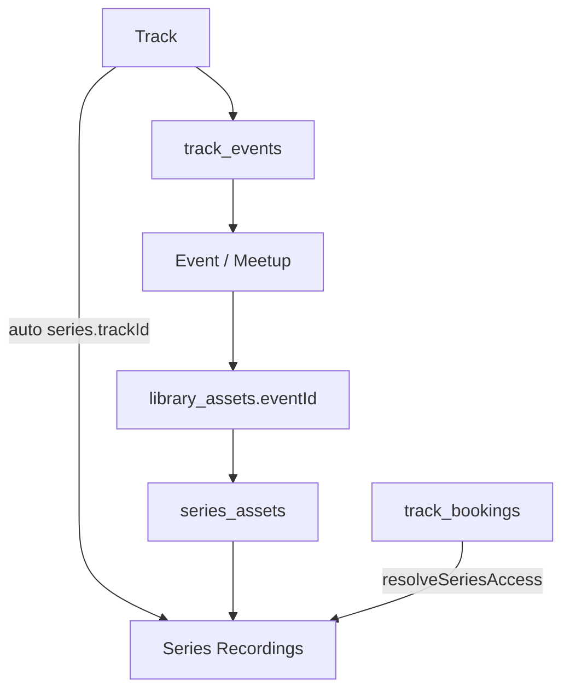

# Recordings داخل Event/Track (مع الإبقاء على `/recordings`)

## نقطة مرجعية (قبل الكود)

1. إضافة وثيقة [`abdelrhman-changes/event-track-recordings-access.md`](abdelrhman-changes/event-track-recordings-access.md) توضّح الاتفاق:
   - **نبقي** صفحة `/recordings` (كتالوج Series).
   - التسجيلات المرتبطة بالتراك تظهر أيضًا عبر زرار داخل صفحة الـ Track / الـ Event.
   - شراء/نشر تراكات قديمة = كورس مسجّل (وصول للتسجيلات).
2. تحديث [`abdelrhman-changes/README.md`](abdelrhman-changes/README.md).
3. Commit + push على `main` كـ checkpoint ثم البدء في التنفيذ.

## الوضع الحالي (استغلاله)

- عند إنشاء Track يُنشأ Series تلقائيًا بعنوان `"{title} Recordings"` — [`server/src/routes/api/tracks.ts`](server/src/routes/api/tracks.ts).
- حجز الـ Track يفتح الـ Series عبر `hasTrackBooking` في [`server/src/routes/api/seriesAccess.ts`](server/src/routes/api/seriesAccess.ts) بدون `series_access_grants`.
- الـ API العام للـ Track **لا** يُرجع `seriesId` اليوم؛ الفرونت يتجاهل `trackId` في mapper الـ Series.

## قرار المنتج (مثبت في هذه الخطة)

- **من يفتح التسجيلات:** من حجز الـ Track **أو** سجّل/حضر أي Event تابع لنفس الـ Track **أو** لديه grant/شراء Series.
- **الزرار:** يظهر لمن لديه صلاحية وصول (أو بعد تسجيل الدخول يُوجَّه للمحتوى).
- **`/recordings` تبقى.**
- **لا schema جديد** — نستخدم `series.trackId` الموجود.
- نشر التراكات القديمة للبيع كمسجّل = عملية أدمن (publish + إعادة فتح `track_booking_end` إن لزم)؛ الكود يضمن وصول التسجيلات بعد الحجز.

## التنفيذ

### 1) توسيع صلاحية الوصول

في [`server/src/routes/api/seriesAccess.ts`](server/src/routes/api/seriesAccess.ts):

- إضافة فحص: مستخدم مسجّل نشط في أي `event` ضمن `track_events` لنفس `series.trackId` → `hasAccess = true` (مثل `hasTrackBooking`).
- اختبارات في [`tests/unit/series-access.test.ts`](tests/unit/series-access.test.ts).

### 2) كشف `recordingsSeriesId` من الـ API

- [`GET /api/tracks/:id/public`](server/src/routes/api/tracks.ts): إرجاع `recordingsSeriesId` (من `series` حيث `trackId = track.id`).
- تفاصيل الـ Event ([`server/src/routes/api/events.ts`](server/src/routes/api/events.ts)): إن وُجد `trackInfo`، إرجاع `recordingsSeriesId` لنفس الـ track.
- تحديث أنواع الفرونت في [`src/app/api/tracks.ts`](src/app/api/tracks.ts) و [`src/app/api/events.ts`](src/app/api/events.ts).

### 3) زرار Recordings في الواجهة

- [`src/features/tracks/pages/TrackDetail.tsx`](src/features/tracks/pages/TrackDetail.tsx): تحت بلوك "You're enrolled" — زرار **Recordings** → `/dashboard/library/series/:recordingsSeriesId` (يتطلب auth؛ إن لم يكن مسجّل دخول → مسار تسجيل مع return).
- [`src/features/events/pages/EventDetail.tsx`](src/features/events/pages/EventDetail.tsx): في عمود الإجراءات عند `hasAccess` / enrolled — نفس الزرار إن وُجد `recordingsSeriesId`.
- لا تغيير على قائمة `/recordings` العامة.

### 4) توثيق التنفيذ

تحديث نفس ملف `event-track-recordings-access.md` بعد التنفيذ (ملفات، API، اختبارات) + commit/push.

## خارج النطاق (متعمد)

- إزالة `/recordings`.
- ربط Series يدويًا بـ Event منفصل عن Track.
- تغيير بوابة الدفع أو Module Settings.
