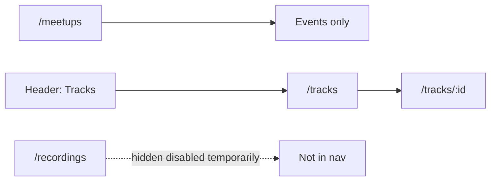

# فصل Events عن Tracks (مبسّط)

## القرار المثبت (حسب توضيح العميل)

- [`/meetups`](src/features/events/pages/Meetups.tsx): **Events فقط**.
- [`/tracks`](src/features/tracks/pages/PublicTracks.tsx) **جديد**: قائمة الـ Tracks التي كانت في Meetups (نفس الكروت/`PublicTrackCard` + تفاصيل `/tracks/:id` الحالية).
- **`/recordings`**: إخفاء من الـ nav + **تعطيل مؤقت للصفحة** (لا redirect).
- **APIs:** مسموح التعديل/الإضافة عند الحاجة. الافتراضي استخدام الموجود `GET /api/tracks/public` (+ detail العام) لأنه يدعم pagination أصلًا.
- لا إعادة هيكلة Series commerce في هذه الجولة.

## التنفيذ

### 1) Meetups = Events فقط

في [`src/features/events/pages/Meetups.tsx`](src/features/events/pages/Meetups.tsx):

- احذف قسم Learning Tracks و`usePublicTracks` و`PublicTrackCard` وtrack analytics على هذه الصفحة.
- أبقِ Events + الفلاتر + CTA.

### 2) صفحة `/tracks` جديدة

أنشئ [`src/features/tracks/pages/PublicTracks.tsx`](src/features/tracks/pages/PublicTracks.tsx):

- تصميم قريب من صفحة Recordings/Meetups العامة (hero + شبكة + pagination).
- `usePublicTracks` + `PublicTrackCard` → `/tracks/:id`.
- نصوص Tracks (مثل القسم الذي أُزيل من Meetups).

حدّث analytics: [`isCanonicalDiscoveryListPath`](src/lib/analytics/contentDiscovery.ts) ليشمل `/tracks` أيضًا (قائمة Tracks منفصلة).

### 3) Routing + Header — بدون redirect

[`src/shared/components/layout/Header.tsx`](src/shared/components/layout/Header.tsx):

- استبدل عنصر Recordings بـ `{ href: '/tracks', label: 'Tracks', icon: BookOpen }`.

[`src/App.tsx`](src/App.tsx):

- أضف `path="/tracks"` → `PublicTracks` **قبل** `path="/tracks/:id"`.
- عطّل مؤقتًا `/recordings` و`/recordings/:id` (مثلاً صفحة بسيطة Unavailable / أو إزالة الـ routes من الـ router العام حتى لا تُعرض في nav — الروابط المباشرة تُظهر unavailable مؤقتًا). **بدون** `Navigate` إلى `/tracks`.

راجع Footer إن وُجد رابط recordings.

### 4) APIs (عند الحاجة فقط)

الموجود يكفي للـ MVP:

- قائمة: `GET /api/tracks/public?page=&pageSize=`
- تفصيل: `GET /api/tracks/:id/public`

إن ظهر نقص أثناء التنفيذ (مثل search على كتالوج `/tracks`)، يُضاف query param على نفس الـ endpoint — بدون schema جديد.

### 5) توثيق خفيف

حدّث [`abdelrhman-changes/product-structure-and-overlap.md`](abdelrhman-changes/product-structure-and-overlap.md) و[`README.md`](abdelrhman-changes/README.md):  
`/meetups` = Events؛ `/tracks` = Tracks؛ `/recordings` مخفي/معطّل مؤقتًا.

## خارج النطاق

- Schema migrations / payments.
- نقل Series store لمسار جديد.
- Module Settings لـ Tracks.
