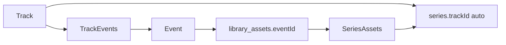

# نقطة #2 — نشر التسجيلات بعد انتهاء Track/Event

## القرارات المثبتة (من العميل)

1. **سياسة الحاجزين:** DDL عند النشر — افتراضي **مجاني للحاجزين**؛ خيار **الكل يدفع** (وامتداد لاحق إن لزم).
2. **مدخل الشراء:** زر على صفحة Track/Event المنتهية يفتح صفحة **مثل dashboard series** لشراء **حزمة التسجيلات المرتبطة** (وحدة البيع = Series المرتبطة بالـ Track).
3. **لا** نعيد `/recordings` للهيدر (النقطة #1 تبقى).
4. حذر: لا تمديد نافذة حجز اللايف؛ لا schema زائد عن الحاجة.

## الترابط الحالي (استغلاله)

- إنشاء Track ينشئ Series `"… Recordings"` مع `salesEnabled=false`.
- إضافة Event للتراك يضيف أصول `eventId` إلى `series_assets`.
- البيع القائم: `isSeriesSellable` + Orders/`series_access_grants`.
- الوصول المجاني الحالي عبر `hasTrackBooking` في [`seriesAccess.ts`](server/src/routes/api/seriesAccess.ts).

## نطاق Phase 1 (دقيق)

| السطح | السلوك |
|--------|--------|
| أدمن Track [`/admin/library/tracks/:id`](src/pages/admin/library/tracks/[id].tsx) | بطاقة **Publish recordings for sale**: سعر + DDL سياسة + سويتش نشر |
| أدمن Event [`/admin/meetups/edit/:id`](src/features/events/pages/admin/edit.tsx) | نفس التحكم **إذا** الأيفنت تابع لـ Track له Series؛ يحدّث **نفس** Series التراك (وحدة بيع واحدة) |
| Track عام بعد `Booking period has ended` | إن Series قابلة للبيع → زر **Available recordings** |
| Event عام (ماضي / منتهٍ) | إن Series الأب قابلة للبيع وفيها أصول لهذا الأيفنت → نفس الزر |
| صفحة الزر | مسار جديد عام يشبه [`DashboardSeriesDetail`](src/pages/DashboardSeriesDetail.tsx): قائمة التسجيلات + شراء الحزمة (Reuse buy actions / order flow) |
| حاجز قديم | حسب DDL: `free_for_prior_buyers` (افتراضي) أو `everyone_pays` |

**خارج Phase 1:** أيفنت standalone بدون Track/Series؛ إعادة كتالوج `/recordings`؛ بيع أصل واحد منفصل عن Series.

## نموذج البيانات

Migration جديدة على `series` (مثال اسم: `0025_series_recordings_access_policy.sql`):

- `recordings_access_policy` text/enum-like: `free_for_prior_buyers` | `everyone_pays`  
  - default: `free_for_prior_buyers`
- يبقى استخدام: `sales_enabled`, `price_in_cents`, `is_published` (عند تفعيل البيع: `salesEnabled=true` + `isPublished=true` + سعر > 0 + أصول ≥ 1 عبر `assertSeriesSalesReady`).

## صلاحيات الوصول (تعديل حذر)

في [`resolveSeriesAccess`](server/src/routes/api/seriesAccess.ts) + استدعاءات [`series.ts`](server/src/routes/api/series.ts) / store:

- إن `everyone_pays`: **لا** يُحسب `hasTrackBooking` / حضور الأيفنت كوصول مجاني للـ Series المباعة؛ يبقى staff / subscriber / `series_access_grants` (شراء).
- إن `free_for_prior_buyers` (افتراضي): `hasTrackBooking` **أو** حضور نشط لأي event في نفس التراك → وصول مجاني (كما طلب العميل).
- اختبارات وحدة في [`tests/unit/series-access.test.ts`](tests/unit/series-access.test.ts).

## API

- `GET /tracks/:id` (أدمن) و/أو public: إرجاع `recordingsSeries` ملخص (`id`, `salesEnabled`, `priceInCents`, `policy`, `assetCount`, `isSellable`).
- `GET /events/:id`: إن وُجد track → نفس ملخص Series + هل للأيفنت أصول في السلسلة.
- `PATCH` عبر `PUT /series/:id` الموجود: قبول `recordingsAccessPolicy` + تفعيل البيع (من بطاقة الأدمن).
- اختياري خفيف: `GET /series/:id/public-for-parent?trackId|eventId` إن احتجنا payload موحّد لصفحة الزر — وإلا إعادة استخدام `GET /series/store/:id` أو `GET /series/:id` مع auth.

## Frontend

1. **`TrackRecordingsPublishCard`** على أدمن Track (سعر + DDL + Publish).  
2. **بطاقة مماثلة** على أدمن Event عند وجود parent track series.  
3. **`TrackDetail`**: بعد انتهاء الحجز + `isSellable` → زر → `/tracks/:id/recordings` (صفحة عامة جديدة).  
4. **`EventDetail`**: بعد انتهاء/ماضي + sellable + أصول للأيفنت → زر → `/meetups/:id/recordings` أو نفس Series page بـ query `?eventId=`.  
5. صفحة التفاصيل: قائمة أصول (للأيفنت: فلترة `eventId`؛ للتراك: الكل) + CTA شراء الحزمة (Series) عبر التدفق الحالي للسلة/الطلب — **ليس** حجز Track من جديد.  
6. إعدادات المنصة (اختياري Phase 1b): إن طُلب لاحقًا تفضيل «افتح series vs قائمة أصول» — **Phase 1 يثبت: فتح صفحة series-like واحدة دائمًا**.

## توثيق + نقطة تقدم

- وثيقة في `abdelrhman-changes/` + تحديث [`recordings-change-checkpoints.md`](abdelrhman-changes/recordings-change-checkpoints.md) كـ **#2**.  
- تحديث [`product-structure-and-overlap.md`](abdelrhman-changes/product-structure-and-overlap.md) بإشارة السلوك الجديد.

## اختبارات

- Unit: سياسات `resolveSeriesAccess` (`free_for_prior_buyers` vs `everyone_pays`).  
- Unit: `isSeriesSellable` بدون كسر.  
- يدوي: نشر من Track/Event → زر يظهر بعد الانتهاء → شراء → حاجز قديم مجاني/مدفوع حسب DDL.
