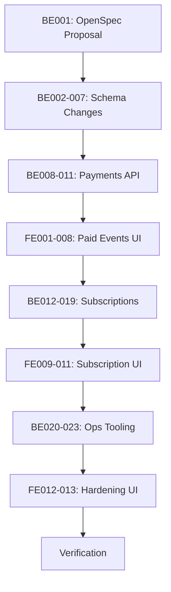

# Payment Gateway MVP Implementation Plan (v2)

This plan implements Fawaterk payment gateway integration for TrafficMENA with three value-focused phases.

---

## Guiding Principles

> [!IMPORTANT]
> These principles prevent scope creep and ensure consistency across all implementation.

1. **Access = (Active Yearly Subscription) OR (Event/Track Booking) OR (Public Content)**
   - No parallel entitlement system; bookings remain the source of truth for access

2. **Payments gate registration, not access directly**
   - Payment success triggers existing booking/registration logic
   - No new "purchased content" tracking; use existing `event_attendees` and `track_bookings`

3. **Pricing stored in cents (EGP)**
   - Explicit discounted price fields; no percentage calculations
   - `null` price = free; `0` is invalid

4. **Premium is a gating label, not a separate product**
   - Premium content is locked for free users
   - Purchases or subscription unlock the same content

5. **Reuse existing infrastructure**
   - Booking windows, registration logic, email service, schema patterns
   - Add minimal new fields only when missing

---

## User Review Required

> [!WARNING]
> **Before Phase 1**: Register at [staging.fawaterk.com](https://staging.fawaterk.com), generate API/Vendor/Provider keys, add to `server/.env`.

---

## Phase 0: Setup

*Critical first step before any implementation.*

---

### BE000 - Create Feature Branch

```bash
git checkout main
git pull origin main
git checkout -b feature/payment-gateway
```

> [!IMPORTANT]
> All payment gateway work MUST be done on the `feature/payment-gateway` branch. Do not commit directly to `main`.

---

## Phase 1: Paid Events & Tracks

*Goal: Users can pay for events and tracks via Fawaterk redirect flow.*

---

### Phase 1.1 | Data Model & Rules

#### BE001 - Draft OpenSpec Proposal
Create `openspec/proposals/payment-gateway.md` documenting payment flows, pricing precedence, and access rules. Align with existing booking windows and series separation.

---

#### BE002 - Add Pricing/Delivery Fields to Events

##### [MODIFY] [index.ts](file:///Users/hosnimohamed/Projects/trafficmena/server/src/db/schema/index.ts)

```diff
+ export const deliveryModeEnum = pgEnum('delivery_mode', ['online', 'offline', 'hybrid']);

  export const events = pgTable('events', {
    // ... existing fields
+   deliveryMode: deliveryModeEnum('delivery_mode').default('online').notNull(),
+   priceInCents: integer('price_in_cents'),  // null = free
+   subscriberPriceInCents: integer('subscriber_price_in_cents'),  // offline discount
+   isPremium: boolean('is_premium').default(false).notNull(),
+   allowLatePurchase: boolean('allow_late_purchase').default(false).notNull(),
  });
```

---

#### BE003 - Add Per-Event Pricing in Track Context

```diff
  export const trackEvents = pgTable('track_events', {
    // ... existing fields (trackId, eventId, sortOrder)
+   singlePriceInCents: integer('single_price_in_cents'),  // price during single-booking window
+   subscriberSinglePriceInCents: integer('subscriber_single_price_in_cents'),
  });
```

> [!NOTE]
> This separates "event standalone price" from "event-in-track single-booking price"—same event can have different prices in different contexts.

---

#### BE004 - Add Payment Tracking to Existing Registration Tables

```diff
  export const eventAttendees = pgTable('event_attendees', {
    // ... existing fields
+   paidAt: timestamp('paid_at', { withTimezone: true }),
+   pricePaidCents: integer('price_paid_cents'),
  });
```

> Leverages existing `track_bookings.paid_at` and `track_bookings.price_paid_cents` which already exist.

---

#### BE005 - Add Late Purchase Flag to Tracks

```diff
  export const tracks = pgTable('tracks', {
    // ... existing fields (priceInCents already exists)
+   subscriberPriceInCents: integer('subscriber_price_in_cents'),
+   isPremium: boolean('is_premium').default(false).notNull(),
+   allowLatePurchase: boolean('allow_late_purchase').default(false).notNull(),
  });
```

---

#### BE006 - Create Payment Intents Table

```typescript
export const paymentStatusEnum = pgEnum('payment_status', ['pending', 'paid', 'failed']);
export const paymentItemTypeEnum = pgEnum('payment_item_type', ['event', 'track', 'subscription']);

export const paymentIntents = pgTable('payment_intents', {
  id: uuid('id').primaryKey().defaultRandom(),
  userId: uuid('user_id').references(() => users.id, { onDelete: 'cascade' }).notNull(),
  fawaterkInvoiceId: text('fawaterk_invoice_id'),
  fawaterkInvoiceKey: text('fawaterk_invoice_key'),
  amountCents: integer('amount_cents').notNull(),
  currency: text('currency').default('EGP').notNull(),
  status: paymentStatusEnum('status').default('pending').notNull(),
  paymentMethod: text('payment_method'),
  itemType: paymentItemTypeEnum('item_type').notNull(),
  itemId: uuid('item_id').notNull(),
  paidAt: timestamp('paid_at', { withTimezone: true }),
  fawaterkPayload: jsonb('fawaterk_payload'),
  createdAt: timestamp('created_at', { withTimezone: true }).defaultNow().notNull(),
  updatedAt: timestamp('updated_at', { withTimezone: true }).defaultNow().notNull(),
}, (table) => ({
  userIdx: index('payment_intents_user_idx').on(table.userId),
  invoiceIdx: uniqueIndex('payment_intents_invoice_unique').on(table.fawaterkInvoiceId),
}));
```

---

#### BE007 - Run Migrations
```bash
npm --prefix server run db:gen && npm --prefix server run db:migrate
```

---

### Phase 1.2 | Payments API & Booking Integration

#### BE008 - Create Fawaterk Service

##### [NEW] [fawaterk.ts](file:///Users/hosnimohamed/Projects/trafficmena/server/src/services/fawaterk.ts)

```typescript
// Functions:
// - getPaymentMethods(): GET /api/v2/getPaymentmethods
// - initiatePayment(params): POST /api/v2/invoiceInitPay → returns redirect URL
// - getInvoiceData(invoiceId): GET /api/v2/getInvoiceData/{id} → verify payment status
```

**Environment variables** (add to `server/src/config/env.ts`):
```typescript
FAWATERK_API_KEY: z.string().min(1),
FAWATERK_VENDOR_KEY: z.string().min(1),
FAWATERK_PROVIDER_KEY: z.string().min(1),
FAWATERK_ENV: z.enum(['staging', 'live']).default('staging'),
APP_URL: z.string().url().default('http://localhost:8080'),
```

---

#### BE009 - Create Payments Routes

##### [NEW] [payments.ts](file:///Users/hosnimohamed/Projects/trafficmena/server/src/routes/api/payments.ts)

| Endpoint | Method | Auth | Description |
|----------|--------|------|-------------|
| `/payments/methods` | GET | User | List Fawaterk payment methods |
| `/payments/checkout` | POST | User | Create payment intent, return redirect URL |
| `/payments/:id` | GET | User | Get payment status (for polling) |
| `/payments/webhook` | POST | None | Fawaterk callback (IP whitelist recommended) |
| `/payments/callback/success` | GET | None | Success redirect → complete booking |
| `/payments/callback/fail` | GET | None | Failure redirect |
| `/payments/callback/pending` | GET | None | Pending redirect (Fawry/AMAN) |

---

#### BE010 - Gate Registration with PAYMENT_REQUIRED

##### [MODIFY] [events.ts](file:///Users/hosnimohamed/Projects/trafficmena/server/src/routes/api/events.ts)

```typescript
// POST /events/:id/register
// 1. Fetch event with pricing fields
// 2. If priceInCents is null → proceed with free registration (existing logic)
// 3. If priceInCents set:
//    a. Check active subscription + event.isPremium + deliveryMode
//       - Online premium + subscriber → free registration
//       - Offline/hybrid + subscriber → use subscriberPriceInCents
//    b. Non-subscriber → use priceInCents
// 4. Check booking window (or allowLatePurchase)
// 5. Return 402 PAYMENT_REQUIRED with { price, eventId, paymentContext }
// 6. User completes payment → webhook/callback triggers registration
```

Similar update to `/tracks/:id/book` in `tracks.ts`.

---

#### BE011 - Idempotent Payment Finalization

On confirmed payment (webhook or callback verification):
1. Verify invoice via `getInvoiceData(invoiceId)`
2. If `paid === 1`:
   - Create `event_attendees` or `track_bookings` via existing booking logic
   - Update `payment_intents.status = 'paid'`
   - Update `event_attendees.paid_at` / `track_bookings.paid_at`
3. If already processed (idempotency), return success

---

### Phase 1.3 | Admin Pricing UI

#### FE001 - Extend Event Form with Pricing

Update `AdminEventForm` and `src/app/api/events.ts`:
- Price input (EGP, converted to cents)
- Subscriber price input (show when deliveryMode is offline/hybrid)
- Delivery mode radio (Online/Offline/Hybrid)
- "Free/Paid" toggle derived from price field

---

#### FE002 - Extend Track Form with Pricing

Update `TrackForm` and `src/app/api/tracks.ts`:
- Track bundle price
- Subscriber price
- `allowLatePurchase` toggle

---

#### FE003 - Per-Event Price in Track Detail

In admin track detail page, allow setting `singlePriceInCents` and `subscriberSinglePriceInCents` for each event in the track.

---

#### FE004 - Pricing Validation

Add form validation:
- Subscriber price ≤ base price
- Delivery mode required when price is set
- `allowLatePurchase` only meaningful when price is set

---

### Phase 1.4 | Checkout UX

#### FE005 - Payment API Client

Create `src/app/api/payments.ts` with hooks:
- `usePaymentMethods()`
- `useInitiatePayment()`
- `usePaymentStatus(paymentId)` for polling

---

#### FE006 - Payment Callback Pages

- `/payment/success` → Verify payment, redirect to event/track detail
- `/payment/fail` → Error message, retry option
- `/payment/pending` → Pending message for Fawry/AMAN with status polling

---

#### FE007 - Update Event/Track Detail CTAs

- Show price badge on paid events/tracks
- "Register" becomes "Pay & Register" when price > 0
- Show subscriber discount if applicable

---

#### FE008 - Pending Payment Messaging

For Fawry/AMAN flows:
- Display payment code
- Show expiry time
- Poll `/payments/:id` for status updates

---

## Phase 2: Annual Subscription + Premium Access

*Goal: Users can subscribe yearly for full platform access; premium content gating works.*

---

### Phase 2.1 | Subscription Data & Settings

#### BE012 - Create Subscriptions Table

```typescript
export const subscriptionStatusEnum = pgEnum('subscription_status', ['active', 'expired', 'cancelled']);

export const subscriptions = pgTable('subscriptions', {
  id: uuid('id').primaryKey().defaultRandom(),
  userId: uuid('user_id').references(() => users.id, { onDelete: 'cascade' }).notNull().unique(),
  status: subscriptionStatusEnum('status').default('active').notNull(),
  pricePaidCents: integer('price_paid_cents'),
  startsAt: timestamp('starts_at', { withTimezone: true }).defaultNow().notNull(),
  endsAt: timestamp('ends_at', { withTimezone: true }).notNull(),
  paymentIntentId: uuid('payment_intent_id').references(() => paymentIntents.id),
  grantedBy: uuid('granted_by').references(() => users.id, { onDelete: 'set null' }),
  createdAt: timestamp('created_at', { withTimezone: true }).defaultNow().notNull(),
  updatedAt: timestamp('updated_at', { withTimezone: true }).defaultNow().notNull(),
}, (table) => ({
  userIdx: uniqueIndex('subscriptions_user_unique').on(table.userId),
  statusIdx: index('subscriptions_status_idx').on(table.status),
  endsAtIdx: index('subscriptions_ends_at_idx').on(table.endsAt),
}));
```

---

#### BE013 - Extend Platform Settings

Add to existing `platformSettings`:
```diff
  export const platformSettings = pgTable('platform_settings', {
    // ... existing fields
+   annualSubscriptionPriceCents: integer('annual_subscription_price_cents').default(100000), // 1000 EGP
  });
```

Update `server/src/routes/api/settings.ts` to expose manager-viewable, admin-editable price.

---

#### BE014 - Update Profile Subscription Status

Update `profiles.subscriptionStatus` as cached value on subscription changes:
- On subscription activation: `'active'`
- On expiry/cancellation: `'expired'`

Include in `/users/me` response:
```json
{
  "isSubscriber": true,
  "subscriptionExpiresAt": "2027-01-01T00:00:00Z"
}
```

---

### Phase 2.2 | Premium Access & Pricing Precedence

#### BE015 - Add isPremium Flags

Add to `series` and `libraryAssets`:
```diff
  export const series = pgTable('series', {
+   isPremium: boolean('is_premium').default(false).notNull(),
  });

  export const libraryAssets = pgTable('library_assets', {
+   isPremium: boolean('is_premium').default(false).notNull(),
  });
```

---

#### BE016 - Centralized Access Helper

##### [MODIFY] [utils.ts](file:///Users/hosnimohamed/Projects/trafficmena/server/src/routes/api/utils.ts)

```typescript
type AccessCheckResult = { hasAccess: boolean; reason?: string };

export async function checkContentAccess(
  userId: string,
  content: { isPremium: boolean; eventId?: string | null; trackId?: string | null }
): Promise<AccessCheckResult> {
  // 1. Check active subscription → full access to premium
  // 2. Check event booking (event_attendees) → access to that event's content
  // 3. Check track booking (track_bookings) → access to all track events' content
  // 4. Public content (isPremium = false) → always accessible
}
```

Use in `/library`, `/series`, event content access.

---

#### BE017 - Subscriber Pricing Precedence

Pricing logic (in order):
1. **Online premium event + subscriber** → Free (`priceInCents` bypassed)
2. **Offline/hybrid event + subscriber** → `subscriberPriceInCents` (or `priceInCents` if not set)
3. **Non-subscriber** → `priceInCents`
4. **Track bundle + subscriber** → `subscriberPriceInCents` (or `priceInCents` if not set)
5. **Single event in track + subscriber** → `subscriberSinglePriceInCents` (or `singlePriceInCents`)

---

### Phase 2.3 | Subscription Purchase & Admin Controls

#### BE018 - Subscription Purchase Flow

Extend `/payments/checkout` to support `type: 'subscription'`:
1. Get price from `platformSettings.annualSubscriptionPriceCents`
2. Create `payment_intents` with `itemType: 'subscription'`
3. On payment confirmation:
   - Create/update `subscriptions` record (expires = +1 year)
   - Update `profiles.subscriptionStatus = 'active'`
   - Send confirmation email

---

#### BE019 - Subscription Admin Routes

| Endpoint | Method | Auth | Description |
|----------|--------|------|-------------|
| `/subscriptions` | GET | Admin+ | List all subscribers (paginated) |
| `/subscriptions/grant` | POST | Admin+ | Manually grant subscription |
| `/subscriptions/:id/revoke` | POST | Admin+ | Revoke subscription |

---

#### FE009 - Subscription Settings Page

Manager+ dashboard:
- View current subscription price
- Admin: Edit price

Admin-only section:
- Subscriber list table
- Grant subscription modal
- Revoke button

---

#### FE010 - Subscription CTA & Status

- Add `/subscribe` page with benefits list
- Show subscription status badge in user menu
- Pull `isSubscriber` from `/users/me`

---

#### FE011 - Premium Content UI

- Purple "Premium" badge on cards
- Lock overlay on thumbnails for non-subscribers without purchase
- "Subscribe to unlock" or "Purchase to access" CTAs based on context

---

## Phase 3: Ops, Notifications & Hardening

*Goal: Production-ready with operational tooling.*

---

### Phase 3.1 | Emails & Reminders

#### BE020 - Receipt Email

Extend `server/src/services/email.ts`:
```typescript
export async function sendReceiptEmail(args: {
  email: string;
  firstName?: string;
  itemName: string;
  itemType: 'event' | 'track' | 'subscription';
  amountEgp: number;
  invoiceRef: string;
  paidAt: Date;
}) {
  // HTML email with TrafficMENA branding
}
```

---

#### BE021 - Subscription Reminder Endpoint

```
POST /admin/subscriptions/send-reminders (Admin-only)
```

Processes:
1. "Expiring soon" (7 days before) → Send reminder email
2. "Expired" (1 day after) → Send renewal prompt

> Wire to external cron (Render, Vercel, GitHub Actions).

---

#### BE022 - Confirmation Emails

- Subscription activation confirmation
- Event/track purchase confirmation

---

### Phase 3.2 | QA & Guardrails

#### FE012 - Webhook Delay Fallback

On success callback page:
1. Check payment status via `/payments/:id`
2. If still pending, poll every 5s for 30s
3. Show fallback message if webhook delayed

---

#### FE013 - Payment Audit View

Admin dashboard page:
- Recent payments table from `payment_intents`
- Columns: User, Amount, Type, Status, Date
- Filter by status

---

#### BE023 - Payment Reconciliation Endpoint

```
POST /admin/payments/:id/reconcile (Admin-only)
```

Re-fetches invoice status from Fawaterk via `getInvoiceData()` and updates local records. Use when webhook fails.

---

## Environment Variables Summary

```bash
# Fawaterk Payment Gateway
FAWATERK_API_KEY=your_api_key
FAWATERK_VENDOR_KEY=your_vendor_key
FAWATERK_PROVIDER_KEY=your_provider_key
FAWATERK_ENV=staging  # 'staging' or 'live'

# App URL for callbacks
APP_URL=http://localhost:8080
```

---

## Fawaterk Test Cards

| Card | Result |
|------|--------|
| `5123450000000008` / `12/26` / `100` | ✅ Success |
| `4005550000000001` / `12/26` / `100` | ✅ Success |
| `5543474002249996` / `05/21` / `123` | ❌ Failure |

---

## Implementation Order



---

## Verification Plan

### Test 1: Event Purchase (Non-subscriber)
1. Create paid event (500 EGP)
2. As free user, attempt register → see payment required
3. Complete payment → registration confirmed
4. Access event content → unlocked

### Test 2: Subscriber Free Access (Online)
1. Create premium online event (500 EGP)
2. As subscriber, register → no payment required
3. Access content → unlocked

### Test 3: Subscriber Discount (Offline)
1. Create offline event: 500 EGP, subscriber price 300 EGP
2. As subscriber, see 300 EGP price
3. Complete payment at 300 EGP → registered

### Test 4: Track Bundle Purchase
1. Create track with 3 events, bundle price 1000 EGP
2. Book track → payment required
3. After payment → all 3 events registered

### Test 5: Single Event in Track
1. During single-booking window, view individual event
2. See single event price (not bundle price)
3. Purchase → only that event registered

### Test 6: Subscription Purchase
1. Navigate to `/subscribe`
2. Complete payment
3. Profile shows `isSubscriber: true`
4. All premium content unlocked

### Test 7: Admin Grant Subscription
1. As admin, grant subscription to free user
2. User immediately has access

---

## Rollback Plan

1. **Schema changes are additive** - No data loss on rollback
2. **Feature flag**: `PAYMENTS_ENABLED=false` disables payment checks
3. **Existing free flows preserved** - `priceInCents = null` works as before
