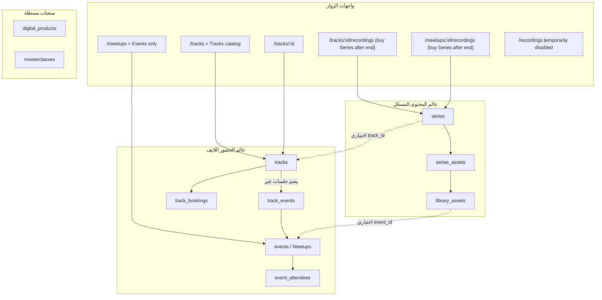
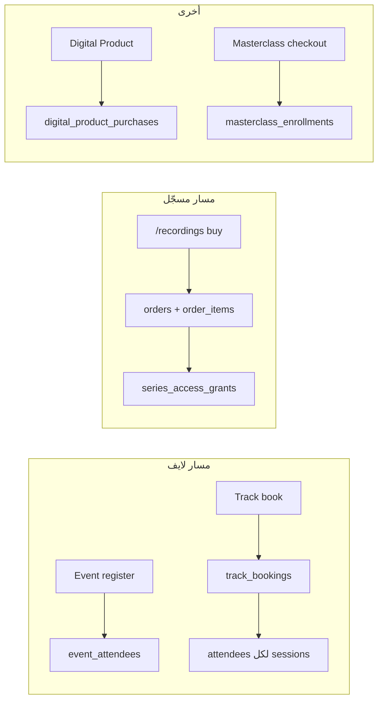

# هيكل المنتجات والعلاقات — Events / Tracks / Series / Recordings

> **الغرض:** مرجع دقيق قبل أي تطوير على البنية.  
> **تاريخ:** 2026-08-10  
> **حالة الكود:** بعد نقطة #2 — نشر حزمة تسجيلات التراك بعد انتهاء الحجز/الأيفنت عبر Series؛ `/recordings` ما زال معطّلًا من الهيدر.

---

## 1) خريطة ذهنية سريعة

في المنصة فيه **أربع عوالم منتج** أساسية (+ مكتبة أصول)، وليست كلها نفس الشيء بأسماء مختلفة:

| الاسم في الواجهة | الاسم في النظام / DB | إيه هو؟ |
|------------------|----------------------|---------|
| **Meetup / Event** | `events` | جلسة حية (موعد، مكان/لينك، تسجيل حضور) |
| **Track** | `tracks` | باقة جلسات — تشتري الباقة كلها |
| **Series** | `series` | مجموعة محتوى مسجّل (أصول مكتبة) قابلة للبيع |
| **Recordings** | *(واجهة فقط)* | اسم العرض العام لـ **Series القابلة للبيع** على `/recordings` |
| **Library asset** | `library_assets` | ملف/فيديو واحد في المكتبة |
| **Digital Product** | `digital_products` | منتج رقمي منفصل (ملفات + فيديو اختياري) |
| **Masterclass** | `masterclasses` | كورس منظّم (Modules → Lessons) مستقل |

**قاعدة ذهبية:**  
`Recordings` ≠ جدول جديد.  
`Recordings` = **واجهة بيع/تصفح** فوق جدول `series`.

---

## 2) الرسم الهيكلي (التداخل الحقيقي)

### ماذا يعني «اختياري»؟

- عند **إنشاء Track** النظام ينشئ تلقائيًا Series بعنوان مثل `"{title} Recordings"` ويربطها بـ `series.track_id`.
- عند **إضافة Events للتراك**، الأصول المرتبطة بتلك الأيفنتات (`library_assets.event_id`) تُضاف غالبًا إلى Series التراك.
- Series **قائمة بذاتها** ممكنة أيضًا (`track_id = null`) — تُدار من Library → Series وتُباع من `/recordings` إن كانت قابلة للبيع.

---

## 3) كل كيان: دوره، مساراته، وكيف يُشترى

### 3.1 Event (Meetup)

| | |
|--|--|
| **الوظيفة** | جلسة بتاريخ ووقت؛ حضور لايف |
| **جداول** | `events`, `event_attendees`, `event_reservations` |
| **عام** | `/meetups`, `/meetups/:id` |
| **أدمن** | `/admin/meetups` |
| **الشراء/التسجيل** | تسجيل فردي على الأيفنت (مجاني أو مدفوع عبر `payments` itemType=event) |
| **بعد الانتهاء** | إن الأيفنت تابع لتراك وله Series قابلة للبيع + أصول للأيفنت → زر **Available recordings** → `/meetups/:id/recordings` (شراء حزمة Series التراك) |

قد يكون الأيفنت **داخل Track** (عبر `track_events`) أو **Standalone**.

---

### 3.2 Track

| | |
|--|--|
| **الوظيفة** | باقة تعلم = عدة Sessions (Events) |
| **جداول** | `tracks`, `track_events`, `track_bookings`, `track_reservations` |
| **عام** | كتالوج `/tracks` + تفصيل `/tracks/:id`؛ بعد انتهاء الحجز إن Series sellable → `/tracks/:id/recordings` |
| **أدمن** | Library / Meetups → Tracks (+ بطاقة Publish recordings) |
| **الشراء** | حجز Track كامل → `track_bookings` + تسجيل المستخدم على أحداث الباقة |
| **نافذة الحجز** | `track_booking_start` / `track_booking_end` (وخيارات single booking) |

**مهم:** شراء Track ≠ شراء Series من المتجر.  
حجز Track (أو حضور أيفنت في التراك) قد يمنح وصولًا مجانيًا لـ Series حسب `recordings_access_policy` (`free_for_prior_buyers` افتراضيًا؛ `everyone_pays` يلغي المجانية).

---

### 3.3 Series

| | |
|--|--|
| **الوظيفة** | حاوية محتوى مسجّل (ترتيب أصول مكتبة) |
| **جداول** | `series`, `series_assets`, `series_access_grants` |
| **حقول البيع** | `price_in_cents`, `sales_enabled`, `is_published`, `is_premium`, `recordings_access_policy` |
| **ربط اختياري** | `series.track_id` → Track |
| **أدمن** | `/admin/library` تبويب Series |
| **عضو بعد الشراء** | `/dashboard/library/series/:id` |

**قابل للبيع (`isSeriesSellable`) فقط إذا:**

1. `is_published = true`
2. `sales_enabled = true`
3. `price_in_cents > 0`
4. يوجد أصل واحد على الأقل في `series_assets`

الشراء عبر سلة Orders (`item_type: series`) → `series_access_grants` بـ `grantReason: purchase`.  
**لا يُنشئ** `track_booking`.

---

### 3.4 Recordings (واجهة)

| | |
|--|--|
| **الوظيفة** | كتالوج زوار لـ Series القابلة للبيع **أو** مدخل شراء من Track/Event المنتهي |
| **مسارات** | `/recordings` (معطّل مؤقتًا)، `/tracks/:id/recordings`, `/meetups/:id/recordings` (+ legacy `/series/:id`) |
| **API** | `GET /api/series/store`, `GET /api/series/store/:id` |
| **في الهيدر** | مخفي مؤقتًا (نقطة #1) — البيع بعد الانتهاء عبر زر على الصفحة |

إذًا: الأدمن يدير **Series**؛ الزائر يرى **Recordings** كواجهة. نفس البيانات.

---

### 3.5 Library Asset

| | |
|--|--|
| **الوظيفة** | وحدة محتوى واحدة (فيديو/مستند/…) |
| **جدول** | `library_assets` |
| **ربط اختياري** | `event_id` → Event (مواد مرتبطة بجلسة) |
| **الاستخدام** | داخل Series عبر `series_assets`؛ وأيضًا مكتبة عامة/premium حسب الصلاحيات |

الوصول لملف داخل Series يعتمد على: staff / اشتراك / حجز Track مرتبط / grant Series / أو قواعد premium/public/event للملف.

---

### 3.6 Digital Products و Masterclasses (للتفرقة فقط)

| المنتج | علاقة بـ Event/Track/Series؟ |
|--------|------------------------------|
| **Digital Products** | مستقل؛ سلة مشتركة مع Series في Orders؛ يُخفى عبر Module Settings |
| **Masterclasses** | مستقل تمامًا (Modules/Lessons)؛ دفع مباشر enrollment؛ يُخفى عبر Module Settings |

لا يدخلان في معادلة Meetups ↔ Tracks ↔ Recordings.

---

## 4) مسارات الشراء — لا تخلطهم

| لو المستخدم… | يحصل على… | لا يحصل تلقائيًا على… |
|--------------|------------|-------------------------|
| سجّل في Meetup | حضور الأيفنت | Series كاملة / Track |
| حجز Track | كل Sessions + غالبًا وصول Series المرتبطة بالـ track | شراء Series كتالوج منفصل |
| اشترى من Recordings | Series grant دائم | `track_booking` أو حضور لايف |
| اشترى Digital Product | ملفات المنتج | Series أو Track |
| اشترى Masterclass | Enrollment الكورس | السلة الموحدة Series/DP |

---

## 5) أين يظهر كل شيء للمستخدم؟

| السطح | Event | Track | Series (مسجّل) | Digital Products | Masterclass |
|-------|-------|-------|----------------|------------------|-------------|
| هيدر عام | Events → `/meetups` | **Tracks → `/tracks`** | مخفي مؤقتًا (`/recordings` معطّل) | Digital Products* | — |
| عضو dashboard | Meetups | Library tracks | Library series | Digital Products* | Masterclasses* |
| أدمن | Meetups CRUD | Tracks CRUD | Library Series | Digital Products* | Masterclasses* |

\* يخضع لـ **Module Settings** (`masterclassesEnabled` / `digitalProductsEnabled`).

> **2026-08-10:** فصل الواجهة العامة — `/meetups` = Events فقط؛ `/tracks` = كتالوج Tracks؛ `/recordings` معطّل مؤقتًا من الـ nav والصفحة.

---

## 6) التداخل الذي يسبب لخبطة (واقرأه قبل أي تغيير بنية)

1. **نفس الجلسة لها اسمان:** في Track اسمها *Session*؛ في الرابط هي `/meetups/:eventId` (= Event).
2. **Recordings ≠ موديول DB:** أي تطوير «موديول Recordings» بدون جدول جديد = تطوير على Series + الواجهة.
3. **Series المرتبطة بـ Track** تُنشأ تلقائيًا؛ Series الحرة تُنشأ من الأدمن — الاثنان يظهران في `/recordings` إن صارا sellable.
4. **وصول Series بعد حجز Track** مشتق من الحجز الحي (`hasTrackBooking`)، بينما **شراء Recordings** يكتب `series_access_grants` — مساران مختلفان لنفس المحتوى أحيانًا.
5. **Asset مربوط بـ Event** قد يدخل Series التراك عند إضافة الأيفنت للتراك — المحتوى المسجّل واللايف يلتقيان هنا.
6. **انتهاء الأيفنت/التراك** لا يفعّل البيع تلقائيًا؛ الأدمن ينشر من بطاقة Publish (نقطة #2). الزر العام يفتح صفحة شراء Series — لا يمدّد حجز اللايف.

---

## 7) جداول الربط (مرجع سريع)

| جدول | يربط |
|------|------|
| `track_events` | Track ↔ Event (حدث واحد عادة لتراك واحد — unique على event) |
| `series.track_id` | Series ↔ Track (اختياري / تلقائي عند إنشاء Track) |
| `series_assets` | Series ↔ library_assets |
| `library_assets.event_id` | Asset ↔ Event (اختياري) |
| `series_access_grants` | User ↔ Series (شراء / منح يدوي) |
| `track_bookings` | User ↔ Track |
| `event_attendees` | User ↔ Event |

---

## 8) قرارات منتج مؤجلة (لا تُفترض موجودة)

- إعادة كتالوج `/recordings` للهيدر  
- بيع أصل واحد منفصل عن Series (بدون حزمة التراك)  
- أيفنت standalone بدون Track/Series  
- تمديد نافذة حجز Track كبديل لبيع التسجيلات  

**مُنفَّذ في نقطة #2:** Publish من Track/Event edit + زر Available recordings + سياسة `recordings_access_policy`.

أي عمل جديد على هذا المحور يجب أن يبدأ من هذه الوثيقة ويحدّثها عند تغيير السلوك.

---

## 9) مراجع مرتبطة

| وثيقة | ماذا تغطي |
|-------|-----------|
| [publish-recordings-after-end.md](./publish-recordings-after-end.md) | نقطة #2 — نشر التسجيلات بعد الانتهاء |
| [public-store-pages.md](./public-store-pages.md) | `/recordings` و Digital Products للزوار |
| [series-sales-commerce.md](./series-sales-commerce.md) | سلة وطلبات Series |
| [series-pricing-and-sales.md](./series-pricing-and-sales.md) | سعر و`sales_enabled` |
| [library-series-access.md](./library-series-access.md) | وصول المكتبة عبر Series |
| [digital-products-commerce.md](./digital-products-commerce.md) | منتجات رقمية |
| [masterclasses-system.md](./masterclasses-system.md) | كورسات مستقلة |
| [module-settings.md](./module-settings.md) | إخفاء Masterclasses / Digital Products |
| Schema | `server/src/db/schema/index.ts` |
