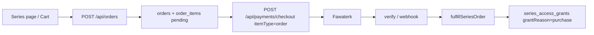

# Recording Series — Commerce (Orders, Cart, Purchase)

> **Author:** Abdelrhman (via Cursor)  
> **Date:** June 11, 2026  
> **Scope:** بيع Recording Series عبر سلة + طلب + دفع واحد، مع صفحة عامة ووصول دائم بعد الشراء

---

## الملخص

تمت إضافة طبقة تجارة فوق pricing الموجود مسبقًا (`price_in_cents`, `sales_enabled`):

| Task | الحالة |
|------|--------|
| 1 — Price + Available for Sale + شروط البيع | ✅ مع تحقق: سعر &gt; 0 + تسجيل واحد على الأقل |
| 2 — Public landing page | ✅ `/series/:id` + API `GET /series/store/:id` |
| 3 — شراء Series واحدة | ✅ عبر `SeriesBuyActions` → Order → Checkout |
| 4 — سلة Series + Order | ✅ `SeriesCartContext` + `POST /orders` + `itemType: order` |
| 5 — الحفاظ على الوصول القديم | ✅ subscription / track booking / manual grant / staff |

---

## قاعدة البيانات (Migration `0018`)

**الملف:** `server/drizzle/0018_series_orders.sql`

| جدول / تغيير | الوصف |
|--------------|--------|
| `orders` | طلب شراء (pending → paid) |
| `order_items` | بنود الطلب (Series فقط في Phase 1) |
| `payment_item_type` + `'order'` | الدفع مرتبط بـ `orders.id` |
| `series_access_grants.payment_id` | ربط منح الشراء بالدفع |

### تشغيل

```bash
npm --prefix server run db:migrate
```

---

## شروط ظهور Series للبيع

تُعتبر Series **قابلة للبيع** (`isSellable`) فقط إذا:

1. `sales_enabled = true`
2. `price_in_cents > 0`
3. `is_published = true`
4. تحتوي على **تسجيل واحد على الأقل** في `series_assets`

التحقق في: `server/src/services/seriesSales.ts` → `isSeriesSellable()`

عند تفعيل البيع من الأدمن (`PUT /series/:id`) يُرفض الطلب إن لم يتحقق السعر والتسجيلات.

---

## تدفق الشراء



1. المستخدم يضيف Series للسلة (localStorage) أو **اشترِ الآن**
2. `POST /api/orders` `{ seriesIds: [...] }` ينشئ طلبًا
3. Checkout: `{ itemType: "order", itemId: "<order-uuid>", paymentMethodId }`
4. بعد الدفع: `fulfillSeriesOrder` يمنح وصولًا دائمًا لكل Series في الطلب
5. الوصول عبر `series_access_grants` (نفس مسار المنح اليدوي، مع `grantReason: 'purchase'`)

> **ملاحظة:** شراء Series ≠ تسجيل Track. لا يُنشأ `track_booking`.

---

## API الجديد

| Method | Route | Auth | الوصف |
|--------|-------|------|--------|
| GET | `/api/series/store` | اختياري | قائمة Series المعروضة للبيع |
| GET | `/api/series/store/:id` | اختياري | صفحة تسويقية + preview |
| POST | `/api/orders` | نعم | إنشاء طلب من `seriesIds` |
| GET | `/api/orders/:id` | نعم | حالة الطلب |

توسيع الدفع:

- `checkoutSchema`: `itemType: 'order'`
- `calculatePrice`: يجمع `orders.total_cents`
- `processSuccessfulPayment`: يستدعي `fulfillSeriesOrder`

---

## الواجهة (Frontend)

| المسار | الملف |
|--------|--------|
| `/series/:id` | `src/pages/SeriesStoreDetail.tsx` — صفحة عامة |
| `/series/cart` | `src/pages/SeriesCart.tsx` — السلة والدفع |
| `/dashboard/library/series/:id` | معاينة + شراء إن لم يكن وصول |
| Provider | `src/features/series/context/SeriesCartContext.tsx` |
| Cart في الداشبورد | Sidebar **Series Cart** + زر **Cart** في الهيدر + صفحة المكتبة |
| زر الشراء | أسفل كل `SeriesCard` + صفحة تفاصيل Series |

مكوّنات:

- `SeriesBuyActions` — أضف للسلة / اشترِ الآن
- `SeriesPurchasedBadge` — **تم الشراء**
- `PaymentCheckoutDialog` — يدعم `itemType: 'order'`

---

## طرق الوصول (بدون كسر القديم)

| الحالة | النتيجة |
|--------|---------|
| Paid purchase | `series_access_grants` + `payment_id` |
| Active subscription | `resolveSeriesAccess` → وصول كامل |
| Linked track booking | وصول عبر `trackId` |
| Manual admin grant | `series_access_grants` |
| Staff | وصول كامل |
| لا وصول + للبيع | Preview + أزرار شراء |

---

## الملفات الرئيسية

```
server/drizzle/0018_series_orders.sql
server/src/db/schema/index.ts
server/src/services/seriesSales.ts
server/src/routes/api/orders.ts
server/src/routes/api/seriesStore.ts
server/src/routes/api/series.ts
server/src/routes/api/payments.ts
src/app/api/orders.ts
src/features/series/context/SeriesCartContext.tsx
src/features/series/components/SeriesBuyActions.tsx
src/pages/SeriesStoreDetail.tsx
src/pages/SeriesCart.tsx
```

---

## اختبار يدوي

```bash
npm --prefix server run db:migrate
npm --prefix server run dev
npm run dev
```

1. **Admin** `/admin/library?tab=series` — سعر + Sales Enabled + أضف recording
2. **عام** `http://localhost:8080/series/<uuid>` — معاينة + شراء
3. أضف سلسلتين للسلة → `/series/cart` → Checkout
4. بعد الدفع → `/dashboard/library` — badge **تم الشراء** + وصول للتسجيلات
5. تحقق: اشتراك / track booking / grant يدوي ما زالوا يعملون

---

## علاقة بالمستند السابق

- [series-pricing-and-sales.md](./series-pricing-and-sales.md) — عرض السعر في الأدمن (Task 1 الأساسي)
- **هذا المستند** — Commerce كامل (Tasks 2–5)
