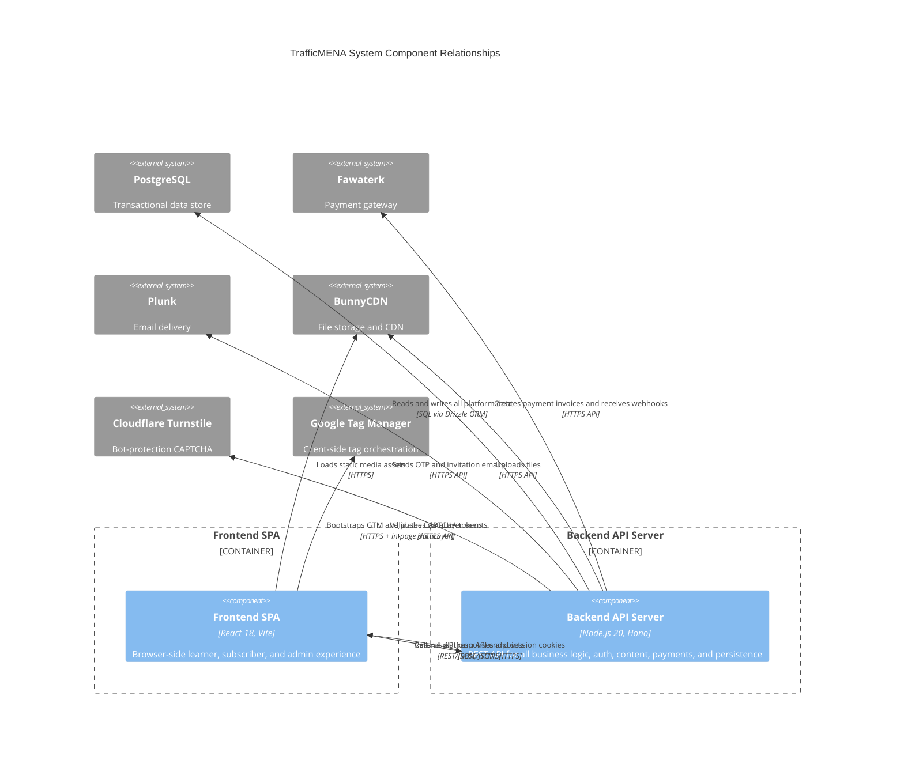

# C4 Component Level: System Overview

## System Components

### Backend API Server

- **Name**: Backend API Server
- **Description**: Hono/Node.js REST API that implements all platform business logic, authentication, content management, payments, and database persistence.
- **Technology**: Node.js 20, Hono, TypeScript, Drizzle ORM, PostgreSQL 17, Zod, Better Auth
- **Detailed Components**: See the backend sub-component index below and [c4-container.md](./c4-container.md) for deployment mapping.

### Frontend SPA

- **Name**: Frontend SPA
- **Description**: React 18 Vite single-page application that delivers the complete browser experience for learners, subscribers, and platform administrators.
- **Technology**: React 18, Vite, TypeScript, React Router, TanStack Query, Tailwind CSS, shadcn/ui, TipTap
- **Detailed Components**: See the frontend sub-component index below and [c4-container.md](./c4-container.md) for the browser-to-API deployment view.

## External Systems

| System | Role |
|---|---|
| **PostgreSQL** | Durable transactional data store. All platform state (users, events, tracks, payments, subscriptions, reservations) is persisted here via Drizzle ORM. |
| **Fawaterk** | Payment gateway that creates invoices and delivers HMAC-verified payment event webhooks back to the API server. |
| **Plunk** | Transactional email service used to deliver OTP login codes and invitation emails. |
| **BunnyCDN** | Object storage and CDN. The API server uploads files here; the browser loads media assets directly from CDN URLs. |
| **Cloudflare Turnstile** | Bot-protection CAPTCHA. Tokens are submitted by the browser and validated server-side during OTP requests. |
| **Google Tag Manager** | Client-side tag orchestration. Loaded by `public/gtm-bootstrap.js`; receives typed events pushed to `window.dataLayer` by `src/lib/analytics/`. No server-side coupling. |

## Component Relationships

## Sub-Component Index

The two top-level components above are each composed of finer-grained sub-components documented individually:

### Backend API Server Sub-Components

| Sub-Component | Description | Documentation |
|---|---|---|
| API Runtime and Platform Security | Hono bootstrap, middleware stack, health routes, and error envelope | [c4-component-api-runtime-and-platform-security.md](./components/c4-component-api-runtime-and-platform-security.md) |
| Identity, Invitations, and Member Operations API | Auth, users, OTP, invitations, and onboarding domain routes | [c4-component-identity-invitations-and-member-operations-api.md](./components/c4-component-identity-invitations-and-member-operations-api.md) |
| Learning Content and Delivery API | Events, tracks, series, library, uploads, settings, and metrics domain routes | [c4-component-learning-content-and-delivery-api.md](./components/c4-component-learning-content-and-delivery-api.md) |
| Payments, Pricing, and Revenue Operations API | Checkout, pricing, promo codes, subscriptions, manual track enrollments, subscription/series grants, webhook ingestion, and payment-analytics enrichment for verified purchase events | [c4-component-payments-pricing-and-revenue-operations-api.md](./components/c4-component-payments-pricing-and-revenue-operations-api.md) |
| Persistence and Background Operations | Drizzle ORM schema, migration history, connection pool, and payment/data maintenance operations | [c4-component-persistence-and-background-operations.md](./components/c4-component-persistence-and-background-operations.md) |

### Frontend SPA Sub-Components

| Sub-Component | Description | Documentation |
|---|---|---|
| Web Experience Platform | SPA shell: routing, providers, shared UI primitives, TipTap editor tooling, GTM bootstrap, auth-scoped query keys, and the dataLayer analytics layer under `src/lib/analytics/` | [c4-component-web-experience-platform.md](./components/c4-component-web-experience-platform.md) |
| Learning Experiences UI | Learner-facing event, track, library, and series feature modules with `PremiumContentGate` enforcement for premium library and series content | [c4-component-learning-experiences-ui.md](./components/c4-component-learning-experiences-ui.md) |
| Membership and Checkout UI | Checkout widgets and payment status surfaces. Subscription landing is role-gated (owner/admin) — the learner-facing subscribe flow is currently hidden and subscriptions are provisioned via admin grants | [c4-component-membership-and-checkout-ui.md](./components/c4-component-membership-and-checkout-ui.md) |
| Admin Operations Console | Protected staff dashboard for content, user, invitation, manual track enrollment, subscription/series grants (single, revoke, bulk CSV), promo codes, metrics, and settings | [c4-component-admin-operations-console.md](./components/c4-component-admin-operations-console.md) |
| Calculators Experience | 23 interactive marketing and finance calculators with shared analytics instrumentation for use and conversion events | [c4-component-calculators-experience.md](./components/c4-component-calculators-experience.md) |

### Supporting Tooling

| Sub-Component | Description | Documentation |
|---|---|---|
| Local Development and Regression Tooling | Project-scoped Postgres scripts and the Node.js unit test suite | [c4-component-local-development-and-regression-tooling.md](./components/c4-component-local-development-and-regression-tooling.md) |
