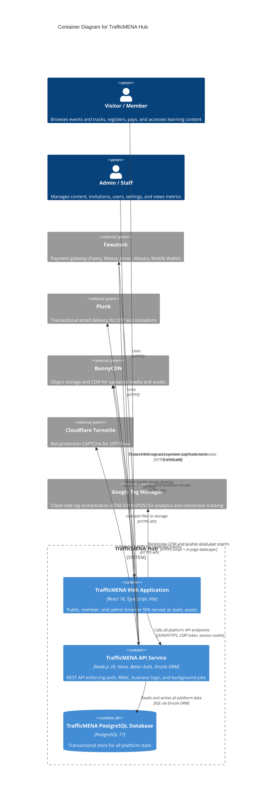

# C4 Container Level: System Deployment

The repository does not contain Dockerfiles, Kubernetes manifests, or infrastructure-as-code definitions. The container mapping below is derived from the runtime entrypoints (`src/main.tsx`, `server/src/index.ts`), build scripts in `package.json` and `server/package.json`, the Vite proxy configuration in `vite.config.ts`, and the project-scoped PostgreSQL tooling in `local/postgres/bin/`.

---

## Containers

### TrafficMENA Web Application

- **Name**: TrafficMENA Web Application
- **Description**: React 18 single-page application compiled by Vite into a static asset bundle. Delivers public marketing pages, learner dashboards, admin console, checkout journeys, and standalone calculators.
- **Type**: Web Application (Browser-executed SPA, served as static files)
- **Technology**: React 18, TypeScript, Vite 7, React Router 6, TanStack Query 5, Tailwind CSS 3, shadcn/ui, Radix UI, TipTap 3
- **Deployment**: `npm run build` produces a `dist/` directory of static HTML/JS/CSS assets. In development, Vite serves on `http://localhost:8080` and proxies `/api` to the API service at `http://localhost:3001`. In production, the `dist/` output is served from a static hosting layer or CDN origin with the same-origin `/api` proxy rule preserved.

### TrafficMENA API Service

- **Name**: TrafficMENA API Service
- **Description**: Long-running Node.js 20 process that exposes all platform REST endpoints, enforces authentication and RBAC, coordinates all business logic, integrates with external payment/email/CDN services, and runs background payment-expiration jobs.
- **Type**: API Application (Long-running HTTP server)
- **Technology**: Node.js 20, Hono 4, TypeScript, Better Auth 1, Drizzle ORM, Zod, `@hono/node-server`
- **Deployment**: Compiled with `npm --prefix server run build` (TypeScript → `server/dist/`). Started with `node dist/index.js` (or `tsx watch` in development). Listens on port `3001`. All secrets are injected via environment variables validated by Zod at startup.

### TrafficMENA PostgreSQL Database

- **Name**: TrafficMENA PostgreSQL Database
- **Description**: Relational database that stores all durable platform state: users, profiles, auth sessions, events, tracks, series, library assets, subscriptions, payments, reservations, promo codes, invitations, and platform settings.
- **Type**: Database (Relational)
- **Technology**: PostgreSQL 17, SQL, Drizzle-managed schema with UUID primary keys
- **Deployment**: Local development uses project-scoped scripts in `local/postgres/bin/` running PostgreSQL on port `5433`. Production expects a managed PostgreSQL 17 instance with SSL enabled (`DB_SSL=true`). Schema migrations are applied via `npm --prefix server run db:migrate` (Drizzle Kit).

---

## Purpose

### TrafficMENA Web Application

This container is the only user-facing delivery surface. It renders three distinct experience layers for three actor types:

- **Visitors**: Public marketing pages, event listings, and the signin/OTP flow. The subscribe landing page and the in-dashboard subscribe surface are currently hidden behind `owner`/`admin` role checks; subscription access is provisioned via admin grants.
- **Members / Learners**: Protected dashboard, event detail with registration, track detail with booking, library access (gated by `PremiumContentGate` where applicable), series browsing, and payment result pages.
- **Staff / Admins**: Protected admin console for content CRUD, user management, invitation dispatch, promo code management, manual track enrollment, subscription/series grants, metrics, and settings.

All platform data is fetched from the Backend API Service via same-origin HTTPS/JSON calls. The typed browser client (`src/app/api/client.ts`) auto-attaches CSRF headers from cookies and forwards session cookies on every request. TanStack Query keys are namespaced by session via `src/app/queryKeys.ts` so cached state is isolated across account switches and logout. Static media is loaded directly from BunnyCDN using URLs stored in API responses. The SPA bundle is pure static output with no server-side runtime.

The SPA also bootstraps Google Tag Manager (`GTM-5DMGVFZS`) from `public/gtm-bootstrap.js` on the initial HTML document. Analytics modules under `src/lib/analytics/` push typed events to `window.dataLayer` (signup funnel, auth outcomes, content discovery, calendar, library, profile, payment flow, page views). Verified purchase events enrich their payload from the paid-payment response before pushing a single `purchase` event. GTM is never called server-side.

### TrafficMENA API Service

This container is the sole server-side runtime. It is responsible for:

- **Security envelope**: CSP, HSTS (production), CORS, CSRF middleware, request payload size limits, and structured error responses. CSP is hardened for GTM: `script-src` includes `https://www.googletagmanager.com` and `https://tagmanager.google.com`; `frame-src` includes `https://www.googletagmanager.com`; `connect-src` includes `*.google-analytics.com`, `*.analytics.google.com`, and `googletagmanager.com`. The `gtm-bootstrap.js` file is self-hosted to avoid `unsafe-inline` and is covered by regression tests (`tests/unit/gtm-csp-hardening.test.ts`).
- **Authentication**: OTP-based login via Better Auth with Plunk email delivery. Invite-only enforcement, Cloudflare Turnstile CAPTCHA support, in-memory rate limiting (normal: 3 OTPs/10 min, 10/day; event mode: 15/10 min, 50/day).
- **Authorization**: Five-level RBAC (user → expert → manager → admin → owner) enforced per-endpoint via `requireAdmin()` / `requireManager()` helpers.
- **Learning content**: Full CRUD for events, tracks, series, and library assets including registration, cancellation/refund workflows, capacity reservation with 72-hour TTL, and BunnyCDN file upload.
- **Commerce**: Fawaterk payment gateway integration (Fawry, Meeza, Aman, Masary, Mobile Wallet), checkout invoice creation, HMAC-verified webhook ingestion, subscriber discount logic, and promo code validation.
- **Background jobs**: Payment expiration and reservation cleanup runs at startup on a scheduled interval.
- **Admin operations**: Overview metrics, invitation dispatch (single and CSV bulk), and platform settings management.

### TrafficMENA PostgreSQL Database

This container holds the platform's authoritative persistent state. The schema is managed exclusively by Drizzle ORM migrations. Key table groups:

- **Auth/Identity**: `users`, `profiles`, `session`, `verification` (Better Auth managed)
- **Content catalog**: `events`, `tracks`, `trackEvents`, `series`, `seriesAssets`, `libraryAssets`
- **Registrations and access**: `eventAttendees`, `eventReservations`, `trackBookings`, `trackReservations`
- **Commerce**: `payments`, `subscriptions`, `promoCodes`
- **Operations**: `invitations`, `platformSettings`

All writes from the API service are transactional. Atomic booking fulfillment for tracks uses CTE-based transactions to prevent oversell.

---

## Components

### TrafficMENA Web Application

This container deploys the following components:

- **Web Experience Platform**: SPA bootstrap, React Router route tree, provider composition (QueryClient, Auth, theme, toasts), TipTap rich-text editor tooling, and shadcn/Radix UI primitive library.
  - Documentation: [c4-component-web-experience-platform.md](./components/c4-component-web-experience-platform.md)

- **Learning Experiences UI**: Event browsing/detail/registration/cancellation, track browsing/detail/booking, library asset browsing with subscription-gated access, and series browsing.
  - Documentation: [c4-component-learning-experiences-ui.md](./components/c4-component-learning-experiences-ui.md)

- **Membership and Checkout UI**: Subscription landing and benefits presentation, checkout widget, payment method selection, and payment result screens.
  - Documentation: [c4-component-membership-and-checkout-ui.md](./components/c4-component-membership-and-checkout-ui.md)

- **Admin Operations Console**: Role-guarded staff dashboard for content CRUD (events, tracks, series, library), user management, invitation management, promo code management, and platform settings.
  - Documentation: [c4-component-admin-operations-console.md](./components/c4-component-admin-operations-console.md)

- **Calculators Experience**: 23 standalone interactive marketing and finance calculators with no API dependency.
  - Documentation: [c4-component-calculators-experience.md](./components/c4-component-calculators-experience.md)

### TrafficMENA API Service

This container deploys the following components:

- **API Runtime and Platform Security**: Hono bootstrap, middleware stack (CSP, CORS, HSTS, CSRF, payload limits, request timing), health routes, and structured error envelope.
  - Documentation: [c4-component-api-runtime-and-platform-security.md](./components/c4-component-api-runtime-and-platform-security.md)

- **Identity, Invitations, and Member Operations API**: Auth routes (OTP request/verify/logout/session), user profile CRUD, role management, invitation dispatch (single/bulk CSV), invitation accept/activate flows.
  - Documentation: [c4-component-identity-invitations-and-member-operations-api.md](./components/c4-component-identity-invitations-and-member-operations-api.md)

- **Learning Content and Delivery API**: Events, tracks, series, library, uploads, settings, and admin metrics route groups. Includes cancellation/refund workflow, BunnyCDN upload, and attendee management.
  - Documentation: [c4-component-learning-content-and-delivery-api.md](./components/c4-component-learning-content-and-delivery-api.md)

- **Payments, Pricing, and Revenue Operations API**: Checkout, price preview, payment status, Fawaterk webhook ingestion, promo code CRUD, and subscription management routes.
  - Documentation: [c4-component-payments-pricing-and-revenue-operations-api.md](./components/c4-component-payments-pricing-and-revenue-operations-api.md)

- **Persistence and Background Operations**: Drizzle ORM schema, `pg` connection pool, Drizzle client initialization, and background payment expiration/reconciliation jobs.
  - Documentation: [c4-component-persistence-and-background-operations.md](./components/c4-component-persistence-and-background-operations.md)

### TrafficMENA PostgreSQL Database

This container is owned by the following component:

- **Persistence and Background Operations**: Manages all DDL via Drizzle migrations and all DML via Drizzle ORM queries.
  - Documentation: [c4-component-persistence-and-background-operations.md](./components/c4-component-persistence-and-background-operations.md)

---

## Interfaces

### TrafficMENA Web Application Interfaces

#### Browser Route Surface

- **Protocol**: Browser navigation (client-side routing)
- **Description**: URL-addressable pages resolved by React Router after the initial document load. No server round-trip for route changes.
- **Specification**: Route map embedded in `src/app/router.tsx`; no separate spec file.
- **Routes**:
  - `GET /` — Public landing page
  - `GET /about`, `GET /community` — Public informational pages
  - `GET /signin` — OTP login entry point
  - `GET /dashboard/*` — Authenticated learner dashboard and feature pages
  - `GET /profile/edit` — Profile editing page
  - `GET /signup/*` — Multi-step onboarding wizard
  - `GET /invitation/:token` — Invitation acceptance flow
  - `GET /payment/success`, `/payment/failed`, `/payment/pending` — Payment result screens
  - `GET /admin/*` — Role-guarded admin console (manager+ required)
  - `GET /calculators/*` — Standalone calculator pages

#### Frontend API Client Surface

- **Protocol**: HTTPS/JSON (same-origin, proxied to API service)
- **Description**: All API calls from the SPA pass through `fetchJson()` in `src/app/api/client.ts`. CSRF tokens are extracted from the `better-auth.csrf-token` cookie and attached as `x-csrf-token` headers. Session cookies are forwarded automatically with `credentials: 'include'`.
- **Specification**: [apis/trafficmena-api.yaml](./apis/trafficmena-api.yaml)
- **Key client operations**:
  - `fetchJson<T>(input, init?)` — Typed fetch with `ApiError` normalization
  - `getCsrfHeaders()` — Extracts CSRF token from cookie for mutation requests
  - All endpoints under `/api/*` — Proxied by Vite (dev) or web server (prod) to the API service

#### BunnyCDN Media Consumption

- **Protocol**: HTTPS
- **Description**: The SPA loads media URLs returned in API responses directly from the BunnyCDN CDN origin. No API service involvement at media load time.
- **Base URL**: `https://trafficmena.b-cdn.net` (configured via `BUNNY_STORAGE_CDN_URL`)

---

### TrafficMENA API Service Interfaces

#### Platform REST API

- **Protocol**: HTTPS/JSON
- **Description**: All platform endpoints grouped by domain. Mutation endpoints require a valid session cookie and CSRF token header. The error response envelope is `{ "error": { "code": "...", "message": "..." } }`.
- **Specification**: [apis/trafficmena-api.yaml](./apis/trafficmena-api.yaml)

**Authentication endpoints** (no auth required):

| Method | Path | Description |
|--------|------|-------------|
| `POST` | `/api/auth/otp/request` | Request an OTP code (rate-limited; optional Turnstile token) |
| `POST` | `/api/auth/otp/verify` | Verify OTP and create session cookie |
| `GET` | `/api/auth/session` | Return current authenticated session |
| `POST` | `/api/auth/logout` | Invalidate session (requires session + CSRF) |

**User and profile endpoints** (authenticated):

| Method | Path | Min Role | Description |
|--------|------|----------|-------------|
| `GET` | `/api/users` | manager | List users (paginated, searchable) |
| `GET` | `/api/users/me` | user | Current user profile |
| `PUT` | `/api/users/me` | user | Update own profile |
| `GET` | `/api/users/:id` | user | User detail |
| `PUT` | `/api/users/:id` | admin | Update user role |
| `DELETE` | `/api/users/:id` | admin | Delete user |

**Event endpoints**:

| Method | Path | Min Role | Description |
|--------|------|----------|-------------|
| `GET` | `/api/events` | public | List events (paginated, filterable, searchable) |
| `GET` | `/api/events/:id` | public | Event detail with attendance status |
| `POST` | `/api/events` | manager | Create event |
| `PUT` | `/api/events/:id` | manager | Update event |
| `DELETE` | `/api/events/:id` | admin | Delete event |
| `GET` | `/api/events/:id/attendees` | manager | List attendees |
| `POST` | `/api/events/:id/register` | user | Register for event |
| `DELETE` | `/api/events/:id/register` | user | Cancel registration / request refund |
| `GET` | `/api/events/:id/cancellation-requests` | admin | List refund requests |
| `POST` | `/api/events/:id/cancellation-requests/:regId/approve` | admin | Approve refund |
| `POST` | `/api/events/:id/cancellation-requests/:regId/reject` | admin | Reject refund |

**Track (course bundle) endpoints**:

| Method | Path | Min Role | Description |
|--------|------|----------|-------------|
| `GET` | `/api/tracks` | public | List published tracks (searchable) |
| `GET` | `/api/tracks/:id` | public | Track detail with booking status |
| `POST` | `/api/tracks` | manager | Create track |
| `PUT` | `/api/tracks/:id` | manager | Update track |
| `DELETE` | `/api/tracks/:id` | admin | Delete track |
| `GET` | `/api/tracks/:id/events` | public | List events in track |
| `POST` | `/api/tracks/:id/events` | manager | Add event to track |
| `DELETE` | `/api/tracks/:id/events/:eventId` | manager | Remove event from track |
| `POST` | `/api/tracks/:id/book` | user | Book entire track |
| `POST` | `/api/tracks/:id/manual-enrollments` | manager | Manually enroll a user in a published track (reason + reference, optional amount paid) |
| `POST` | `/api/tracks/:id/enrollments/:userId/revoke` | manager | Revoke an active manual or paid track enrollment |

**Series (content collection) endpoints**:

| Method | Path | Min Role | Description |
|--------|------|----------|-------------|
| `GET` | `/api/series` | public | List published series |
| `GET` | `/api/series/:id` | public | Series detail |
| `POST` | `/api/series` | manager | Create series |
| `PUT` | `/api/series/:id` | manager | Update series |
| `DELETE` | `/api/series/:id` | admin | Delete series |
| `GET` | `/api/series/:id/assets` | user | List assets in series |
| `POST` | `/api/series/:id/assets` | manager | Add asset to series |
| `DELETE` | `/api/series/:id/assets/:assetId` | manager | Remove asset from series |

**Library endpoints**:

| Method | Path | Min Role | Description |
|--------|------|----------|-------------|
| `GET` | `/api/library` | user | List assets (subscription access control applied) |
| `GET` | `/api/library/:id` | user | Asset detail |
| `POST` | `/api/library` | manager | Create asset |
| `DELETE` | `/api/library/:id` | admin | Delete asset |

**Payment and commerce endpoints**:

| Method | Path | Min Role | Description |
|--------|------|----------|-------------|
| `GET` | `/api/payments/methods` | public | Available payment methods |
| `POST` | `/api/payments/checkout` | user | Create payment invoice (rate-limited) |
| `POST` | `/api/payments/verify` | user | Poll for payment confirmation |
| `GET` | `/api/payments/price-preview` | user | Preview price with subscriber discount and promo code |
| `GET` | `/api/payments/:id` | user | Payment status by ID (paid responses are enriched with verified purchase analytics: item metadata, customer-type, discount, promo code, payment method) |
| `POST` | `/api/payments/webhook` | public | Fawaterk form-encoded webhook (HMAC verified) |
| `POST` | `/api/payments/webhook_json` | public | Fawaterk JSON webhook (HMAC verified) |

**Subscription endpoints**:

> Note: the learner-facing subscribe and dashboard-subscribe routes are currently gated behind `owner`/`admin` roles in the SPA. The API endpoints below remain functional (the checkout flow still issues subscription payments when exercised), but the public UI paths are hidden. Subscriptions are primarily provisioned through the admin grant endpoints in the next table.

| Method | Path | Min Role | Description |
|--------|------|----------|-------------|
| `GET` | `/api/subscriptions/current` | user | User's active subscription |
| `GET` | `/api/subscriptions/settings` | manager | Subscription configuration |
| `PUT` | `/api/subscriptions/settings` | admin | Update subscription configuration |
| `GET` | `/api/subscriptions/info` | public | Public subscription info with benefits (IP-rate-limited to 60/min) |

**Subscription, series, and skill grant endpoints**:

| Method | Path | Min Role | Description |
|--------|------|----------|-------------|
| `POST` | `/api/subscriptions/grants` | admin | Grant a subscription to a specific user (with reason/duration) |
| `POST` | `/api/subscriptions/grants/revoke` | admin | Revoke a previously issued subscription grant |
| `POST` | `/api/subscriptions/grants/bulk` | admin | Bulk CSV grant ingestion with per-row results |
| `GET` | `/api/series/:id/grants` | manager | List per-user access grants for a premium series |
| `POST` | `/api/series/:id/grants` | manager | Grant access to a premium series for a user |
| `POST` | `/api/series/:id/grants/:userId/revoke` | manager | Revoke a series grant |
| `POST` | `/api/series/grants/bulk` | admin | Bulk CSV series grant ingestion |
| `GET` | `/api/skills` | public | List curated skill taxonomy |
| `POST` | `/api/skills` | admin | Create a skill |
| `GET` | `/api/user/skills` | user | Current user's selected skills |
| `POST` | `/api/user/skills` | user | Add a skill to current user |
| `DELETE` | `/api/user/skills/:skillId` | user | Remove a skill from current user |

**Promo code endpoints**:

| Method | Path | Min Role | Description |
|--------|------|----------|-------------|
| `GET` | `/api/promo-codes` | manager | List promo codes |
| `POST` | `/api/promo-codes` | manager | Create promo code |
| `GET` | `/api/promo-codes/:id` | manager | Promo detail with usage count |
| `PUT` | `/api/promo-codes/:id` | manager | Update promo code |
| `DELETE` | `/api/promo-codes/:id` | manager | Soft-delete promo code |

**Invitation endpoints**:

| Method | Path | Min Role | Description |
|--------|------|----------|-------------|
| `GET` | `/api/invitations` | admin | List invitations |
| `GET` | `/api/invitations/stats` | admin | Invitation statistics |
| `POST` | `/api/invitations/single` | admin | Send single invitation |
| `POST` | `/api/invitations/bulk` | admin | Bulk CSV invitations (daily limit enforced) |
| `POST` | `/api/invitations/accept` | public | Accept invitation token |
| `POST` | `/api/invitations/activate` | public | Activate accepted invitation |

**Admin metrics endpoints**:

| Method | Path | Min Role | Description |
|--------|------|----------|-------------|
| `GET` | `/api/admin/metrics/overview` | admin | Consolidated dashboard metrics for users, subscriptions, and paid sales |

**Platform and operations endpoints**:

| Method | Path | Min Role | Description |
|--------|------|----------|-------------|
| `POST` | `/api/uploads` | user | Upload file to BunnyCDN (max 20 MB) |
| `GET` | `/api/settings` | public | Platform settings (public fields) |
| `PUT` | `/api/settings` | admin | Update platform settings |
| `GET` | `/api/health` | public | Health probe |
| `GET` | `/health` | public | Application liveness probe |

#### Fawaterk Webhook Ingestion

- **Protocol**: HTTPS (inbound from Fawaterk)
- **Description**: Fawaterk posts signed payment event notifications to the API service. HMAC signature is verified before processing. Supports both form-encoded and JSON payloads.
- **Endpoints**: `POST /api/payments/webhook`, `POST /api/payments/webhook_json`

---

### TrafficMENA PostgreSQL Database Interface

#### SQL Data Store Surface

- **Protocol**: SQL over TCP (via `node-postgres` / `pg` driver)
- **Description**: Drizzle ORM translates all API service queries into parameterized SQL. The `pg` connection pool manages the connection lifecycle. In production, SSL is required (`DB_SSL=true`). The database is not directly accessible by any other container.
- **Specification**: Schema documented in [c4-code-server-src-db-schema.md](./code/c4-code-server-src-db-schema.md) and migration history documented in [c4-code-server-drizzle.md](./code/c4-code-server-drizzle.md)
- **Key table groups**:
  - Auth/Identity: `users`, `profiles`, `session`, `verification`
  - Content: `events`, `tracks`, `trackEvents`, `series`, `seriesAssets`, `libraryAssets`
  - Registrations: `eventAttendees`, `eventReservations`, `trackBookings`, `trackReservations`
  - Commerce: `payments`, `subscriptions`, `promoCodes`
  - Operations: `invitations`, `platformSettings`

---

## API Specifications

The full OpenAPI 3.1 specification for the Backend API Service is maintained at:

- **[apis/trafficmena-api.yaml](./apis/trafficmena-api.yaml)** — Covers all HTTP endpoints, security schemes (session cookie + CSRF token), request/response schemas, and common error responses.

The specification serves as the authoritative container interface contract. It is architecture-level documentation derived from the Hono route surface in `server/src/routes/` and is not auto-generated from code.

---

## Dependencies

### TrafficMENA Web Application

#### Containers Used

- **TrafficMENA API Service**: All platform data (auth, events, tracks, library, payments, subscriptions, admin) consumed via same-origin HTTPS/JSON. In development, Vite proxies `/api` to `http://localhost:3001`.

#### External Systems

- **BunnyCDN** (`https://trafficmena.b-cdn.net`): Media asset URLs are embedded in API responses and loaded directly by the browser.
- **Google Tag Manager** (`https://www.googletagmanager.com/gtm.js?id=GTM-5DMGVFZS`): Loaded by `public/gtm-bootstrap.js`; receives `dataLayer` pushes and fans out to downstream tags at runtime. No server-side coupling.
- **Browser runtime**: Executes the JS bundle, stores session cookies, and manages client-side navigation history.

### TrafficMENA API Service

#### Containers Used

- **TrafficMENA PostgreSQL Database**: All transactional persistence via Drizzle ORM + `pg` driver. Connection URL in `DATABASE_URL` env var.

#### External Systems

- **Fawaterk** (`https://api.fawaterk.com`): Payment gateway for invoice creation, status polling, and HMAC-verified webhook callbacks. Requires `FAWATERK_API_KEY`. Configurable between `staging` and `live` environments.
- **Plunk** (`https://api.useplunk.com`): Transactional email delivery for OTP codes and invitation emails. Requires `PLUNK_API_KEY`.
- **BunnyCDN** (`https://storage.bunnycdn.com`): Object storage for user-uploaded files (max 20 MB). Requires `BUNNY_STORAGE_ZONE` and `BUNNY_STORAGE_ACCESS_KEY`. Served from `BUNNY_STORAGE_CDN_URL`.
- **Cloudflare Turnstile** (`https://challenges.cloudflare.com`): Optional bot-protection CAPTCHA. Tokens submitted by the browser are validated server-side during OTP requests. Requires `TURNSTILE_SECRET_KEY`.

### TrafficMENA PostgreSQL Database

#### Containers Used

- None. The database is a dependency, not a consumer.

#### External Systems

- Backup, replication, monitoring, and managed-database services are deployment-time concerns not defined in this repository.

---

## Infrastructure

### TrafficMENA Web Application

- **Build Command**: `npm run build` (Vite) → outputs to `dist/`
- **Dev Server**: `npm run dev` → `http://localhost:8080` with `/api` proxy to `http://localhost:3001`
- **Deployment Config**: Derived from [vite.config.ts](../../vite.config.ts) and [package.json](../../package.json). No Docker or cloud manifest is present in the repository.
- **Scaling**: Scales horizontally as static assets served from a CDN or reverse proxy; no stateful runtime.
- **Resources**: No server-side CPU or memory at the origin. Client runtime resources are browser-managed.

### TrafficMENA API Service

- **Build Command**: `npm --prefix server run build` (TypeScript → `server/dist/`)
- **Start Command**: `node server/dist/index.js`
- **Dev Command**: `npm --prefix server run dev` (tsx watch, hot reload) → `http://localhost:3001`
- **Deployment Config**: Derived from [server/package.json](../../server/package.json) and [server/src/index.ts](../../server/src/index.ts). No Docker or Kubernetes manifest is present.
- **Scaling**: Horizontal scaling is feasible because primary state lives in PostgreSQL. The in-memory rate-limit store (`src/services/rateLimiter.ts`) is instance-local; a production deployment with multiple instances would require a shared rate-limit store (e.g., Redis).
- **Resources**: Moderate CPU and memory for HTTP traffic, background jobs, webhook processing, and transient in-memory state.
- **Key environment variables**: `DATABASE_URL`, `BETTER_AUTH_SECRET`, `PLUNK_API_KEY`, `FAWATERK_API_KEY`, `BUNNY_STORAGE_ZONE`, `BUNNY_STORAGE_ACCESS_KEY`, `TURNSTILE_SECRET_KEY`

### TrafficMENA PostgreSQL Database

- **Local Scripts**: `npm run db:start / db:stop / db:status / db:reset / db:psql` — wrappers around `local/postgres/bin/` shell scripts. Runs on port `5433`.
- **Schema Migrations**: `npm --prefix server run db:gen` (generate SQL) and `npm --prefix server run db:migrate` (apply via Drizzle Kit).
- **Migration Documentation**: [c4-code-server-drizzle.md](./code/c4-code-server-drizzle.md) for the ordered SQL history and [c4-code-server-scripts.md](./code/c4-code-server-scripts.md) for manual remediation and seed scripts.
- **Deployment Config**: [local/postgres/bin](../../local/postgres/bin) for development. Production expects a managed PostgreSQL 17 service with SSL.
- **Scaling**: Vertical scaling for compute and storage; operational backup and point-in-time recovery managed at the database layer.
- **Resources**: Persistent storage proportional to content, user, and payment data volume; moderate CPU for transactional workloads and reporting queries.

---

## Container Diagram

