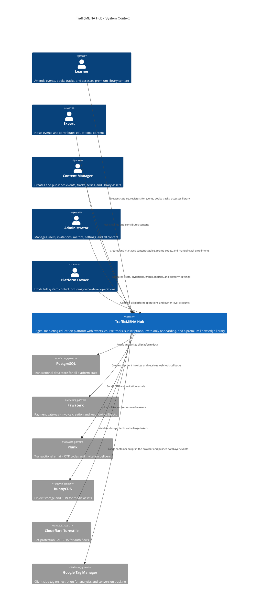

# C4 Context Level: System Context

## System Overview

### Short Description

TrafficMENA Hub is a digital marketing education platform for the MENA region that connects practitioners with expert-led events, bundled course tracks, and a premium knowledge library through a single member experience.

### Long Description

TrafficMENA Hub solves the fragmented learning journey for digital marketing professionals in the MENA region. The platform lets practitioners discover and attend expert-led live events, purchase bundled course tracks for structured learning, and access a curated premium library of assets and content series after each live experience ends.

Access is controlled through a five-tier role model (user, expert, manager, admin, owner) so that the same platform serves learners consuming content, subject-matter experts contributing it, and operations staff managing the full catalog lifecycle. Onboarding supports both open OTP-based signup and curated invite-only flows, giving the operations team full control over who enters the platform.

Commerce is built around the Fawaterk payment gateway supporting five payment methods (Fawry, Meeza, Aman, Masary, Mobile Wallet), a 72-hour capacity reservation system, subscriber discounts, and time-bounded promo codes. Annual subscriptions unlock a configurable discount on offline events and track bookings and grant free access to online events, creating an incentive structure that rewards long-term membership.

The admin workspace covers the complete content lifecycle: creating and publishing events, assembling tracks from event groups, curating series and library assets, managing invitations (single and bulk CSV), configuring promo codes, and monitoring platform metrics. Twenty-three standalone marketing and financial calculators round out the learner value proposition without requiring any backend calls.

## Personas

### Learner

- **Type**: Human User
- **Description**: An authenticated digital marketing professional who uses the platform to attend events, book course tracks, and access premium library content.
- **Goals**: Discover and register for live events, purchase track bundles, consume premium library assets, and track learning progress.
- **Key Features Used**: Event browsing and registration, track booking, library access, series browsing, subscription management, marketing calculators, payment checkout.

### Expert

- **Type**: Human User
- **Description**: A subject-matter expert or event host who co-hosts events and authors educational content managed through the platform.
- **Goals**: Deliver knowledge to the audience and have supporting materials published as library or series assets accessible to members.
- **Key Features Used**: Events (as host or co-host), library assets, series, expert-linked content workflows.

### Content Manager

- **Type**: Human User
- **Description**: A staff user with write access to the content catalog and commerce tools who manages day-to-day publishing operations without user-management authority.
- **Goals**: Create and publish events, tracks, series, and library assets; manage promo codes; monitor attendee lists; configure subscription settings.
- **Key Features Used**: Event CRUD, track CRUD, series CRUD, library asset CRUD, promo code management, attendee management, subscription settings.

### Administrator

- **Type**: Human User
- **Description**: A platform operator with full control over content, users, invitations, and settings, excluding removal of owner-level accounts.
- **Goals**: Manage the full user roster and role assignments, run invitation campaigns, oversee platform settings, review dashboard metrics and revenue performance, and approve or reject cancellation requests.
- **Key Features Used**: All Content Manager features plus user management, invitation dispatch (single and bulk CSV), admin dashboard metrics, cancellation request approval, platform settings.

### Platform Owner

- **Type**: Human User
- **Description**: The highest-privilege account holder with unrestricted system control, including owner-level user management and all configuration operations.
- **Goals**: Maintain full platform control including owner-level user operations, all settings changes, and all content and commerce operations.
- **Key Features Used**: All Administrator features plus owner-level user management and system-wide configuration.

### Fawaterk Payment Gateway

- **Type**: Programmatic User
- **Description**: The external payment provider that sends HMAC-verified webhook callbacks to the platform when a hosted invoice changes state.
- **Goals**: Notify the platform that a payment has been confirmed, failed, or expired so that bookings, subscriptions, and reservations can be fulfilled or released.
- **Key Features Used**: Payment webhook endpoints (`POST /api/payments/webhook`, `POST /api/payments/webhook_json`), invoice verification, atomic checkout fulfillment.

### Plunk Email Service

- **Type**: Programmatic User
- **Description**: The transactional email provider that receives API requests from the platform and delivers OTP codes and invitation emails to end users.
- **Goals**: Reliably deliver authentication and onboarding email messages on behalf of the platform.
- **Key Features Used**: OTP email delivery for authentication flows, invitation email dispatch for single and bulk invitation campaigns.

### BunnyCDN

- **Type**: Programmatic User
- **Description**: The object storage and CDN that receives file uploads from the API server and serves stored media assets directly to browsers.
- **Goals**: Store and serve uploaded documents, images, and content assets with low latency.
- **Key Features Used**: File upload API (20 MB limit), direct browser media delivery for library assets, event images, and track thumbnails.

### Google Tag Manager (GTM)

- **Type**: Programmatic User (Analytics Delivery)
- **Description**: Client-side tag orchestration service loaded by the SPA on first paint. Consumes a well-defined `dataLayer` event stream pushed by the analytics modules in `src/lib/analytics/` and fans events out to downstream marketing and measurement platforms (GA4, Ads, Meta, etc.) at GTM runtime.
- **Goals**: Deliver the platform's conversion and engagement events to measurement tools without requiring code changes for every new tag.
- **Key Features Used**: `dataLayer` event stream for auth, signup, content discovery, calendar, library, profile, payment, and purchase events; verified purchase payload enriched from backend via payment analytics endpoints; GTM container ID `GTM-5DMGVFZS` bootstrapped through `public/gtm-bootstrap.js`.

## System Features

### Email OTP Authentication with CAPTCHA

- **Description**: Passwordless authentication using one-time codes sent to email. Supports open signup, invite-only enforcement, session management, and optional Cloudflare Turnstile bot protection on high-load flows. Rate-limited at 3 OTPs per 10 minutes in normal mode and 15 per 10 minutes in event mode.
- **Users**: Learner, Expert, Content Manager, Administrator, Platform Owner
- **User Journey**: New User Signup Journey

### Event Management and Registration

- **Description**: Full lifecycle for expert-led live events including creation, publishing, attendee registration, capacity tracking, cancellation requests, and refund workflow management.
- **Users**: Learner (registration), Expert (hosting), Content Manager (CRUD), Administrator (CRUD, refund approval)
- **User Journey**: Event Registration Journey

### Track (Course Bundle) Booking

- **Description**: Bundles of events sold as a single purchase with atomic capacity reservation, a 72-hour booking window, and access to all constituent events after booking confirmation.
- **Users**: Learner (booking), Content Manager (CRUD), Administrator (CRUD)
- **User Journey**: Track Booking Journey

### Content Series and Library

- **Description**: Curated series of educational assets and a premium knowledge library with subscription-gated access control, view tracking, and rich media support.
- **Users**: Learner (browsing and access), Expert (content contribution), Content Manager (CRUD), Administrator (CRUD)
- **User Journey**: Library Access Journey

### Payment Processing

- **Description**: End-to-end commerce using the Fawaterk gateway supporting Fawry, Meeza, Aman, Masary, and Mobile Wallet. Includes price previews, promo code application, 72-hour capacity reservations, HMAC-verified webhook fulfillment, and a background job for stale payment expiration.
- **Users**: Learner (checkout), Fawaterk Payment Gateway (webhook callbacks)
- **User Journey**: Payment Flow Journey

### Subscription Management and Admin Grants

- **Description**: Annual membership that unlocks free online events, a configurable discount on offline events and track bundles (default 20%), and full access to the premium knowledge library. The learner-facing subscribe page (`/subscribe`, `/dashboard/subscribe`) is currently gated behind `owner`/`admin` roles — the public purchase surface is hidden and subscriptions are provisioned through the admin grant workflow (single, revoke, bulk CSV) backed by `/api/subscriptions/grants*`. Premium content is enforced at read time by a shared `PremiumContentGate` surface.
- **Users**: Learner (sees own subscription status, premium gate on library/series content), Administrator (grants/revokes subscriptions, manages settings), Platform Owner (same as Administrator)
- **User Journey**: Library Access Journey, Admin Content Management Journey

### Promo Codes and Discounts

- **Description**: Time-bounded discount codes with configurable percentage reductions, usage tracking, soft-delete lifecycle, and validation at checkout.
- **Users**: Learner (code application at checkout), Content Manager (code management), Administrator (code management)
- **User Journey**: Payment Flow Journey

### Invitation System

- **Description**: Invite-only onboarding support with single email invitations and bulk CSV import, invite acceptance and activation flows, and a toggleable invite-only platform mode.
- **Users**: Administrator (dispatch), Platform Owner (dispatch), Learner (acceptance)
- **User Journey**: New User Signup Journey

### Admin Dashboard and Metrics

- **Description**: Protected staff workspace with overview metrics, revenue visibility, attendee monitoring, and all content and user management operations.
- **Users**: Administrator, Platform Owner
- **User Journey**: Admin Content Management Journey

### Marketing Calculators

- **Description**: Twenty-three standalone interactive marketing and financial calculators (ROI, CPL, ROAS, LTV, and others) that run entirely in the browser with no API dependency.
- **Users**: Learner, Expert, Visitor (public access)
- **User Journey**: N/A (standalone tools)

### Rich Text Content Editor

- **Description**: TipTap-based rich text editor used in content authoring for events, library assets, and series descriptions. Supports headings, code blocks, images, blockquotes, lists, links, and text alignment.
- **Users**: Content Manager, Administrator, Platform Owner
- **User Journey**: Admin Content Management Journey

### Manual Track Enrollment

- **Description**: Manager-level operation to enroll a user directly into a published track without running a payment flow, recording an off-platform reference (e.g., manual bank transfer) and an optional paid amount. Revoke is supported. Uses the same atomic track-booking write path as paid bookings so capacity, event grants, and series access stay consistent.
- **Users**: Content Manager, Administrator, Platform Owner
- **User Journey**: Admin Content Management Journey

### Series and Library Access Grants

- **Description**: Admin-controlled per-user access grants for premium series and bulk CSV ingestion for grant campaigns. Grants complement subscriptions for cases where individual learners need targeted access. Premium content resolution combines subscriber status, track-booking access, per-series grants, and series/asset premium flags.
- **Users**: Administrator, Platform Owner, Learner (as grant recipient)
- **User Journey**: Library Access Journey, Admin Content Management Journey

### Analytics and Conversion Tracking

- **Description**: Client-side dataLayer instrumentation covering page views, signup funnel, login outcomes, content discovery (event/track/library/series impressions and detail views), calendar actions, profile updates, payment flow, and verified purchases. GTM is loaded from a static bootstrap script and CSP is hardened to permit only Google Tag Manager origins. Purchase payloads are enriched server-side via the payment analytics helpers, which classify customer type (new/returning, subscription vs. non-subscription) and resolve item metadata for GA4-compatible e-commerce events.
- **Users**: All personas (implicit); GTM (as event recipient)
- **User Journey**: All learner journeys (cross-cutting instrumentation)

## User Journeys

### New User Signup Journey

**Persona**: Learner (or any new member)

1. An Administrator dispatches a single or bulk invitation email from the admin console.
2. The invited user receives the email and opens the invitation link (`/invitation/:token`).
3. The platform validates the invitation token and initializes the invite-session context.
4. The user completes the multi-step signup wizard (profile details, preferences).
5. The backend activates the invitation, creates the member record with the `user` role, and establishes a session via Better Auth.
6. The user lands on the dashboard and can browse events, tracks, and library content.

**Alternative path (open OTP signup, when invite-only is disabled):**

1. A visitor navigates to `/signin` and enters their email address.
2. The frontend submits an OTP request to `POST /api/auth/otp/request`, optionally with a Turnstile token.
3. The backend rate-limits the request and dispatches a one-time code via Plunk.
4. The visitor enters the OTP code on the verification screen.
5. The backend verifies the code, creates or resumes the session, and returns the authenticated session state.
6. The user proceeds to the dashboard.

### Event Registration Journey

**Persona**: Learner

1. The learner browses the events catalog from the dashboard or a public listing page.
2. The frontend loads event details and current attendance state from `GET /api/events/:id`.
3. For a free event, the learner clicks Register; the backend records attendance immediately.
4. For a paid event, the learner proceeds to checkout: the frontend requests a price preview from `GET /api/payments/price-preview`, optionally applying a promo code.
5. The learner selects a payment method from `GET /api/payments/methods` and submits checkout via `POST /api/payments/checkout`.
6. The backend creates a 72-hour capacity reservation and a hosted Fawaterk invoice, returning invoice metadata.
7. The learner completes payment through the Fawaterk-hosted flow.
8. Fawaterk sends an HMAC-verified callback to `POST /api/payments/webhook`; the backend fulfills the booking atomically.
9. The learner returns to a payment success screen and sees confirmed registration status in the dashboard.

### Track Booking Journey

**Persona**: Learner

1. The learner opens a track page from the dashboard or public track listing.
2. The frontend loads track details, the event lineup, and current booking state from `GET /api/tracks/:id`.
3. The learner initiates booking via `POST /api/tracks/:id/book`.
4. The backend reserves capacity across all track events atomically and creates a Fawaterk invoice.
5. The learner completes payment; Fawaterk sends a webhook callback.
6. The backend fulfills the track booking via a CTE-based atomic transaction, granting access to all constituent events.
7. The learner sees the track confirmed in the dashboard and can access all linked events and associated library assets.

### Library Access Journey

**Persona**: Learner

1. The learner navigates to the library or a series detail page from the dashboard.
2. The frontend requests the asset catalog from `GET /api/library` or series assets from `GET /api/series/:id/assets`. The backend composes access from subscriber status, relevant track bookings, per-series grants, and the series/asset `isPremium` flags.
3. Premium assets are visible in the listing but rendered behind the shared `PremiumContentGate` surface for learners without access.
4. A learner with active access (subscription, track booking, or series grant) opens the asset and the backend records a view.
5. A learner without access sees the gate explaining that the content is premium and pointing them at the path their account has available (e.g., booking a relevant track). The public subscription purchase flow is currently hidden — subscriptions are provisioned via admin grants (`POST /api/subscriptions/grants` and bulk CSV variants).
6. Administrators issue or revoke grants from the admin console when a learner is entitled to access outside of a purchase.

**Admin-driven provisioning path:**

1. An Administrator opens the subscription or series grant manager in the admin console.
2. For a single user, the admin submits `POST /api/subscriptions/grants` or `POST /api/series/:id/grants` with a reason and duration/scope.
3. For campaigns, the admin uploads a CSV through the bulk grant surface; the backend validates rows server-side and records per-row results.
4. The grant immediately unlocks the gated surface for the learner on their next request.

### Admin Content Management Journey

**Persona**: Administrator or Content Manager

1. The staff user signs in and navigates to the protected admin console (`/admin/*`).
2. To create an event, the admin fills in the event form (title, description via TipTap editor, date, capacity, pricing) and submits to `POST /api/events`.
3. The backend validates the payload with Zod, enforces the manager-level RBAC check, and persists the event.
4. To build a track, the admin creates a track record via `POST /api/tracks`, then assembles events into it via `POST /api/tracks/:id/events`.
5. Content assets (images, documents) are uploaded via `POST /api/uploads`; the backend stores them in BunnyCDN and returns CDN URLs for embedding.
6. The admin publishes the track; it becomes visible to learners in the catalog.
7. To enroll a user directly in a published track (for example, after an off-platform payment), the admin uses the track's Manual Enrollment Manager and submits `POST /api/tracks/:id/manual-enrollments` with a reason, reference, and optional paid amount; revocation uses `POST /api/tracks/:id/enrollments/:userId/revoke`. Both paths go through the same atomic booking transaction used for paid bookings.
8. To provision library or series access outside of a purchase, the admin uses the Subscription Grants or Series Grants surfaces (single, revoke, or bulk CSV) that hit `/api/subscriptions/grants*` and `/api/series/:id/grants*`.
9. An Administrator monitors the admin dashboard for overview metrics, revenue figures, and attendee lists, iterating as needed.

### Analytics Tracking Journey

**Persona**: Google Tag Manager (implicit across all learner journeys)

1. The SPA loads `public/gtm-bootstrap.js` from the `index.html` head, which injects the GTM container `GTM-5DMGVFZS` and the CSP-whitelisted `noscript` fallback iframe.
2. As the learner interacts with the app, modules under `src/lib/analytics/` push typed events to `window.dataLayer` — signup steps, login outcomes, calendar add-to-calendar clicks, content impressions and detail views for events/tracks/library/series, profile updates, payment start/complete, and page views via `usePageTracking`.
3. On payment confirmation, the frontend reads the verified purchase payload directly from the paid `GET /api/payments/:id` (or `POST /api/payments/verify`) response, which the backend enriches via `paymentAnalytics.ts` with item metadata, promo code, discount, payment method, and a customer-type classification (new vs. returning, subscription vs. non-subscription). The frontend then pushes a single `purchase` event to the dataLayer with this payload. Enrichment is best-effort — failures are logged but do not block payment verification.
4. GTM tags fan the events out to downstream marketing and measurement platforms. The platform itself does not post events to GTM or third-party analytics servers — only the learner's browser does.

### Payment Flow Journey

**Persona**: Learner (initiating), Fawaterk Payment Gateway (fulfilling)

1. The learner selects a paid item (event, track, or subscription) and starts checkout.
2. The frontend requests a price preview with any applicable subscriber discount and promo code.
3. The learner confirms the order; the frontend submits `POST /api/payments/checkout` with the selected payment method.
4. The backend creates a capacity reservation (72-hour TTL), generates a Fawaterk hosted invoice, and returns the invoice URL.
5. The learner is redirected to the Fawaterk-hosted payment page and completes the transaction.
6. Fawaterk delivers an HMAC-verified webhook callback to `POST /api/payments/webhook`.
7. The backend verifies the webhook signature, resolves invoice state, and atomically fulfills the purchase (event booking, track booking, or subscription grant).
8. The learner is redirected to the payment success screen; access is immediately active.
9. A background job periodically expires stale pending payments and releases associated capacity reservations.

## External Systems and Dependencies

### PostgreSQL

- **Type**: Database
- **Description**: The durable transactional data store holding all platform state including users, profiles, events, tracks, series, library assets, payments, reservations, subscriptions, promo codes, invitations, and platform settings.
- **Integration Type**: SQL via Drizzle ORM
- **Purpose**: Single source of truth for all platform business state; backs authentication, content discovery, access control, commerce, and metrics.

### Fawaterk

- **Type**: Payment Gateway
- **Description**: Provides payment-method discovery, hosted invoice creation for Fawry, Meeza, Aman, Masary, and Mobile Wallet, and HMAC-verified webhook callbacks when invoice state changes.
- **Integration Type**: HTTPS API (outbound invoice creation) and HTTPS webhooks (inbound payment confirmations)
- **Purpose**: Enables paid registration for events, track bookings, and annual subscriptions.

### Plunk

- **Type**: Transactional Email Service
- **Description**: Receives API requests from the backend and delivers OTP authentication codes and invitation emails to end users.
- **Integration Type**: HTTPS API
- **Purpose**: Supports passwordless authentication and curated invite-only onboarding communications.

### BunnyCDN

- **Type**: Object Storage and Content Delivery Network
- **Description**: Stores uploaded files sent by the backend API and serves stored media assets directly to browsers using CDN URLs.
- **Integration Type**: HTTPS API (upload) and direct browser HTTPS delivery (media serving)
- **Purpose**: Hosts uploaded documents, images, event thumbnails, and library content assets with low-latency global delivery.

### Cloudflare Turnstile

- **Type**: Bot-Protection Service
- **Description**: Issues challenge tokens in the browser that are submitted alongside OTP requests and validated server-side by the backend.
- **Integration Type**: HTTPS API (server-side token validation)
- **Purpose**: Protects OTP request endpoints from automated abuse during high-traffic periods such as event launches.

### Google Tag Manager

- **Type**: Analytics Tag Orchestration (third-party JavaScript)
- **Description**: GTM container (`GTM-5DMGVFZS`) is bootstrapped client-side from `public/gtm-bootstrap.js`. The platform never talks to GTM server-side. All events reach GTM by being pushed to `window.dataLayer` from the frontend, and GTM fans them out to downstream destinations per its own tag configuration.
- **Integration Type**: Browser-loaded JavaScript and dataLayer messaging (no server-side integration)
- **Purpose**: Decouples marketing and measurement tag configuration from the codebase; fulfills conversion tracking for signup, registration, track booking, library engagement, and verified purchases.

## System Context Diagram

## Related Documentation

- [Container Documentation](./c4-container.md)
- [Component Documentation](./c4-component.md)
- [Web Experience Platform](./components/c4-component-web-experience-platform.md)
- [API Runtime and Platform Security](./components/c4-component-api-runtime-and-platform-security.md)
- [Identity, Invitations, and Member Operations API](./components/c4-component-identity-invitations-and-member-operations-api.md)
- [Learning Experiences UI](./components/c4-component-learning-experiences-ui.md)
- [Payments, Pricing, and Revenue Operations API](./components/c4-component-payments-pricing-and-revenue-operations-api.md)
- [Learning Content and Delivery API](./components/c4-component-learning-content-and-delivery-api.md)
- [Persistence and Background Operations](./components/c4-component-persistence-and-background-operations.md)
