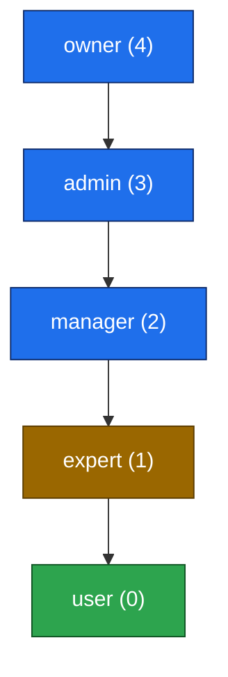

# C4 — Role-Based Access Control (RBAC)

> **Scope:** This is a cross-cutting reference for the authorization model of the TrafficMENA API
> Service container. It complements the C4 set (`c4-context.md`, `c4-container.md`,
> `c4-component.md`) and the naming decision in [`../rbac-decision.md`](../rbac-decision.md).
> Everything below is grounded in the actual code, with file/line references. Where the code
> diverges from other documentation, it is called out under **Findings & Discrepancies**.

---

## 1. Overview

Authorization is **role-based**, enforced **server-side per endpoint**. A single role is stored
per user and compared against a per-endpoint allow-list (or a minimum rank). There is no
fine-grained permission/scope table — the model is intentionally coarse, matching the MVP mindset.

| Concern | Location |
| --- | --- |
| Role enum (DB) | `server/src/db/schema/index.ts:18` (`userRoleEnum`), `:58` (`profiles.role`) |
| Role helpers & guards | `server/src/routes/api/utils.ts:9-177` |
| Per-endpoint enforcement | Each `server/src/routes/api/*.ts` route handler |
| Session source | `server/src/utils/session.ts` (`getSessionFromRequest`) |
| Frontend role logic | `src/shared/hooks/custom/useRolePermissions.ts` |
| Frontend route guard | `src/shared/components/layout/AdminProtectedRoute.tsx` |

**Source of truth:** the user's role lives in `profiles.role` (a Postgres enum column,
default `user`, `NOT NULL`). The session (Better Auth) identifies *who* the user is; the
`profiles` row determines *what they may do*.

---

## 2. Roles & Hierarchy

The role enum is `('owner', 'admin', 'manager', 'expert', 'user')`
(`server/src/db/schema/index.ts:18`). Authorization uses a numeric **priority/rank** so guards
can express "this role or higher" (`server/src/routes/api/utils.ts:11-17`):

```
owner   (4)   Full system control
admin   (3)   Full control except protected owner operations
manager (2)   Content CRUD (no hard delete), invitations, grants, user directory (read)
expert  (1)   No enforced privileges — see §7 Findings (currently equivalent to `user`)
user    (0)   Authenticated end-user: browse, register, self-profile, library access
```



### Role normalization (compat shim)

`normalizeRole()` (`utils.ts:96-104`) lowercases the stored value and maps the legacy
`member` value to `user`. Any unknown/null value also resolves to `user` (fail-closed to the
lowest privilege). This shim exists because an earlier migration briefly stored `member`
(see [`../rbac-decision.md`](../rbac-decision.md)); the canonical free-tier value is `user`.

---

## 3. Authorization Guards (server)

All guards live in `server/src/routes/api/utils.ts` and return either
`{ userId, role }` (success) or `{ response }` (a ready-to-return 401/403). Handlers use the
`'response' in result` check to short-circuit.

| Guard | Allowed roles | On no session | On wrong role | Source |
| --- | --- | --- | --- | --- |
| `requireRole(c, roles, opts)` | caller-supplied list | `401 UNAUTHORIZED` | `403 FORBIDDEN` | `utils.ts:120-163` |
| `requireAdmin(c)` | `owner`, `admin` | `401` | `403 "Admin privileges required."` | `utils.ts:165-167` |
| `requireManager(c)` | `owner`, `admin`, `manager` | `401` | `403 "Manager or admin privileges required."` | `utils.ts:169-173` |
| `getOptionalUserRole(userId)` | — (read-time lookup) | returns `null` | returns `null` | `utils.ts:106-114` |
| `getRolePriority(role)` | — (rank lookup) | — | — | `utils.ts:175-177` |

**Two enforcement styles exist in the code:**

1. **Hard guards** — `requireAdmin` / `requireManager` / `requireRole` gate write/admin
   endpoints and reject unauthorized callers.
2. **Soft (read-time) gating** — `getOptionalUserRole` is used inside *list/detail* handlers
   for events, tracks, series, and library. Staff (manager+) get to see unpublished/hidden
   content and bypass premium gates; everyone else sees only published/permitted rows. This is
   visibility filtering, not a 403 boundary.

---

## 4. Endpoint → Required Role Matrix

Legend: **Public** = no auth · **Auth** = any logged-in user (self-scoped) ·
**Manager+** = `manager`/`admin`/`owner` · **Admin+** = `admin`/`owner` · **Owner-gated** =
extra owner-only business rules apply (§6).

### Users (`users.ts`)
| Endpoint | Required | Source / Notes |
| --- | --- | --- |
| `GET /users/me` | Auth | self profile |
| `PUT /users/me` | Auth | self profile (`users.ts` self-update; whitelisted fields) |
| `GET /users` | **Manager+** | inline role check `users.ts:61-93` |
| `GET /users/:id` | — | stub (`notImplemented`) `users.ts:467` |
| `PUT /users/:id` | **Admin+ / Owner-gated** | `requireRole(['owner','admin'])` `users.ts:470` + §6 rules |
| `DELETE /users/:id` | **Admin+ / Owner-gated** | `requireRole(['owner','admin'])` `users.ts:596` + §6 rules |

### Events (`events.ts`)
| Endpoint | Required | Source / Notes |
| --- | --- | --- |
| `GET /events`, `GET /events/:id` | Public | role only affects visibility (`getOptionalUserRole` `events.ts:165,309`) |
| `POST /events`, `PUT /events/:id` | **Manager+** | `requireManager` `events.ts:379,470` |
| `GET /events/:id/attendees` | **Manager+** | `requireManager` `events.ts:543` |
| `POST/DELETE /events/:id/register` | Auth | self registration / refund request |
| `DELETE /events/:id` | **Admin+** | `requireAdmin` `events.ts:644` |
| Cancellation-requests list / approve / reject | **Admin+** | `requireAdmin` `events.ts:977,1054,1107` |

### Tracks (`tracks.ts`, `trackEnrollments.ts`)
| Endpoint | Required | Source / Notes |
| --- | --- | --- |
| `GET /tracks`, `/tracks/:id`, `/tracks/:id/events` | Public | visibility/booking status via `getOptionalUserRole` `tracks.ts:487,584,673` |
| `POST /tracks`, `PUT /tracks/:id` | **Manager+** | `requireManager` `tracks.ts:796,1161` |
| `POST/DELETE /tracks/:id/events` | **Manager+** | `requireManager` `tracks.ts:902,976` |
| `POST /tracks/:id/book` | Auth | self booking |
| `DELETE /tracks/:id` | **Admin+** | `requireAdmin` `tracks.ts:1139` |
| Track enrollment admin grants | **Manager+** | `requireManager` `trackEnrollments.ts:59,206` |

### Series (`series.ts`, `seriesGrants.ts`)
| Endpoint | Required | Source / Notes |
| --- | --- | --- |
| `GET /series`, `/series/:id`, `/series/:id/assets` | Public | visibility via `getOptionalUserRole` `series.ts:73,160` |
| `POST /series`, `PUT /series/:id` | **Manager+** | `requireManager` `series.ts:316,413` |
| `POST/DELETE /series/:id/assets` | **Manager+** | `requireManager` `series.ts:344,487,524` |
| `DELETE /series/:id` | **Admin+** | `requireAdmin` `series.ts:389` |
| Series access grants (single/bulk/CSV) | **Manager+** | `requireManager` `seriesGrants.ts:43,128,257,323` |

### Library (`library.ts`)
| Endpoint | Required | Source / Notes |
| --- | --- | --- |
| `GET /library`, `GET /library/:id` | Auth | premium access gated by **subscription**; staff bypass via `getOptionalUserRole` `library.ts:135,361` |
| `POST /library` | **Manager+** | `requireManager` `library.ts:464,525` |
| `DELETE /library/:id` | **Admin+** | `requireAdmin` `library.ts:628` |

### Promo Codes (`promoCodes.ts`)
| Endpoint | Required | Source / Notes |
| --- | --- | --- |
| `GET` list / `GET /:id` / `POST` / `PUT /:id` | **Manager+** | `requireManager` `promoCodes.ts:110,159,181,232` |
| `DELETE /:id` (soft-delete) | **Admin+** | `requireAdmin` `promoCodes.ts:284` — ⚠ see §7 |

### Subscriptions & Grants (`subscriptions.ts`, `subscriptionsGrants.ts`)
| Endpoint | Required | Source / Notes |
| --- | --- | --- |
| `GET /subscriptions/current`, `/subscriptions/info` | Auth / Public | self / public benefits |
| `GET /subscriptions/settings` | **Manager+** | `requireManager` `subscriptions.ts:72` |
| `PUT /subscriptions/settings` | **Admin+** | `requireAdmin` `subscriptions.ts:89` |
| Subscription grants (single/bulk/CSV) | **Admin+** | `requireAdmin` `subscriptionsGrants.ts:175,223,267` |

### Invitations (`invitations.ts`)
| Endpoint | Required | Source / Notes |
| --- | --- | --- |
| List / stats / single / bulk | **Manager+** | local `requireAdmin` wrapper that permits `manager`/`admin`/`owner` `invitations.ts:192,202-230` — ⚠ misnamed, see §7 |
| `POST /invitations/accept`, `/activate` | Public | invite redemption |

### Settings, Metrics, Uploads, Skills
| Endpoint | Required | Source / Notes |
| --- | --- | --- |
| `GET /settings` | Public/Auth | read platform settings |
| `PUT /settings` | **Admin+** | `requireAdmin` `settings.ts:49,77` |
| `GET /admin/metrics/*` | **Admin+** | `requireRole(['owner','admin'])` `adminMetrics.ts:33`; payment analytics load inside this guard |
| `POST /uploads` | **Manager+** | `requireManager` `uploads.ts:114` |
| `GET /skills` | Public/Auth | taxonomy read |
| `POST /skills`, `GET/POST /user/skills`, `DELETE /user/skills/:id` | **Auth only** | session check, **no role gate** `skills.ts:34,101,130,178` — ⚠ see §7 |

---

## 5. Per-Role Capability Summary

| Capability | user | expert | manager | admin | owner |
| --- | :--: | :--: | :--: | :--: | :--: |
| Browse events / tracks / series | ✅ | ✅ | ✅ | ✅ | ✅ |
| Register / book / request refund (self) | ✅ | ✅ | ✅ | ✅ | ✅ |
| Edit own profile | ✅ | ✅ | ✅ | ✅ | ✅ |
| Library premium content | subscription-gated | subscription-gated | ✅ (staff bypass) | ✅ | ✅ |
| View user directory (`GET /users`) | ❌ | ❌ | ✅ | ✅ | ✅ |
| Create / update content (events, tracks, series, library, promo) | ❌ | ❌ | ✅ | ✅ | ✅ |
| Upload files | ❌ | ❌ | ✅ | ✅ | ✅ |
| Manage invitations | ❌ | ❌ | ✅ | ✅ | ✅ |
| Series access grants / track enrollment grants | ❌ | ❌ | ✅ | ✅ | ✅ |
| **Delete** content (events, tracks, series, library, promo) | ❌ | ❌ | ❌ | ✅ | ✅ |
| Approve/reject event refunds | ❌ | ❌ | ❌ | ✅ | ✅ |
| Subscription grants & settings write | ❌ | ❌ | ❌ | ✅ | ✅ |
| Platform settings write | ❌ | ❌ | ❌ | ✅ | ✅ |
| Admin metrics / revenue analytics | ❌ | ❌ | ❌ | ✅ | ✅ |
| Change user roles / delete users | ❌ | ❌ | ❌ | ✅* | ✅ |
| Grant **owner** role / remove last owner | ❌ | ❌ | ❌ | ❌ | ✅ |

`✅* ` = admin can change roles **except** assigning/removing `owner` (owner-only — §6).
`expert` currently has the same effective access as `user` (§7, Finding 1).

---

## 6. Owner-Protected Business Rules (`users.ts`)

Beyond the role guard, user-management endpoints enforce extra invariants
(`users.ts:504-553, 615+`):

1. **Only `owner` can grant `owner`** — admins assigning `owner` get `403`
   (`"Only owners can grant owner access."`).
2. **No self-demotion from owner** — an owner cannot strip their own owner access
   (`"You cannot remove your own owner access."`).
3. **Last-owner protection** — demoting the final remaining owner is blocked
   (`"Cannot remove the last owner on the account."`).
4. **No self-delete** — an actor cannot delete their own account via `DELETE /users/:id`.

These prevent lockout and privilege-escalation footguns and are independent of the
role-rank check.

---

## 7. Findings & Discrepancies (code vs. docs)

These are real, code-grounded observations surfaced while mapping enforcement. They are
documented here rather than silently "fixed" — treat as a backlog for a maintainer to decide on.

1. **`expert` has no enforced privileges.** It exists in the enum and has rank `1`
   (`utils.ts:13`), but no endpoint grants `expert` any capability beyond `user`. Every write
   path uses `requireManager` (rank ≥ 2) or `requireAdmin`, so an `expert` is functionally a
   `user`. The "co-host/author content" / `create:content` capability described in
   `../rbac-decision.md` is **aspirational, not implemented**.

2. **`invitations.ts` defines a *local* `requireAdmin` that actually permits manager+.**
   `invitations.ts:202-230` allows `manager`, `admin`, and `owner` despite the name. The
   effective access for all invitation management endpoints is **Manager+**. This matches the
   `rbac-decision.md` intent ("manager manages invitations") but **contradicts the API table in
   `CLAUDE.md`**, which lists invitation endpoints as `admin+`. The misleading name is a
   maintenance hazard — it shadows the canonical `requireManager` from `utils.ts`.

3. **Promo-code `DELETE` requires Admin+, not Manager+.** `promoCodes.ts:284` uses
   `requireAdmin`, but `CLAUDE.md` lists `DELETE /api/promo-codes/:id` as `(manager+)`. Code is
   the source of truth: deletion is **Admin+**.

4. **`skills` write endpoints are authenticated-only (no role gate).** `POST /skills` (adds to
   the global skills taxonomy) and the `/user/skills` endpoints only check for a session
   (`skills.ts:34,101,130,178`). Any logged-in `user` can mutate the shared taxonomy. If the
   taxonomy is meant to be staff-curated, this needs a `requireManager` gate.

5. **The `permissions` matrix in `rbac-decision.md` is illustrative, not the mechanism.** That
   document shows permission-string sets (e.g. `user: ['read:events','read:library']`). The
   real implementation uses **coarse role-rank guards**, not a permission-string lookup. Read
   this `c4-rbac.md` for actual enforcement.

---

## 8. Frontend Enforcement (defense-in-depth)

The SPA mirrors the server model for UX (hiding controls, redirecting), but is **not** a
security boundary — every protected action is re-checked server-side.

- **`useRolePermissions()`** (`src/shared/hooks/custom/useRolePermissions.ts`) reads the
  current profile role, normalizes it (same `member → user` shim), and exposes:
  `role`, `rank`, `isOwner`, `isAdmin` (rank ≥ admin), `isManager` (rank ≥ manager),
  `isExpert`, `isMember`, plus capability flags `canManageContent`, `canDeleteContent`,
  `canManageInvites`, `canManageUsers`, `canAccessAdmin` (manager+), `canAccessSubscriptionPages`
  (admin+), and helpers `hasRole(...)` / `hasRankAtLeast(...)`.
- **`AdminProtectedRoute`** (`src/shared/components/layout/AdminProtectedRoute.tsx`) gates
  routes by the minimum rank derived from `allowedRoles` (default `['owner','admin']`),
  redirecting unauthenticated users to `/signin` and under-privileged users to `/dashboard`.
- **`getAdminDashboardPath(role)`** (`src/shared/utils/adminAccess.ts`) routes `manager` to
  `/admin/library`, `admin`/`owner` to `/admin`, and everyone else to `/dashboard`.
- Convenience hooks `useIsAdmin` / `useIsManager` wrap the above for component-level checks.

---

## 9. Related Documentation

- [`c4-container.md`](./c4-container.md) — API Service container (RBAC enforcement layer)
- [`c4-context.md`](./c4-context.md) — personas and system context
- [`c4-component.md`](./c4-component.md) — component breakdown
- [`../rbac-decision.md`](../rbac-decision.md) — why `user` is the canonical free-tier role
