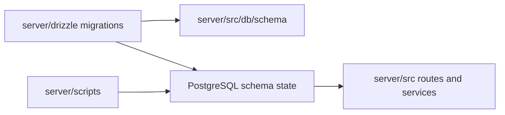

# C4 Code Level: Drizzle Migration History

## Overview

- **Name**: Drizzle Migration History
- **Description**: Ordered SQL migration set that evolves the TrafficMENA PostgreSQL schema over time.
- **Location**: [server/drizzle](../../../server/drizzle)
- **Language**: SQL
- **Purpose**: Provide the authoritative schema-evolution record for authentication, content, commerce, subscriptions, invitations, and operational access control.

This code-level document covers the executable migration files in `server/drizzle/`. Generated metadata in `server/drizzle/meta/` and archived rollback artifacts in `server/drizzle/_archive/` are intentionally excluded from the active code-level scope.

## Code Elements

### Functions/Methods

- None. This directory contains declarative SQL migration modules executed by Drizzle Kit rather than callable TypeScript functions or classes.

### Modules/Scripts

- `0000_initial_schema.sql`
  - Description: Establishes the baseline schema with enums, core domain tables, foreign keys, and indexes covering platform settings, auth, events, tracks, library assets, invitations, payments, subscriptions, skills, and user activity.
  - Location: [server/drizzle/0000_initial_schema.sql](../../../server/drizzle/0000_initial_schema.sql) (line 1)
  - Dependencies: PostgreSQL DDL support, `gen_random_uuid()`, Drizzle migration runner
- `0001_aromatic_morlun.sql`
  - Description: Adds the `series.is_premium` flag used to distinguish premium series access.
  - Location: [server/drizzle/0001_aromatic_morlun.sql](../../../server/drizzle/0001_aromatic_morlun.sql) (line 1)
  - Dependencies: `series`
- `0002_shallow_malice.sql`
  - Description: Adds the `library_assets.is_premium` flag for premium asset gating.
  - Location: [server/drizzle/0002_shallow_malice.sql](../../../server/drizzle/0002_shallow_malice.sql) (line 1)
  - Dependencies: `library_assets`
- `0003_payment_reference_codes.sql`
  - Description: Extends `payments` with provider-specific reference fields for Fawry, Aman, Masary, and Meeza payment flows.
  - Location: [server/drizzle/0003_payment_reference_codes.sql](../../../server/drizzle/0003_payment_reference_codes.sql) (line 1)
  - Dependencies: `payments`
- `0004_event_mode.sql`
  - Description: Adds the `platform_settings.event_mode` feature flag for higher-throughput event-launch behavior.
  - Location: [server/drizzle/0004_event_mode.sql](../../../server/drizzle/0004_event_mode.sql) (line 1)
  - Dependencies: `platform_settings`
- `0005_meeza_reference_text.sql`
  - Description: Changes `payments.meeza_reference` from integer to text to support non-numeric references.
  - Location: [server/drizzle/0005_meeza_reference_text.sql](../../../server/drizzle/0005_meeza_reference_text.sql) (line 1)
  - Dependencies: `payments`
- `0006_auth_verifications_identifier_created_at_idx.sql`
  - Description: Adds a composite index to speed verification lookups by identifier and creation time.
  - Location: [server/drizzle/0006_auth_verifications_identifier_created_at_idx.sql](../../../server/drizzle/0006_auth_verifications_identifier_created_at_idx.sql) (line 1)
  - Dependencies: `auth_verifications`
- `0007_strange_northstar.sql`
  - Description: Introduces `registration_status` and refund/cancellation audit fields on `event_attendees`.
  - Location: [server/drizzle/0007_strange_northstar.sql](../../../server/drizzle/0007_strange_northstar.sql) (line 1)
  - Dependencies: `event_attendees`
- `0008_nice_toad.sql`
  - Description: Adds a composite `(event_id, status)` index to support attendee-status filtering.
  - Location: [server/drizzle/0008_nice_toad.sql](../../../server/drizzle/0008_nice_toad.sql) (line 1)
  - Dependencies: `event_attendees`
- `0009_moaning_bug.sql`
  - Description: Adds `events.location_url` for map or venue deep links.
  - Location: [server/drizzle/0009_moaning_bug.sql](../../../server/drizzle/0009_moaning_bug.sql) (line 1)
  - Dependencies: `events`
- `0010_next_wraith.sql`
  - Description: Adds `tracks.location` and `tracks.location_url` so track-level experiences can expose venue data.
  - Location: [server/drizzle/0010_next_wraith.sql](../../../server/drizzle/0010_next_wraith.sql) (line 1)
  - Dependencies: `tracks`
- `0011_odd_sauron.sql`
  - Description: Introduces `promo_codes`, adds discount bookkeeping to `payments`, and enforces promo-code integrity constraints and lookup indexes.
  - Location: [server/drizzle/0011_odd_sauron.sql](../../../server/drizzle/0011_odd_sauron.sql) (line 1)
  - Dependencies: `promo_codes`, `payments`
- `0012_grant_app_privileges.sql`
  - Description: Grants the application role access to newly created tables and default privileges for future schema additions.
  - Location: [server/drizzle/0012_grant_app_privileges.sql](../../../server/drizzle/0012_grant_app_privileges.sql) (line 1)
  - Dependencies: PostgreSQL role `trafficmena_app`, schema `public`
- `0013_blue_luckman.sql`
  - Description: Adds subscription source/audit fields, creates `series_access_grants`, backs up problematic subscriptions, normalizes legacy rows, and enforces one active subscription per user.
  - Location: [server/drizzle/0013_blue_luckman.sql](../../../server/drizzle/0013_blue_luckman.sql) (line 1)
  - Dependencies: `subscriptions`, `series_access_grants`, `users`, `series`, PostgreSQL window functions
- `0014_add_subscription_check_constraints.sql`
  - Description: Repairs invalid historical subscription and series-grant rows, then adds validated consistency constraints for active subscriptions and revocation metadata.
  - Location: [server/drizzle/0014_add_subscription_check_constraints.sql](../../../server/drizzle/0014_add_subscription_check_constraints.sql) (line 1)
  - Dependencies: `subscriptions`, `series_access_grants`, PostgreSQL constraint validation

## Dependencies

### Internal Dependencies

- [server/src/db/schema/index.ts](../../../server/src/db/schema/index.ts) - TypeScript schema declarations that mirror and depend on the migrated database shape.
- [server/src/db/client.ts](../../../server/src/db/client.ts) - Database client that operates against the migrated schema.
- [server/scripts](../../../server/scripts) - Manual remediation scripts that assume these migrations have already established the required columns and constraints.
- `server/package.json` migration commands - `db:gen`, `db:migrate`, and `db:studio` drive the operational lifecycle of this directory.

### External Dependencies

- PostgreSQL 17 - Executes all DDL, DML normalization, grants, indexes, and constraint validation in this directory.
- Drizzle Kit - Generates and applies the ordered SQL migration files.

## Relationships

