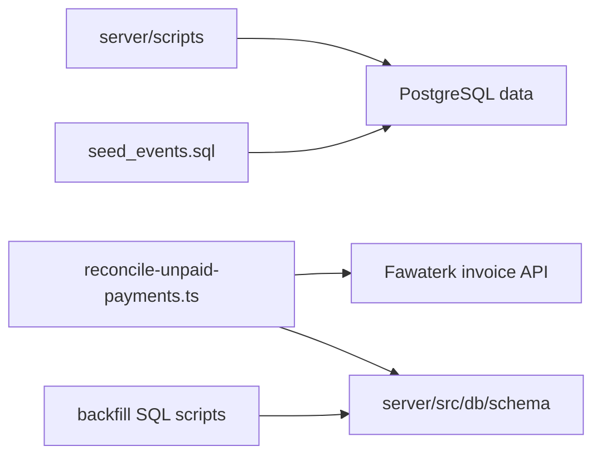

# C4 Code Level: Server Operational Scripts

## Overview

- **Name**: Server Operational Scripts
- **Description**: One-off SQL and TypeScript scripts for reconciliation, data backfills, and curated seed data outside the long-running API process.
- **Location**: [server/scripts](../../../server/scripts)
- **Language**: TypeScript, SQL
- **Purpose**: Support controlled operational maintenance tasks such as reconciling paid-state drift, normalizing legacy series visibility, and seeding representative event data.

## Code Elements

### Functions/Methods

- `parseArgs(argv: string[]): Args`
  - Description: Parses `--apply`, `--since=<ISO-8601>`, and `--limit=<n>` CLI flags for the unpaid-payment reconciliation workflow.
  - Location: [server/scripts/reconcile-unpaid-payments.ts](../../../server/scripts/reconcile-unpaid-payments.ts) (line 19)
  - Dependencies: Node.js argument parsing via `process.argv`, built-in `Date`, `Number.isFinite`, and `Math.floor`.
- `async run(): Promise<void>`
  - Description: Loads paid event and track payments with invoice IDs, checks their remote Fawaterk invoice state, logs unpaid mismatches, and optionally rolls back attendee, booking, and reservation records inside a database transaction.
  - Location: [server/scripts/reconcile-unpaid-payments.ts](../../../server/scripts/reconcile-unpaid-payments.ts) (line 46)
  - Dependencies: `db`, `payments`, `eventAttendees`, `eventReservations`, `trackBookings`, `trackReservations`, `getInvoiceData`, `isInvoicePaid`.

### Modules/Scripts

- `reconcile-unpaid-payments.ts`
  - Description: CLI maintenance script that audits paid `event` and `track` payments against Fawaterk invoice truth and can convert mismatched rows back to `failed` after deleting fulfillment records.
  - Location: [server/scripts/reconcile-unpaid-payments.ts](../../../server/scripts/reconcile-unpaid-payments.ts) (line 1)
  - Dependencies: [server/src/db/client.ts](../../../server/src/db/client.ts), [server/src/db/schema/index.ts](../../../server/src/db/schema/index.ts), [server/src/services/fawaterk.ts](../../../server/src/services/fawaterk.ts), [server/src/utils/invoiceStatus.ts](../../../server/src/utils/invoiceStatus.ts)
- `backfill_series_premium_paid_tracks.sql`
  - Description: Marks series and linked library assets as premium when they belong to published tracks with a positive price.
  - Location: [server/scripts/backfill_series_premium_paid_tracks.sql](../../../server/scripts/backfill_series_premium_paid_tracks.sql) (line 1)
  - Dependencies: `series`, `series_assets`, `library_assets`, `tracks`
- `backfill_series_published.sql`
  - Description: Aligns derived series publication state with already-published parent tracks.
  - Location: [server/scripts/backfill_series_published.sql](../../../server/scripts/backfill_series_published.sql) (line 1)
  - Dependencies: `series`, `tracks`
- `seed_events.sql`
  - Description: Seeds five curated sample events with guest expert metadata, images, tags, and narrative descriptions for development or demo environments.
  - Location: [server/scripts/seed_events.sql](../../../server/scripts/seed_events.sql) (line 1)
  - Dependencies: `events`, PostgreSQL `jsonb_build_object`, PostgreSQL `jsonb_build_array`

## Dependencies

### Internal Dependencies

- [server/src/db/client.ts](../../../server/src/db/client.ts) - Database client used by the reconciliation CLI.
- [server/src/db/schema/index.ts](../../../server/src/db/schema/index.ts) - Table definitions referenced by reconciliation and implied by the SQL maintenance scripts.
- [server/src/services/fawaterk.ts](../../../server/src/services/fawaterk.ts) - Remote invoice lookup used to validate paid-state drift.
- [server/src/utils/invoiceStatus.ts](../../../server/src/utils/invoiceStatus.ts) - Shared invoice status normalization helper used to decide whether a fetched invoice is truly paid.
- [c4-code-server-src-db-schema.md](./c4-code-server-src-db-schema.md) - Authoritative schema reference that these scripts mutate.
- [c4-code-server-drizzle.md](./c4-code-server-drizzle.md) - Migration history that establishes the columns and tables targeted by the backfill scripts.

### External Dependencies

- PostgreSQL - Executes the SQL maintenance scripts and stores the rows mutated by the TypeScript reconciliation flow.
- Fawaterk API - Supplies invoice status data for `reconcile-unpaid-payments.ts`.
- Node.js / `tsx` runtime - Executes the TypeScript reconciliation script from the command line.

## Relationships

