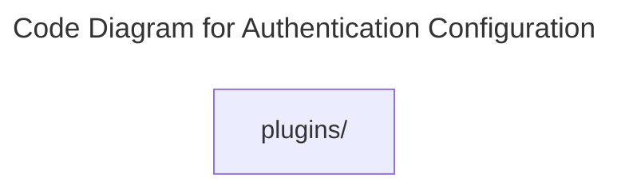

# C4 Code Level: Authentication Configuration

## Overview

- **Name**: Authentication Configuration
- **Description**: Better Auth configuration and authentication-related helpers for the backend.
- **Location**: [server/src/auth](../../../server/src/auth)
- **Language**: Directory aggregator (no direct source files)
- **Purpose**: Configure session management, OTP verification, and invite-session support.

## Code Elements

### Subdirectories

- [server/src/auth/plugins](./c4-code-server-src-auth-plugins.md) - Plugins authentication modules.

### Functions/Methods

- No direct top-level functions or methods are defined in files at this directory level.

### Classes/Modules

- This directory is primarily an organizational boundary for child directories rather than a direct source module location.

## Dependencies

### Internal Dependencies

- server/src/auth/plugins (child module boundary)

### External Dependencies

- None captured from direct file imports in this directory.

## Relationships

