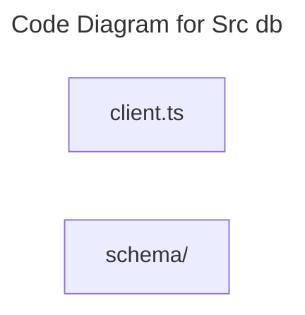

# C4 Code Level: Src db

## Overview

- **Name**: Src db
- **Description**: Src db modules for the TrafficMENA codebase.
- **Location**: [server/src/db](../../../server/src/db)
- **Language**: TypeScript
- **Purpose**: Organize the src db responsibilities used by the application.

## Code Elements

### Subdirectories

- [server/src/db/schema](./c4-code-server-src-db-schema.md) - Drizzle ORM schema definitions for application tables, enums, indexes, and relational constraints.

### Functions/Methods

- `resolveDatabaseUrl(): string`
  - Description: Implements resolve database url behavior for this module.
  - Location: [server/src/db/client.ts](../../../server/src/db/client.ts) (line 6)
  - Dependencies: ../config/env.js, drizzle-orm/node-postgres, pg
- `async closeDb(): unknown`
  - Description: Implements close db behavior for this module.
  - Location: [server/src/db/client.ts](../../../server/src/db/client.ts) (line 46)
  - Dependencies: ../config/env.js, drizzle-orm/node-postgres, pg

### Classes/Modules

- `client.ts`
  - Description: Client boundary module responsible for browser-side API interaction.
  - Location: [server/src/db/client.ts](../../../server/src/db/client.ts)
  - Contains: 2 function(s)
  - Dependencies: ../config/env.js, drizzle-orm/node-postgres, pg

## Dependencies

### Internal Dependencies

- ../config/env.js
- server/src/db/schema (child module boundary)

### External Dependencies

- drizzle-orm/node-postgres
- pg

## Relationships

