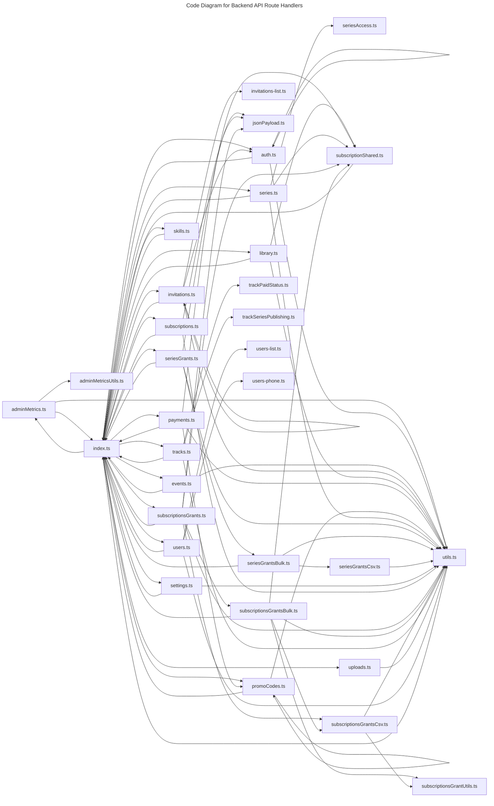

# C4 Code Level: Backend API Route Handlers

## Overview

- **Name**: Backend API Route Handlers
- **Description**: Hono route registration, request validation, and HTTP handlers for the TrafficMENA API surface.
- **Location**: [server/src/routes/api](../../../server/src/routes/api)
- **Language**: TypeScript
- **Purpose**: Expose the authenticated REST API used by the frontend admin, learner, invitation, and payment flows.

## Code Elements

### Functions/Methods

- `registerAdminMetricsRoutes(app: Hono): unknown`
  - Description: Registers admin metrics routes with the surrounding module or runtime.
  - Location: [server/src/routes/api/adminMetrics.ts](../../../server/src/routes/api/adminMetrics.ts) (line 31)
  - Dependencies: ../../db/client.js, ../../db/schema/index.js, ./adminMetricsUtils.js, ./utils.js, drizzle-orm, hono
- `toNumber(value: number | string | null | undefined): unknown`
  - Description: Implements to number behavior for this module.
  - Location: [server/src/routes/api/adminMetricsUtils.ts](../../../server/src/routes/api/adminMetricsUtils.ts) (line 1)
  - Dependencies: None
- `getActiveSubscriptionMetricsFromAggregate(row: { premiumUsers: number | string | null; revenueCents: number | string | null } | null): unknown`
  - Description: Returns active subscription metrics from aggregate derived from current inputs or state.
  - Location: [server/src/routes/api/adminMetricsUtils.ts](../../../server/src/routes/api/adminMetricsUtils.ts) (line 3)
  - Dependencies: None
- `registerAuthRoutes(app: Hono): unknown`
  - Description: Registers auth routes with the surrounding module or runtime.
  - Location: [server/src/routes/api/auth.ts](../../../server/src/routes/api/auth.ts) (line 36)
  - Dependencies: ../../auth.js, ../../db/client.js, ../../db/schema/index.js, ../../services/rateLimiter.js, ../../services/turnstile.js, ./utils.js, drizzle-orm, hono, zod
- `parseEventIdParam(eventId: string): string`
  - Description: Parses event id param into a normalized form.
  - Location: [server/src/routes/api/events.ts](../../../server/src/routes/api/events.ts) (line 39)
  - Dependencies: ../../db/client.js, ../../db/schema/index.js, ../../utils/errors.js, ../../utils/session.js, ./utils.js, drizzle-orm, hono, zod
- `httpsUrlSchema(label: string): unknown`
  - Description: Implements https url schema behavior for this module.
  - Location: [server/src/routes/api/events.ts](../../../server/src/routes/api/events.ts) (line 54)
  - Dependencies: ../../db/client.js, ../../db/schema/index.js, ../../utils/errors.js, ../../utils/session.js, ./utils.js, drizzle-orm, hono, zod
- `normalizeDescription(description: string): unknown`
  - Description: Implements normalize description behavior for this module.
  - Location: [server/src/routes/api/events.ts](../../../server/src/routes/api/events.ts) (line 109)
  - Dependencies: ../../db/client.js, ../../db/schema/index.js, ../../utils/errors.js, ../../utils/session.js, ./utils.js, drizzle-orm, hono, zod
- `registerEventRoutes(app: Hono): unknown`
  - Description: Registers event routes with the surrounding module or runtime.
  - Location: [server/src/routes/api/events.ts](../../../server/src/routes/api/events.ts) (line 145)
  - Dependencies: ../../db/client.js, ../../db/schema/index.js, ../../utils/errors.js, ../../utils/session.js, ./utils.js, drizzle-orm, hono, zod
- `registerApiRoutes(app: Hono): unknown`
  - Description: Registers api routes with the surrounding module or runtime.
  - Location: [server/src/routes/api/index.ts](../../../server/src/routes/api/index.ts) (line 20)
  - Dependencies: ../../utils/csrf.js, ./adminMetrics.js, ./auth.js, ./events.js, ./invitations.js, ./library.js, ./payments.js, ./promoCodes.js, ./series.js, ./seriesGrants.js, ./settings.js, ./skills.js, ./subscriptions.js, ./subscriptionsGrants.js, ./tracks.js, ./uploads.js, ./users.js, hono
- `parseInvitationListQuery(input: unknown): unknown`
  - Description: Parses invitation list query into a normalized form.
  - Location: [server/src/routes/api/invitations-list.ts](../../../server/src/routes/api/invitations-list.ts) (line 14)
  - Dependencies: zod
- `registerInvitationRoutes(app: Hono): unknown`
  - Description: Registers invitation routes with the surrounding module or runtime.
  - Location: [server/src/routes/api/invitations.ts](../../../server/src/routes/api/invitations.ts) (line 39)
  - Dependencies: ../../auth.js, ../../config/env.js, ../../db/client.js, ../../db/schema/index.js, ../../services/invitations.js, ../../services/rateLimiter.js, ../../utils/session.js, ./invitations-list.js, ./utils.js, drizzle-orm, hono, hono/utils/http-status, zod
- `handle(handler: (c: Context) => Promise<Response>, fallbackCode: string, fallbackMessage: string, logLabel = fallbackCode.toLowerCase()): unknown`
  - Description: Implements handle behavior for this module.
  - Location: [server/src/routes/api/invitations.ts](../../../server/src/routes/api/invitations.ts) (line 164)
  - Dependencies: ../../auth.js, ../../config/env.js, ../../db/client.js, ../../db/schema/index.js, ../../services/invitations.js, ../../services/rateLimiter.js, ../../utils/session.js, ./invitations-list.js, ./utils.js, drizzle-orm, hono, hono/utils/http-status, zod
- `adminRoute(handler: (c: Context, admin: AdminContext) => Promise<Response>, fallbackCode = 'INTERNAL_ERROR', fallbackMessage = 'Something went wrong.', logLabel = 'admin route failed'): unknown`
  - Description: Implements admin route behavior for this module.
  - Location: [server/src/routes/api/invitations.ts](../../../server/src/routes/api/invitations.ts) (line 183)
  - Dependencies: ../../auth.js, ../../config/env.js, ../../db/client.js, ../../db/schema/index.js, ../../services/invitations.js, ../../services/rateLimiter.js, ../../utils/session.js, ./invitations-list.js, ./utils.js, drizzle-orm, hono, hono/utils/http-status, zod
- `async requireAdmin(c: Context): Promise<AdminGuardSuccess | AdminGuardFailure>`
  - Description: Implements require admin behavior for this module.
  - Location: [server/src/routes/api/invitations.ts](../../../server/src/routes/api/invitations.ts) (line 201)
  - Dependencies: ../../auth.js, ../../config/env.js, ../../db/client.js, ../../db/schema/index.js, ../../services/invitations.js, ../../services/rateLimiter.js, ../../utils/session.js, ./invitations-list.js, ./utils.js, drizzle-orm, hono, hono/utils/http-status, zod
- `async extractCsvPayload(c: Context): Promise<string | null>`
  - Description: Implements extract csv payload behavior for this module.
  - Location: [server/src/routes/api/invitations.ts](../../../server/src/routes/api/invitations.ts) (line 245)
  - Dependencies: ../../auth.js, ../../config/env.js, ../../db/client.js, ../../db/schema/index.js, ../../services/invitations.js, ../../services/rateLimiter.js, ../../utils/session.js, ./invitations-list.js, ./utils.js, drizzle-orm, hono, hono/utils/http-status, zod
- `respondError(c: Context, error: InvitationError): unknown`
  - Description: Implements respond error behavior for this module.
  - Location: [server/src/routes/api/invitations.ts](../../../server/src/routes/api/invitations.ts) (line 270)
  - Dependencies: ../../auth.js, ../../config/env.js, ../../db/client.js, ../../db/schema/index.js, ../../services/invitations.js, ../../services/rateLimiter.js, ../../utils/session.js, ./invitations-list.js, ./utils.js, drizzle-orm, hono, hono/utils/http-status, zod
- `async parseJson(c: Context, schema: z.ZodSchema<T>): unknown`
  - Description: Parses json into a normalized form.
  - Location: [server/src/routes/api/invitations.ts](../../../server/src/routes/api/invitations.ts) (line 277)
  - Dependencies: ../../auth.js, ../../config/env.js, ../../db/client.js, ../../db/schema/index.js, ../../services/invitations.js, ../../services/rateLimiter.js, ../../utils/session.js, ./invitations-list.js, ./utils.js, drizzle-orm, hono, hono/utils/http-status, zod
- `parseQuery(_c: Context, parser: (value: unknown) => { success: true; data: T } | { success: false; error: z.ZodError }, value: unknown): unknown`
  - Description: Parses query into a normalized form.
  - Location: [server/src/routes/api/invitations.ts](../../../server/src/routes/api/invitations.ts) (line 285)
  - Dependencies: ../../auth.js, ../../config/env.js, ../../db/client.js, ../../db/schema/index.js, ../../services/invitations.js, ../../services/rateLimiter.js, ../../utils/session.js, ./invitations-list.js, ./utils.js, drizzle-orm, hono, hono/utils/http-status, zod
- `async fetchInvitationStats(): Promise<InvitationStats>`
  - Description: Implements fetch invitation stats behavior for this module.
  - Location: [server/src/routes/api/invitations.ts](../../../server/src/routes/api/invitations.ts) (line 314)
  - Dependencies: ../../auth.js, ../../config/env.js, ../../db/client.js, ../../db/schema/index.js, ../../services/invitations.js, ../../services/rateLimiter.js, ../../utils/session.js, ./invitations-list.js, ./utils.js, drizzle-orm, hono, hono/utils/http-status, zod
- `async fetchInvitations(params: InvitationListParams): unknown`
  - Description: Implements fetch invitations behavior for this module.
  - Location: [server/src/routes/api/invitations.ts](../../../server/src/routes/api/invitations.ts) (line 338)
  - Dependencies: ../../auth.js, ../../config/env.js, ../../db/client.js, ../../db/schema/index.js, ../../services/invitations.js, ../../services/rateLimiter.js, ../../utils/session.js, ./invitations-list.js, ./utils.js, drizzle-orm, hono, hono/utils/http-status, zod
- `async acceptInvitation(token: string, payload: { email: string; firstName?: string; lastName?: string }): Promise<{ invitation: InvitationRecord; userId: string }>`
  - Description: Implements accept invitation behavior for this module.
  - Location: [server/src/routes/api/invitations.ts](../../../server/src/routes/api/invitations.ts) (line 373)
  - Dependencies: ../../auth.js, ../../config/env.js, ../../db/client.js, ../../db/schema/index.js, ../../services/invitations.js, ../../services/rateLimiter.js, ../../utils/session.js, ./invitations-list.js, ./utils.js, drizzle-orm, hono, hono/utils/http-status, zod
- `async activateInvitation(c: Context, token: string, email: string): Promise<ActivationResult>`
  - Description: Implements activate invitation behavior for this module.
  - Location: [server/src/routes/api/invitations.ts](../../../server/src/routes/api/invitations.ts) (line 451)
  - Dependencies: ../../auth.js, ../../config/env.js, ../../db/client.js, ../../db/schema/index.js, ../../services/invitations.js, ../../services/rateLimiter.js, ../../utils/session.js, ./invitations-list.js, ./utils.js, drizzle-orm, hono, hono/utils/http-status, zod
- `optional(value?: string): unknown`
  - Description: Implements optional behavior for this module.
  - Location: [server/src/routes/api/invitations.ts](../../../server/src/routes/api/invitations.ts) (line 558)
  - Dependencies: ../../auth.js, ../../config/env.js, ../../db/client.js, ../../db/schema/index.js, ../../services/invitations.js, ../../services/rateLimiter.js, ../../utils/session.js, ./invitations-list.js, ./utils.js, drizzle-orm, hono, hono/utils/http-status, zod
- `isJsonContentType(contentType: string | null | undefined): unknown`
  - Description: Checks whether json content type.
  - Location: [server/src/routes/api/jsonPayload.ts](../../../server/src/routes/api/jsonPayload.ts) (line 17)
  - Dependencies: ../../config/requestLimits.js, hono
- `payloadTooLargeError(): JsonPayloadError`
  - Description: Implements payload too large error behavior for this module.
  - Location: [server/src/routes/api/jsonPayload.ts](../../../server/src/routes/api/jsonPayload.ts) (line 23)
  - Dependencies: ../../config/requestLimits.js, hono
- `jsonPayloadErrorStatusCode(code: JsonPayloadError['code']): unknown`
  - Description: Implements json payload error status code behavior for this module.
  - Location: [server/src/routes/api/jsonPayload.ts](../../../server/src/routes/api/jsonPayload.ts) (line 31)
  - Dependencies: ../../config/requestLimits.js, hono
- `async readRequestTextWithLimit(request: Request): Promise<{ ok: true; text: string } | JsonPayloadError>`
  - Description: Implements read request text with limit behavior for this module.
  - Location: [server/src/routes/api/jsonPayload.ts](../../../server/src/routes/api/jsonPayload.ts) (line 35)
  - Dependencies: ../../config/requestLimits.js, hono
- `async extractJsonPayload(c: Context): Promise<JsonPayloadResult>`
  - Description: Implements extract json payload behavior for this module.
  - Location: [server/src/routes/api/jsonPayload.ts](../../../server/src/routes/api/jsonPayload.ts) (line 87)
  - Dependencies: ../../config/requestLimits.js, hono
- `registerLibraryRoutes(app: Hono): unknown`
  - Description: Registers library routes with the surrounding module or runtime.
  - Location: [server/src/routes/api/library.ts](../../../server/src/routes/api/library.ts) (line 94)
  - Dependencies: ../../db/client.js, ../../db/schema/index.js, ../../utils/session.js, ./subscriptionShared.js, ./utils.js, drizzle-orm, hono, zod
- `async executeAtomicTrackBooking(tx: DbTransaction, params: TrackBookingParams): Promise<TrackBookingResult>`
  - Description: Implements execute atomic track booking behavior for this module.
  - Location: [server/src/routes/api/payments.ts](../../../server/src/routes/api/payments.ts) (line 147)
  - Dependencies: ../../config/env.js, ../../db/client.js, ../../db/schema/index.js, ../../services/fawaterk.js, ../../services/promoCodes.js, ../../services/rateLimiter.js, ../../utils/errors.js, ../../utils/invoiceStatus.js, ../../utils/session.js, ./subscriptionShared.js, ./utils.js, drizzle-orm, hono, hono/utils/http-status, zod
- `validateTrackBookingResult(result: TrackBookingResult, maxTrackBookings: number | null): void`
  - Description: Validates track booking result against module rules.
  - Location: [server/src/routes/api/payments.ts](../../../server/src/routes/api/payments.ts) (line 238)
  - Dependencies: ../../config/env.js, ../../db/client.js, ../../db/schema/index.js, ../../services/fawaterk.js, ../../services/promoCodes.js, ../../services/rateLimiter.js, ../../utils/errors.js, ../../utils/invoiceStatus.js, ../../utils/session.js, ./subscriptionShared.js, ./utils.js, drizzle-orm, hono, hono/utils/http-status, zod
- `buildCheckoutIdempotencyCacheKey(params: {
  userId: string;
  itemType: 'event' | 'track' | 'subscription';
  itemId?: string;
  paymentMethodId: number;
  idempotencyKey: string;
}): string`
  - Description: Builds checkout idempotency cache key from available inputs.
  - Location: [server/src/routes/api/payments.ts](../../../server/src/routes/api/payments.ts) (line 258)
  - Dependencies: ../../config/env.js, ../../db/client.js, ../../db/schema/index.js, ../../services/fawaterk.js, ../../services/promoCodes.js, ../../services/rateLimiter.js, ../../utils/errors.js, ../../utils/invoiceStatus.js, ../../utils/session.js, ./subscriptionShared.js, ./utils.js, drizzle-orm, hono, hono/utils/http-status, zod
- `readCheckoutIdempotencyResponse(cacheKey: string): CheckoutSuccessPayload | null`
  - Description: Implements read checkout idempotency response behavior for this module.
  - Location: [server/src/routes/api/payments.ts](../../../server/src/routes/api/payments.ts) (line 270)
  - Dependencies: ../../config/env.js, ../../db/client.js, ../../db/schema/index.js, ../../services/fawaterk.js, ../../services/promoCodes.js, ../../services/rateLimiter.js, ../../utils/errors.js, ../../utils/invoiceStatus.js, ../../utils/session.js, ./subscriptionShared.js, ./utils.js, drizzle-orm, hono, hono/utils/http-status, zod
- `writeCheckoutIdempotencyResponse(cacheKey: string, response: CheckoutSuccessPayload): void`
  - Description: Implements write checkout idempotency response behavior for this module.
  - Location: [server/src/routes/api/payments.ts](../../../server/src/routes/api/payments.ts) (line 285)
  - Dependencies: ../../config/env.js, ../../db/client.js, ../../db/schema/index.js, ../../services/fawaterk.js, ../../services/promoCodes.js, ../../services/rateLimiter.js, ../../utils/errors.js, ../../utils/invoiceStatus.js, ../../utils/session.js, ./subscriptionShared.js, ./utils.js, drizzle-orm, hono, hono/utils/http-status, zod
- `readCheckoutIdempotencyInFlight(cacheKey: string): CheckoutInFlightReservation | null`
  - Description: Implements read checkout idempotency in flight behavior for this module.
  - Location: [server/src/routes/api/payments.ts](../../../server/src/routes/api/payments.ts) (line 299)
  - Dependencies: ../../config/env.js, ../../db/client.js, ../../db/schema/index.js, ../../services/fawaterk.js, ../../services/promoCodes.js, ../../services/rateLimiter.js, ../../utils/errors.js, ../../utils/invoiceStatus.js, ../../utils/session.js, ./subscriptionShared.js, ./utils.js, drizzle-orm, hono, hono/utils/http-status, zod
- `createCheckoutInFlightReservation(): CheckoutInFlightReservation`
  - Description: Creates checkout in flight reservation for downstream use.
  - Location: [server/src/routes/api/payments.ts](../../../server/src/routes/api/payments.ts) (line 314)
  - Dependencies: ../../config/env.js, ../../db/client.js, ../../db/schema/index.js, ../../services/fawaterk.js, ../../services/promoCodes.js, ../../services/rateLimiter.js, ../../utils/errors.js, ../../utils/invoiceStatus.js, ../../utils/session.js, ./subscriptionShared.js, ./utils.js, drizzle-orm, hono, hono/utils/http-status, zod
- `isPostgresUniqueViolation(error: unknown): boolean`
  - Description: Checks whether postgres unique violation.
  - Location: [server/src/routes/api/payments.ts](../../../server/src/routes/api/payments.ts) (line 326)
  - Dependencies: ../../config/env.js, ../../db/client.js, ../../db/schema/index.js, ../../services/fawaterk.js, ../../services/promoCodes.js, ../../services/rateLimiter.js, ../../utils/errors.js, ../../utils/invoiceStatus.js, ../../utils/session.js, ./subscriptionShared.js, ./utils.js, drizzle-orm, hono, hono/utils/http-status, zod
- `async calculatePrice(userId: string, itemType: 'event' | 'track' | 'subscription', itemId: string | null, promoCode?: string, tx?: DbTransaction): Promise<PriceResult>`
  - Description: Implements calculate price behavior for this module.
  - Location: [server/src/routes/api/payments.ts](../../../server/src/routes/api/payments.ts) (line 330)
  - Dependencies: ../../config/env.js, ../../db/client.js, ../../db/schema/index.js, ../../services/fawaterk.js, ../../services/promoCodes.js, ../../services/rateLimiter.js, ../../utils/errors.js, ../../utils/invoiceStatus.js, ../../utils/session.js, ./subscriptionShared.js, ./utils.js, drizzle-orm, hono, hono/utils/http-status, zod
- `async processSuccessfulPayment(paymentId: string, options: ProcessSuccessfulPaymentOptions = {}): Promise<ProcessSuccessfulPaymentResult>`
  - Description: Implements process successful payment behavior for this module.
  - Location: [server/src/routes/api/payments.ts](../../../server/src/routes/api/payments.ts) (line 613)
  - Dependencies: ../../config/env.js, ../../db/client.js, ../../db/schema/index.js, ../../services/fawaterk.js, ../../services/promoCodes.js, ../../services/rateLimiter.js, ../../utils/errors.js, ../../utils/invoiceStatus.js, ../../utils/session.js, ./subscriptionShared.js, ./utils.js, drizzle-orm, hono, hono/utils/http-status, zod
- `async confirmGatewayInvoicePayment(args: {
  invoiceId: number;
  source: ConfirmationSource;
  userId?: string;
  expectedInvoiceKey?: string;
}): Promise<ConfirmGatewayInvoiceResult>`
  - Description: Implements confirm gateway invoice payment behavior for this module.
  - Location: [server/src/routes/api/payments.ts](../../../server/src/routes/api/payments.ts) (line 970)
  - Dependencies: ../../config/env.js, ../../db/client.js, ../../db/schema/index.js, ../../services/fawaterk.js, ../../services/promoCodes.js, ../../services/rateLimiter.js, ../../utils/errors.js, ../../utils/invoiceStatus.js, ../../utils/session.js, ./subscriptionShared.js, ./utils.js, drizzle-orm, hono, hono/utils/http-status, zod
- `registerPaymentRoutes(app: Hono): unknown`
  - Description: Registers payment routes with the surrounding module or runtime.
  - Location: [server/src/routes/api/payments.ts](../../../server/src/routes/api/payments.ts) (line 1098)
  - Dependencies: ../../config/env.js, ../../db/client.js, ../../db/schema/index.js, ../../services/fawaterk.js, ../../services/promoCodes.js, ../../services/rateLimiter.js, ../../utils/errors.js, ../../utils/invoiceStatus.js, ../../utils/session.js, ./subscriptionShared.js, ./utils.js, drizzle-orm, hono, hono/utils/http-status, zod
- `parseDate(value: string): unknown`
  - Description: Parses date into a normalized form.
  - Location: [server/src/routes/api/promoCodes.ts](../../../server/src/routes/api/promoCodes.ts) (line 33)
  - Dependencies: ../../db/client.js, ../../db/schema/index.js, ../../services/promoCodes.js, ../../utils/errors.js, ./utils.js, drizzle-orm, hono, zod
- `async validateTarget(targetType: 'track' | 'event', targetId: string): unknown`
  - Description: Validates target against module rules.
  - Location: [server/src/routes/api/promoCodes.ts](../../../server/src/routes/api/promoCodes.ts) (line 41)
  - Dependencies: ../../db/client.js, ../../db/schema/index.js, ../../services/promoCodes.js, ../../utils/errors.js, ./utils.js, drizzle-orm, hono, zod
- `async fetchPromoDetail(promoId: string): unknown`
  - Description: Implements fetch promo detail behavior for this module.
  - Location: [server/src/routes/api/promoCodes.ts](../../../server/src/routes/api/promoCodes.ts) (line 66)
  - Dependencies: ../../db/client.js, ../../db/schema/index.js, ../../services/promoCodes.js, ../../utils/errors.js, ./utils.js, drizzle-orm, hono, zod
- `registerPromoCodeRoutes(app: Hono): unknown`
  - Description: Registers promo code routes with the surrounding module or runtime.
  - Location: [server/src/routes/api/promoCodes.ts](../../../server/src/routes/api/promoCodes.ts) (line 108)
  - Dependencies: ../../db/client.js, ../../db/schema/index.js, ../../services/promoCodes.js, ../../utils/errors.js, ./utils.js, drizzle-orm, hono, zod
- `registerSeriesRoutes(app: Hono): unknown`
  - Description: Registers series routes with the surrounding module or runtime.
  - Location: [server/src/routes/api/series.ts](../../../server/src/routes/api/series.ts) (line 53)
  - Dependencies: ../../db/client.js, ../../db/schema/index.js, ../../utils/session.js, ./seriesAccess.js, ./subscriptionShared.js, ./utils.js, drizzle-orm, hono, zod
- `resolveSeriesAccess(context: SeriesAccessContext): boolean`
  - Description: Implements resolve series access behavior for this module.
  - Location: [server/src/routes/api/seriesAccess.ts](../../../server/src/routes/api/seriesAccess.ts) (line 16)
  - Dependencies: None
- `resolveSeriesAssetAccess(input: SeriesAssetAccessInput): boolean`
  - Description: Implements resolve series asset access behavior for this module.
  - Location: [server/src/routes/api/seriesAccess.ts](../../../server/src/routes/api/seriesAccess.ts) (line 26)
  - Dependencies: None
- `registerSeriesGrantsRoutes(app: Hono): unknown`
  - Description: Registers series grants routes with the surrounding module or runtime.
  - Location: [server/src/routes/api/seriesGrants.ts](../../../server/src/routes/api/seriesGrants.ts) (line 41)
  - Dependencies: ../../db/client.js, ../../db/schema/index.js, ./jsonPayload.js, ./seriesGrantsBulk.js, ./utils.js, drizzle-orm, hono, zod
- `dedupeSeriesGrantRows(rows: NormalizedSeriesGrantRow[]): NormalizedSeriesGrantRow[]`
  - Description: Implements dedupe series grant rows behavior for this module.
  - Location: [server/src/routes/api/seriesGrantsBulk.ts](../../../server/src/routes/api/seriesGrantsBulk.ts) (line 18)
  - Dependencies: ../../db/client.js, ../../db/schema/index.js, ./seriesGrantsCsv.js, ./utils.js, drizzle-orm, hono
- `async handleSeriesBulkGrant(c: Context, actorUserId: string): Promise<Response>`
  - Description: Implements handle series bulk grant behavior for this module.
  - Location: [server/src/routes/api/seriesGrantsBulk.ts](../../../server/src/routes/api/seriesGrantsBulk.ts) (line 29)
  - Dependencies: ../../db/client.js, ../../db/schema/index.js, ./seriesGrantsCsv.js, ./utils.js, drizzle-orm, hono
- `parseSeriesGrantCsv(csvText: string): {
  rows: SeriesGrantCsvRow[];
  errors: SeriesGrantCsvError[];
}`
  - Description: Parses series grant csv into a normalized form.
  - Location: [server/src/routes/api/seriesGrantsCsv.ts](../../../server/src/routes/api/seriesGrantsCsv.ts) (line 21)
  - Dependencies: ./utils.js, papaparse, zod
- `async fetchSettings(): Promise<SettingsRecord | null>`
  - Description: Implements fetch settings behavior for this module.
  - Location: [server/src/routes/api/settings.ts](../../../server/src/routes/api/settings.ts) (line 16)
  - Dependencies: ../../db/client.js, ../../db/schema/index.js, ./utils.js, drizzle-orm, hono, zod
- `registerSettingsRoutes(app: Hono): unknown`
  - Description: Registers settings routes with the surrounding module or runtime.
  - Location: [server/src/routes/api/settings.ts](../../../server/src/routes/api/settings.ts) (line 35)
  - Dependencies: ../../db/client.js, ../../db/schema/index.js, ./utils.js, drizzle-orm, hono, zod
- `registerSkillRoutes(app: Hono): unknown`
  - Description: Registers skill routes with the surrounding module or runtime.
  - Location: [server/src/routes/api/skills.ts](../../../server/src/routes/api/skills.ts) (line 18)
  - Dependencies: ../../db/client.js, ../../db/schema/index.js, ../../utils/session.js, drizzle-orm, hono, zod
- `getEffectiveDiscountPercent(value: number | null | undefined): unknown`
  - Description: Returns effective discount percent derived from current inputs or state.
  - Location: [server/src/routes/api/subscriptions.ts](../../../server/src/routes/api/subscriptions.ts) (line 21)
  - Dependencies: ../../db/client.js, ../../db/schema/index.js, ../../services/rateLimiter.js, ../../utils/session.js, ./jsonPayload.js, ./utils.js, drizzle-orm, hono, zod
- `registerSubscriptionRoutes(app: Hono): unknown`
  - Description: Registers subscription routes with the surrounding module or runtime.
  - Location: [server/src/routes/api/subscriptions.ts](../../../server/src/routes/api/subscriptions.ts) (line 26)
  - Dependencies: ../../db/client.js, ../../db/schema/index.js, ../../services/rateLimiter.js, ../../utils/session.js, ./jsonPayload.js, ./utils.js, drizzle-orm, hono, zod
- `async createSubscriptionGrantRecord(params: {
  actorUserId: string;
  payload: CreateSubscriptionGrantPayload;
  now: Date;
}): Promise<CreateGrantResult>`
  - Description: Creates subscription grant record for downstream use.
  - Location: [server/src/routes/api/subscriptionsGrants.ts](../../../server/src/routes/api/subscriptionsGrants.ts) (line 42)
  - Dependencies: ../../db/client.js, ../../db/schema/index.js, ./jsonPayload.js, ./subscriptionShared.js, ./subscriptionsGrantsBulk.js, ./subscriptionsGrantsCsv.js, ./utils.js, drizzle-orm, hono, zod
- `async revokeSubscriptionGrantRecord(params: {
  actorUserId: string;
  payload: RevokeSubscriptionGrantPayload;
  now: Date;
}): Promise<RevokeGrantResult>`
  - Description: Implements revoke subscription grant record behavior for this module.
  - Location: [server/src/routes/api/subscriptionsGrants.ts](../../../server/src/routes/api/subscriptionsGrants.ts) (line 114)
  - Dependencies: ../../db/client.js, ../../db/schema/index.js, ./jsonPayload.js, ./subscriptionShared.js, ./subscriptionsGrantsBulk.js, ./subscriptionsGrantsCsv.js, ./utils.js, drizzle-orm, hono, zod
- `registerSubscriptionGrantRoutes(app: Hono, deps: Partial<RegisterSubscriptionGrantRoutesDeps> = {}): unknown`
  - Description: Registers subscription grant routes with the surrounding module or runtime.
  - Location: [server/src/routes/api/subscriptionsGrants.ts](../../../server/src/routes/api/subscriptionsGrants.ts) (line 168)
  - Dependencies: ../../db/client.js, ../../db/schema/index.js, ./jsonPayload.js, ./subscriptionShared.js, ./subscriptionsGrantsBulk.js, ./subscriptionsGrantsCsv.js, ./utils.js, drizzle-orm, hono, zod
- `async handleSubscriptionBulkGrant(c: Context, actorUserId: string): Promise<Response>`
  - Description: Implements handle subscription bulk grant behavior for this module.
  - Location: [server/src/routes/api/subscriptionsGrantsBulk.ts](../../../server/src/routes/api/subscriptionsGrantsBulk.ts) (line 15)
  - Dependencies: ../../db/client.js, ../../db/schema/index.js, ./subscriptionShared.js, ./subscriptionsGrantUtils.js, ./subscriptionsGrantsCsv.js, ./utils.js, drizzle-orm, hono
- `parseSubscriptionGrantCsv(csvText: string): {
  rows: SubscriptionGrantCsvRow[];
  errors: SubscriptionGrantCsvError[];
}`
  - Description: Parses subscription grant csv into a normalized form.
  - Location: [server/src/routes/api/subscriptionsGrantsCsv.ts](../../../server/src/routes/api/subscriptionsGrantsCsv.ts) (line 22)
  - Dependencies: ./subscriptionsGrantUtils.js, ./utils.js, papaparse, zod
- `normalizeBulkSubscriptionGrantRows(params: {
  rows: SubscriptionGrantCsvRow[];
  userIdByEmail: Map<string, string>;
}): {
  rows: NormalizedSubscriptionGrantRow[];
  errors: SubscriptionGrantCsvError[];
}`
  - Description: Implements normalize bulk subscription grant rows behavior for this module.
  - Location: [server/src/routes/api/subscriptionsGrantUtils.ts](../../../server/src/routes/api/subscriptionsGrantUtils.ts) (line 25)
  - Dependencies: None
- `collectActiveSubscriptionConflicts(params: {
  rows: NormalizedSubscriptionGrantRow[];
  activeEndsAtByUserId: Map<string, Date>;
}): SubscriptionGrantCsvError[]`
  - Description: Implements collect active subscription conflicts behavior for this module.
  - Location: [server/src/routes/api/subscriptionsGrantUtils.ts](../../../server/src/routes/api/subscriptionsGrantUtils.ts) (line 82)
  - Dependencies: None
- `activeSubscriptionWhere(userId: string, now: Date = new Date()): unknown`
  - Description: Implements active subscription where behavior for this module.
  - Location: [server/src/routes/api/subscriptionShared.ts](../../../server/src/routes/api/subscriptionShared.ts) (line 7)
  - Dependencies: ../../db/client.js, ../../db/schema/index.js, drizzle-orm
- `async hasActiveSubscription(userId: string, now: Date = new Date()): unknown`
  - Description: Checks whether the current context has active subscription.
  - Location: [server/src/routes/api/subscriptionShared.ts](../../../server/src/routes/api/subscriptionShared.ts) (line 16)
  - Dependencies: ../../db/client.js, ../../db/schema/index.js, drizzle-orm
- `isPaidTrack(priceInCents: number | null | undefined): boolean`
  - Description: Checks whether paid track.
  - Location: [server/src/routes/api/trackPaidStatus.ts](../../../server/src/routes/api/trackPaidStatus.ts) (line 1)
  - Dependencies: None
- `validateBookingWindows(current: Partial<BookingFields>, payload: Partial<BookingFields>): { valid: boolean; error?: string }`
  - Description: Validates booking windows against module rules.
  - Location: [server/src/routes/api/tracks.ts](../../../server/src/routes/api/tracks.ts) (line 116)
  - Dependencies: ../../db/client.js, ../../db/schema/index.js, ../../utils/booking.js, ../../utils/errors.js, ../../utils/session.js, ./trackPaidStatus.js, ./trackSeriesPublishing.js, ./utils.js, drizzle-orm, hono, zod
- `validateUuid(value: string, paramName = 'id'): { valid: true; value: string } | { valid: false; error: { code: string; message: string } }`
  - Description: Validates uuid against module rules.
  - Location: [server/src/routes/api/tracks.ts](../../../server/src/routes/api/tracks.ts) (line 235)
  - Dependencies: ../../db/client.js, ../../db/schema/index.js, ../../utils/booking.js, ../../utils/errors.js, ../../utils/session.js, ./trackPaidStatus.js, ./trackSeriesPublishing.js, ./utils.js, drizzle-orm, hono, zod
- `registerTrackRoutes(app: Hono): unknown`
  - Description: Registers track routes with the surrounding module or runtime.
  - Location: [server/src/routes/api/tracks.ts](../../../server/src/routes/api/tracks.ts) (line 246)
  - Dependencies: ../../db/client.js, ../../db/schema/index.js, ../../utils/booking.js, ../../utils/errors.js, ../../utils/session.js, ./trackPaidStatus.js, ./trackSeriesPublishing.js, ./utils.js, drizzle-orm, hono, zod
- `shouldPublishTrackSeries(input: TrackSeriesPublishInput): boolean`
  - Description: Implements should publish track series behavior for this module.
  - Location: [server/src/routes/api/trackSeriesPublishing.ts](../../../server/src/routes/api/trackSeriesPublishing.ts) (line 6)
  - Dependencies: None
- `buildPublicUrl(storagePath: string): unknown`
  - Description: Builds public url from available inputs.
  - Location: [server/src/routes/api/uploads.ts](../../../server/src/routes/api/uploads.ts) (line 68)
  - Dependencies: ../../config/env.js, ./utils.js, hono, node:buffer, node:crypto, node:path
- `resolveScopeName(input: unknown): UploadScope`
  - Description: Implements resolve scope name behavior for this module.
  - Location: [server/src/routes/api/uploads.ts](../../../server/src/routes/api/uploads.ts) (line 80)
  - Dependencies: ../../config/env.js, ./utils.js, hono, node:buffer, node:crypto, node:path
- `getExtension(file: File, fallback = 'bin'): unknown`
  - Description: Returns extension derived from current inputs or state.
  - Location: [server/src/routes/api/uploads.ts](../../../server/src/routes/api/uploads.ts) (line 89)
  - Dependencies: ../../config/env.js, ./utils.js, hono, node:buffer, node:crypto, node:path
- `async validateFileSignature(file: File, extension: string): unknown`
  - Description: Validates file signature against module rules.
  - Location: [server/src/routes/api/uploads.ts](../../../server/src/routes/api/uploads.ts) (line 99)
  - Dependencies: ../../config/env.js, ./utils.js, hono, node:buffer, node:crypto, node:path
- `async handleUploadRequest(c: Context): unknown`
  - Description: Implements handle upload request behavior for this module.
  - Location: [server/src/routes/api/uploads.ts](../../../server/src/routes/api/uploads.ts) (line 113)
  - Dependencies: ../../config/env.js, ./utils.js, hono, node:buffer, node:crypto, node:path
- `registerUploadRoutes(app: Hono): unknown`
  - Description: Registers upload routes with the surrounding module or runtime.
  - Location: [server/src/routes/api/uploads.ts](../../../server/src/routes/api/uploads.ts) (line 245)
  - Dependencies: ../../config/env.js, ./utils.js, hono, node:buffer, node:crypto, node:path
- `parseUsersListQuery(input: unknown): unknown`
  - Description: Parses users list query into a normalized form.
  - Location: [server/src/routes/api/users-list.ts](../../../server/src/routes/api/users-list.ts) (line 21)
  - Dependencies: zod
- `isEmptyString(value: string | null | undefined): value is null | undefined | ''`
  - Description: Checks whether empty string.
  - Location: [server/src/routes/api/users-phone.ts](../../../server/src/routes/api/users-phone.ts) (line 3)
  - Dependencies: None
- `normalizePhoneNumber(value: string): unknown`
  - Description: Implements normalize phone number behavior for this module.
  - Location: [server/src/routes/api/users-phone.ts](../../../server/src/routes/api/users-phone.ts) (line 6)
  - Dependencies: None
- `isE164PhoneNumber(value: string): unknown`
  - Description: Checks whether e164 phone number.
  - Location: [server/src/routes/api/users-phone.ts](../../../server/src/routes/api/users-phone.ts) (line 10)
  - Dependencies: None
- `isSamePhoneNumber(incomingNormalized: string, existing: string | null | undefined): unknown`
  - Description: Checks whether same phone number.
  - Location: [server/src/routes/api/users-phone.ts](../../../server/src/routes/api/users-phone.ts) (line 14)
  - Dependencies: None
- `validatePhoneNumberUpdate({
  incomingNormalized,
  existing,
}: {
  incomingNormalized: string;
  existing: string | null | undefined;
}): { ok: true; isUnchanged: boolean } | { ok: false; message: string }`
  - Description: Validates phone number update against module rules.
  - Location: [server/src/routes/api/users-phone.ts](../../../server/src/routes/api/users-phone.ts) (line 19)
  - Dependencies: None
- `isEmptyValue(value: string | null | undefined): unknown`
  - Description: Checks whether empty value.
  - Location: [server/src/routes/api/users.ts](../../../server/src/routes/api/users.ts) (line 29)
  - Dependencies: ../../db/client.js, ../../db/schema/index.js, ../../utils/session.js, ./users-list.js, ./users-phone.js, ./utils.js, drizzle-orm, hono, zod
- `getActiveSubscriptionSelectors(now: Date): unknown`
  - Description: Returns active subscription selectors derived from current inputs or state.
  - Location: [server/src/routes/api/users.ts](../../../server/src/routes/api/users.ts) (line 31)
  - Dependencies: ../../db/client.js, ../../db/schema/index.js, ../../utils/session.js, ./users-list.js, ./users-phone.js, ./utils.js, drizzle-orm, hono, zod
- `registerUserRoutes(app: Hono): unknown`
  - Description: Registers user routes with the surrounding module or runtime.
  - Location: [server/src/routes/api/users.ts](../../../server/src/routes/api/users.ts) (line 60)
  - Dependencies: ../../db/client.js, ../../db/schema/index.js, ../../utils/session.js, ./users-list.js, ./users-phone.js, ./utils.js, drizzle-orm, hono, zod
- `async notImplemented(c: Context, { feature }: NotImplementedOptions): unknown`
  - Description: Implements not implemented behavior for this module.
  - Location: [server/src/routes/api/utils.ts](../../../server/src/routes/api/utils.ts) (line 26)
  - Dependencies: ../../db/client.js, ../../db/schema/index.js, ../../services/rateLimiter.js, ../../utils/session.js, @hono/node-server/conninfo, drizzle-orm, hono
- `normalizeEmail(email: string): unknown`
  - Description: Implements normalize email behavior for this module.
  - Location: [server/src/routes/api/utils.ts](../../../server/src/routes/api/utils.ts) (line 55)
  - Dependencies: ../../db/client.js, ../../db/schema/index.js, ../../services/rateLimiter.js, ../../utils/session.js, @hono/node-server/conninfo, drizzle-orm, hono
- `getRequestIp(c: Context): unknown`
  - Description: Returns request ip derived from current inputs or state.
  - Location: [server/src/routes/api/utils.ts](../../../server/src/routes/api/utils.ts) (line 59)
  - Dependencies: ../../db/client.js, ../../db/schema/index.js, ../../services/rateLimiter.js, ../../utils/session.js, @hono/node-server/conninfo, drizzle-orm, hono
- `normalizeRole(value: string | null | undefined): UserRole`
  - Description: Implements normalize role behavior for this module.
  - Location: [server/src/routes/api/utils.ts](../../../server/src/routes/api/utils.ts) (line 96)
  - Dependencies: ../../db/client.js, ../../db/schema/index.js, ../../services/rateLimiter.js, ../../utils/session.js, @hono/node-server/conninfo, drizzle-orm, hono
- `async getOptionalUserRole(userId: string): Promise<UserRole | null>`
  - Description: Returns optional user role derived from current inputs or state.
  - Location: [server/src/routes/api/utils.ts](../../../server/src/routes/api/utils.ts) (line 106)
  - Dependencies: ../../db/client.js, ../../db/schema/index.js, ../../services/rateLimiter.js, ../../utils/session.js, @hono/node-server/conninfo, drizzle-orm, hono
- `isRoleAllowed(role: UserRole, allowed: UserRole[]): unknown`
  - Description: Checks whether role allowed.
  - Location: [server/src/routes/api/utils.ts](../../../server/src/routes/api/utils.ts) (line 116)
  - Dependencies: ../../db/client.js, ../../db/schema/index.js, ../../services/rateLimiter.js, ../../utils/session.js, @hono/node-server/conninfo, drizzle-orm, hono
- `async requireRole(c: Context, allowedRoles: UserRole[], options?: { forbiddenMessage?: string }): Promise<RoleGuardSuccess | RoleGuardFailure>`
  - Description: Implements require role behavior for this module.
  - Location: [server/src/routes/api/utils.ts](../../../server/src/routes/api/utils.ts) (line 120)
  - Dependencies: ../../db/client.js, ../../db/schema/index.js, ../../services/rateLimiter.js, ../../utils/session.js, @hono/node-server/conninfo, drizzle-orm, hono
- `async requireAdmin(c: Context): Promise<RoleGuardSuccess | RoleGuardFailure>`
  - Description: Implements require admin behavior for this module.
  - Location: [server/src/routes/api/utils.ts](../../../server/src/routes/api/utils.ts) (line 165)
  - Dependencies: ../../db/client.js, ../../db/schema/index.js, ../../services/rateLimiter.js, ../../utils/session.js, @hono/node-server/conninfo, drizzle-orm, hono
- `async requireManager(c: Context): Promise<RoleGuardSuccess | RoleGuardFailure>`
  - Description: Implements require manager behavior for this module.
  - Location: [server/src/routes/api/utils.ts](../../../server/src/routes/api/utils.ts) (line 169)
  - Dependencies: ../../db/client.js, ../../db/schema/index.js, ../../services/rateLimiter.js, ../../utils/session.js, @hono/node-server/conninfo, drizzle-orm, hono
- `getRolePriority(role: UserRole): number`
  - Description: Returns role priority derived from current inputs or state.
  - Location: [server/src/routes/api/utils.ts](../../../server/src/routes/api/utils.ts) (line 175)
  - Dependencies: ../../db/client.js, ../../db/schema/index.js, ../../services/rateLimiter.js, ../../utils/session.js, @hono/node-server/conninfo, drizzle-orm, hono
- `escapeLikePattern(input: string): string`
  - Description: Implements escape like pattern behavior for this module.
  - Location: [server/src/routes/api/utils.ts](../../../server/src/routes/api/utils.ts) (line 183)
  - Dependencies: ../../db/client.js, ../../db/schema/index.js, ../../services/rateLimiter.js, ../../utils/session.js, @hono/node-server/conninfo, drizzle-orm, hono
- `csvTooLarge(maxBytes: number): CsvPayloadError`
  - Description: Implements csv too large behavior for this module.
  - Location: [server/src/routes/api/utils.ts](../../../server/src/routes/api/utils.ts) (line 203)
  - Dependencies: ../../db/client.js, ../../db/schema/index.js, ../../services/rateLimiter.js, ../../utils/session.js, @hono/node-server/conninfo, drizzle-orm, hono
- `csvInvalid(message: string): CsvPayloadError`
  - Description: Implements csv invalid behavior for this module.
  - Location: [server/src/routes/api/utils.ts](../../../server/src/routes/api/utils.ts) (line 211)
  - Dependencies: ../../db/client.js, ../../db/schema/index.js, ../../services/rateLimiter.js, ../../utils/session.js, @hono/node-server/conninfo, drizzle-orm, hono
- `getStringByteLength(value: string): number`
  - Description: Returns string byte length derived from current inputs or state.
  - Location: [server/src/routes/api/utils.ts](../../../server/src/routes/api/utils.ts) (line 219)
  - Dependencies: ../../db/client.js, ../../db/schema/index.js, ../../services/rateLimiter.js, ../../utils/session.js, @hono/node-server/conninfo, drizzle-orm, hono
- `async extractCsvPayload(c: Context, options: { maxBytes?: number } = {}): Promise<CsvPayloadResult>`
  - Description: Implements extract csv payload behavior for this module.
  - Location: [server/src/routes/api/utils.ts](../../../server/src/routes/api/utils.ts) (line 223)
  - Dependencies: ../../db/client.js, ../../db/schema/index.js, ../../services/rateLimiter.js, ../../utils/session.js, @hono/node-server/conninfo, drizzle-orm, hono
- `consumeRateLimit(c: Context, key: string, rule: RateLimitRule): Response | null`
  - Description: Implements consume rate limit behavior for this module.
  - Location: [server/src/routes/api/utils.ts](../../../server/src/routes/api/utils.ts) (line 295)
  - Dependencies: ../../db/client.js, ../../db/schema/index.js, ../../services/rateLimiter.js, ../../utils/session.js, @hono/node-server/conninfo, drizzle-orm, hono
- `extractDatabaseErrorCode(error: unknown, depth = 0): string | null`
  - Description: Implements extract database error code behavior for this module.
  - Location: [server/src/routes/api/utils.ts](../../../server/src/routes/api/utils.ts) (line 315)
  - Dependencies: ../../db/client.js, ../../db/schema/index.js, ../../services/rateLimiter.js, ../../utils/session.js, @hono/node-server/conninfo, drizzle-orm, hono
- `isKnownDatabaseConflict(error: unknown): 'unique' | 'fk' | null`
  - Description: Checks whether known database conflict.
  - Location: [server/src/routes/api/utils.ts](../../../server/src/routes/api/utils.ts) (line 333)
  - Dependencies: ../../db/client.js, ../../db/schema/index.js, ../../services/rateLimiter.js, ../../utils/session.js, @hono/node-server/conninfo, drizzle-orm, hono

### Classes/Modules

- `adminMetrics.ts`
  - Description: Module that implements admin metrics responsibilities for this directory.
  - Location: [server/src/routes/api/adminMetrics.ts](../../../server/src/routes/api/adminMetrics.ts)
  - Contains: 1 function(s)
  - Dependencies: ../../db/client.js, ../../db/schema/index.js, ./adminMetricsUtils.js, ./utils.js, drizzle-orm, hono
- `adminMetricsUtils.ts`
  - Description: Module that implements admin metrics utils responsibilities for this directory.
  - Location: [server/src/routes/api/adminMetricsUtils.ts](../../../server/src/routes/api/adminMetricsUtils.ts)
  - Contains: 2 function(s)
  - Dependencies: None
- `auth.ts`
  - Description: Authentication-focused module for session, identity, or login flows.
  - Location: [server/src/routes/api/auth.ts](../../../server/src/routes/api/auth.ts)
  - Contains: 1 function(s)
  - Dependencies: ../../auth.js, ../../db/client.js, ../../db/schema/index.js, ../../services/rateLimiter.js, ../../services/turnstile.js, ./utils.js, drizzle-orm, hono, zod
- `events.ts`
  - Description: Module that implements events responsibilities for this directory.
  - Location: [server/src/routes/api/events.ts](../../../server/src/routes/api/events.ts)
  - Contains: 4 function(s)
  - Dependencies: ../../db/client.js, ../../db/schema/index.js, ../../utils/errors.js, ../../utils/session.js, ./utils.js, drizzle-orm, hono, zod
- `index.ts`
  - Description: Entry-point module that re-exports or wires together sibling modules.
  - Location: [server/src/routes/api/index.ts](../../../server/src/routes/api/index.ts)
  - Contains: 1 function(s)
  - Dependencies: ../../utils/csrf.js, ./adminMetrics.js, ./auth.js, ./events.js, ./invitations.js, ./library.js, ./payments.js, ./promoCodes.js, ./series.js, ./seriesGrants.js, ./settings.js, ./skills.js, ./subscriptions.js, ./subscriptionsGrants.js, ./tracks.js, ./uploads.js, ./users.js, hono
- `invitations-list.ts`
  - Description: Module that implements invitations list responsibilities for this directory.
  - Location: [server/src/routes/api/invitations-list.ts](../../../server/src/routes/api/invitations-list.ts)
  - Contains: 1 function(s)
  - Dependencies: zod
- `invitations.ts`
  - Description: Module that implements invitations responsibilities for this directory.
  - Location: [server/src/routes/api/invitations.ts](../../../server/src/routes/api/invitations.ts)
  - Contains: 13 function(s)
  - Dependencies: ../../auth.js, ../../config/env.js, ../../db/client.js, ../../db/schema/index.js, ../../services/invitations.js, ../../services/rateLimiter.js, ../../utils/session.js, ./invitations-list.js, ./utils.js, drizzle-orm, hono, hono/utils/http-status, zod
- `jsonPayload.ts`
  - Description: Module that implements json payload responsibilities for this directory.
  - Location: [server/src/routes/api/jsonPayload.ts](../../../server/src/routes/api/jsonPayload.ts)
  - Contains: 5 function(s)
  - Dependencies: ../../config/requestLimits.js, hono
- `library.ts`
  - Description: Module that implements library responsibilities for this directory.
  - Location: [server/src/routes/api/library.ts](../../../server/src/routes/api/library.ts)
  - Contains: 1 function(s)
  - Dependencies: ../../db/client.js, ../../db/schema/index.js, ../../utils/session.js, ./subscriptionShared.js, ./utils.js, drizzle-orm, hono, zod
- `payments.ts`
  - Description: Module that implements payments responsibilities for this directory.
  - Location: [server/src/routes/api/payments.ts](../../../server/src/routes/api/payments.ts)
  - Contains: 12 function(s)
  - Dependencies: ../../config/env.js, ../../db/client.js, ../../db/schema/index.js, ../../services/fawaterk.js, ../../services/promoCodes.js, ../../services/rateLimiter.js, ../../utils/errors.js, ../../utils/invoiceStatus.js, ../../utils/session.js, ./subscriptionShared.js, ./utils.js, drizzle-orm, hono, hono/utils/http-status, zod
- `promoCodes.ts`
  - Description: Module that implements promo codes responsibilities for this directory.
  - Location: [server/src/routes/api/promoCodes.ts](../../../server/src/routes/api/promoCodes.ts)
  - Contains: 4 function(s)
  - Dependencies: ../../db/client.js, ../../db/schema/index.js, ../../services/promoCodes.js, ../../utils/errors.js, ./utils.js, drizzle-orm, hono, zod
- `series.ts`
  - Description: Module that implements series responsibilities for this directory.
  - Location: [server/src/routes/api/series.ts](../../../server/src/routes/api/series.ts)
  - Contains: 1 function(s)
  - Dependencies: ../../db/client.js, ../../db/schema/index.js, ../../utils/session.js, ./seriesAccess.js, ./subscriptionShared.js, ./utils.js, drizzle-orm, hono, zod
- `seriesAccess.ts`
  - Description: Module that implements series access responsibilities for this directory.
  - Location: [server/src/routes/api/seriesAccess.ts](../../../server/src/routes/api/seriesAccess.ts)
  - Contains: 2 function(s)
  - Dependencies: None
- `seriesGrants.ts`
  - Description: Module that implements series grants responsibilities for this directory.
  - Location: [server/src/routes/api/seriesGrants.ts](../../../server/src/routes/api/seriesGrants.ts)
  - Contains: 1 function(s)
  - Dependencies: ../../db/client.js, ../../db/schema/index.js, ./jsonPayload.js, ./seriesGrantsBulk.js, ./utils.js, drizzle-orm, hono, zod
- `seriesGrantsBulk.ts`
  - Description: Module that implements series grants bulk responsibilities for this directory.
  - Location: [server/src/routes/api/seriesGrantsBulk.ts](../../../server/src/routes/api/seriesGrantsBulk.ts)
  - Contains: 2 function(s)
  - Dependencies: ../../db/client.js, ../../db/schema/index.js, ./seriesGrantsCsv.js, ./utils.js, drizzle-orm, hono
- `seriesGrantsCsv.ts`
  - Description: Module that implements series grants csv responsibilities for this directory.
  - Location: [server/src/routes/api/seriesGrantsCsv.ts](../../../server/src/routes/api/seriesGrantsCsv.ts)
  - Contains: 1 function(s)
  - Dependencies: ./utils.js, papaparse, zod
- `settings.ts`
  - Description: Module that implements settings responsibilities for this directory.
  - Location: [server/src/routes/api/settings.ts](../../../server/src/routes/api/settings.ts)
  - Contains: 2 function(s)
  - Dependencies: ../../db/client.js, ../../db/schema/index.js, ./utils.js, drizzle-orm, hono, zod
- `skills.ts`
  - Description: Module that implements skills responsibilities for this directory.
  - Location: [server/src/routes/api/skills.ts](../../../server/src/routes/api/skills.ts)
  - Contains: 1 function(s)
  - Dependencies: ../../db/client.js, ../../db/schema/index.js, ../../utils/session.js, drizzle-orm, hono, zod
- `subscriptions.ts`
  - Description: Module that implements subscriptions responsibilities for this directory.
  - Location: [server/src/routes/api/subscriptions.ts](../../../server/src/routes/api/subscriptions.ts)
  - Contains: 2 function(s)
  - Dependencies: ../../db/client.js, ../../db/schema/index.js, ../../services/rateLimiter.js, ../../utils/session.js, ./jsonPayload.js, ./utils.js, drizzle-orm, hono, zod
- `subscriptionsGrants.ts`
  - Description: Module that implements subscriptions grants responsibilities for this directory.
  - Location: [server/src/routes/api/subscriptionsGrants.ts](../../../server/src/routes/api/subscriptionsGrants.ts)
  - Contains: 3 function(s)
  - Dependencies: ../../db/client.js, ../../db/schema/index.js, ./jsonPayload.js, ./subscriptionShared.js, ./subscriptionsGrantsBulk.js, ./subscriptionsGrantsCsv.js, ./utils.js, drizzle-orm, hono, zod
- `subscriptionsGrantsBulk.ts`
  - Description: Module that implements subscriptions grants bulk responsibilities for this directory.
  - Location: [server/src/routes/api/subscriptionsGrantsBulk.ts](../../../server/src/routes/api/subscriptionsGrantsBulk.ts)
  - Contains: 1 function(s)
  - Dependencies: ../../db/client.js, ../../db/schema/index.js, ./subscriptionShared.js, ./subscriptionsGrantUtils.js, ./subscriptionsGrantsCsv.js, ./utils.js, drizzle-orm, hono
- `subscriptionsGrantsCsv.ts`
  - Description: Module that implements subscriptions grants csv responsibilities for this directory.
  - Location: [server/src/routes/api/subscriptionsGrantsCsv.ts](../../../server/src/routes/api/subscriptionsGrantsCsv.ts)
  - Contains: 1 function(s)
  - Dependencies: ./subscriptionsGrantUtils.js, ./utils.js, papaparse, zod
- `subscriptionsGrantUtils.ts`
  - Description: Module that implements subscriptions grant utils responsibilities for this directory.
  - Location: [server/src/routes/api/subscriptionsGrantUtils.ts](../../../server/src/routes/api/subscriptionsGrantUtils.ts)
  - Contains: 2 function(s)
  - Dependencies: None
- `subscriptionShared.ts`
  - Description: Module that implements subscription shared responsibilities for this directory.
  - Location: [server/src/routes/api/subscriptionShared.ts](../../../server/src/routes/api/subscriptionShared.ts)
  - Contains: 2 function(s)
  - Dependencies: ../../db/client.js, ../../db/schema/index.js, drizzle-orm
- `trackPaidStatus.ts`
  - Description: Module that implements track paid status responsibilities for this directory.
  - Location: [server/src/routes/api/trackPaidStatus.ts](../../../server/src/routes/api/trackPaidStatus.ts)
  - Contains: 1 function(s)
  - Dependencies: None
- `tracks.ts`
  - Description: Module that implements tracks responsibilities for this directory.
  - Location: [server/src/routes/api/tracks.ts](../../../server/src/routes/api/tracks.ts)
  - Contains: 3 function(s)
  - Dependencies: ../../db/client.js, ../../db/schema/index.js, ../../utils/booking.js, ../../utils/errors.js, ../../utils/session.js, ./trackPaidStatus.js, ./trackSeriesPublishing.js, ./utils.js, drizzle-orm, hono, zod
- `trackSeriesPublishing.ts`
  - Description: Module that implements track series publishing responsibilities for this directory.
  - Location: [server/src/routes/api/trackSeriesPublishing.ts](../../../server/src/routes/api/trackSeriesPublishing.ts)
  - Contains: 1 function(s)
  - Dependencies: None
- `uploads.ts`
  - Description: Module that implements uploads responsibilities for this directory.
  - Location: [server/src/routes/api/uploads.ts](../../../server/src/routes/api/uploads.ts)
  - Contains: 6 function(s)
  - Dependencies: ../../config/env.js, ./utils.js, hono, node:buffer, node:crypto, node:path
- `users-list.ts`
  - Description: Module that implements users list responsibilities for this directory.
  - Location: [server/src/routes/api/users-list.ts](../../../server/src/routes/api/users-list.ts)
  - Contains: 1 function(s)
  - Dependencies: zod
- `users-phone.ts`
  - Description: Module that implements users phone responsibilities for this directory.
  - Location: [server/src/routes/api/users-phone.ts](../../../server/src/routes/api/users-phone.ts)
  - Contains: 5 function(s)
  - Dependencies: None
- `users.ts`
  - Description: Module that implements users responsibilities for this directory.
  - Location: [server/src/routes/api/users.ts](../../../server/src/routes/api/users.ts)
  - Contains: 3 function(s)
  - Dependencies: ../../db/client.js, ../../db/schema/index.js, ../../utils/session.js, ./users-list.js, ./users-phone.js, ./utils.js, drizzle-orm, hono, zod
- `utils.ts`
  - Description: Utility module with reusable helpers for sibling modules.
  - Location: [server/src/routes/api/utils.ts](../../../server/src/routes/api/utils.ts)
  - Contains: 18 function(s)
  - Dependencies: ../../db/client.js, ../../db/schema/index.js, ../../services/rateLimiter.js, ../../utils/session.js, @hono/node-server/conninfo, drizzle-orm, hono

## Dependencies

### Internal Dependencies

- ../../auth.js
- ../../config/env.js
- ../../config/requestLimits.js
- ../../db/client.js
- ../../db/schema/index.js
- ../../services/fawaterk.js
- ../../services/invitations.js
- ../../services/promoCodes.js
- ../../services/rateLimiter.js
- ../../services/turnstile.js
- ../../utils/booking.js
- ../../utils/csrf.js
- ../../utils/errors.js
- ../../utils/invoiceStatus.js
- ../../utils/session.js
- ./adminMetrics.js
- ./adminMetricsUtils.js
- ./auth.js
- ./events.js
- ./invitations-list.js
- ./invitations.js
- ./jsonPayload.js
- ./library.js
- ./payments.js
- ./promoCodes.js
- ./series.js
- ./seriesAccess.js
- ./seriesGrants.js
- ./seriesGrantsBulk.js
- ./seriesGrantsCsv.js
- ./settings.js
- ./skills.js
- ./subscriptionShared.js
- ./subscriptions.js
- ./subscriptionsGrantUtils.js
- ./subscriptionsGrants.js
- ./subscriptionsGrantsBulk.js
- ./subscriptionsGrantsCsv.js
- ./trackPaidStatus.js
- ./trackSeriesPublishing.js
- ./tracks.js
- ./uploads.js
- ./users-list.js
- ./users-phone.js
- ./users.js
- ./utils.js

### External Dependencies

- @hono/node-server/conninfo
- drizzle-orm
- hono
- hono/utils/http-status
- node:buffer
- node:crypto
- node:path
- papaparse
- zod

## Relationships

## Recent Additions (Analytics, Manual Track Enrollment)

These route and helper files are registered in `index.ts` but were added after the initial auto-generated inventory above.

- `paymentAnalytics.ts` / `paymentAnalyticsHelpers.ts` — Builds `VerifiedPaymentAnalytics` payloads (`itemName`, `itemCategory`, `paymentMethod`, `promoCode`, `originalAmountCents`, `discountAppliedCents`, customer-type classification) from a paid `payments` row. Consumed by `payments.ts` when a payment is in `paid` state so `GET /api/payments/{id}` and `POST /api/payments/verify` return the enriched fields that the frontend pushes as a `purchase` dataLayer event. Enrichment is best-effort: if the enrichment queries fail, verification still returns the payment record.
- `trackEnrollments.ts` — Registers `POST /api/tracks/:id/manual-enrollments` and `POST /api/tracks/:id/enrollments/:userId/revoke` (manager+). Uses `extractJsonPayload`, `requireManager`, and a per-actor `consumeRateLimit` of 40 calls/min. Both paths route through `executeTrackBookingWrite` / `revokeTrackBookingAccess` in `trackBookingShared.ts` so capacity counts, constituent-event grants, and downstream series access stay consistent with paid bookings.
- `trackBookingShared.ts` — Extracted atomic booking write/revoke helpers shared by `tracks.ts` (paid booking + free auto-booking) and `trackEnrollments.ts` (manual enrollment). Keeps the CTE-based booking transaction in a single place.
- `paymentAnalyticsHelpers.ts` exports: `buildVerifiedPaymentAnalytics`, `getDefaultAnalyticsItemCategory`, `getDefaultAnalyticsItemName`, `type VerifiedPaymentAnalytics`.

