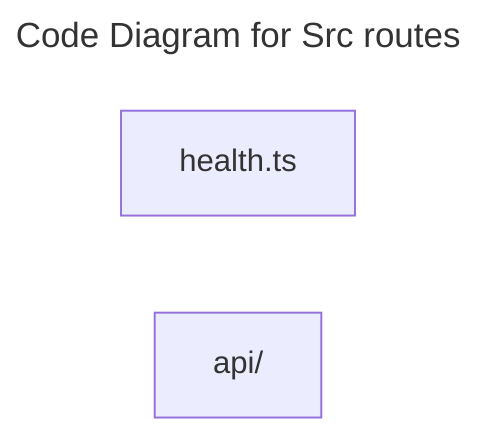

# C4 Code Level: Src routes

## Overview

- **Name**: Src routes
- **Description**: Src routes modules for the TrafficMENA codebase.
- **Location**: [server/src/routes](../../../server/src/routes)
- **Language**: TypeScript
- **Purpose**: Organize the src routes responsibilities used by the application.

## Code Elements

### Subdirectories

- [server/src/routes/api](./c4-code-server-src-routes-api.md) - Hono route registration, request validation, and HTTP handlers for the TrafficMENA API surface.

### Functions/Methods

- `registerHealthRoutes(app: Hono): unknown`
  - Description: Registers health routes with the surrounding module or runtime.
  - Location: [server/src/routes/health.ts](../../../server/src/routes/health.ts) (line 5)
  - Dependencies: ../db/client.js, drizzle-orm, hono

### Classes/Modules

- `health.ts`
  - Description: Module that implements health responsibilities for this directory.
  - Location: [server/src/routes/health.ts](../../../server/src/routes/health.ts)
  - Contains: 1 function(s)
  - Dependencies: ../db/client.js, drizzle-orm, hono

## Dependencies

### Internal Dependencies

- ../db/client.js
- server/src/routes/api (child module boundary)

### External Dependencies

- drizzle-orm
- hono

## Relationships

