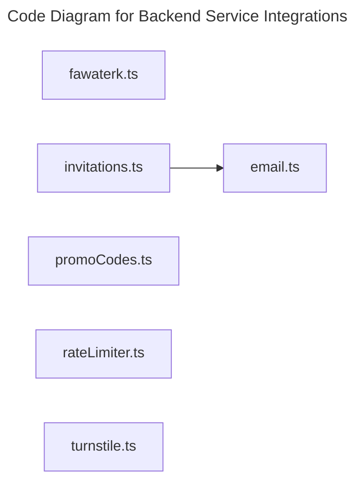

# C4 Code Level: Backend Service Integrations

## Overview

- **Name**: Backend Service Integrations
- **Description**: Service-layer modules that integrate with external providers and encapsulate reusable backend business rules.
- **Location**: [server/src/services](../../../server/src/services)
- **Language**: TypeScript
- **Purpose**: Support email, payments, invitations, CAPTCHA verification, pricing, and rate limiting from the Hono API.

## Code Elements

### Functions/Methods

- `escapeHtml(input: string): unknown`
  - Description: Implements escape html behavior for this module.
  - Location: [server/src/services/email.ts](../../../server/src/services/email.ts) (line 20)
  - Dependencies: ../config/env.js
- `async sendOtpEmail({ email, otp, ttlMinutes }: SendOtpEmailArgs): unknown`
  - Description: Implements send otp email behavior for this module.
  - Location: [server/src/services/email.ts](../../../server/src/services/email.ts) (line 28)
  - Dependencies: ../config/env.js
- `async sendInvitationEmail({
  email,
  invitationLink,
  expiresAt,
  firstName,
  inviterName,
  customMessage,
}: SendInvitationEmailArgs): unknown`
  - Description: Implements send invitation email behavior for this module.
  - Location: [server/src/services/email.ts](../../../server/src/services/email.ts) (line 90)
  - Dependencies: ../config/env.js
- `async fetchWithTimeout(url: string, options: RequestInit, timeoutMs = API_TIMEOUT_MS): Promise<Response>`
  - Description: Implements fetch with timeout behavior for this module.
  - Location: [server/src/services/fawaterk.ts](../../../server/src/services/fawaterk.ts) (line 23)
  - Dependencies: ../config/env.js, node:crypto, zod
- `async fetchWithCircuitBreaker(url: string, options: RequestInit, timeoutMs = API_TIMEOUT_MS): Promise<Response>`
  - Description: Implements fetch with circuit breaker behavior for this module.
  - Location: [server/src/services/fawaterk.ts](../../../server/src/services/fawaterk.ts) (line 39)
  - Dependencies: ../config/env.js, node:crypto, zod
- `summarizePaymentData(input: unknown): unknown`
  - Description: Implements summarize payment data behavior for this module.
  - Location: [server/src/services/fawaterk.ts](../../../server/src/services/fawaterk.ts) (line 202)
  - Dependencies: ../config/env.js, node:crypto, zod
- `getBaseUrl(): unknown`
  - Description: Returns base url derived from current inputs or state.
  - Location: [server/src/services/fawaterk.ts](../../../server/src/services/fawaterk.ts) (line 224)
  - Dependencies: ../config/env.js, node:crypto, zod
- `async getPaymentMethods(): Promise<PaymentMethod[]>`
  - Description: Returns payment methods derived from current inputs or state.
  - Location: [server/src/services/fawaterk.ts](../../../server/src/services/fawaterk.ts) (line 229)
  - Dependencies: ../config/env.js, node:crypto, zod
- `invalidatePaymentMethodsCache(): unknown`
  - Description: Implements invalidate payment methods cache behavior for this module.
  - Location: [server/src/services/fawaterk.ts](../../../server/src/services/fawaterk.ts) (line 276)
  - Dependencies: ../config/env.js, node:crypto, zod
- `async invoiceInitPay(args: InitiatePaymentArgs): Promise<{
  invoiceId: number;
  invoiceKey: string;
  paymentData: {
    redirectTo?: string;
    fawryCode?: string;
    meezaReference?: string;
    meezaQrCode?: string;
    amanCode?: string;
    masaryCode?: string;
  };
}>`
  - Description: Implements invoice init pay behavior for this module.
  - Location: [server/src/services/fawaterk.ts](../../../server/src/services/fawaterk.ts) (line 280)
  - Dependencies: ../config/env.js, node:crypto, zod
- `async getInvoiceData(invoiceId: number): Promise<InvoiceData>`
  - Description: Returns invoice data derived from current inputs or state.
  - Location: [server/src/services/fawaterk.ts](../../../server/src/services/fawaterk.ts) (line 352)
  - Dependencies: ../config/env.js, node:crypto, zod
- `verifyFawaterkWebhook(body: {
  invoice_id: number;
  invoice_key: string;
  payment_method: string;
  hashKey: string;
}): boolean`
  - Description: Implements verify fawaterk webhook behavior for this module.
  - Location: [server/src/services/fawaterk.ts](../../../server/src/services/fawaterk.ts) (line 382)
  - Dependencies: ../config/env.js, node:crypto, zod
- `async sendSingleInvitation(admin: AdminContext, input: InvitationInput): Promise<InvitationRecord>`
  - Description: Implements send single invitation behavior for this module.
  - Location: [server/src/services/invitations.ts](../../../server/src/services/invitations.ts) (line 45)
  - Dependencies: ../config/env.js, ../db/client.js, ../db/schema/index.js, ./email.js, drizzle-orm, node:crypto, papaparse
- `async sendBulkInvitations(admin: AdminContext, csvText: string): Promise<BulkInvitationResult>`
  - Description: Implements send bulk invitations behavior for this module.
  - Location: [server/src/services/invitations.ts](../../../server/src/services/invitations.ts) (line 93)
  - Dependencies: ../config/env.js, ../db/client.js, ../db/schema/index.js, ./email.js, drizzle-orm, node:crypto, papaparse
- `async getOrCreateMember(email: string, names?: { firstName?: string; lastName?: string }): unknown`
  - Description: Returns or create member derived from current inputs or state.
  - Location: [server/src/services/invitations.ts](../../../server/src/services/invitations.ts) (line 175)
  - Dependencies: ../config/env.js, ../db/client.js, ../db/schema/index.js, ./email.js, drizzle-orm, node:crypto, papaparse
- `optional(value?: string | null): unknown`
  - Description: Implements optional behavior for this module.
  - Location: [server/src/services/invitations.ts](../../../server/src/services/invitations.ts) (line 216)
  - Dependencies: ../config/env.js, ../db/client.js, ../db/schema/index.js, ./email.js, drizzle-orm, node:crypto, papaparse
- `normalizeEmail(value: string): unknown`
  - Description: Implements normalize email behavior for this module.
  - Location: [server/src/services/invitations.ts](../../../server/src/services/invitations.ts) (line 221)
  - Dependencies: ../config/env.js, ../db/client.js, ../db/schema/index.js, ./email.js, drizzle-orm, node:crypto, papaparse
- `buildInvitationLink(token: string, email: string): unknown`
  - Description: Builds invitation link from available inputs.
  - Location: [server/src/services/invitations.ts](../../../server/src/services/invitations.ts) (line 225)
  - Dependencies: ../config/env.js, ../db/client.js, ../db/schema/index.js, ./email.js, drizzle-orm, node:crypto, papaparse
- `buildAdminName(admin: AdminContext): unknown`
  - Description: Builds admin name from available inputs.
  - Location: [server/src/services/invitations.ts](../../../server/src/services/invitations.ts) (line 231)
  - Dependencies: ../config/env.js, ../db/client.js, ../db/schema/index.js, ./email.js, drizzle-orm, node:crypto, papaparse
- `buildFullName(firstName?: string | null, lastName?: string | null): unknown`
  - Description: Builds full name from available inputs.
  - Location: [server/src/services/invitations.ts](../../../server/src/services/invitations.ts) (line 236)
  - Dependencies: ../config/env.js, ../db/client.js, ../db/schema/index.js, ./email.js, drizzle-orm, node:crypto, papaparse
- `async ensureDailyLimit(adminId: string): unknown`
  - Description: Implements ensure daily limit behavior for this module.
  - Location: [server/src/services/invitations.ts](../../../server/src/services/invitations.ts) (line 241)
  - Dependencies: ../config/env.js, ../db/client.js, ../db/schema/index.js, ./email.js, drizzle-orm, node:crypto, papaparse
- `async countInvitesToday(adminId: string): unknown`
  - Description: Implements count invites today behavior for this module.
  - Location: [server/src/services/invitations.ts](../../../server/src/services/invitations.ts) (line 252)
  - Dependencies: ../config/env.js, ../db/client.js, ../db/schema/index.js, ./email.js, drizzle-orm, node:crypto, papaparse
- `parseCsv(text: string): {
  rows: Array<InvitationInput & { __line: number }>;
  errors: Array<{ line: number; email: string; reason: string }>;
}`
  - Description: Parses csv into a normalized form.
  - Location: [server/src/services/invitations.ts](../../../server/src/services/invitations.ts) (line 264)
  - Dependencies: ../config/env.js, ../db/client.js, ../db/schema/index.js, ./email.js, drizzle-orm, node:crypto, papaparse
- `isValidEmail(value: string): unknown`
  - Description: Checks whether valid email.
  - Location: [server/src/services/invitations.ts](../../../server/src/services/invitations.ts) (line 351)
  - Dependencies: ../config/env.js, ../db/client.js, ../db/schema/index.js, ./email.js, drizzle-orm, node:crypto, papaparse
- `async validatePromoCode(code: string, targetType: 'track' | 'event', targetId: string, tx?: DbTransaction): Promise<ValidPromoCode>`
  - Description: Validates promo code against module rules.
  - Location: [server/src/services/promoCodes.ts](../../../server/src/services/promoCodes.ts) (line 18)
  - Dependencies: ../db/client.js, ../db/schema/index.js, ../utils/errors.js, drizzle-orm, zod
- `async verifyTurnstileToken(token: string, remoteIp?: string): Promise<TurnstileVerifyResult>`
  - Description: Implements verify turnstile token behavior for this module.
  - Location: [server/src/services/turnstile.ts](../../../server/src/services/turnstile.ts) (line 24)
  - Dependencies: ../config/env.js, zod
- `isTurnstileEnabled(): boolean`
  - Description: Checks whether turnstile enabled.
  - Location: [server/src/services/turnstile.ts](../../../server/src/services/turnstile.ts) (line 83)
  - Dependencies: ../config/env.js, zod

### Classes/Modules

- `InvitationError`
  - Description: Class that encapsulates invitation error behavior and related methods.
  - Location: [server/src/services/invitations.ts](../../../server/src/services/invitations.ts) (line 34)
  - Methods: No class methods captured.
  - Dependencies: ../config/env.js, ../db/client.js, ../db/schema/index.js, ./email.js, drizzle-orm, node:crypto, papaparse
- `InMemoryRateLimiter`
  - Description: Class that encapsulates in memory rate limiter behavior and related methods.
  - Location: [server/src/services/rateLimiter.ts](../../../server/src/services/rateLimiter.ts) (line 28)
  - Methods: `consume(key: string, rule: RateLimitRule): unknown`, `reset(key: string): unknown`, `getCount(key: string): number`, `dispose(): unknown`
  - Dependencies: None

- `email.ts`
  - Description: Module that implements email responsibilities for this directory.
  - Location: [server/src/services/email.ts](../../../server/src/services/email.ts)
  - Contains: 3 function(s)
  - Dependencies: ../config/env.js
- `fawaterk.ts`
  - Description: Module that implements fawaterk responsibilities for this directory.
  - Location: [server/src/services/fawaterk.ts](../../../server/src/services/fawaterk.ts)
  - Contains: 9 function(s)
  - Dependencies: ../config/env.js, node:crypto, zod
- `invitations.ts`
  - Description: Module that implements invitations responsibilities for this directory.
  - Location: [server/src/services/invitations.ts](../../../server/src/services/invitations.ts)
  - Contains: 12 function(s), 1 class(es)
  - Dependencies: ../config/env.js, ../db/client.js, ../db/schema/index.js, ./email.js, drizzle-orm, node:crypto, papaparse
- `promoCodes.ts`
  - Description: Module that implements promo codes responsibilities for this directory.
  - Location: [server/src/services/promoCodes.ts](../../../server/src/services/promoCodes.ts)
  - Contains: 1 function(s)
  - Dependencies: ../db/client.js, ../db/schema/index.js, ../utils/errors.js, drizzle-orm, zod
- `rateLimiter.ts`
  - Description: Module that implements rate limiter responsibilities for this directory.
  - Location: [server/src/services/rateLimiter.ts](../../../server/src/services/rateLimiter.ts)
  - Contains: 1 class(es)
  - Dependencies: None
- `turnstile.ts`
  - Description: Module that implements turnstile responsibilities for this directory.
  - Location: [server/src/services/turnstile.ts](../../../server/src/services/turnstile.ts)
  - Contains: 2 function(s)
  - Dependencies: ../config/env.js, zod

## Dependencies

### Internal Dependencies

- ../config/env.js
- ../db/client.js
- ../db/schema/index.js
- ../utils/errors.js
- ./email.js

### External Dependencies

- drizzle-orm
- node:crypto
- papaparse
- zod

## Relationships

