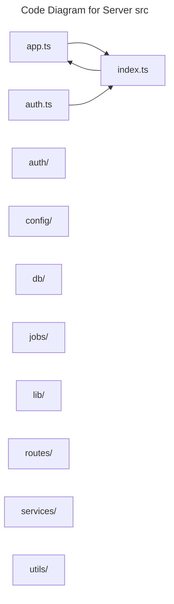

# C4 Code Level: Server src

## Overview

- **Name**: Server src
- **Description**: Server src modules for the TrafficMENA codebase.
- **Location**: [server/src](../../../server/src)
- **Language**: TypeScript
- **Purpose**: Organize the server src responsibilities used by the application.

## Code Elements

### Subdirectories

- [server/src/auth](./c4-code-server-src-auth.md) - Better Auth configuration and authentication-related helpers for the backend.
- [server/src/config](./c4-code-server-src-config.md) - Config modules for the TrafficMENA codebase.
- [server/src/db](./c4-code-server-src-db.md) - Src db modules for the TrafficMENA codebase.
- [server/src/jobs](./c4-code-server-src-jobs.md) - Background maintenance jobs that reconcile or expire payment-related records.
- [server/src/lib](./c4-code-server-src-lib.md) - Src lib modules for the TrafficMENA codebase.
- [server/src/routes](./c4-code-server-src-routes.md) - Src routes modules for the TrafficMENA codebase.
- [server/src/services](./c4-code-server-src-services.md) - Service-layer modules that integrate with external providers and encapsulate reusable backend business rules.
- [server/src/utils](./c4-code-server-src-utils.md) - Shared backend utility modules for security, errors, session handling, booking, and invoice status normalization.

### Functions/Methods

- `createApp(): unknown`
  - Description: Creates app for downstream use.
  - Location: [server/src/app.ts](../../../server/src/app.ts) (line 11)
  - Dependencies: ./config/env.js, ./config/requestLimits.js, ./routes/api/index.js, ./routes/health.js, hono, hono/cors, hono/logger, hono/secure-headers, hono/timing

### Classes/Modules

- `app.ts`
  - Description: Application composition module that wires middleware, providers, or global setup.
  - Location: [server/src/app.ts](../../../server/src/app.ts)
  - Contains: 1 function(s)
  - Dependencies: ./config/env.js, ./config/requestLimits.js, ./routes/api/index.js, ./routes/health.js, hono, hono/cors, hono/logger, hono/secure-headers, hono/timing
- `auth.ts`
  - Description: Authentication-focused module for session, identity, or login flows.
  - Location: [server/src/auth.ts](../../../server/src/auth.ts)
  - Contains: module-level configuration or data
  - Dependencies: ./auth/plugins/inviteSession.js, ./config/env.js, ./db/client.js, ./db/schema/index.js, ./services/email.js, better-auth, better-auth/adapters/drizzle, better-auth/plugins/email-otp, node:crypto
- `index.ts`
  - Description: Entry-point module that re-exports or wires together sibling modules.
  - Location: [server/src/index.ts](../../../server/src/index.ts)
  - Contains: module-level configuration or data
  - Dependencies: ./app.js, ./config/env.js, ./db/client.js, ./jobs/paymentExpiration.js, ./jobs/paymentReconciliation.js, @hono/node-server

## Dependencies

### Internal Dependencies

- ./app.js
- ./auth/plugins/inviteSession.js
- ./config/env.js
- ./config/requestLimits.js
- ./db/client.js
- ./db/schema/index.js
- ./jobs/paymentExpiration.js
- ./jobs/paymentReconciliation.js
- ./routes/api/index.js
- ./routes/health.js
- ./services/email.js
- server/src/auth (child module boundary)
- server/src/config (child module boundary)
- server/src/db (child module boundary)
- server/src/jobs (child module boundary)
- server/src/lib (child module boundary)
- server/src/routes (child module boundary)
- server/src/services (child module boundary)
- server/src/utils (child module boundary)

### External Dependencies

- @hono/node-server
- better-auth
- better-auth/adapters/drizzle
- better-auth/plugins/email-otp
- hono
- hono/cors
- hono/logger
- hono/secure-headers
- hono/timing
- node:crypto

## Relationships

