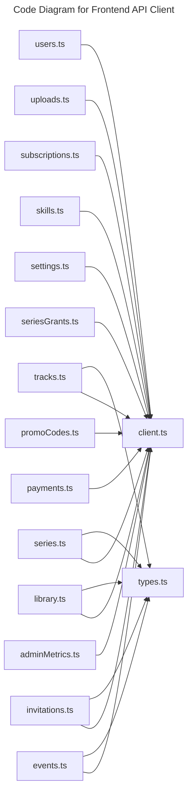

# C4 Code Level: Frontend API Client

## Overview

- **Name**: Frontend API Client
- **Description**: Typed browser-side fetch helpers, CSRF handling, and API error translation for the React SPA.
- **Location**: [src/app/api](../../../src/app/api)
- **Language**: TypeScript
- **Purpose**: Provide the shared client boundary for all frontend server communication.

## Code Elements

### Functions/Methods

- `async fetchAdminMetricsOverview(): Promise<AdminMetricsOverview>`
  - Description: Implements fetch admin metrics overview behavior for this module.
  - Location: [src/app/api/adminMetrics.ts](../../../src/app/api/adminMetrics.ts) (line 21)
  - Dependencies: ./client
- `getCookieValue(name: string): unknown`
  - Description: Returns cookie value derived from current inputs or state.
  - Location: [src/app/api/client.ts](../../../src/app/api/client.ts) (line 18)
  - Dependencies: None
- `getCsrfHeaders(): unknown`
  - Description: Returns csrf headers derived from current inputs or state.
  - Location: [src/app/api/client.ts](../../../src/app/api/client.ts) (line 24)
  - Dependencies: None
- `async fetchJson(input: RequestInfo, init?: RequestInit): Promise<T>`
  - Description: Implements fetch json behavior for this module.
  - Location: [src/app/api/client.ts](../../../src/app/api/client.ts) (line 29)
  - Dependencies: None
- `mapApiEventToRecord(event: ApiEvent): EventRecord`
  - Description: Implements map api event to record behavior for this module.
  - Location: [src/app/api/events.ts](../../../src/app/api/events.ts) (line 67)
  - Dependencies: ./client, ./types
- `mapApiEventDetailToRecord(api: ApiEventDetail): EventDetailRecord`
  - Description: Implements map api event detail to record behavior for this module.
  - Location: [src/app/api/events.ts](../../../src/app/api/events.ts) (line 84)
  - Dependencies: ./client, ./types
- `async fetchEvents(params: FetchEventsParams = {}): Promise<PaginatedResult<EventRecord>>`
  - Description: Implements fetch events behavior for this module.
  - Location: [src/app/api/events.ts](../../../src/app/api/events.ts) (line 137)
  - Dependencies: ./client, ./types
- `async fetchEventById(id: string): Promise<EventDetailRecord>`
  - Description: Implements fetch event by id behavior for this module.
  - Location: [src/app/api/events.ts](../../../src/app/api/events.ts) (line 162)
  - Dependencies: ./client, ./types
- `async createEvent(payload: CreateEventPayload): Promise<EventDetailRecord>`
  - Description: Creates event for downstream use.
  - Location: [src/app/api/events.ts](../../../src/app/api/events.ts) (line 170)
  - Dependencies: ./client, ./types
- `async updateEvent(id: string, payload: UpdateEventPayload): Promise<EventDetailRecord>`
  - Description: Implements update event behavior for this module.
  - Location: [src/app/api/events.ts](../../../src/app/api/events.ts) (line 179)
  - Dependencies: ./client, ./types
- `async deleteEvent(id: string): Promise<void>`
  - Description: Implements delete event behavior for this module.
  - Location: [src/app/api/events.ts](../../../src/app/api/events.ts) (line 191)
  - Dependencies: ./client, ./types
- `async registerForEvent(id: string): Promise<{ success: boolean; message?: string }>`
  - Description: Registers for event with the surrounding module or runtime.
  - Location: [src/app/api/events.ts](../../../src/app/api/events.ts) (line 197)
  - Dependencies: ./client, ./types
- `async cancelEventRegistration(id: string): Promise<{ success: boolean; message?: string }>`
  - Description: Implements cancel event registration behavior for this module.
  - Location: [src/app/api/events.ts](../../../src/app/api/events.ts) (line 206)
  - Dependencies: ./client, ./types
- `async fetchEventAttendees(eventId: string, params: { page?: number; pageSize?: number; search?: string } = {}): Promise<PaginatedResult<EventAttendeeRecord>>`
  - Description: Implements fetch event attendees behavior for this module.
  - Location: [src/app/api/events.ts](../../../src/app/api/events.ts) (line 242)
  - Dependencies: ./client, ./types
- `async fetchCancellationRequests(eventId: string, params: { page?: number; pageSize?: number } = {}): Promise<PaginatedResult<CancellationRequest>>`
  - Description: Implements fetch cancellation requests behavior for this module.
  - Location: [src/app/api/events.ts](../../../src/app/api/events.ts) (line 299)
  - Dependencies: ./client, ./types
- `async approveCancellation(eventId: string, registrationId: string): Promise<{ success: boolean; message?: string }>`
  - Description: Implements approve cancellation behavior for this module.
  - Location: [src/app/api/events.ts](../../../src/app/api/events.ts) (line 330)
  - Dependencies: ./client, ./types
- `async rejectCancellation(eventId: string, registrationId: string, reason?: string): Promise<{ success: boolean; message?: string }>`
  - Description: Implements reject cancellation behavior for this module.
  - Location: [src/app/api/events.ts](../../../src/app/api/events.ts) (line 340)
  - Dependencies: ./client, ./types
- `async fetchInvitations(params: FetchInvitationsParams = {}): Promise<PaginatedResult<InvitationRecord>>`
  - Description: Implements fetch invitations behavior for this module.
  - Location: [src/app/api/invitations.ts](../../../src/app/api/invitations.ts) (line 59)
  - Dependencies: ./client, ./types
- `async fetchInvitationStats(): Promise<InvitationStats>`
  - Description: Implements fetch invitation stats behavior for this module.
  - Location: [src/app/api/invitations.ts](../../../src/app/api/invitations.ts) (line 83)
  - Dependencies: ./client, ./types
- `async createInvitation(payload: CreateInvitationPayload): Promise<{ invitation: InvitationRecord }>`
  - Description: Creates invitation for downstream use.
  - Location: [src/app/api/invitations.ts](../../../src/app/api/invitations.ts) (line 90)
  - Dependencies: ./client, ./types
- `async acceptInvitation(payload: AcceptInvitationPayload): Promise<AcceptInvitationResponse>`
  - Description: Implements accept invitation behavior for this module.
  - Location: [src/app/api/invitations.ts](../../../src/app/api/invitations.ts) (line 106)
  - Dependencies: ./client, ./types
- `async activateInvitation(payload: ActivateInvitationPayload): Promise<ActivateInvitationResponse>`
  - Description: Implements activate invitation behavior for this module.
  - Location: [src/app/api/invitations.ts](../../../src/app/api/invitations.ts) (line 125)
  - Dependencies: ./client, ./types
- `async createInvitationsFromCsv(file: File): Promise<BulkInvitationResponse>`
  - Description: Creates invitations from csv for downstream use.
  - Location: [src/app/api/invitations.ts](../../../src/app/api/invitations.ts) (line 144)
  - Dependencies: ./client, ./types
- `mapAsset(asset: ApiLibraryAsset): LibraryAssetRecord`
  - Description: Implements map asset behavior for this module.
  - Location: [src/app/api/library.ts](../../../src/app/api/library.ts) (line 46)
  - Dependencies: ./client, ./types
- `async fetchLibraryAssets(params: FetchLibraryParams = {}): Promise<PaginatedResult<LibraryAssetRecord>>`
  - Description: Implements fetch library assets behavior for this module.
  - Location: [src/app/api/library.ts](../../../src/app/api/library.ts) (line 93)
  - Dependencies: ./client, ./types
- `async fetchLibraryAssetById(id: string): Promise<LibraryAssetRecord>`
  - Description: Implements fetch library asset by id behavior for this module.
  - Location: [src/app/api/library.ts](../../../src/app/api/library.ts) (line 122)
  - Dependencies: ./client, ./types
- `async updateLibraryAsset(id: string, payload: UpdateLibraryAssetPayload): Promise<LibraryAssetRecord>`
  - Description: Implements update library asset behavior for this module.
  - Location: [src/app/api/library.ts](../../../src/app/api/library.ts) (line 150)
  - Dependencies: ./client, ./types
- `async createLibraryAsset(payload: CreateLibraryAssetPayload): Promise<LibraryAssetRecord>`
  - Description: Creates library asset for downstream use.
  - Location: [src/app/api/library.ts](../../../src/app/api/library.ts) (line 162)
  - Dependencies: ./client, ./types
- `async deleteLibraryAsset(id: string): Promise<void>`
  - Description: Implements delete library asset behavior for this module.
  - Location: [src/app/api/library.ts](../../../src/app/api/library.ts) (line 173)
  - Dependencies: ./client, ./types
- `async fetchPaymentMethods(signal?: AbortSignal): Promise<PaymentMethod[]>`
  - Description: Implements fetch payment methods behavior for this module.
  - Location: [src/app/api/payments.ts](../../../src/app/api/payments.ts) (line 86)
  - Dependencies: ./client
- `async createCheckout(payload: CheckoutRequest): Promise<CheckoutResponse>`
  - Description: Creates checkout for downstream use.
  - Location: [src/app/api/payments.ts](../../../src/app/api/payments.ts) (line 94)
  - Dependencies: ./client
- `async verifyPayment(payload: VerifyPaymentRequest): Promise<VerifyPaymentResponse>`
  - Description: Implements verify payment behavior for this module.
  - Location: [src/app/api/payments.ts](../../../src/app/api/payments.ts) (line 102)
  - Dependencies: ./client
- `async fetchPayment(paymentId: string): Promise<Payment>`
  - Description: Implements fetch payment behavior for this module.
  - Location: [src/app/api/payments.ts](../../../src/app/api/payments.ts) (line 110)
  - Dependencies: ./client
- `async fetchPricePreview(itemType: PaymentItemType, itemId?: string, promoCode?: string, signal?: AbortSignal): Promise<PricePreview>`
  - Description: Implements fetch price preview behavior for this module.
  - Location: [src/app/api/payments.ts](../../../src/app/api/payments.ts) (line 117)
  - Dependencies: ./client
- `mapPromoCode(promo: ApiPromoCode): PromoCodeRecord`
  - Description: Implements map promo code behavior for this module.
  - Location: [src/app/api/promoCodes.ts](../../../src/app/api/promoCodes.ts) (line 31)
  - Dependencies: ./client
- `async fetchPromoCodes(): Promise<PromoCodeRecord[]>`
  - Description: Implements fetch promo codes behavior for this module.
  - Location: [src/app/api/promoCodes.ts](../../../src/app/api/promoCodes.ts) (line 60)
  - Dependencies: ./client
- `async fetchPromoCode(id: string): Promise<PromoCodeRecord>`
  - Description: Implements fetch promo code behavior for this module.
  - Location: [src/app/api/promoCodes.ts](../../../src/app/api/promoCodes.ts) (line 67)
  - Dependencies: ./client
- `async createPromoCode(payload: CreatePromoCodePayload): Promise<PromoCodeRecord>`
  - Description: Creates promo code for downstream use.
  - Location: [src/app/api/promoCodes.ts](../../../src/app/api/promoCodes.ts) (line 74)
  - Dependencies: ./client
- `async updatePromoCode(id: string, payload: UpdatePromoCodePayload): Promise<PromoCodeRecord>`
  - Description: Implements update promo code behavior for this module.
  - Location: [src/app/api/promoCodes.ts](../../../src/app/api/promoCodes.ts) (line 82)
  - Dependencies: ./client
- `async deletePromoCode(id: string): Promise<void>`
  - Description: Implements delete promo code behavior for this module.
  - Location: [src/app/api/promoCodes.ts](../../../src/app/api/promoCodes.ts) (line 93)
  - Dependencies: ./client
- `mapSeries(api: ApiSeries): SeriesRecord`
  - Description: Implements map series behavior for this module.
  - Location: [src/app/api/series.ts](../../../src/app/api/series.ts) (line 81)
  - Dependencies: ./client, ./types
- `mapSeriesAsset(asset: ApiSeriesAsset): SeriesAssetRecord`
  - Description: Implements map series asset behavior for this module.
  - Location: [src/app/api/series.ts](../../../src/app/api/series.ts) (line 93)
  - Dependencies: ./client, ./types
- `mapSeriesDetail(series: ApiSeriesDetail): SeriesDetailRecord`
  - Description: Implements map series detail behavior for this module.
  - Location: [src/app/api/series.ts](../../../src/app/api/series.ts) (line 112)
  - Dependencies: ./client, ./types
- `async fetchSeries(params: FetchSeriesParams = {}): Promise<PaginatedResult<SeriesRecord>>`
  - Description: Implements fetch series behavior for this module.
  - Location: [src/app/api/series.ts](../../../src/app/api/series.ts) (line 139)
  - Dependencies: ./client, ./types
- `async fetchSeriesById(id: string): Promise<SeriesDetailRecord>`
  - Description: Implements fetch series by id behavior for this module.
  - Location: [src/app/api/series.ts](../../../src/app/api/series.ts) (line 161)
  - Dependencies: ./client, ./types
- `async createSeries(payload: CreateSeriesPayload): Promise<SeriesRecord>`
  - Description: Creates series for downstream use.
  - Location: [src/app/api/series.ts](../../../src/app/api/series.ts) (line 168)
  - Dependencies: ./client, ./types
- `async updateSeries(id: string, payload: UpdateSeriesPayload): Promise<SeriesRecord>`
  - Description: Implements update series behavior for this module.
  - Location: [src/app/api/series.ts](../../../src/app/api/series.ts) (line 176)
  - Dependencies: ./client, ./types
- `async deleteSeries(id: string): Promise<void>`
  - Description: Implements delete series behavior for this module.
  - Location: [src/app/api/series.ts](../../../src/app/api/series.ts) (line 187)
  - Dependencies: ./client, ./types
- `async addAssetsToSeries(seriesId: string, assetIds: string[]): Promise<{ addedCount: number }>`
  - Description: Implements add assets to series behavior for this module.
  - Location: [src/app/api/series.ts](../../../src/app/api/series.ts) (line 194)
  - Dependencies: ./client, ./types
- `async removeAssetFromSeries(seriesId: string, assetId: string): Promise<void>`
  - Description: Implements remove asset from series behavior for this module.
  - Location: [src/app/api/series.ts](../../../src/app/api/series.ts) (line 208)
  - Dependencies: ./client, ./types
- `async reorderSeriesAssets(seriesId: string, assetIds: string[]): Promise<void>`
  - Description: Implements reorder series assets behavior for this module.
  - Location: [src/app/api/series.ts](../../../src/app/api/series.ts) (line 214)
  - Dependencies: ./client, ./types
- `async fetchSeriesGrants(seriesId: string, params: FetchSeriesGrantsParams = {}, signal?: AbortSignal): Promise<SeriesGrantListResponse>`
  - Description: Implements fetch series grants behavior for this module.
  - Location: [src/app/api/seriesGrants.ts](../../../src/app/api/seriesGrants.ts) (line 36)
  - Dependencies: ./client
- `async grantSeriesAccess(seriesId: string, payload: { userIds: string[]; reason: string }): Promise<{ success: boolean; grantedCount: number; alreadyGrantedCount: number }>`
  - Description: Implements grant series access behavior for this module.
  - Location: [src/app/api/seriesGrants.ts](../../../src/app/api/seriesGrants.ts) (line 53)
  - Dependencies: ./client
- `async revokeSeriesAccess(seriesId: string, userId: string, reason: string): Promise<{ success: boolean }>`
  - Description: Implements revoke series access behavior for this module.
  - Location: [src/app/api/seriesGrants.ts](../../../src/app/api/seriesGrants.ts) (line 66)
  - Dependencies: ./client
- `async createSeriesGrantsFromCsv(file: File): Promise<BulkSeriesGrantResponse>`
  - Description: Creates series grants from csv for downstream use.
  - Location: [src/app/api/seriesGrants.ts](../../../src/app/api/seriesGrants.ts) (line 85)
  - Dependencies: ./client
- `async fetchPublicSettings(): Promise<PublicSettings>`
  - Description: Implements fetch public settings behavior for this module.
  - Location: [src/app/api/settings.ts](../../../src/app/api/settings.ts) (line 7)
  - Dependencies: ./client
- `async fetchAdminSettings(): Promise<AdminSettings>`
  - Description: Implements fetch admin settings behavior for this module.
  - Location: [src/app/api/settings.ts](../../../src/app/api/settings.ts) (line 20)
  - Dependencies: ./client
- `async updateAdminSettings(payload: {
  inviteOnly?: boolean;
  eventMode?: boolean;
}): Promise<AdminSettings>`
  - Description: Implements update admin settings behavior for this module.
  - Location: [src/app/api/settings.ts](../../../src/app/api/settings.ts) (line 26)
  - Dependencies: ./client
- `async fetchSkills(): Promise<SkillRecord[]>`
  - Description: Implements fetch skills behavior for this module.
  - Location: [src/app/api/skills.ts](../../../src/app/api/skills.ts) (line 12)
  - Dependencies: ./client
- `async createSkill(payload: {
  name: string;
  category?: string;
  description?: string;
}): Promise<{ success: boolean; skill?: SkillRecord; error?: { code: string; message: string } }>`
  - Description: Creates skill for downstream use.
  - Location: [src/app/api/skills.ts](../../../src/app/api/skills.ts) (line 19)
  - Dependencies: ./client
- `async fetchUserSkills(): Promise<ApiUserSkill[]>`
  - Description: Implements fetch user skills behavior for this module.
  - Location: [src/app/api/skills.ts](../../../src/app/api/skills.ts) (line 36)
  - Dependencies: ./client
- `async addUserSkill(skillId: string): Promise<{ success: boolean; message?: string }>`
  - Description: Implements add user skill behavior for this module.
  - Location: [src/app/api/skills.ts](../../../src/app/api/skills.ts) (line 43)
  - Dependencies: ./client
- `async removeUserSkill(skillId: string): Promise<{ success: boolean; message?: string }>`
  - Description: Implements remove user skill behavior for this module.
  - Location: [src/app/api/skills.ts](../../../src/app/api/skills.ts) (line 52)
  - Dependencies: ./client
- `async fetchSubscriptionSettings(): Promise<SubscriptionSettings>`
  - Description: Implements fetch subscription settings behavior for this module.
  - Location: [src/app/api/subscriptions.ts](../../../src/app/api/subscriptions.ts) (line 33)
  - Dependencies: ./client
- `async updateSubscriptionSettings(payload: Partial<SubscriptionSettings>): Promise<SubscriptionSettings>`
  - Description: Implements update subscription settings behavior for this module.
  - Location: [src/app/api/subscriptions.ts](../../../src/app/api/subscriptions.ts) (line 40)
  - Dependencies: ./client
- `async fetchCurrentSubscription(): Promise<UserSubscription>`
  - Description: Implements fetch current subscription behavior for this module.
  - Location: [src/app/api/subscriptions.ts](../../../src/app/api/subscriptions.ts) (line 53)
  - Dependencies: ./client
- `async fetchSubscriptionInfo(): Promise<SubscriptionInfo>`
  - Description: Implements fetch subscription info behavior for this module.
  - Location: [src/app/api/subscriptions.ts](../../../src/app/api/subscriptions.ts) (line 60)
  - Dependencies: ./client
- `async createSubscriptionGrant(payload: {
  userId: string;
  source: SubscriptionGrantSource;
  reason: string;
}): Promise<{
  success: boolean;
  subscription: {
    id: string;
    userId: string;
    status: 'active' | 'expired';
    startsAt: string;
    endsAt: string;
    source: 'paid' | 'legacy' | 'gift';
  };
}>`
  - Description: Creates subscription grant for downstream use.
  - Location: [src/app/api/subscriptions.ts](../../../src/app/api/subscriptions.ts) (line 76)
  - Dependencies: ./client
- `async revokeSubscriptionGrant(payload: {
  userId: string;
  reason: string;
}): Promise<{ success: boolean }>`
  - Description: Implements revoke subscription grant behavior for this module.
  - Location: [src/app/api/subscriptions.ts](../../../src/app/api/subscriptions.ts) (line 97)
  - Dependencies: ./client
- `async createSubscriptionGrantsFromCsv(file: File): Promise<BulkSubscriptionGrantResponse>`
  - Description: Creates subscription grants from csv for downstream use.
  - Location: [src/app/api/subscriptions.ts](../../../src/app/api/subscriptions.ts) (line 112)
  - Dependencies: ./client
- `mapTrack(api: ApiTrack): TrackRecord`
  - Description: Implements map track behavior for this module.
  - Location: [src/app/api/tracks.ts](../../../src/app/api/tracks.ts) (line 97)
  - Dependencies: ./client, ./types
- `mapTrackEvent(event: ApiTrackEvent): TrackEventRecord`
  - Description: Implements map track event behavior for this module.
  - Location: [src/app/api/tracks.ts](../../../src/app/api/tracks.ts) (line 120)
  - Dependencies: ./client, ./types
- `mapTrackDetail(track: ApiTrackDetail): TrackDetailRecord`
  - Description: Implements map track detail behavior for this module.
  - Location: [src/app/api/tracks.ts](../../../src/app/api/tracks.ts) (line 131)
  - Dependencies: ./client, ./types
- `async fetchTracks(params: FetchTracksParams = {}): Promise<PaginatedResult<TrackRecord>>`
  - Description: Implements fetch tracks behavior for this module.
  - Location: [src/app/api/tracks.ts](../../../src/app/api/tracks.ts) (line 165)
  - Dependencies: ./client, ./types
- `async fetchTrackById(id: string): Promise<TrackDetailRecord>`
  - Description: Implements fetch track by id behavior for this module.
  - Location: [src/app/api/tracks.ts](../../../src/app/api/tracks.ts) (line 187)
  - Dependencies: ./client, ./types
- `async createTrack(payload: CreateTrackPayload): Promise<TrackRecord>`
  - Description: Creates track for downstream use.
  - Location: [src/app/api/tracks.ts](../../../src/app/api/tracks.ts) (line 194)
  - Dependencies: ./client, ./types
- `async updateTrack(id: string, payload: UpdateTrackPayload): Promise<TrackRecord>`
  - Description: Implements update track behavior for this module.
  - Location: [src/app/api/tracks.ts](../../../src/app/api/tracks.ts) (line 202)
  - Dependencies: ./client, ./types
- `async deleteTrack(id: string): Promise<void>`
  - Description: Implements delete track behavior for this module.
  - Location: [src/app/api/tracks.ts](../../../src/app/api/tracks.ts) (line 210)
  - Dependencies: ./client, ./types
- `async addEventsToTrack(trackId: string, eventIds: string[]): Promise<{ addedCount: number }>`
  - Description: Implements add events to track behavior for this module.
  - Location: [src/app/api/tracks.ts](../../../src/app/api/tracks.ts) (line 216)
  - Dependencies: ./client, ./types
- `async removeEventFromTrack(trackId: string, eventId: string): Promise<void>`
  - Description: Implements remove event from track behavior for this module.
  - Location: [src/app/api/tracks.ts](../../../src/app/api/tracks.ts) (line 230)
  - Dependencies: ./client, ./types
- `async reorderTrackEvents(trackId: string, eventIds: string[]): Promise<void>`
  - Description: Implements reorder track events behavior for this module.
  - Location: [src/app/api/tracks.ts](../../../src/app/api/tracks.ts) (line 236)
  - Dependencies: ./client, ./types
- `async bookTrack(trackId: string): Promise<TrackBookingSuccess>`
  - Description: Implements book track behavior for this module.
  - Location: [src/app/api/tracks.ts](../../../src/app/api/tracks.ts) (line 243)
  - Dependencies: ./client, ./types
- `async fetchTrackAttendees(trackId: string, params: { page?: number; pageSize?: number; search?: string } = {}): Promise<PaginatedResult<TrackAttendee>>`
  - Description: Implements fetch track attendees behavior for this module.
  - Location: [src/app/api/tracks.ts](../../../src/app/api/tracks.ts) (line 263)
  - Dependencies: ./client, ./types
- `async fetchPublicTracks(params: { page?: number; pageSize?: number } = {}): Promise<PaginatedResult<PublicTrackRecord>>`
  - Description: Implements fetch public tracks behavior for this module.
  - Location: [src/app/api/tracks.ts](../../../src/app/api/tracks.ts) (line 329)
  - Dependencies: ./client, ./types
- `async fetchPublicTrackById(id: string): Promise<{ track: PublicTrackDetailRecord; events: PublicTrackEventRecord[] }>`
  - Description: Implements fetch public track by id behavior for this module.
  - Location: [src/app/api/tracks.ts](../../../src/app/api/tracks.ts) (line 379)
  - Dependencies: ./client, ./types
- `async uploadFile({
  file,
  scope = 'events',
  signal,
}: UploadFileOptions): Promise<UploadFileResult>`
  - Description: Implements upload file behavior for this module.
  - Location: [src/app/api/uploads.ts](../../../src/app/api/uploads.ts) (line 19)
  - Dependencies: ./client
- `mapProfile(profile: ApiProfile): ProfileRecord | null`
  - Description: Implements map profile behavior for this module.
  - Location: [src/app/api/users.ts](../../../src/app/api/users.ts) (line 36)
  - Dependencies: ./client
- `async fetchCurrentUser(): Promise<CurrentUserResponse>`
  - Description: Implements fetch current user behavior for this module.
  - Location: [src/app/api/users.ts](../../../src/app/api/users.ts) (line 106)
  - Dependencies: ./client
- `async fetchUsersAdmin(params: FetchUsersAdminParams = {}): Promise<AdminUsersResponse>`
  - Description: Implements fetch users admin behavior for this module.
  - Location: [src/app/api/users.ts](../../../src/app/api/users.ts) (line 115)
  - Dependencies: ./client
- `async updateCurrentUser(payload: UpdateCurrentUserPayload, options?: { mode?: 'signup' }): Promise<{ success: boolean; message?: string }>`
  - Description: Implements update current user behavior for this module.
  - Location: [src/app/api/users.ts](../../../src/app/api/users.ts) (line 160)
  - Dependencies: ./client
- `async updateCurrentUserSignup(payload: UpdateCurrentUserPayload): Promise<{ success: boolean; message?: string }>`
  - Description: Implements update current user signup behavior for this module.
  - Location: [src/app/api/users.ts](../../../src/app/api/users.ts) (line 181)
  - Dependencies: ./client
- `async updateUserRole(userId: string, role: UserRoleValue): Promise<{ success: boolean; user: AdminUserRecord }>`
  - Description: Implements update user role behavior for this module.
  - Location: [src/app/api/users.ts](../../../src/app/api/users.ts) (line 187)
  - Dependencies: ./client
- `async deleteUser(userId: string): Promise<{ success: boolean }>`
  - Description: Implements delete user behavior for this module.
  - Location: [src/app/api/users.ts](../../../src/app/api/users.ts) (line 215)
  - Dependencies: ./client

### Classes/Modules

- `ApiError`
  - Description: Class that encapsulates api error behavior and related methods.
  - Location: [src/app/api/client.ts](../../../src/app/api/client.ts) (line 1)
  - Methods: No class methods captured.
  - Dependencies: None

- `adminMetrics.ts`
  - Description: Module that implements admin metrics responsibilities for this directory.
  - Location: [src/app/api/adminMetrics.ts](../../../src/app/api/adminMetrics.ts)
  - Contains: 1 function(s)
  - Dependencies: ./client
- `client.ts`
  - Description: Client boundary module responsible for browser-side API interaction.
  - Location: [src/app/api/client.ts](../../../src/app/api/client.ts)
  - Contains: 3 function(s), 1 class(es)
  - Dependencies: None
- `events.ts`
  - Description: Module that implements events responsibilities for this directory.
  - Location: [src/app/api/events.ts](../../../src/app/api/events.ts)
  - Contains: 13 function(s)
  - Dependencies: ./client, ./types
- `invitations.ts`
  - Description: Module that implements invitations responsibilities for this directory.
  - Location: [src/app/api/invitations.ts](../../../src/app/api/invitations.ts)
  - Contains: 6 function(s)
  - Dependencies: ./client, ./types
- `library.ts`
  - Description: Module that implements library responsibilities for this directory.
  - Location: [src/app/api/library.ts](../../../src/app/api/library.ts)
  - Contains: 6 function(s)
  - Dependencies: ./client, ./types
- `payments.ts`
  - Description: Module that implements payments responsibilities for this directory.
  - Location: [src/app/api/payments.ts](../../../src/app/api/payments.ts)
  - Contains: 5 function(s)
  - Dependencies: ./client
- `promoCodes.ts`
  - Description: Module that implements promo codes responsibilities for this directory.
  - Location: [src/app/api/promoCodes.ts](../../../src/app/api/promoCodes.ts)
  - Contains: 6 function(s)
  - Dependencies: ./client
- `series.ts`
  - Description: Module that implements series responsibilities for this directory.
  - Location: [src/app/api/series.ts](../../../src/app/api/series.ts)
  - Contains: 11 function(s)
  - Dependencies: ./client, ./types
- `seriesGrants.ts`
  - Description: Module that implements series grants responsibilities for this directory.
  - Location: [src/app/api/seriesGrants.ts](../../../src/app/api/seriesGrants.ts)
  - Contains: 4 function(s)
  - Dependencies: ./client
- `settings.ts`
  - Description: Module that implements settings responsibilities for this directory.
  - Location: [src/app/api/settings.ts](../../../src/app/api/settings.ts)
  - Contains: 3 function(s)
  - Dependencies: ./client
- `skills.ts`
  - Description: Module that implements skills responsibilities for this directory.
  - Location: [src/app/api/skills.ts](../../../src/app/api/skills.ts)
  - Contains: 5 function(s)
  - Dependencies: ./client
- `subscriptions.ts`
  - Description: Module that implements subscriptions responsibilities for this directory.
  - Location: [src/app/api/subscriptions.ts](../../../src/app/api/subscriptions.ts)
  - Contains: 7 function(s)
  - Dependencies: ./client
- `tracks.ts`
  - Description: Module that implements tracks responsibilities for this directory.
  - Location: [src/app/api/tracks.ts](../../../src/app/api/tracks.ts)
  - Contains: 15 function(s)
  - Dependencies: ./client, ./types
- `types.ts`
  - Description: Module that implements types responsibilities for this directory.
  - Location: [src/app/api/types.ts](../../../src/app/api/types.ts)
  - Contains: module-level configuration or data
  - Dependencies: None
- `uploads.ts`
  - Description: Module that implements uploads responsibilities for this directory.
  - Location: [src/app/api/uploads.ts](../../../src/app/api/uploads.ts)
  - Contains: 1 function(s)
  - Dependencies: ./client
- `users.ts`
  - Description: Module that implements users responsibilities for this directory.
  - Location: [src/app/api/users.ts](../../../src/app/api/users.ts)
  - Contains: 7 function(s)
  - Dependencies: ./client

## Dependencies

### Internal Dependencies

- ./client
- ./types

### External Dependencies

- None captured from direct file imports in this directory.

## Relationships

