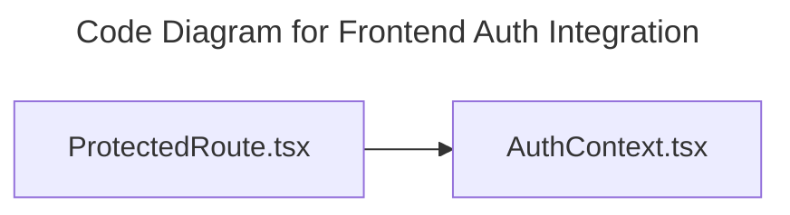

# C4 Code Level: Frontend Auth Integration

## Overview

- **Name**: Frontend Auth Integration
- **Description**: Application-level authentication helpers and adapters for the React app shell.
- **Location**: [src/app/auth](../../../src/app/auth)
- **Language**: TypeScript
- **Purpose**: Coordinate login state and auth-aware flows in the SPA.

## Code Elements

### Functions/Methods

- `AuthProvider({ children }: { children: ReactNode }): unknown`
  - Description: Implements auth provider behavior for this module.
  - Location: [src/app/auth/AuthContext.tsx](../../../src/app/auth/AuthContext.tsx) (line 30)
  - Dependencies: @/app/api/client, react
- `useAuth(): unknown`
  - Description: React hook that manages auth behavior.
  - Location: [src/app/auth/AuthContext.tsx](../../../src/app/auth/AuthContext.tsx) (line 110)
  - Dependencies: @/app/api/client, react
- `ProtectedRoute({ children }: { children: ReactNode }): unknown`
  - Description: Implements protected route behavior for this module.
  - Location: [src/app/auth/ProtectedRoute.tsx](../../../src/app/auth/ProtectedRoute.tsx) (line 5)
  - Dependencies: ./AuthContext, react, react-router-dom

### Classes/Modules

- `AuthContext.tsx`
  - Description: Module that implements auth context responsibilities for this directory.
  - Location: [src/app/auth/AuthContext.tsx](../../../src/app/auth/AuthContext.tsx)
  - Contains: 2 function(s)
  - Dependencies: @/app/api/client, react
- `ProtectedRoute.tsx`
  - Description: Module that implements protected route responsibilities for this directory.
  - Location: [src/app/auth/ProtectedRoute.tsx](../../../src/app/auth/ProtectedRoute.tsx)
  - Contains: 1 function(s)
  - Dependencies: ./AuthContext, react, react-router-dom

## Dependencies

### Internal Dependencies

- ./AuthContext
- @/app/api/client

### External Dependencies

- react
- react-router-dom

## Relationships

