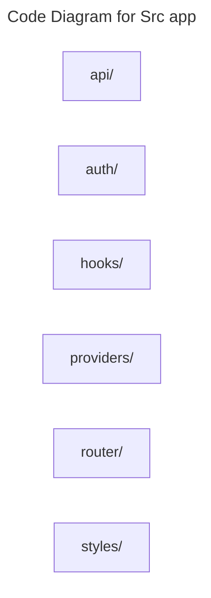

# C4 Code Level: Src app

## Overview

- **Name**: Src app
- **Description**: Src app modules for the TrafficMENA codebase.
- **Location**: [src/app](../../../src/app)
- **Language**: Directory aggregator (no direct source files)
- **Purpose**: Organize the src app responsibilities used by the application.

## Code Elements

### Subdirectories

- [src/app/api](./c4-code-src-app-api.md) - Typed browser-side fetch helpers, CSRF handling, and API error translation for the React SPA.
- [src/app/auth](./c4-code-src-app-auth.md) - Application-level authentication helpers and adapters for the React app shell.
- [src/app/hooks](./c4-code-src-app-hooks.md) - App hooks React hooks and stateful helper logic.
- [src/app/providers](./c4-code-src-app-providers.md) - App providers modules for the TrafficMENA codebase.
- [src/app/router](./c4-code-src-app-router.md) - App router modules for the TrafficMENA codebase.
- [src/app/styles](./c4-code-src-app-styles.md) - App styles modules for the TrafficMENA codebase.

### Functions/Methods

- No direct top-level functions or methods are defined in files at this directory level.

### Classes/Modules

- This directory is primarily an organizational boundary for child directories rather than a direct source module location.

## Dependencies

### Internal Dependencies

- src/app/api (child module boundary)
- src/app/auth (child module boundary)
- src/app/hooks (child module boundary)
- src/app/providers (child module boundary)
- src/app/router (child module boundary)
- src/app/styles (child module boundary)

### External Dependencies

- None captured from direct file imports in this directory.

## Relationships

