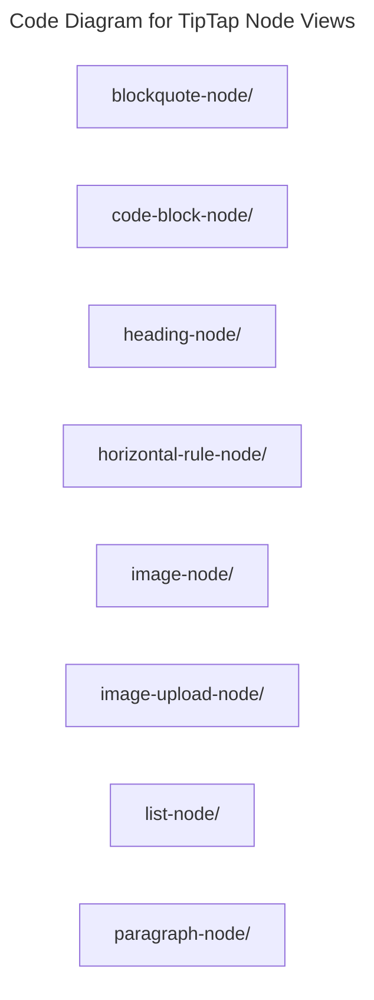

# C4 Code Level: TipTap Node Views

## Overview

- **Name**: TipTap Node Views
- **Description**: TipTap node-level extensions and node view wrappers used by the editor experience.
- **Location**: [src/components/tiptap-node](../../../src/components/tiptap-node)
- **Language**: Directory aggregator (no direct source files)
- **Purpose**: Customize how rich-text content blocks behave and render inside the editor.

## Code Elements

### Subdirectories

- [src/components/tiptap-node/blockquote-node](./c4-code-src-components-tiptap-node-blockquote-node.md) - Tiptap Node blockquote Node React component modules.
- [src/components/tiptap-node/code-block-node](./c4-code-src-components-tiptap-node-code-block-node.md) - Tiptap Node code Block Node React component modules.
- [src/components/tiptap-node/heading-node](./c4-code-src-components-tiptap-node-heading-node.md) - Tiptap Node heading Node React component modules.
- [src/components/tiptap-node/horizontal-rule-node](./c4-code-src-components-tiptap-node-horizontal-rule-node.md) - Tiptap Node horizontal Rule Node React component modules.
- [src/components/tiptap-node/image-node](./c4-code-src-components-tiptap-node-image-node.md) - Tiptap Node image Node React component modules.
- [src/components/tiptap-node/image-upload-node](./c4-code-src-components-tiptap-node-image-upload-node.md) - Tiptap Node image Upload Node React component modules.
- [src/components/tiptap-node/list-node](./c4-code-src-components-tiptap-node-list-node.md) - Tiptap Node list Node React component modules.
- [src/components/tiptap-node/paragraph-node](./c4-code-src-components-tiptap-node-paragraph-node.md) - Tiptap Node paragraph Node React component modules.

### Functions/Methods

- No direct top-level functions or methods are defined in files at this directory level.

### Classes/Modules

- This directory is primarily an organizational boundary for child directories rather than a direct source module location.

## Dependencies

### Internal Dependencies

- src/components/tiptap-node/blockquote-node (child module boundary)
- src/components/tiptap-node/code-block-node (child module boundary)
- src/components/tiptap-node/heading-node (child module boundary)
- src/components/tiptap-node/horizontal-rule-node (child module boundary)
- src/components/tiptap-node/image-node (child module boundary)
- src/components/tiptap-node/image-upload-node (child module boundary)
- src/components/tiptap-node/list-node (child module boundary)
- src/components/tiptap-node/paragraph-node (child module boundary)

### External Dependencies

- None captured from direct file imports in this directory.

## Relationships

