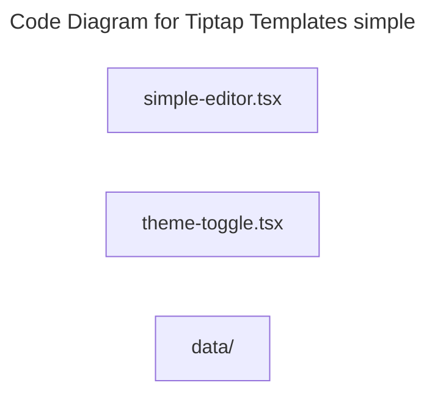

# C4 Code Level: Tiptap Templates simple

## Overview

- **Name**: Tiptap Templates simple
- **Description**: Tiptap Templates simple React component modules.
- **Location**: [src/components/tiptap-templates/simple](../../../src/components/tiptap-templates/simple)
- **Language**: CSS/SCSS, TypeScript
- **Purpose**: Render tiptap templates simple user interface elements for the TrafficMENA frontend.

## Code Elements

### Subdirectories

- [src/components/tiptap-templates/simple/data](./c4-code-src-components-tiptap-templates-simple-data.md) - Tiptap Templates simple React component modules.

### Functions/Methods

- `MainToolbarContent({
  onHighlighterClick,
  onLinkClick,
  isMobile,
}: {
  onHighlighterClick: () => void;
  onLinkClick: () => void;
  isMobile: boolean;
}): unknown`
  - Description: Implements main toolbar content behavior for this module.
  - Location: [src/components/tiptap-templates/simple/simple-editor.tsx](../../../src/components/tiptap-templates/simple/simple-editor.tsx) (line 64)
  - Dependencies: @/components/tiptap-icons/arrow-left-icon, @/components/tiptap-icons/highlighter-icon, @/components/tiptap-icons/link-icon, @/components/tiptap-node/blockquote-node/blockquote-node.scss, @/components/tiptap-node/code-block-node/code-block-node.scss, @/components/tiptap-node/heading-node/heading-node.scss, @/components/tiptap-node/horizontal-rule-node/horizontal-rule-node-extension, @/components/tiptap-node/horizontal-rule-node/horizontal-rule-node.scss, @/components/tiptap-node/image-node/image-node.scss, @/components/tiptap-node/image-upload-node/image-upload-node-extension, @/components/tiptap-node/list-node/list-node.scss, @/components/tiptap-node/paragraph-node/paragraph-node.scss, @/components/tiptap-templates/simple/data/content.json, @/components/tiptap-templates/simple/simple-editor.scss, @/components/tiptap-templates/simple/theme-toggle, @/components/tiptap-ui-primitive/button, @/components/tiptap-ui-primitive/spacer, @/components/tiptap-ui-primitive/toolbar, @/components/tiptap-ui/blockquote-button, @/components/tiptap-ui/code-block-button, @/components/tiptap-ui/color-highlight-popover, @/components/tiptap-ui/heading-dropdown-menu, @/components/tiptap-ui/image-upload-button, @/components/tiptap-ui/link-popover, @/components/tiptap-ui/list-dropdown-menu, @/components/tiptap-ui/mark-button, @/components/tiptap-ui/text-align-button, @/components/tiptap-ui/undo-redo-button, @/hooks/use-cursor-visibility, @/hooks/use-mobile, @/hooks/use-window-size, @/lib/tiptap-utils, @tiptap/extension-highlight, @tiptap/extension-image, @tiptap/extension-list, @tiptap/extension-subscript, @tiptap/extension-superscript, @tiptap/extension-text-align, @tiptap/extension-typography, @tiptap/extensions, @tiptap/react, @tiptap/starter-kit, react
- `MobileToolbarContent({
  type,
  onBack,
}: {
  type: 'highlighter' | 'link';
  onBack: () => void;
}): unknown`
  - Description: Implements mobile toolbar content behavior for this module.
  - Location: [src/components/tiptap-templates/simple/simple-editor.tsx](../../../src/components/tiptap-templates/simple/simple-editor.tsx) (line 140)
  - Dependencies: @/components/tiptap-icons/arrow-left-icon, @/components/tiptap-icons/highlighter-icon, @/components/tiptap-icons/link-icon, @/components/tiptap-node/blockquote-node/blockquote-node.scss, @/components/tiptap-node/code-block-node/code-block-node.scss, @/components/tiptap-node/heading-node/heading-node.scss, @/components/tiptap-node/horizontal-rule-node/horizontal-rule-node-extension, @/components/tiptap-node/horizontal-rule-node/horizontal-rule-node.scss, @/components/tiptap-node/image-node/image-node.scss, @/components/tiptap-node/image-upload-node/image-upload-node-extension, @/components/tiptap-node/list-node/list-node.scss, @/components/tiptap-node/paragraph-node/paragraph-node.scss, @/components/tiptap-templates/simple/data/content.json, @/components/tiptap-templates/simple/simple-editor.scss, @/components/tiptap-templates/simple/theme-toggle, @/components/tiptap-ui-primitive/button, @/components/tiptap-ui-primitive/spacer, @/components/tiptap-ui-primitive/toolbar, @/components/tiptap-ui/blockquote-button, @/components/tiptap-ui/code-block-button, @/components/tiptap-ui/color-highlight-popover, @/components/tiptap-ui/heading-dropdown-menu, @/components/tiptap-ui/image-upload-button, @/components/tiptap-ui/link-popover, @/components/tiptap-ui/list-dropdown-menu, @/components/tiptap-ui/mark-button, @/components/tiptap-ui/text-align-button, @/components/tiptap-ui/undo-redo-button, @/hooks/use-cursor-visibility, @/hooks/use-mobile, @/hooks/use-window-size, @/lib/tiptap-utils, @tiptap/extension-highlight, @tiptap/extension-image, @tiptap/extension-list, @tiptap/extension-subscript, @tiptap/extension-superscript, @tiptap/extension-text-align, @tiptap/extension-typography, @tiptap/extensions, @tiptap/react, @tiptap/starter-kit, react
- `SimpleEditor(): unknown`
  - Description: Implements simple editor behavior for this module.
  - Location: [src/components/tiptap-templates/simple/simple-editor.tsx](../../../src/components/tiptap-templates/simple/simple-editor.tsx) (line 165)
  - Dependencies: @/components/tiptap-icons/arrow-left-icon, @/components/tiptap-icons/highlighter-icon, @/components/tiptap-icons/link-icon, @/components/tiptap-node/blockquote-node/blockquote-node.scss, @/components/tiptap-node/code-block-node/code-block-node.scss, @/components/tiptap-node/heading-node/heading-node.scss, @/components/tiptap-node/horizontal-rule-node/horizontal-rule-node-extension, @/components/tiptap-node/horizontal-rule-node/horizontal-rule-node.scss, @/components/tiptap-node/image-node/image-node.scss, @/components/tiptap-node/image-upload-node/image-upload-node-extension, @/components/tiptap-node/list-node/list-node.scss, @/components/tiptap-node/paragraph-node/paragraph-node.scss, @/components/tiptap-templates/simple/data/content.json, @/components/tiptap-templates/simple/simple-editor.scss, @/components/tiptap-templates/simple/theme-toggle, @/components/tiptap-ui-primitive/button, @/components/tiptap-ui-primitive/spacer, @/components/tiptap-ui-primitive/toolbar, @/components/tiptap-ui/blockquote-button, @/components/tiptap-ui/code-block-button, @/components/tiptap-ui/color-highlight-popover, @/components/tiptap-ui/heading-dropdown-menu, @/components/tiptap-ui/image-upload-button, @/components/tiptap-ui/link-popover, @/components/tiptap-ui/list-dropdown-menu, @/components/tiptap-ui/mark-button, @/components/tiptap-ui/text-align-button, @/components/tiptap-ui/undo-redo-button, @/hooks/use-cursor-visibility, @/hooks/use-mobile, @/hooks/use-window-size, @/lib/tiptap-utils, @tiptap/extension-highlight, @tiptap/extension-image, @tiptap/extension-list, @tiptap/extension-subscript, @tiptap/extension-superscript, @tiptap/extension-text-align, @tiptap/extension-typography, @tiptap/extensions, @tiptap/react, @tiptap/starter-kit, react
- `ThemeToggle(): unknown`
  - Description: Implements theme toggle behavior for this module.
  - Location: [src/components/tiptap-templates/simple/theme-toggle.tsx](../../../src/components/tiptap-templates/simple/theme-toggle.tsx) (line 8)
  - Dependencies: @/components/tiptap-icons/moon-star-icon, @/components/tiptap-icons/sun-icon, @/components/tiptap-ui-primitive/button, react

### Classes/Modules

- `simple-editor.scss`
  - Description: Style module that provides visual rules for sibling components.
  - Location: [src/components/tiptap-templates/simple/simple-editor.scss](../../../src/components/tiptap-templates/simple/simple-editor.scss)
  - Contains: module-level configuration or data
  - Dependencies: None
- `simple-editor.tsx`
  - Description: Module that implements simple editor responsibilities for this directory.
  - Location: [src/components/tiptap-templates/simple/simple-editor.tsx](../../../src/components/tiptap-templates/simple/simple-editor.tsx)
  - Contains: 3 function(s)
  - Dependencies: @/components/tiptap-icons/arrow-left-icon, @/components/tiptap-icons/highlighter-icon, @/components/tiptap-icons/link-icon, @/components/tiptap-node/blockquote-node/blockquote-node.scss, @/components/tiptap-node/code-block-node/code-block-node.scss, @/components/tiptap-node/heading-node/heading-node.scss, @/components/tiptap-node/horizontal-rule-node/horizontal-rule-node-extension, @/components/tiptap-node/horizontal-rule-node/horizontal-rule-node.scss, @/components/tiptap-node/image-node/image-node.scss, @/components/tiptap-node/image-upload-node/image-upload-node-extension, @/components/tiptap-node/list-node/list-node.scss, @/components/tiptap-node/paragraph-node/paragraph-node.scss, @/components/tiptap-templates/simple/data/content.json, @/components/tiptap-templates/simple/simple-editor.scss, @/components/tiptap-templates/simple/theme-toggle, @/components/tiptap-ui-primitive/button, @/components/tiptap-ui-primitive/spacer, @/components/tiptap-ui-primitive/toolbar, @/components/tiptap-ui/blockquote-button, @/components/tiptap-ui/code-block-button, @/components/tiptap-ui/color-highlight-popover, @/components/tiptap-ui/heading-dropdown-menu, @/components/tiptap-ui/image-upload-button, @/components/tiptap-ui/link-popover, @/components/tiptap-ui/list-dropdown-menu, @/components/tiptap-ui/mark-button, @/components/tiptap-ui/text-align-button, @/components/tiptap-ui/undo-redo-button, @/hooks/use-cursor-visibility, @/hooks/use-mobile, @/hooks/use-window-size, @/lib/tiptap-utils, @tiptap/extension-highlight, @tiptap/extension-image, @tiptap/extension-list, @tiptap/extension-subscript, @tiptap/extension-superscript, @tiptap/extension-text-align, @tiptap/extension-typography, @tiptap/extensions, @tiptap/react, @tiptap/starter-kit, react
- `theme-toggle.tsx`
  - Description: Module that implements theme toggle responsibilities for this directory.
  - Location: [src/components/tiptap-templates/simple/theme-toggle.tsx](../../../src/components/tiptap-templates/simple/theme-toggle.tsx)
  - Contains: 1 function(s)
  - Dependencies: @/components/tiptap-icons/moon-star-icon, @/components/tiptap-icons/sun-icon, @/components/tiptap-ui-primitive/button, react

## Dependencies

### Internal Dependencies

- @/components/tiptap-icons/arrow-left-icon
- @/components/tiptap-icons/highlighter-icon
- @/components/tiptap-icons/link-icon
- @/components/tiptap-icons/moon-star-icon
- @/components/tiptap-icons/sun-icon
- @/components/tiptap-node/blockquote-node/blockquote-node.scss
- @/components/tiptap-node/code-block-node/code-block-node.scss
- @/components/tiptap-node/heading-node/heading-node.scss
- @/components/tiptap-node/horizontal-rule-node/horizontal-rule-node-extension
- @/components/tiptap-node/horizontal-rule-node/horizontal-rule-node.scss
- @/components/tiptap-node/image-node/image-node.scss
- @/components/tiptap-node/image-upload-node/image-upload-node-extension
- @/components/tiptap-node/list-node/list-node.scss
- @/components/tiptap-node/paragraph-node/paragraph-node.scss
- @/components/tiptap-templates/simple/data/content.json
- @/components/tiptap-templates/simple/simple-editor.scss
- @/components/tiptap-templates/simple/theme-toggle
- @/components/tiptap-ui-primitive/button
- @/components/tiptap-ui-primitive/spacer
- @/components/tiptap-ui-primitive/toolbar
- @/components/tiptap-ui/blockquote-button
- @/components/tiptap-ui/code-block-button
- @/components/tiptap-ui/color-highlight-popover
- @/components/tiptap-ui/heading-dropdown-menu
- @/components/tiptap-ui/image-upload-button
- @/components/tiptap-ui/link-popover
- @/components/tiptap-ui/list-dropdown-menu
- @/components/tiptap-ui/mark-button
- @/components/tiptap-ui/text-align-button
- @/components/tiptap-ui/undo-redo-button
- @/hooks/use-cursor-visibility
- @/hooks/use-mobile
- @/hooks/use-window-size
- @/lib/tiptap-utils
- src/components/tiptap-templates/simple/data (child module boundary)

### External Dependencies

- @tiptap/extension-highlight
- @tiptap/extension-image
- @tiptap/extension-list
- @tiptap/extension-subscript
- @tiptap/extension-superscript
- @tiptap/extension-text-align
- @tiptap/extension-typography
- @tiptap/extensions
- @tiptap/react
- @tiptap/starter-kit
- react

## Relationships

