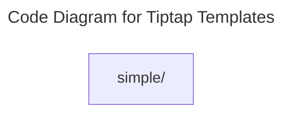

# C4 Code Level: Tiptap Templates

## Overview

- **Name**: Tiptap Templates
- **Description**: Tiptap Templates React component modules.
- **Location**: [src/components/tiptap-templates](../../../src/components/tiptap-templates)
- **Language**: Directory aggregator (no direct source files)
- **Purpose**: Render tiptap templates user interface elements for the TrafficMENA frontend.

## Code Elements

### Subdirectories

- [src/components/tiptap-templates/simple](./c4-code-src-components-tiptap-templates-simple.md) - Tiptap Templates simple React component modules.

### Functions/Methods

- No direct top-level functions or methods are defined in files at this directory level.

### Classes/Modules

- This directory is primarily an organizational boundary for child directories rather than a direct source module location.

## Dependencies

### Internal Dependencies

- src/components/tiptap-templates/simple (child module boundary)

### External Dependencies

- None captured from direct file imports in this directory.

## Relationships

