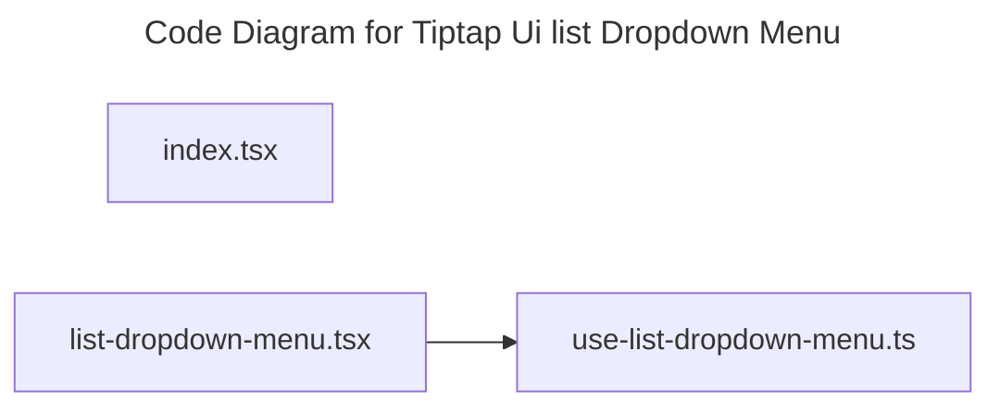

# C4 Code Level: Tiptap Ui list Dropdown Menu

## Overview

- **Name**: Tiptap Ui list Dropdown Menu
- **Description**: Tiptap Ui list Dropdown Menu React component modules.
- **Location**: [src/components/tiptap-ui/list-dropdown-menu](../../../src/components/tiptap-ui/list-dropdown-menu)
- **Language**: TypeScript
- **Purpose**: Render tiptap ui list dropdown menu user interface elements for the TrafficMENA frontend.

## Code Elements

### Functions/Methods

- `ListDropdownMenu({
  editor: providedEditor,
  types = ['bulletList', 'orderedList', 'taskList'],
  hideWhenUnavailable = false,
  onOpenChange,
  portal = false,
  ...props
}: ListDropdownMenuProps): unknown`
  - Description: Implements list dropdown menu behavior for this module.
  - Location: [src/components/tiptap-ui/list-dropdown-menu/list-dropdown-menu.tsx](../../../src/components/tiptap-ui/list-dropdown-menu/list-dropdown-menu.tsx) (line 46)
  - Dependencies: ./use-list-dropdown-menu, @/components/tiptap-icons/chevron-down-icon, @/components/tiptap-ui-primitive/button, @/components/tiptap-ui-primitive/card, @/components/tiptap-ui-primitive/dropdown-menu, @/components/tiptap-ui/list-button, @/hooks/use-tiptap-editor, @tiptap/react, react
- `canToggleAnyList(editor: Editor | null, listTypes: ListType[]): boolean`
  - Description: Implements can toggle any list behavior for this module.
  - Location: [src/components/tiptap-ui/list-dropdown-menu/use-list-dropdown-menu.ts](../../../src/components/tiptap-ui/list-dropdown-menu/use-list-dropdown-menu.ts) (line 65)
  - Dependencies: @/components/tiptap-icons/list-icon, @/components/tiptap-icons/list-ordered-icon, @/components/tiptap-icons/list-todo-icon, @/components/tiptap-ui/list-button, @/hooks/use-tiptap-editor, @/lib/tiptap-utils, @tiptap/react, react
- `isAnyListActive(editor: Editor | null, listTypes: ListType[]): boolean`
  - Description: Checks whether any list active.
  - Location: [src/components/tiptap-ui/list-dropdown-menu/use-list-dropdown-menu.ts](../../../src/components/tiptap-ui/list-dropdown-menu/use-list-dropdown-menu.ts) (line 70)
  - Dependencies: @/components/tiptap-icons/list-icon, @/components/tiptap-icons/list-ordered-icon, @/components/tiptap-icons/list-todo-icon, @/components/tiptap-ui/list-button, @/hooks/use-tiptap-editor, @/lib/tiptap-utils, @tiptap/react, react
- `getFilteredListOptions(availableTypes: ListType[]): typeof listOptions`
  - Description: Returns filtered list options derived from current inputs or state.
  - Location: [src/components/tiptap-ui/list-dropdown-menu/use-list-dropdown-menu.ts](../../../src/components/tiptap-ui/list-dropdown-menu/use-list-dropdown-menu.ts) (line 75)
  - Dependencies: @/components/tiptap-icons/list-icon, @/components/tiptap-icons/list-ordered-icon, @/components/tiptap-icons/list-todo-icon, @/components/tiptap-ui/list-button, @/hooks/use-tiptap-editor, @/lib/tiptap-utils, @tiptap/react, react
- `shouldShowListDropdown(params: {
  editor: Editor | null;
  listTypes: ListType[];
  hideWhenUnavailable: boolean;
  listInSchema: boolean;
  canToggleAny: boolean;
}): boolean`
  - Description: Implements should show list dropdown behavior for this module.
  - Location: [src/components/tiptap-ui/list-dropdown-menu/use-list-dropdown-menu.ts](../../../src/components/tiptap-ui/list-dropdown-menu/use-list-dropdown-menu.ts) (line 79)
  - Dependencies: @/components/tiptap-icons/list-icon, @/components/tiptap-icons/list-ordered-icon, @/components/tiptap-icons/list-todo-icon, @/components/tiptap-ui/list-button, @/hooks/use-tiptap-editor, @/lib/tiptap-utils, @tiptap/react, react
- `getActiveListType(editor: Editor | null, availableTypes: ListType[]): ListType | undefined`
  - Description: Returns active list type derived from current inputs or state.
  - Location: [src/components/tiptap-ui/list-dropdown-menu/use-list-dropdown-menu.ts](../../../src/components/tiptap-ui/list-dropdown-menu/use-list-dropdown-menu.ts) (line 102)
  - Dependencies: @/components/tiptap-icons/list-icon, @/components/tiptap-icons/list-ordered-icon, @/components/tiptap-icons/list-todo-icon, @/components/tiptap-ui/list-button, @/hooks/use-tiptap-editor, @/lib/tiptap-utils, @tiptap/react, react
- `useListDropdownMenu(config?: UseListDropdownMenuConfig): unknown`
  - Description: React hook that manages list dropdown menu behavior.
  - Location: [src/components/tiptap-ui/list-dropdown-menu/use-list-dropdown-menu.ts](../../../src/components/tiptap-ui/list-dropdown-menu/use-list-dropdown-menu.ts) (line 149)
  - Dependencies: @/components/tiptap-icons/list-icon, @/components/tiptap-icons/list-ordered-icon, @/components/tiptap-icons/list-todo-icon, @/components/tiptap-ui/list-button, @/hooks/use-tiptap-editor, @/lib/tiptap-utils, @tiptap/react, react

### Classes/Modules

- `index.tsx`
  - Description: Entry-point module that re-exports or wires together sibling modules.
  - Location: [src/components/tiptap-ui/list-dropdown-menu/index.tsx](../../../src/components/tiptap-ui/list-dropdown-menu/index.tsx)
  - Contains: module-level configuration or data
  - Dependencies: None
- `list-dropdown-menu.tsx`
  - Description: Module that implements list dropdown menu responsibilities for this directory.
  - Location: [src/components/tiptap-ui/list-dropdown-menu/list-dropdown-menu.tsx](../../../src/components/tiptap-ui/list-dropdown-menu/list-dropdown-menu.tsx)
  - Contains: 1 function(s)
  - Dependencies: ./use-list-dropdown-menu, @/components/tiptap-icons/chevron-down-icon, @/components/tiptap-ui-primitive/button, @/components/tiptap-ui-primitive/card, @/components/tiptap-ui-primitive/dropdown-menu, @/components/tiptap-ui/list-button, @/hooks/use-tiptap-editor, @tiptap/react, react
- `use-list-dropdown-menu.ts`
  - Description: Module that implements use list dropdown menu responsibilities for this directory.
  - Location: [src/components/tiptap-ui/list-dropdown-menu/use-list-dropdown-menu.ts](../../../src/components/tiptap-ui/list-dropdown-menu/use-list-dropdown-menu.ts)
  - Contains: 6 function(s)
  - Dependencies: @/components/tiptap-icons/list-icon, @/components/tiptap-icons/list-ordered-icon, @/components/tiptap-icons/list-todo-icon, @/components/tiptap-ui/list-button, @/hooks/use-tiptap-editor, @/lib/tiptap-utils, @tiptap/react, react

## Dependencies

### Internal Dependencies

- ./use-list-dropdown-menu
- @/components/tiptap-icons/chevron-down-icon
- @/components/tiptap-icons/list-icon
- @/components/tiptap-icons/list-ordered-icon
- @/components/tiptap-icons/list-todo-icon
- @/components/tiptap-ui-primitive/button
- @/components/tiptap-ui-primitive/card
- @/components/tiptap-ui-primitive/dropdown-menu
- @/components/tiptap-ui/list-button
- @/hooks/use-tiptap-editor
- @/lib/tiptap-utils

### External Dependencies

- @tiptap/react
- react

## Relationships

