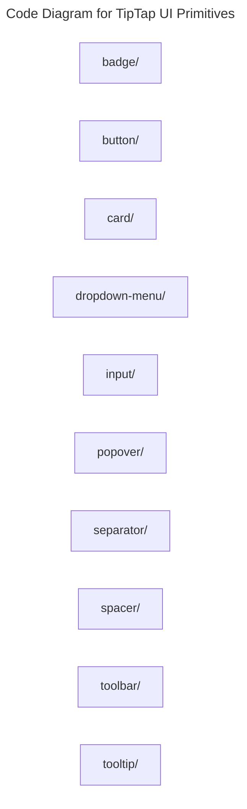

# C4 Code Level: TipTap UI Primitives

## Overview

- **Name**: TipTap UI Primitives
- **Description**: Low-level UI primitives used by the TipTap editor controls.
- **Location**: [src/components/tiptap-ui-primitive](../../../src/components/tiptap-ui-primitive)
- **Language**: Directory aggregator (no direct source files)
- **Purpose**: Share consistent editor chrome across all authoring buttons, menus, and popovers.

## Code Elements

### Subdirectories

- [src/components/tiptap-ui-primitive/badge](./c4-code-src-components-tiptap-ui-primitive-badge.md) - Tiptap UI Primitive badge React component modules.
- [src/components/tiptap-ui-primitive/button](./c4-code-src-components-tiptap-ui-primitive-button.md) - Tiptap UI Primitive button React component modules.
- [src/components/tiptap-ui-primitive/card](./c4-code-src-components-tiptap-ui-primitive-card.md) - Tiptap UI Primitive card React component modules.
- [src/components/tiptap-ui-primitive/dropdown-menu](./c4-code-src-components-tiptap-ui-primitive-dropdown-menu.md) - Tiptap UI Primitive dropdown Menu React component modules.
- [src/components/tiptap-ui-primitive/input](./c4-code-src-components-tiptap-ui-primitive-input.md) - Tiptap UI Primitive input React component modules.
- [src/components/tiptap-ui-primitive/popover](./c4-code-src-components-tiptap-ui-primitive-popover.md) - Tiptap UI Primitive popover React component modules.
- [src/components/tiptap-ui-primitive/separator](./c4-code-src-components-tiptap-ui-primitive-separator.md) - Tiptap UI Primitive separator React component modules.
- [src/components/tiptap-ui-primitive/spacer](./c4-code-src-components-tiptap-ui-primitive-spacer.md) - Tiptap UI Primitive spacer React component modules.
- [src/components/tiptap-ui-primitive/toolbar](./c4-code-src-components-tiptap-ui-primitive-toolbar.md) - Tiptap UI Primitive toolbar React component modules.
- [src/components/tiptap-ui-primitive/tooltip](./c4-code-src-components-tiptap-ui-primitive-tooltip.md) - Tiptap UI Primitive tooltip React component modules.

### Functions/Methods

- No direct top-level functions or methods are defined in files at this directory level.

### Classes/Modules

- This directory is primarily an organizational boundary for child directories rather than a direct source module location.

## Dependencies

### Internal Dependencies

- src/components/tiptap-ui-primitive/badge (child module boundary)
- src/components/tiptap-ui-primitive/button (child module boundary)
- src/components/tiptap-ui-primitive/card (child module boundary)
- src/components/tiptap-ui-primitive/dropdown-menu (child module boundary)
- src/components/tiptap-ui-primitive/input (child module boundary)
- src/components/tiptap-ui-primitive/popover (child module boundary)
- src/components/tiptap-ui-primitive/separator (child module boundary)
- src/components/tiptap-ui-primitive/spacer (child module boundary)
- src/components/tiptap-ui-primitive/toolbar (child module boundary)
- src/components/tiptap-ui-primitive/tooltip (child module boundary)

### External Dependencies

- None captured from direct file imports in this directory.

## Relationships

