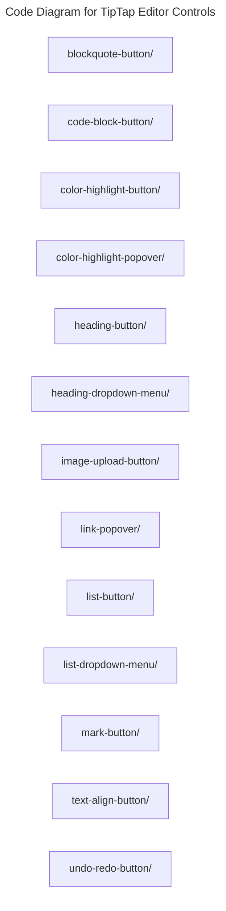

# C4 Code Level: TipTap Editor Controls

## Overview

- **Name**: TipTap Editor Controls
- **Description**: Rich-text editor control components layered on top of TipTap and shared UI primitives.
- **Location**: [src/components/tiptap-ui](../../../src/components/tiptap-ui)
- **Language**: Directory aggregator (no direct source files)
- **Purpose**: Provide reusable editing affordances for content authoring workflows.

## Code Elements

### Subdirectories

- [src/components/tiptap-ui/blockquote-button](./c4-code-src-components-tiptap-ui-blockquote-button.md) - Tiptap Ui blockquote Button React component modules.
- [src/components/tiptap-ui/code-block-button](./c4-code-src-components-tiptap-ui-code-block-button.md) - Tiptap Ui code Block Button React component modules.
- [src/components/tiptap-ui/color-highlight-button](./c4-code-src-components-tiptap-ui-color-highlight-button.md) - Tiptap Ui color Highlight Button React component modules.
- [src/components/tiptap-ui/color-highlight-popover](./c4-code-src-components-tiptap-ui-color-highlight-popover.md) - Tiptap Ui color Highlight Popover React component modules.
- [src/components/tiptap-ui/heading-button](./c4-code-src-components-tiptap-ui-heading-button.md) - Tiptap Ui heading Button React component modules.
- [src/components/tiptap-ui/heading-dropdown-menu](./c4-code-src-components-tiptap-ui-heading-dropdown-menu.md) - Tiptap Ui heading Dropdown Menu React component modules.
- [src/components/tiptap-ui/image-upload-button](./c4-code-src-components-tiptap-ui-image-upload-button.md) - Tiptap Ui image Upload Button React component modules.
- [src/components/tiptap-ui/link-popover](./c4-code-src-components-tiptap-ui-link-popover.md) - Tiptap Ui link Popover React component modules.
- [src/components/tiptap-ui/list-button](./c4-code-src-components-tiptap-ui-list-button.md) - Tiptap Ui list Button React component modules.
- [src/components/tiptap-ui/list-dropdown-menu](./c4-code-src-components-tiptap-ui-list-dropdown-menu.md) - Tiptap Ui list Dropdown Menu React component modules.
- [src/components/tiptap-ui/mark-button](./c4-code-src-components-tiptap-ui-mark-button.md) - Tiptap Ui mark Button React component modules.
- [src/components/tiptap-ui/text-align-button](./c4-code-src-components-tiptap-ui-text-align-button.md) - Tiptap Ui text Align Button React component modules.
- [src/components/tiptap-ui/undo-redo-button](./c4-code-src-components-tiptap-ui-undo-redo-button.md) - Tiptap Ui undo Redo Button React component modules.

### Functions/Methods

- No direct top-level functions or methods are defined in files at this directory level.

### Classes/Modules

- This directory is primarily an organizational boundary for child directories rather than a direct source module location.

## Dependencies

### Internal Dependencies

- src/components/tiptap-ui/blockquote-button (child module boundary)
- src/components/tiptap-ui/code-block-button (child module boundary)
- src/components/tiptap-ui/color-highlight-button (child module boundary)
- src/components/tiptap-ui/color-highlight-popover (child module boundary)
- src/components/tiptap-ui/heading-button (child module boundary)
- src/components/tiptap-ui/heading-dropdown-menu (child module boundary)
- src/components/tiptap-ui/image-upload-button (child module boundary)
- src/components/tiptap-ui/link-popover (child module boundary)
- src/components/tiptap-ui/list-button (child module boundary)
- src/components/tiptap-ui/list-dropdown-menu (child module boundary)
- src/components/tiptap-ui/mark-button (child module boundary)
- src/components/tiptap-ui/text-align-button (child module boundary)
- src/components/tiptap-ui/undo-redo-button (child module boundary)

### External Dependencies

- None captured from direct file imports in this directory.

## Relationships

