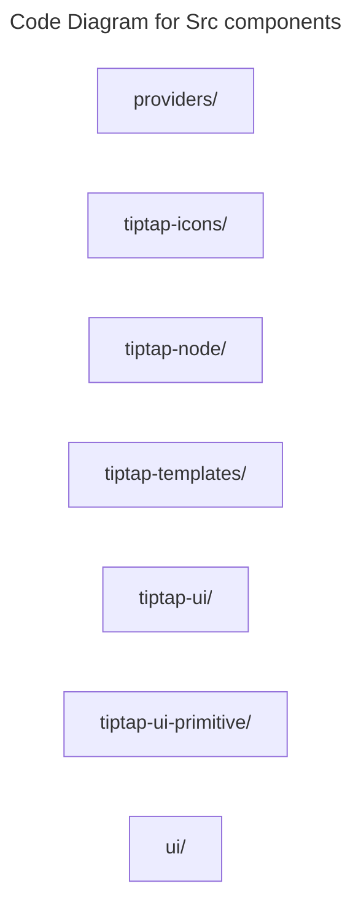

# C4 Code Level: Src components

## Overview

- **Name**: Src components
- **Description**: Src components React component modules.
- **Location**: [src/components](../../../src/components)
- **Language**: Directory aggregator (no direct source files)
- **Purpose**: Render src components user interface elements for the TrafficMENA frontend.

## Code Elements

### Subdirectories

- [src/components/providers](./c4-code-src-components-providers.md) - Components providers React component modules.
- [src/components/tiptap-icons](./c4-code-src-components-tiptap-icons.md) - Tiptap Icons React component modules.
- [src/components/tiptap-node](./c4-code-src-components-tiptap-node.md) - TipTap node-level extensions and node view wrappers used by the editor experience.
- [src/components/tiptap-templates](./c4-code-src-components-tiptap-templates.md) - Tiptap Templates React component modules.
- [src/components/tiptap-ui](./c4-code-src-components-tiptap-ui.md) - Rich-text editor control components layered on top of TipTap and shared UI primitives.
- [src/components/tiptap-ui-primitive](./c4-code-src-components-tiptap-ui-primitive.md) - Low-level UI primitives used by the TipTap editor controls.
- [src/components/ui](./c4-code-src-components-ui.md) - Components ui React component modules.

### Functions/Methods

- No direct top-level functions or methods are defined in files at this directory level.

### Classes/Modules

- This directory is primarily an organizational boundary for child directories rather than a direct source module location.

## Dependencies

### Internal Dependencies

- src/components/providers (child module boundary)
- src/components/tiptap-icons (child module boundary)
- src/components/tiptap-node (child module boundary)
- src/components/tiptap-templates (child module boundary)
- src/components/tiptap-ui (child module boundary)
- src/components/tiptap-ui-primitive (child module boundary)
- src/components/ui (child module boundary)

### External Dependencies

- None captured from direct file imports in this directory.

## Relationships

