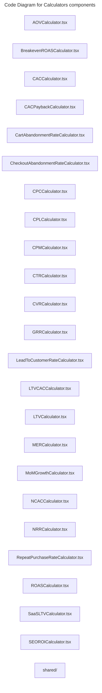

# C4 Code Level: Calculators components

## Overview

- **Name**: Calculators components
- **Description**: Calculators components React component modules.
- **Location**: [src/features/calculators/components](../../../src/features/calculators/components)
- **Language**: TypeScript
- **Purpose**: Render calculators components user interface elements for the TrafficMENA frontend.

## Code Elements

### Subdirectories

- [src/features/calculators/components/shared](./c4-code-src-features-calculators-components-shared.md) - Components shared React component modules.

### Functions/Methods

- `AOVCalculator(): unknown`
  - Description: Implements aovcalculator behavior for this module.
  - Location: [src/features/calculators/components/AOVCalculator.tsx](../../../src/features/calculators/components/AOVCalculator.tsx) (line 23)
  - Dependencies: ../constants/currency, ../utils/clipboard, ../utils/feedback, ./shared, @/shared/components/ui/accordion, @/shared/components/ui/card, @/shared/components/ui/input, @/shared/components/ui/label, @/shared/components/ui/select, react
- `BreakevenROASCalculator(): unknown`
  - Description: Implements breakeven roascalculator behavior for this module.
  - Location: [src/features/calculators/components/BreakevenROASCalculator.tsx](../../../src/features/calculators/components/BreakevenROASCalculator.tsx) (line 15)
  - Dependencies: ../utils/clipboard, ../utils/feedback, ./shared, @/shared/components/ui/accordion, @/shared/components/ui/card, @/shared/components/ui/input, @/shared/components/ui/label, react
- `CACCalculator(): unknown`
  - Description: Implements caccalculator behavior for this module.
  - Location: [src/features/calculators/components/CACCalculator.tsx](../../../src/features/calculators/components/CACCalculator.tsx) (line 23)
  - Dependencies: ../constants/currency, ../utils/clipboard, ../utils/feedback, ./shared, @/shared/components/ui/accordion, @/shared/components/ui/card, @/shared/components/ui/input, @/shared/components/ui/label, @/shared/components/ui/select, react
- `CACPaybackCalculator(): unknown`
  - Description: Implements cacpayback calculator behavior for this module.
  - Location: [src/features/calculators/components/CACPaybackCalculator.tsx](../../../src/features/calculators/components/CACPaybackCalculator.tsx) (line 23)
  - Dependencies: ../constants/currency, ../utils/clipboard, ../utils/feedback, ./shared, @/shared/components/ui/accordion, @/shared/components/ui/card, @/shared/components/ui/input, @/shared/components/ui/label, @/shared/components/ui/select, react
- `CartAbandonmentRateCalculator(): unknown`
  - Description: Implements cart abandonment rate calculator behavior for this module.
  - Location: [src/features/calculators/components/CartAbandonmentRateCalculator.tsx](../../../src/features/calculators/components/CartAbandonmentRateCalculator.tsx) (line 15)
  - Dependencies: ../utils/clipboard, ../utils/feedback, ./shared, @/shared/components/ui/accordion, @/shared/components/ui/card, @/shared/components/ui/input, @/shared/components/ui/label, react
- `CheckoutAbandonmentRateCalculator(): unknown`
  - Description: Implements checkout abandonment rate calculator behavior for this module.
  - Location: [src/features/calculators/components/CheckoutAbandonmentRateCalculator.tsx](../../../src/features/calculators/components/CheckoutAbandonmentRateCalculator.tsx) (line 15)
  - Dependencies: ../utils/clipboard, ../utils/feedback, ./shared, @/shared/components/ui/accordion, @/shared/components/ui/card, @/shared/components/ui/input, @/shared/components/ui/label, react
- `CPCCalculator(): unknown`
  - Description: Implements cpccalculator behavior for this module.
  - Location: [src/features/calculators/components/CPCCalculator.tsx](../../../src/features/calculators/components/CPCCalculator.tsx) (line 23)
  - Dependencies: ../constants/currency, ../utils/clipboard, ../utils/feedback, ./shared, @/shared/components/ui/accordion, @/shared/components/ui/card, @/shared/components/ui/input, @/shared/components/ui/label, @/shared/components/ui/select, react
- `CPLCalculator(): unknown`
  - Description: Implements cplcalculator behavior for this module.
  - Location: [src/features/calculators/components/CPLCalculator.tsx](../../../src/features/calculators/components/CPLCalculator.tsx) (line 23)
  - Dependencies: ../constants/currency, ../utils/clipboard, ../utils/feedback, ./shared, @/shared/components/ui/accordion, @/shared/components/ui/card, @/shared/components/ui/input, @/shared/components/ui/label, @/shared/components/ui/select, react
- `CPMCalculator(): unknown`
  - Description: Implements cpmcalculator behavior for this module.
  - Location: [src/features/calculators/components/CPMCalculator.tsx](../../../src/features/calculators/components/CPMCalculator.tsx) (line 23)
  - Dependencies: ../constants/currency, ../utils/clipboard, ../utils/feedback, ./shared, @/shared/components/ui/accordion, @/shared/components/ui/card, @/shared/components/ui/input, @/shared/components/ui/label, @/shared/components/ui/select, react
- `CTRCalculator(): unknown`
  - Description: Implements ctrcalculator behavior for this module.
  - Location: [src/features/calculators/components/CTRCalculator.tsx](../../../src/features/calculators/components/CTRCalculator.tsx) (line 15)
  - Dependencies: ../utils/clipboard, ../utils/feedback, ./shared, @/shared/components/ui/accordion, @/shared/components/ui/card, @/shared/components/ui/input, @/shared/components/ui/label, react
- `CVRCalculator(): unknown`
  - Description: Implements cvrcalculator behavior for this module.
  - Location: [src/features/calculators/components/CVRCalculator.tsx](../../../src/features/calculators/components/CVRCalculator.tsx) (line 15)
  - Dependencies: ../utils/clipboard, ../utils/feedback, ./shared, @/shared/components/ui/accordion, @/shared/components/ui/card, @/shared/components/ui/input, @/shared/components/ui/label, react
- `GRRCalculator(): unknown`
  - Description: Implements grrcalculator behavior for this module.
  - Location: [src/features/calculators/components/GRRCalculator.tsx](../../../src/features/calculators/components/GRRCalculator.tsx) (line 23)
  - Dependencies: ../constants/currency, ../utils/clipboard, ../utils/feedback, ./shared, @/shared/components/ui/accordion, @/shared/components/ui/card, @/shared/components/ui/input, @/shared/components/ui/label, @/shared/components/ui/select, react
- `LeadToCustomerRateCalculator(): unknown`
  - Description: Implements lead to customer rate calculator behavior for this module.
  - Location: [src/features/calculators/components/LeadToCustomerRateCalculator.tsx](../../../src/features/calculators/components/LeadToCustomerRateCalculator.tsx) (line 15)
  - Dependencies: ../utils/clipboard, ../utils/feedback, ./shared, @/shared/components/ui/accordion, @/shared/components/ui/card, @/shared/components/ui/input, @/shared/components/ui/label, react
- `LTVCACCalculator(): unknown`
  - Description: Implements ltvcaccalculator behavior for this module.
  - Location: [src/features/calculators/components/LTVCACCalculator.tsx](../../../src/features/calculators/components/LTVCACCalculator.tsx) (line 23)
  - Dependencies: ../constants/currency, ../utils/clipboard, ../utils/feedback, ./shared, @/shared/components/ui/accordion, @/shared/components/ui/card, @/shared/components/ui/input, @/shared/components/ui/label, @/shared/components/ui/select, react
- `LTVCalculator(): unknown`
  - Description: Implements ltvcalculator behavior for this module.
  - Location: [src/features/calculators/components/LTVCalculator.tsx](../../../src/features/calculators/components/LTVCalculator.tsx) (line 23)
  - Dependencies: ../constants/currency, ../utils/clipboard, ../utils/feedback, ./shared, @/shared/components/ui/accordion, @/shared/components/ui/card, @/shared/components/ui/input, @/shared/components/ui/label, @/shared/components/ui/select, react
- `MERCalculator(): unknown`
  - Description: Implements mercalculator behavior for this module.
  - Location: [src/features/calculators/components/MERCalculator.tsx](../../../src/features/calculators/components/MERCalculator.tsx) (line 23)
  - Dependencies: ../constants/currency, ../utils/clipboard, ../utils/feedback, ./shared, @/shared/components/ui/accordion, @/shared/components/ui/card, @/shared/components/ui/input, @/shared/components/ui/label, @/shared/components/ui/select, react
- `MoMGrowthCalculator(): unknown`
  - Description: Implements mo mgrowth calculator behavior for this module.
  - Location: [src/features/calculators/components/MoMGrowthCalculator.tsx](../../../src/features/calculators/components/MoMGrowthCalculator.tsx) (line 23)
  - Dependencies: ../constants/currency, ../utils/clipboard, ../utils/feedback, ./shared, @/shared/components/ui/accordion, @/shared/components/ui/card, @/shared/components/ui/input, @/shared/components/ui/label, @/shared/components/ui/select, react
- `NCACCalculator(): unknown`
  - Description: Implements ncaccalculator behavior for this module.
  - Location: [src/features/calculators/components/NCACCalculator.tsx](../../../src/features/calculators/components/NCACCalculator.tsx) (line 23)
  - Dependencies: ../constants/currency, ../utils/clipboard, ../utils/feedback, ./shared, @/shared/components/ui/accordion, @/shared/components/ui/card, @/shared/components/ui/input, @/shared/components/ui/label, @/shared/components/ui/select, react
- `NRRCalculator(): unknown`
  - Description: Implements nrrcalculator behavior for this module.
  - Location: [src/features/calculators/components/NRRCalculator.tsx](../../../src/features/calculators/components/NRRCalculator.tsx) (line 23)
  - Dependencies: ../constants/currency, ../utils/clipboard, ../utils/feedback, ./shared, @/shared/components/ui/accordion, @/shared/components/ui/card, @/shared/components/ui/input, @/shared/components/ui/label, @/shared/components/ui/select, react
- `RepeatPurchaseRateCalculator(): unknown`
  - Description: Implements repeat purchase rate calculator behavior for this module.
  - Location: [src/features/calculators/components/RepeatPurchaseRateCalculator.tsx](../../../src/features/calculators/components/RepeatPurchaseRateCalculator.tsx) (line 15)
  - Dependencies: ../utils/clipboard, ../utils/feedback, ./shared, @/shared/components/ui/accordion, @/shared/components/ui/card, @/shared/components/ui/input, @/shared/components/ui/label, react
- `ROASCalculator(): unknown`
  - Description: Implements roascalculator behavior for this module.
  - Location: [src/features/calculators/components/ROASCalculator.tsx](../../../src/features/calculators/components/ROASCalculator.tsx) (line 25)
  - Dependencies: ../constants/currency, ../utils/clipboard, ../utils/feedback, ./shared, @/shared/components/ui/accordion, @/shared/components/ui/card, @/shared/components/ui/input, @/shared/components/ui/label, @/shared/components/ui/radio-group, @/shared/components/ui/select, @/shared/components/ui/slider, react
- `SaaSLTVCalculator(): unknown`
  - Description: Implements saa sltvcalculator behavior for this module.
  - Location: [src/features/calculators/components/SaaSLTVCalculator.tsx](../../../src/features/calculators/components/SaaSLTVCalculator.tsx) (line 23)
  - Dependencies: ../constants/currency, ../utils/clipboard, ../utils/feedback, ./shared, @/shared/components/ui/accordion, @/shared/components/ui/card, @/shared/components/ui/input, @/shared/components/ui/label, @/shared/components/ui/select, react
- `SEOROICalculator(): unknown`
  - Description: Implements seoroicalculator behavior for this module.
  - Location: [src/features/calculators/components/SEOROICalculator.tsx](../../../src/features/calculators/components/SEOROICalculator.tsx) (line 24)
  - Dependencies: ../constants/currency, ../utils/clipboard, ../utils/feedback, ./shared, @/shared/components/ui/accordion, @/shared/components/ui/card, @/shared/components/ui/input, @/shared/components/ui/label, @/shared/components/ui/select, react, recharts

### Classes/Modules

- `AOVCalculator.tsx`
  - Description: Module that implements aovcalculator responsibilities for this directory.
  - Location: [src/features/calculators/components/AOVCalculator.tsx](../../../src/features/calculators/components/AOVCalculator.tsx)
  - Contains: 1 function(s)
  - Dependencies: ../constants/currency, ../utils/clipboard, ../utils/feedback, ./shared, @/shared/components/ui/accordion, @/shared/components/ui/card, @/shared/components/ui/input, @/shared/components/ui/label, @/shared/components/ui/select, react
- `BreakevenROASCalculator.tsx`
  - Description: Module that implements breakeven roascalculator responsibilities for this directory.
  - Location: [src/features/calculators/components/BreakevenROASCalculator.tsx](../../../src/features/calculators/components/BreakevenROASCalculator.tsx)
  - Contains: 1 function(s)
  - Dependencies: ../utils/clipboard, ../utils/feedback, ./shared, @/shared/components/ui/accordion, @/shared/components/ui/card, @/shared/components/ui/input, @/shared/components/ui/label, react
- `CACCalculator.tsx`
  - Description: Module that implements caccalculator responsibilities for this directory.
  - Location: [src/features/calculators/components/CACCalculator.tsx](../../../src/features/calculators/components/CACCalculator.tsx)
  - Contains: 1 function(s)
  - Dependencies: ../constants/currency, ../utils/clipboard, ../utils/feedback, ./shared, @/shared/components/ui/accordion, @/shared/components/ui/card, @/shared/components/ui/input, @/shared/components/ui/label, @/shared/components/ui/select, react
- `CACPaybackCalculator.tsx`
  - Description: Module that implements cacpayback calculator responsibilities for this directory.
  - Location: [src/features/calculators/components/CACPaybackCalculator.tsx](../../../src/features/calculators/components/CACPaybackCalculator.tsx)
  - Contains: 1 function(s)
  - Dependencies: ../constants/currency, ../utils/clipboard, ../utils/feedback, ./shared, @/shared/components/ui/accordion, @/shared/components/ui/card, @/shared/components/ui/input, @/shared/components/ui/label, @/shared/components/ui/select, react
- `CartAbandonmentRateCalculator.tsx`
  - Description: Module that implements cart abandonment rate calculator responsibilities for this directory.
  - Location: [src/features/calculators/components/CartAbandonmentRateCalculator.tsx](../../../src/features/calculators/components/CartAbandonmentRateCalculator.tsx)
  - Contains: 1 function(s)
  - Dependencies: ../utils/clipboard, ../utils/feedback, ./shared, @/shared/components/ui/accordion, @/shared/components/ui/card, @/shared/components/ui/input, @/shared/components/ui/label, react
- `CheckoutAbandonmentRateCalculator.tsx`
  - Description: Module that implements checkout abandonment rate calculator responsibilities for this directory.
  - Location: [src/features/calculators/components/CheckoutAbandonmentRateCalculator.tsx](../../../src/features/calculators/components/CheckoutAbandonmentRateCalculator.tsx)
  - Contains: 1 function(s)
  - Dependencies: ../utils/clipboard, ../utils/feedback, ./shared, @/shared/components/ui/accordion, @/shared/components/ui/card, @/shared/components/ui/input, @/shared/components/ui/label, react
- `CPCCalculator.tsx`
  - Description: Module that implements cpccalculator responsibilities for this directory.
  - Location: [src/features/calculators/components/CPCCalculator.tsx](../../../src/features/calculators/components/CPCCalculator.tsx)
  - Contains: 1 function(s)
  - Dependencies: ../constants/currency, ../utils/clipboard, ../utils/feedback, ./shared, @/shared/components/ui/accordion, @/shared/components/ui/card, @/shared/components/ui/input, @/shared/components/ui/label, @/shared/components/ui/select, react
- `CPLCalculator.tsx`
  - Description: Module that implements cplcalculator responsibilities for this directory.
  - Location: [src/features/calculators/components/CPLCalculator.tsx](../../../src/features/calculators/components/CPLCalculator.tsx)
  - Contains: 1 function(s)
  - Dependencies: ../constants/currency, ../utils/clipboard, ../utils/feedback, ./shared, @/shared/components/ui/accordion, @/shared/components/ui/card, @/shared/components/ui/input, @/shared/components/ui/label, @/shared/components/ui/select, react
- `CPMCalculator.tsx`
  - Description: Module that implements cpmcalculator responsibilities for this directory.
  - Location: [src/features/calculators/components/CPMCalculator.tsx](../../../src/features/calculators/components/CPMCalculator.tsx)
  - Contains: 1 function(s)
  - Dependencies: ../constants/currency, ../utils/clipboard, ../utils/feedback, ./shared, @/shared/components/ui/accordion, @/shared/components/ui/card, @/shared/components/ui/input, @/shared/components/ui/label, @/shared/components/ui/select, react
- `CTRCalculator.tsx`
  - Description: Module that implements ctrcalculator responsibilities for this directory.
  - Location: [src/features/calculators/components/CTRCalculator.tsx](../../../src/features/calculators/components/CTRCalculator.tsx)
  - Contains: 1 function(s)
  - Dependencies: ../utils/clipboard, ../utils/feedback, ./shared, @/shared/components/ui/accordion, @/shared/components/ui/card, @/shared/components/ui/input, @/shared/components/ui/label, react
- `CVRCalculator.tsx`
  - Description: Module that implements cvrcalculator responsibilities for this directory.
  - Location: [src/features/calculators/components/CVRCalculator.tsx](../../../src/features/calculators/components/CVRCalculator.tsx)
  - Contains: 1 function(s)
  - Dependencies: ../utils/clipboard, ../utils/feedback, ./shared, @/shared/components/ui/accordion, @/shared/components/ui/card, @/shared/components/ui/input, @/shared/components/ui/label, react
- `GRRCalculator.tsx`
  - Description: Module that implements grrcalculator responsibilities for this directory.
  - Location: [src/features/calculators/components/GRRCalculator.tsx](../../../src/features/calculators/components/GRRCalculator.tsx)
  - Contains: 1 function(s)
  - Dependencies: ../constants/currency, ../utils/clipboard, ../utils/feedback, ./shared, @/shared/components/ui/accordion, @/shared/components/ui/card, @/shared/components/ui/input, @/shared/components/ui/label, @/shared/components/ui/select, react
- `LeadToCustomerRateCalculator.tsx`
  - Description: Module that implements lead to customer rate calculator responsibilities for this directory.
  - Location: [src/features/calculators/components/LeadToCustomerRateCalculator.tsx](../../../src/features/calculators/components/LeadToCustomerRateCalculator.tsx)
  - Contains: 1 function(s)
  - Dependencies: ../utils/clipboard, ../utils/feedback, ./shared, @/shared/components/ui/accordion, @/shared/components/ui/card, @/shared/components/ui/input, @/shared/components/ui/label, react
- `LTVCACCalculator.tsx`
  - Description: Module that implements ltvcaccalculator responsibilities for this directory.
  - Location: [src/features/calculators/components/LTVCACCalculator.tsx](../../../src/features/calculators/components/LTVCACCalculator.tsx)
  - Contains: 1 function(s)
  - Dependencies: ../constants/currency, ../utils/clipboard, ../utils/feedback, ./shared, @/shared/components/ui/accordion, @/shared/components/ui/card, @/shared/components/ui/input, @/shared/components/ui/label, @/shared/components/ui/select, react
- `LTVCalculator.tsx`
  - Description: Module that implements ltvcalculator responsibilities for this directory.
  - Location: [src/features/calculators/components/LTVCalculator.tsx](../../../src/features/calculators/components/LTVCalculator.tsx)
  - Contains: 1 function(s)
  - Dependencies: ../constants/currency, ../utils/clipboard, ../utils/feedback, ./shared, @/shared/components/ui/accordion, @/shared/components/ui/card, @/shared/components/ui/input, @/shared/components/ui/label, @/shared/components/ui/select, react
- `MERCalculator.tsx`
  - Description: Module that implements mercalculator responsibilities for this directory.
  - Location: [src/features/calculators/components/MERCalculator.tsx](../../../src/features/calculators/components/MERCalculator.tsx)
  - Contains: 1 function(s)
  - Dependencies: ../constants/currency, ../utils/clipboard, ../utils/feedback, ./shared, @/shared/components/ui/accordion, @/shared/components/ui/card, @/shared/components/ui/input, @/shared/components/ui/label, @/shared/components/ui/select, react
- `MoMGrowthCalculator.tsx`
  - Description: Module that implements mo mgrowth calculator responsibilities for this directory.
  - Location: [src/features/calculators/components/MoMGrowthCalculator.tsx](../../../src/features/calculators/components/MoMGrowthCalculator.tsx)
  - Contains: 1 function(s)
  - Dependencies: ../constants/currency, ../utils/clipboard, ../utils/feedback, ./shared, @/shared/components/ui/accordion, @/shared/components/ui/card, @/shared/components/ui/input, @/shared/components/ui/label, @/shared/components/ui/select, react
- `NCACCalculator.tsx`
  - Description: Module that implements ncaccalculator responsibilities for this directory.
  - Location: [src/features/calculators/components/NCACCalculator.tsx](../../../src/features/calculators/components/NCACCalculator.tsx)
  - Contains: 1 function(s)
  - Dependencies: ../constants/currency, ../utils/clipboard, ../utils/feedback, ./shared, @/shared/components/ui/accordion, @/shared/components/ui/card, @/shared/components/ui/input, @/shared/components/ui/label, @/shared/components/ui/select, react
- `NRRCalculator.tsx`
  - Description: Module that implements nrrcalculator responsibilities for this directory.
  - Location: [src/features/calculators/components/NRRCalculator.tsx](../../../src/features/calculators/components/NRRCalculator.tsx)
  - Contains: 1 function(s)
  - Dependencies: ../constants/currency, ../utils/clipboard, ../utils/feedback, ./shared, @/shared/components/ui/accordion, @/shared/components/ui/card, @/shared/components/ui/input, @/shared/components/ui/label, @/shared/components/ui/select, react
- `RepeatPurchaseRateCalculator.tsx`
  - Description: Module that implements repeat purchase rate calculator responsibilities for this directory.
  - Location: [src/features/calculators/components/RepeatPurchaseRateCalculator.tsx](../../../src/features/calculators/components/RepeatPurchaseRateCalculator.tsx)
  - Contains: 1 function(s)
  - Dependencies: ../utils/clipboard, ../utils/feedback, ./shared, @/shared/components/ui/accordion, @/shared/components/ui/card, @/shared/components/ui/input, @/shared/components/ui/label, react
- `ROASCalculator.tsx`
  - Description: Module that implements roascalculator responsibilities for this directory.
  - Location: [src/features/calculators/components/ROASCalculator.tsx](../../../src/features/calculators/components/ROASCalculator.tsx)
  - Contains: 1 function(s)
  - Dependencies: ../constants/currency, ../utils/clipboard, ../utils/feedback, ./shared, @/shared/components/ui/accordion, @/shared/components/ui/card, @/shared/components/ui/input, @/shared/components/ui/label, @/shared/components/ui/radio-group, @/shared/components/ui/select, @/shared/components/ui/slider, react
- `SaaSLTVCalculator.tsx`
  - Description: Module that implements saa sltvcalculator responsibilities for this directory.
  - Location: [src/features/calculators/components/SaaSLTVCalculator.tsx](../../../src/features/calculators/components/SaaSLTVCalculator.tsx)
  - Contains: 1 function(s)
  - Dependencies: ../constants/currency, ../utils/clipboard, ../utils/feedback, ./shared, @/shared/components/ui/accordion, @/shared/components/ui/card, @/shared/components/ui/input, @/shared/components/ui/label, @/shared/components/ui/select, react
- `SEOROICalculator.tsx`
  - Description: Module that implements seoroicalculator responsibilities for this directory.
  - Location: [src/features/calculators/components/SEOROICalculator.tsx](../../../src/features/calculators/components/SEOROICalculator.tsx)
  - Contains: 1 function(s)
  - Dependencies: ../constants/currency, ../utils/clipboard, ../utils/feedback, ./shared, @/shared/components/ui/accordion, @/shared/components/ui/card, @/shared/components/ui/input, @/shared/components/ui/label, @/shared/components/ui/select, react, recharts

## Dependencies

### Internal Dependencies

- ../constants/currency
- ../utils/clipboard
- ../utils/feedback
- ./shared
- @/shared/components/ui/accordion
- @/shared/components/ui/card
- @/shared/components/ui/input
- @/shared/components/ui/label
- @/shared/components/ui/radio-group
- @/shared/components/ui/select
- @/shared/components/ui/slider
- src/features/calculators/components/shared (child module boundary)

### External Dependencies

- react
- recharts

## Relationships

