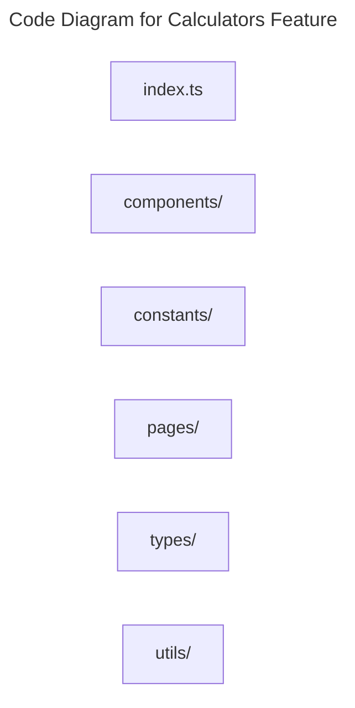

# C4 Code Level: Calculators Feature

## Overview

- **Name**: Calculators Feature
- **Description**: Frontend modules for the platform's marketing and finance calculators.
- **Location**: [src/features/calculators](../../../src/features/calculators)
- **Language**: TypeScript
- **Purpose**: Deliver interactive professional calculators for practitioners using the platform.

## Code Elements

### Subdirectories

- [src/features/calculators/components](./c4-code-src-features-calculators-components.md) - Calculators components React component modules.
- [src/features/calculators/constants](./c4-code-src-features-calculators-constants.md) - Constants modules for the TrafficMENA codebase.
- [src/features/calculators/pages](./c4-code-src-features-calculators-pages.md) - Calculators pages route-level page modules.
- [src/features/calculators/types](./c4-code-src-features-calculators-types.md) - Calculators types TypeScript type definitions.
- [src/features/calculators/utils](./c4-code-src-features-calculators-utils.md) - Calculators utils utility helpers.

### Functions/Methods

- No direct top-level functions or methods are defined in files at this directory level.

### Classes/Modules

- `index.ts`
  - Description: Entry-point module that re-exports or wires together sibling modules.
  - Location: [src/features/calculators/index.ts](../../../src/features/calculators/index.ts)
  - Contains: module-level configuration or data
  - Dependencies: None
- `analytics-shared.ts`
  - Description: Shared analytics types and helpers for calculator-usage events; feeds `src/lib/analytics/events.ts`.
  - Location: [src/features/calculators/analytics-shared.ts](../../../src/features/calculators/analytics-shared.ts)
- `analytics.tsx`
  - Description: React-aware analytics helpers for calculator pages/components — tracks view, interaction, and result events.
  - Location: [src/features/calculators/analytics.tsx](../../../src/features/calculators/analytics.tsx)

## Dependencies

### Internal Dependencies

- src/features/calculators/components (child module boundary)
- src/features/calculators/constants (child module boundary)
- src/features/calculators/pages (child module boundary)
- src/features/calculators/types (child module boundary)
- src/features/calculators/utils (child module boundary)

### External Dependencies

- None captured from direct file imports in this directory.

## Relationships

