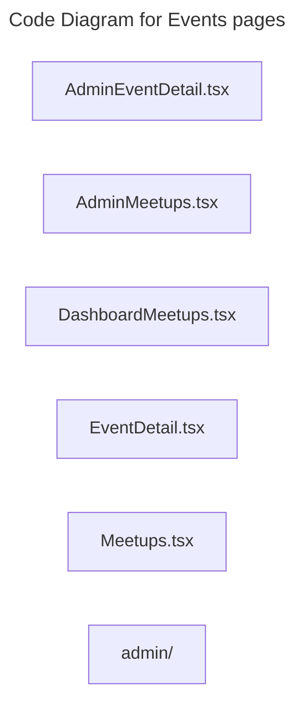

# C4 Code Level: Events pages

## Overview

- **Name**: Events pages
- **Description**: Events pages route-level page modules.
- **Location**: [src/features/events/pages](../../../src/features/events/pages)
- **Language**: TypeScript
- **Purpose**: Compose full-screen events pages experiences that are mounted by the SPA router.

## Code Elements

### Subdirectories

- [src/features/events/pages/admin](./c4-code-src-features-events-pages-admin.md) - Pages admin route-level page modules.

### Functions/Methods

- `SanitizedHtml({ className, html }: SanitizedHtmlProps): unknown`
  - Description: Implements sanitized html behavior for this module.
  - Location: [src/features/events/pages/AdminEventDetail.tsx](../../../src/features/events/pages/AdminEventDetail.tsx) (line 20)
  - Dependencies: ../components/CancellationRequestsList, ../components/EventAttendeesList, ../hooks/useEvents, @/shared/components/DataLoader, @/shared/components/layout/AppLayout, @/shared/components/ui/badge, @/shared/components/ui/button, @/shared/components/ui/card, @/shared/hooks/custom/use-toast, @/shared/utils/dateUtils, dompurify, lucide-react, react-router-dom
- `AdminEventDetail(): unknown`
  - Description: Implements admin event detail behavior for this module.
  - Location: [src/features/events/pages/AdminEventDetail.tsx](../../../src/features/events/pages/AdminEventDetail.tsx) (line 28)
  - Dependencies: ../components/CancellationRequestsList, ../components/EventAttendeesList, ../hooks/useEvents, @/shared/components/DataLoader, @/shared/components/layout/AppLayout, @/shared/components/ui/badge, @/shared/components/ui/button, @/shared/components/ui/card, @/shared/hooks/custom/use-toast, @/shared/utils/dateUtils, dompurify, lucide-react, react-router-dom
- `AdminMeetups(): unknown`
  - Description: Implements admin meetups behavior for this module.
  - Location: [src/features/events/pages/AdminMeetups.tsx](../../../src/features/events/pages/AdminMeetups.tsx) (line 18)
  - Dependencies: ../hooks/useEvents, @/features/tracks/hooks/useTracks, @/shared/components/DataLoader, @/shared/components/layout/AppLayout, @/shared/components/ui/badge, @/shared/components/ui/button, @/shared/components/ui/card, @/shared/components/ui/tabs, @/shared/hooks/custom/use-toast, @/shared/hooks/custom/useRolePermissions, lucide-react, react, react-router-dom
- `DashboardMeetups(): unknown`
  - Description: Implements dashboard meetups behavior for this module.
  - Location: [src/features/events/pages/DashboardMeetups.tsx](../../../src/features/events/pages/DashboardMeetups.tsx) (line 14)
  - Dependencies: ../components/EventCard, ../hooks/useEventBooking, @/features/tracks/components/PublicTrackCard, @/features/tracks/hooks/useTracks, @/shared/components/DataLoader, @/shared/components/layout/AppLayout, @/shared/components/layout/ProtectedRoute, @/shared/components/ui/button, @/shared/context/AuthContext, lucide-react, react, react-router-dom
- `validateMeetingUrl(url: string): unknown`
  - Description: Validates meeting url against module rules.
  - Location: [src/features/events/pages/EventDetail.tsx](../../../src/features/events/pages/EventDetail.tsx) (line 52)
  - Dependencies: ../components/CancellationConfirmDialog, ../hooks/useEventBooking, ../hooks/useEvents, @/app/hooks/usePayments, @/shared/components/DataLoader, @/shared/components/layout/Layout, @/shared/components/payment, @/shared/components/ui/badge, @/shared/components/ui/button, @/shared/context/AuthContext, @/shared/hooks/custom/useIsManager, @/shared/hooks/custom/useLocationVisibility, @/shared/utils/dateUtils, @/shared/utils/eventRedirectUtils, @tanstack/react-query, dompurify, lucide-react, react, react-router-dom
- `SanitizedDescription({ className, html }: SanitizedHtmlProps): unknown`
  - Description: Implements sanitized description behavior for this module.
  - Location: [src/features/events/pages/EventDetail.tsx](../../../src/features/events/pages/EventDetail.tsx) (line 82)
  - Dependencies: ../components/CancellationConfirmDialog, ../hooks/useEventBooking, ../hooks/useEvents, @/app/hooks/usePayments, @/shared/components/DataLoader, @/shared/components/layout/Layout, @/shared/components/payment, @/shared/components/ui/badge, @/shared/components/ui/button, @/shared/context/AuthContext, @/shared/hooks/custom/useIsManager, @/shared/hooks/custom/useLocationVisibility, @/shared/utils/dateUtils, @/shared/utils/eventRedirectUtils, @tanstack/react-query, dompurify, lucide-react, react, react-router-dom
- `EventDetail(): unknown`
  - Description: Implements event detail behavior for this module.
  - Location: [src/features/events/pages/EventDetail.tsx](../../../src/features/events/pages/EventDetail.tsx) (line 90)
  - Dependencies: ../components/CancellationConfirmDialog, ../hooks/useEventBooking, ../hooks/useEvents, @/app/hooks/usePayments, @/shared/components/DataLoader, @/shared/components/layout/Layout, @/shared/components/payment, @/shared/components/ui/badge, @/shared/components/ui/button, @/shared/context/AuthContext, @/shared/hooks/custom/useIsManager, @/shared/hooks/custom/useLocationVisibility, @/shared/utils/dateUtils, @/shared/utils/eventRedirectUtils, @tanstack/react-query, dompurify, lucide-react, react, react-router-dom
- `EventsPage(): unknown`
  - Description: Implements events page behavior for this module.
  - Location: [src/features/events/pages/Meetups.tsx](../../../src/features/events/pages/Meetups.tsx) (line 15)
  - Dependencies: ../components/EventCard, ../hooks/useEvents, ../types, @/features/tracks/components/PublicTrackCard, @/features/tracks/hooks/useTracks, @/shared/components/DataLoader, @/shared/components/layout/Layout, @/shared/components/ui/button, @/shared/components/ui/card, lucide-react, react, react-router-dom

### Classes/Modules

- `AdminEventDetail.tsx`
  - Description: Module that implements admin event detail responsibilities for this directory.
  - Location: [src/features/events/pages/AdminEventDetail.tsx](../../../src/features/events/pages/AdminEventDetail.tsx)
  - Contains: 2 function(s)
  - Dependencies: ../components/CancellationRequestsList, ../components/EventAttendeesList, ../hooks/useEvents, @/shared/components/DataLoader, @/shared/components/layout/AppLayout, @/shared/components/ui/badge, @/shared/components/ui/button, @/shared/components/ui/card, @/shared/hooks/custom/use-toast, @/shared/utils/dateUtils, dompurify, lucide-react, react-router-dom
- `AdminMeetups.tsx`
  - Description: Module that implements admin meetups responsibilities for this directory.
  - Location: [src/features/events/pages/AdminMeetups.tsx](../../../src/features/events/pages/AdminMeetups.tsx)
  - Contains: 1 function(s)
  - Dependencies: ../hooks/useEvents, @/features/tracks/hooks/useTracks, @/shared/components/DataLoader, @/shared/components/layout/AppLayout, @/shared/components/ui/badge, @/shared/components/ui/button, @/shared/components/ui/card, @/shared/components/ui/tabs, @/shared/hooks/custom/use-toast, @/shared/hooks/custom/useRolePermissions, lucide-react, react, react-router-dom
- `DashboardMeetups.tsx`
  - Description: Module that implements dashboard meetups responsibilities for this directory.
  - Location: [src/features/events/pages/DashboardMeetups.tsx](../../../src/features/events/pages/DashboardMeetups.tsx)
  - Contains: 1 function(s)
  - Dependencies: ../components/EventCard, ../hooks/useEventBooking, @/features/tracks/components/PublicTrackCard, @/features/tracks/hooks/useTracks, @/shared/components/DataLoader, @/shared/components/layout/AppLayout, @/shared/components/layout/ProtectedRoute, @/shared/components/ui/button, @/shared/context/AuthContext, lucide-react, react, react-router-dom
- `EventDetail.tsx`
  - Description: Module that implements event detail responsibilities for this directory.
  - Location: [src/features/events/pages/EventDetail.tsx](../../../src/features/events/pages/EventDetail.tsx)
  - Contains: 3 function(s)
  - Dependencies: ../components/CancellationConfirmDialog, ../hooks/useEventBooking, ../hooks/useEvents, @/app/hooks/usePayments, @/shared/components/DataLoader, @/shared/components/layout/Layout, @/shared/components/payment, @/shared/components/ui/badge, @/shared/components/ui/button, @/shared/context/AuthContext, @/shared/hooks/custom/useIsManager, @/shared/hooks/custom/useLocationVisibility, @/shared/utils/dateUtils, @/shared/utils/eventRedirectUtils, @tanstack/react-query, dompurify, lucide-react, react, react-router-dom
- `Meetups.tsx`
  - Description: Module that implements meetups responsibilities for this directory.
  - Location: [src/features/events/pages/Meetups.tsx](../../../src/features/events/pages/Meetups.tsx)
  - Contains: 1 function(s)
  - Dependencies: ../components/EventCard, ../hooks/useEvents, ../types, @/features/tracks/components/PublicTrackCard, @/features/tracks/hooks/useTracks, @/shared/components/DataLoader, @/shared/components/layout/Layout, @/shared/components/ui/button, @/shared/components/ui/card, lucide-react, react, react-router-dom

## Dependencies

### Internal Dependencies

- ../components/CancellationConfirmDialog
- ../components/CancellationRequestsList
- ../components/EventAttendeesList
- ../components/EventCard
- ../hooks/useEventBooking
- ../hooks/useEvents
- ../types
- @/app/hooks/usePayments
- @/features/tracks/components/PublicTrackCard
- @/features/tracks/hooks/useTracks
- @/shared/components/DataLoader
- @/shared/components/layout/AppLayout
- @/shared/components/layout/Layout
- @/shared/components/layout/ProtectedRoute
- @/shared/components/payment
- @/shared/components/ui/badge
- @/shared/components/ui/button
- @/shared/components/ui/card
- @/shared/components/ui/tabs
- @/shared/context/AuthContext
- @/shared/hooks/custom/use-toast
- @/shared/hooks/custom/useIsManager
- @/shared/hooks/custom/useLocationVisibility
- @/shared/hooks/custom/useRolePermissions
- @/shared/utils/dateUtils
- @/shared/utils/eventRedirectUtils
- src/features/events/pages/admin (child module boundary)

### External Dependencies

- @tanstack/react-query
- dompurify
- lucide-react
- react
- react-router-dom

## Relationships

