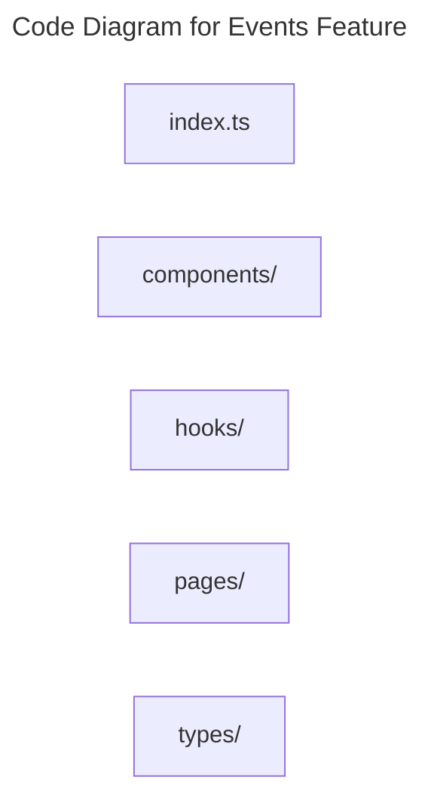

# C4 Code Level: Events Feature

## Overview

- **Name**: Events Feature
- **Description**: Frontend feature modules for browsing, managing, and interacting with events and meetups.
- **Location**: [src/features/events](../../../src/features/events)
- **Language**: TypeScript
- **Purpose**: Implement the event discovery, registration, and admin event management experience.

## Code Elements

### Subdirectories

- [src/features/events/components](./c4-code-src-features-events-components.md) - Events components React component modules.
- [src/features/events/hooks](./c4-code-src-features-events-hooks.md) - Events hooks React hooks and stateful helper logic.
- [src/features/events/pages](./c4-code-src-features-events-pages.md) - Events pages route-level page modules.
- [src/features/events/types](./c4-code-src-features-events-types.md) - Events types TypeScript type definitions.

### Functions/Methods

- No direct top-level functions or methods are defined in files at this directory level.

### Classes/Modules

- `index.ts`
  - Description: Entry-point module that re-exports or wires together sibling modules.
  - Location: [src/features/events/index.ts](../../../src/features/events/index.ts)
  - Contains: module-level configuration or data
  - Dependencies: None

## Dependencies

### Internal Dependencies

- src/features/events/components (child module boundary)
- src/features/events/hooks (child module boundary)
- src/features/events/pages (child module boundary)
- src/features/events/types (child module boundary)

### External Dependencies

- None captured from direct file imports in this directory.

## Relationships

