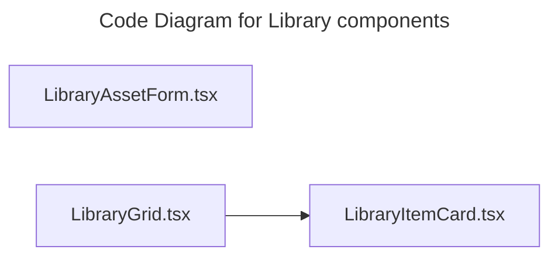

# C4 Code Level: Library components

## Overview

- **Name**: Library components
- **Description**: Library components React component modules.
- **Location**: [src/features/library/components](../../../src/features/library/components)
- **Language**: TypeScript
- **Purpose**: Render library components user interface elements for the TrafficMENA frontend.

## Code Elements

### Functions/Methods

- `normaliseUrl(value?: string | null): unknown`
  - Description: Implements normalise url behavior for this module.
  - Location: [src/features/library/components/LibraryAssetForm.tsx](../../../src/features/library/components/LibraryAssetForm.tsx) (line 100)
  - Dependencies: @/app/api/library, @/app/api/uploads, @/features/events/hooks/useEvents, @/shared/components/LazyEditor, @/shared/components/ui/button, @/shared/components/ui/card, @/shared/components/ui/form, @/shared/components/ui/input, @/shared/components/ui/label, @/shared/components/ui/select, @/shared/components/ui/switch, @/shared/components/ui/tooltip, @hookform/resolvers/zod, dompurify, lucide-react, react, react-hook-form, zod
- `LibraryAssetForm({
  asset,
  onSubmit,
  submitLabel = 'Save asset',
  isSubmitting,
  onDelete,
  isDeleting,
  canDelete = true,
}: LibraryAssetFormProps): unknown`
  - Description: Implements library asset form behavior for this module.
  - Location: [src/features/library/components/LibraryAssetForm.tsx](../../../src/features/library/components/LibraryAssetForm.tsx) (line 106)
  - Dependencies: @/app/api/library, @/app/api/uploads, @/features/events/hooks/useEvents, @/shared/components/LazyEditor, @/shared/components/ui/button, @/shared/components/ui/card, @/shared/components/ui/form, @/shared/components/ui/input, @/shared/components/ui/label, @/shared/components/ui/select, @/shared/components/ui/switch, @/shared/components/ui/tooltip, @hookform/resolvers/zod, dompurify, lucide-react, react, react-hook-form, zod
- `LibraryGrid({
  items,
  onEdit,
  onDelete,
  onAddNew,
  canManage = false,
  canDelete = false,
}): unknown`
  - Description: Implements library grid behavior for this module.
  - Location: [src/features/library/components/LibraryGrid.tsx](../../../src/features/library/components/LibraryGrid.tsx) (line 34)
  - Dependencies: ./LibraryItemCard, @/shared/components/ui/button, lucide-react, react
- `LibraryItemCard({
  item,
  onEdit,
  onDelete,
  canManage = false,
  canDelete = false,
}): unknown`
  - Description: Implements library item card behavior for this module.
  - Location: [src/features/library/components/LibraryItemCard.tsx](../../../src/features/library/components/LibraryItemCard.tsx) (line 52)
  - Dependencies: @/shared/components/ui/badge, @/shared/components/ui/button, @/shared/components/ui/card, dompurify, lucide-react, react, react-router-dom

### Classes/Modules

- `LibraryAssetForm.tsx`
  - Description: Module that implements library asset form responsibilities for this directory.
  - Location: [src/features/library/components/LibraryAssetForm.tsx](../../../src/features/library/components/LibraryAssetForm.tsx)
  - Contains: 2 function(s)
  - Dependencies: @/app/api/library, @/app/api/uploads, @/features/events/hooks/useEvents, @/shared/components/LazyEditor, @/shared/components/ui/button, @/shared/components/ui/card, @/shared/components/ui/form, @/shared/components/ui/input, @/shared/components/ui/label, @/shared/components/ui/select, @/shared/components/ui/switch, @/shared/components/ui/tooltip, @hookform/resolvers/zod, dompurify, lucide-react, react, react-hook-form, zod
- `LibraryGrid.tsx`
  - Description: Module that implements library grid responsibilities for this directory.
  - Location: [src/features/library/components/LibraryGrid.tsx](../../../src/features/library/components/LibraryGrid.tsx)
  - Contains: 1 function(s)
  - Dependencies: ./LibraryItemCard, @/shared/components/ui/button, lucide-react, react
- `LibraryItemCard.tsx`
  - Description: Module that implements library item card responsibilities for this directory.
  - Location: [src/features/library/components/LibraryItemCard.tsx](../../../src/features/library/components/LibraryItemCard.tsx)
  - Contains: 1 function(s)
  - Dependencies: @/shared/components/ui/badge, @/shared/components/ui/button, @/shared/components/ui/card, dompurify, lucide-react, react, react-router-dom

## Dependencies

### Internal Dependencies

- ./LibraryItemCard
- @/app/api/library
- @/app/api/uploads
- @/features/events/hooks/useEvents
- @/shared/components/LazyEditor
- @/shared/components/ui/badge
- @/shared/components/ui/button
- @/shared/components/ui/card
- @/shared/components/ui/form
- @/shared/components/ui/input
- @/shared/components/ui/label
- @/shared/components/ui/select
- @/shared/components/ui/switch
- @/shared/components/ui/tooltip

### External Dependencies

- @hookform/resolvers/zod
- dompurify
- lucide-react
- react
- react-hook-form
- react-router-dom
- zod

## Relationships

