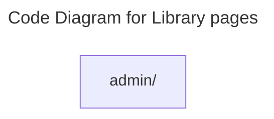

# C4 Code Level: Library pages

## Overview

- **Name**: Library pages
- **Description**: Library pages route-level page modules.
- **Location**: [src/features/library/pages](../../../src/features/library/pages)
- **Language**: Directory aggregator (no direct source files)
- **Purpose**: Compose full-screen library pages experiences that are mounted by the SPA router.

## Code Elements

### Subdirectories

- [src/features/library/pages/admin](./c4-code-src-features-library-pages-admin.md) - Pages admin route-level page modules.

### Functions/Methods

- No direct top-level functions or methods are defined in files at this directory level.

### Classes/Modules

- This directory is primarily an organizational boundary for child directories rather than a direct source module location.

## Dependencies

### Internal Dependencies

- src/features/library/pages/admin (child module boundary)

### External Dependencies

- None captured from direct file imports in this directory.

## Relationships

