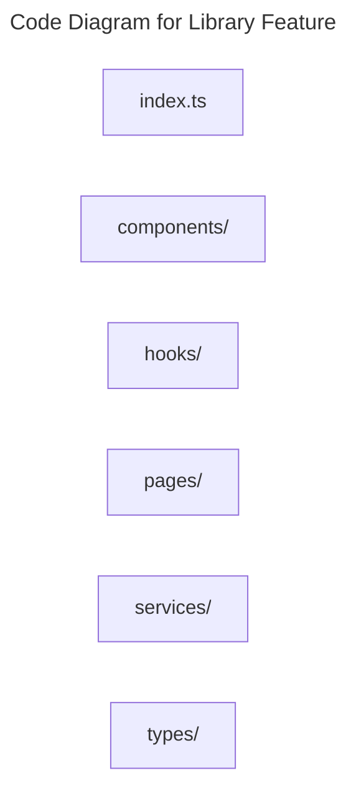

# C4 Code Level: Library Feature

## Overview

- **Name**: Library Feature
- **Description**: Frontend feature modules for the premium content library and asset detail experiences.
- **Location**: [src/features/library](../../../src/features/library)
- **Language**: TypeScript
- **Purpose**: Support browsing, gating, and consuming educational assets.

## Code Elements

### Subdirectories

- [src/features/library/components](./c4-code-src-features-library-components.md) - Library components React component modules.
- [src/features/library/hooks](./c4-code-src-features-library-hooks.md) - Library hooks React hooks and stateful helper logic.
- [src/features/library/pages](./c4-code-src-features-library-pages.md) - Library pages route-level page modules.
- [src/features/library/services](./c4-code-src-features-library-services.md) - Library services service modules and external provider integrations.
- [src/features/library/types](./c4-code-src-features-library-types.md) - Library types TypeScript type definitions.

### Functions/Methods

- No direct top-level functions or methods are defined in files at this directory level.

### Classes/Modules

- `index.ts`
  - Description: Entry-point module that re-exports or wires together sibling modules.
  - Location: [src/features/library/index.ts](../../../src/features/library/index.ts)
  - Contains: module-level configuration or data
  - Dependencies: None

## Dependencies

### Internal Dependencies

- src/features/library/components (child module boundary)
- src/features/library/hooks (child module boundary)
- src/features/library/pages (child module boundary)
- src/features/library/services (child module boundary)
- src/features/library/types (child module boundary)

### External Dependencies

- None captured from direct file imports in this directory.

## Relationships

