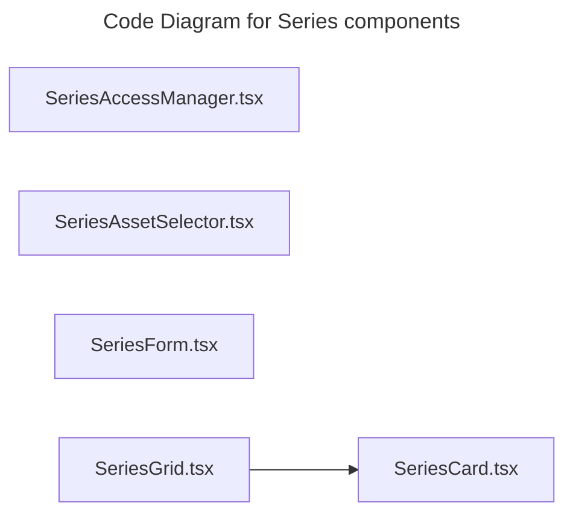

# C4 Code Level: Series components

## Overview

- **Name**: Series components
- **Description**: Series components React component modules.
- **Location**: [src/features/series/components](../../../src/features/series/components)
- **Language**: TypeScript
- **Purpose**: Render series components user interface elements for the TrafficMENA frontend.

## Code Elements

### Functions/Methods

- `SeriesAccessManager({ seriesId, seriesTitle }: SeriesAccessManagerProps): unknown`
  - Description: Implements series access manager behavior for this module.
  - Location: [src/features/series/components/SeriesAccessManager.tsx](../../../src/features/series/components/SeriesAccessManager.tsx) (line 50)
  - Dependencies: @/app/api/client, @/app/api/users, @/features/series/hooks/useSeriesGrants, @/shared/components/ui/badge, @/shared/components/ui/button, @/shared/components/ui/card, @/shared/components/ui/checkbox, @/shared/components/ui/dialog, @/shared/components/ui/input, @/shared/components/ui/label, @/shared/components/ui/table, @/shared/hooks/custom/use-toast, @tanstack/react-query, lucide-react, react
- `getFileTypeIcon(fileType: string): unknown`
  - Description: Returns file type icon derived from current inputs or state.
  - Location: [src/features/series/components/SeriesAssetSelector.tsx](../../../src/features/series/components/SeriesAssetSelector.tsx) (line 25)
  - Dependencies: @/features/library/hooks/useLibrary, @/shared/components/ui/button, @/shared/components/ui/dialog, @/shared/components/ui/input, @/shared/components/ui/scroll-area, lucide-react, react
- `getFileTypeBadgeColor(fileType: string): unknown`
  - Description: Returns file type badge color derived from current inputs or state.
  - Location: [src/features/series/components/SeriesAssetSelector.tsx](../../../src/features/series/components/SeriesAssetSelector.tsx) (line 36)
  - Dependencies: @/features/library/hooks/useLibrary, @/shared/components/ui/button, @/shared/components/ui/dialog, @/shared/components/ui/input, @/shared/components/ui/scroll-area, lucide-react, react
- `SeriesAssetSelector({
  open,
  onOpenChange,
  existingAssetIds,
  onSelect,
  isLoading = false,
}): unknown`
  - Description: Implements series asset selector behavior for this module.
  - Location: [src/features/series/components/SeriesAssetSelector.tsx](../../../src/features/series/components/SeriesAssetSelector.tsx) (line 47)
  - Dependencies: @/features/library/hooks/useLibrary, @/shared/components/ui/button, @/shared/components/ui/dialog, @/shared/components/ui/input, @/shared/components/ui/scroll-area, lucide-react, react
- `SeriesCard({
  series,
  onEdit,
  onDelete,
  canManage = false,
  canDelete = false,
  basePath = '/dashboard/library/series',
}): unknown`
  - Description: Implements series card behavior for this module.
  - Location: [src/features/series/components/SeriesCard.tsx](../../../src/features/series/components/SeriesCard.tsx) (line 24)
  - Dependencies: ../types, @/shared/components/ui/button, @/shared/components/ui/card, dompurify, lucide-react, react, react-router-dom
- `SeriesForm({ series, onSubmit, onCancel, isLoading = false }: SeriesFormProps): unknown`
  - Description: Implements series form behavior for this module.
  - Location: [src/features/series/components/SeriesForm.tsx](../../../src/features/series/components/SeriesForm.tsx) (line 39)
  - Dependencies: ../types, @/app/api/uploads, @/shared/components/LazyEditor, @/shared/components/ui/button, @/shared/components/ui/form, @/shared/components/ui/input, @/shared/components/ui/switch, @hookform/resolvers/zod, lucide-react, react, react-hook-form, zod

### Classes/Modules

- `SeriesAccessManager.tsx`
  - Description: Module that implements series access manager responsibilities for this directory.
  - Location: [src/features/series/components/SeriesAccessManager.tsx](../../../src/features/series/components/SeriesAccessManager.tsx)
  - Contains: 1 function(s)
  - Dependencies: @/app/api/client, @/app/api/users, @/features/series/hooks/useSeriesGrants, @/shared/components/ui/badge, @/shared/components/ui/button, @/shared/components/ui/card, @/shared/components/ui/checkbox, @/shared/components/ui/dialog, @/shared/components/ui/input, @/shared/components/ui/label, @/shared/components/ui/table, @/shared/hooks/custom/use-toast, @tanstack/react-query, lucide-react, react
- `SeriesAssetSelector.tsx`
  - Description: Module that implements series asset selector responsibilities for this directory.
  - Location: [src/features/series/components/SeriesAssetSelector.tsx](../../../src/features/series/components/SeriesAssetSelector.tsx)
  - Contains: 3 function(s)
  - Dependencies: @/features/library/hooks/useLibrary, @/shared/components/ui/button, @/shared/components/ui/dialog, @/shared/components/ui/input, @/shared/components/ui/scroll-area, lucide-react, react
- `SeriesCard.tsx`
  - Description: Module that implements series card responsibilities for this directory.
  - Location: [src/features/series/components/SeriesCard.tsx](../../../src/features/series/components/SeriesCard.tsx)
  - Contains: 1 function(s)
  - Dependencies: ../types, @/shared/components/ui/button, @/shared/components/ui/card, dompurify, lucide-react, react, react-router-dom
- `SeriesForm.tsx`
  - Description: Module that implements series form responsibilities for this directory.
  - Location: [src/features/series/components/SeriesForm.tsx](../../../src/features/series/components/SeriesForm.tsx)
  - Contains: 1 function(s)
  - Dependencies: ../types, @/app/api/uploads, @/shared/components/LazyEditor, @/shared/components/ui/button, @/shared/components/ui/form, @/shared/components/ui/input, @/shared/components/ui/switch, @hookform/resolvers/zod, lucide-react, react, react-hook-form, zod
- `SeriesGrid.tsx`
  - Description: Module that implements series grid responsibilities for this directory.
  - Location: [src/features/series/components/SeriesGrid.tsx](../../../src/features/series/components/SeriesGrid.tsx)
  - Contains: module-level configuration or data
  - Dependencies: ../types, ./SeriesCard, @/shared/components/ui/button, lucide-react, react

## Dependencies

### Internal Dependencies

- ../types
- ./SeriesCard
- @/app/api/client
- @/app/api/uploads
- @/app/api/users
- @/features/library/hooks/useLibrary
- @/features/series/hooks/useSeriesGrants
- @/shared/components/LazyEditor
- @/shared/components/ui/badge
- @/shared/components/ui/button
- @/shared/components/ui/card
- @/shared/components/ui/checkbox
- @/shared/components/ui/dialog
- @/shared/components/ui/form
- @/shared/components/ui/input
- @/shared/components/ui/label
- @/shared/components/ui/scroll-area
- @/shared/components/ui/switch
- @/shared/components/ui/table
- @/shared/hooks/custom/use-toast

### External Dependencies

- @hookform/resolvers/zod
- @tanstack/react-query
- dompurify
- lucide-react
- react
- react-hook-form
- react-router-dom
- zod

## Relationships

