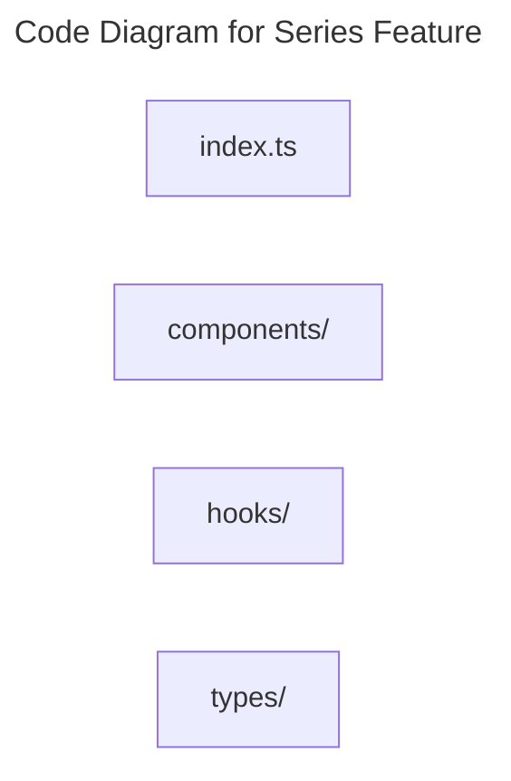

# C4 Code Level: Series Feature

## Overview

- **Name**: Series Feature
- **Description**: Frontend feature modules for curated content series and their presentation.
- **Location**: [src/features/series](../../../src/features/series)
- **Language**: TypeScript
- **Purpose**: Support discovery and dashboard access to grouped library content.

## Code Elements

### Subdirectories

- [src/features/series/components](./c4-code-src-features-series-components.md) - Series components React component modules.
- [src/features/series/hooks](./c4-code-src-features-series-hooks.md) - Series hooks React hooks and stateful helper logic.
- [src/features/series/types](./c4-code-src-features-series-types.md) - Series types TypeScript type definitions.

### Functions/Methods

- No direct top-level functions or methods are defined in files at this directory level.

### Classes/Modules

- `index.ts`
  - Description: Entry-point module that re-exports or wires together sibling modules.
  - Location: [src/features/series/index.ts](../../../src/features/series/index.ts)
  - Contains: module-level configuration or data
  - Dependencies: None

## Dependencies

### Internal Dependencies

- src/features/series/components (child module boundary)
- src/features/series/hooks (child module boundary)
- src/features/series/types (child module boundary)

### External Dependencies

- None captured from direct file imports in this directory.

## Relationships

