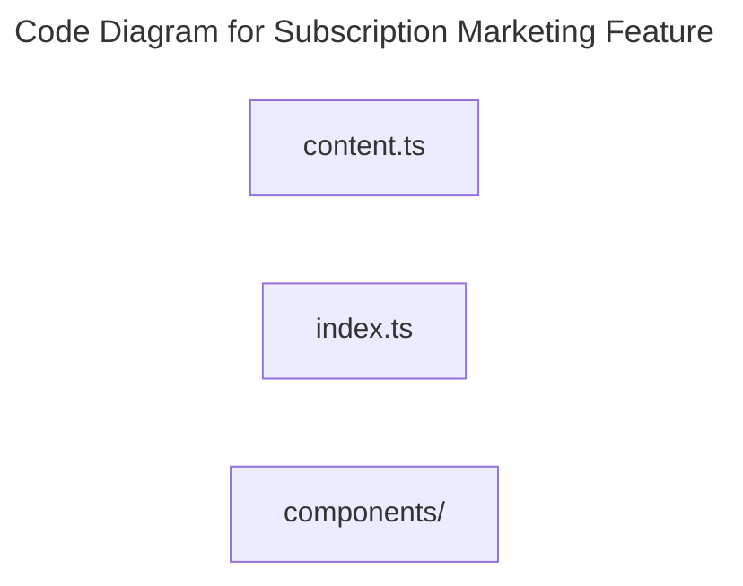

# C4 Code Level: Subscription Marketing Feature

## Overview

- **Name**: Subscription Marketing Feature
- **Description**: Frontend modules for subscription landing pages, membership messaging, and premium conversion UI.
- **Location**: [src/features/subscribe](../../../src/features/subscribe)
- **Language**: TypeScript
- **Purpose**: Explain subscription value and guide visitors into the paid membership flow.

## Code Elements

### Subdirectories

- [src/features/subscribe/components](./c4-code-src-features-subscribe-components.md) - Subscribe components React component modules.

### Functions/Methods

- No direct top-level functions or methods are defined in files at this directory level.

### Classes/Modules

- `content.ts`
  - Description: Module that implements content responsibilities for this directory.
  - Location: [src/features/subscribe/content.ts](../../../src/features/subscribe/content.ts)
  - Contains: module-level configuration or data
  - Dependencies: lucide-react
- `index.ts`
  - Description: Entry-point module that re-exports or wires together sibling modules.
  - Location: [src/features/subscribe/index.ts](../../../src/features/subscribe/index.ts)
  - Contains: module-level configuration or data
  - Dependencies: None

## Dependencies

### Internal Dependencies

- src/features/subscribe/components (child module boundary)

### External Dependencies

- lucide-react

## Relationships

