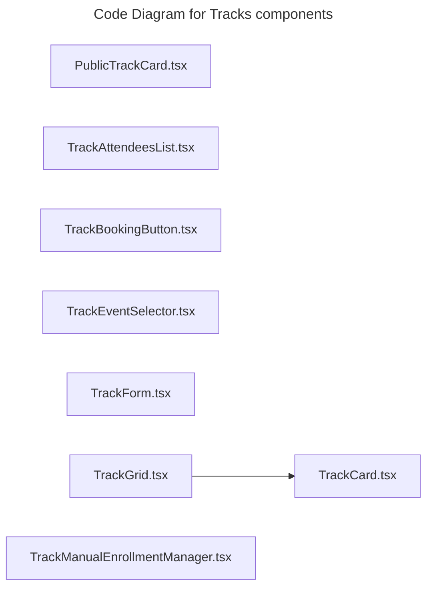

# C4 Code Level: Tracks components

## Overview

- **Name**: Tracks components
- **Description**: Tracks components React component modules.
- **Location**: [src/features/tracks/components](../../../src/features/tracks/components)
- **Language**: TypeScript
- **Purpose**: Render tracks components user interface elements for the TrafficMENA frontend.

## Code Elements

### Functions/Methods

- `PublicTrackCard({ track, to, className, onClick }: PublicTrackCardProps): unknown`
  - Description: Implements public track card behavior for this module.
  - Location: [src/features/tracks/components/PublicTrackCard.tsx](../../../src/features/tracks/components/PublicTrackCard.tsx) (line 16)
  - Dependencies: @/app/api/tracks, @/shared/lib/utils, @/shared/utils/dateUtils, @/shared/utils/inputSanitization, lucide-react, react, react-router-dom
- `TrackAttendeesList({ trackId }: TrackAttendeesListProps): unknown`
  - Description: Implements track attendees list behavior for this module.
  - Location: [src/features/tracks/components/TrackAttendeesList.tsx](../../../src/features/tracks/components/TrackAttendeesList.tsx) (line 21)
  - Dependencies: ../hooks/useTrackAttendees, @/shared/components/ui/button, @/shared/components/ui/card, @/shared/components/ui/input, @/shared/components/ui/table, date-fns, lucide-react, react
- `TrackBookingButton({
  trackId,
  isBooked,
  canBook,
  spotsRemaining,
  className,
  opensAt,
}: TrackBookingButtonProps): unknown`
  - Description: Implements track booking button behavior for this module.
  - Location: [src/features/tracks/components/TrackBookingButton.tsx](../../../src/features/tracks/components/TrackBookingButton.tsx) (line 14)
  - Dependencies: ../hooks/useTrackBooking, @/shared/components/ui/button, lucide-react
- `TrackCard({
  track,
  onEdit,
  onDelete,
  canManage = false,
  canDelete = false,
  basePath = '/dashboard/library/tracks',
}): unknown`
  - Description: Implements track card behavior for this module.
  - Location: [src/features/tracks/components/TrackCard.tsx](../../../src/features/tracks/components/TrackCard.tsx) (line 24)
  - Dependencies: ../types, @/shared/components/ui/button, @/shared/components/ui/card, dompurify, lucide-react, react, react-router-dom
- `TrackEventSelector({
  open,
  onOpenChange,
  existingEventIds,
  onSelect,
  isLoading = false,
}): unknown`
  - Description: Implements track event selector behavior for this module.
  - Location: [src/features/tracks/components/TrackEventSelector.tsx](../../../src/features/tracks/components/TrackEventSelector.tsx) (line 25)
  - Dependencies: @/features/events/hooks/useEvents, @/shared/components/ui/button, @/shared/components/ui/dialog, @/shared/components/ui/input, @/shared/components/ui/scroll-area, lucide-react, react
- `TrackForm({ track, onSubmit, onCancel, isLoading = false }: TrackFormProps): unknown`
  - Description: Implements track form behavior for this module.
  - Location: [src/features/tracks/components/TrackForm.tsx](../../../src/features/tracks/components/TrackForm.tsx) (line 112)
  - Dependencies: ../types, @/app/api/uploads, @/shared/components/LazyEditor, @/shared/components/ui/button, @/shared/components/ui/form, @/shared/components/ui/input, @/shared/components/ui/switch, @hookform/resolvers/zod, lucide-react, react, react-hook-form, zod

### Classes/Modules

- `PublicTrackCard.tsx`
  - Description: Module that implements public track card responsibilities for this directory.
  - Location: [src/features/tracks/components/PublicTrackCard.tsx](../../../src/features/tracks/components/PublicTrackCard.tsx)
  - Contains: 1 function(s)
  - Dependencies: @/app/api/tracks, @/shared/lib/utils, @/shared/utils/dateUtils, @/shared/utils/inputSanitization, lucide-react, react, react-router-dom
- `TrackAttendeesList.tsx`
  - Description: Module that implements track attendees list responsibilities for this directory.
  - Location: [src/features/tracks/components/TrackAttendeesList.tsx](../../../src/features/tracks/components/TrackAttendeesList.tsx)
  - Contains: 1 function(s)
  - Dependencies: ../hooks/useTrackAttendees, @/shared/components/ui/button, @/shared/components/ui/card, @/shared/components/ui/input, @/shared/components/ui/table, date-fns, lucide-react, react
- `TrackBookingButton.tsx`
  - Description: Module that implements track booking button responsibilities for this directory.
  - Location: [src/features/tracks/components/TrackBookingButton.tsx](../../../src/features/tracks/components/TrackBookingButton.tsx)
  - Contains: 1 function(s)
  - Dependencies: ../hooks/useTrackBooking, @/shared/components/ui/button, lucide-react
- `TrackCard.tsx`
  - Description: Module that implements track card responsibilities for this directory.
  - Location: [src/features/tracks/components/TrackCard.tsx](../../../src/features/tracks/components/TrackCard.tsx)
  - Contains: 1 function(s)
  - Dependencies: ../types, @/shared/components/ui/button, @/shared/components/ui/card, dompurify, lucide-react, react, react-router-dom
- `TrackEventSelector.tsx`
  - Description: Module that implements track event selector responsibilities for this directory.
  - Location: [src/features/tracks/components/TrackEventSelector.tsx](../../../src/features/tracks/components/TrackEventSelector.tsx)
  - Contains: 1 function(s)
  - Dependencies: @/features/events/hooks/useEvents, @/shared/components/ui/button, @/shared/components/ui/dialog, @/shared/components/ui/input, @/shared/components/ui/scroll-area, lucide-react, react
- `TrackForm.tsx`
  - Description: Module that implements track form responsibilities for this directory.
  - Location: [src/features/tracks/components/TrackForm.tsx](../../../src/features/tracks/components/TrackForm.tsx)
  - Contains: 1 function(s)
  - Dependencies: ../types, @/app/api/uploads, @/shared/components/LazyEditor, @/shared/components/ui/button, @/shared/components/ui/form, @/shared/components/ui/input, @/shared/components/ui/switch, @hookform/resolvers/zod, lucide-react, react, react-hook-form, zod
- `TrackGrid.tsx`
  - Description: Module that implements track grid responsibilities for this directory.
  - Location: [src/features/tracks/components/TrackGrid.tsx](../../../src/features/tracks/components/TrackGrid.tsx)
  - Contains: module-level configuration or data
  - Dependencies: ../types, ./TrackCard, @/shared/components/ui/button, lucide-react, react

## Dependencies

### Internal Dependencies

- ../hooks/useTrackAttendees
- ../hooks/useTrackBooking
- ../types
- ./TrackCard
- @/app/api/tracks
- @/app/api/uploads
- @/features/events/hooks/useEvents
- @/shared/components/LazyEditor
- @/shared/components/ui/button
- @/shared/components/ui/card
- @/shared/components/ui/dialog
- @/shared/components/ui/form
- @/shared/components/ui/input
- @/shared/components/ui/scroll-area
- @/shared/components/ui/switch
- @/shared/components/ui/table
- @/shared/lib/utils
- @/shared/utils/dateUtils
- @/shared/utils/inputSanitization

### External Dependencies

- @hookform/resolvers/zod
- date-fns
- dompurify
- lucide-react
- react
- react-hook-form
- react-router-dom
- zod

## Relationships

## Admin-Only Additions

- `TrackManualEnrollmentManager.tsx` — Admin console widget rendered on the track detail page. Drives `POST /api/tracks/:id/manual-enrollments` (create) and `POST /api/tracks/:id/enrollments/:userId/revoke` (revoke). Uses `useTrackEnrollmentManagement` for mutations and `manualEnrollmentAmount` utility (`src/features/tracks/utils/manualEnrollmentAmount.ts`) to keep the paid-amount default aligned with the track's list price.

## Analytics Hooks

- `src/features/tracks/trackBookingAnalytics.ts` — Shared builder used by `useTrackBooking` and the track detail/public card analytics callsites to emit consistent `track_booking` / `view_item` dataLayer events for both free auto-bookings and paid booking completions. Feeds into `src/lib/analytics/events.ts`.

