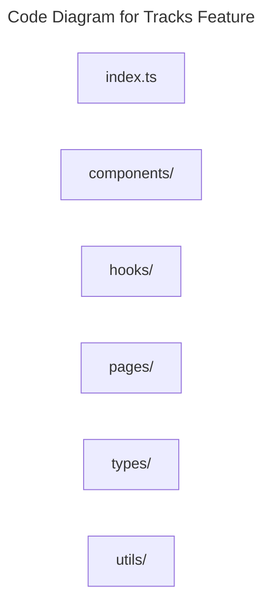

# C4 Code Level: Tracks Feature

## Overview

- **Name**: Tracks Feature
- **Description**: Frontend feature modules for learning tracks and bundled event journeys.
- **Location**: [src/features/tracks](../../../src/features/tracks)
- **Language**: TypeScript
- **Purpose**: Implement public and dashboard track browsing, management, and booking UI.

## Code Elements

### Subdirectories

- [src/features/tracks/components](./c4-code-src-features-tracks-components.md) - Tracks components React component modules.
- [src/features/tracks/hooks](./c4-code-src-features-tracks-hooks.md) - Tracks hooks React hooks and stateful helper logic.
- [src/features/tracks/pages](./c4-code-src-features-tracks-pages.md) - Tracks pages route-level page modules.
- [src/features/tracks/types](./c4-code-src-features-tracks-types.md) - Tracks types TypeScript type definitions.
- [src/features/tracks/utils](./c4-code-src-features-tracks-utils.md) - Tracks utils utility helpers.

### Functions/Methods

- No direct top-level functions or methods are defined in files at this directory level.

### Classes/Modules

- `index.ts`
  - Description: Entry-point module that re-exports or wires together sibling modules.
  - Location: [src/features/tracks/index.ts](../../../src/features/tracks/index.ts)
  - Contains: module-level configuration or data
  - Dependencies: None

## Dependencies

### Internal Dependencies

- src/features/tracks/components (child module boundary)
- src/features/tracks/hooks (child module boundary)
- src/features/tracks/pages (child module boundary)
- src/features/tracks/types (child module boundary)
- src/features/tracks/utils (child module boundary)

### External Dependencies

- None captured from direct file imports in this directory.

## Relationships

