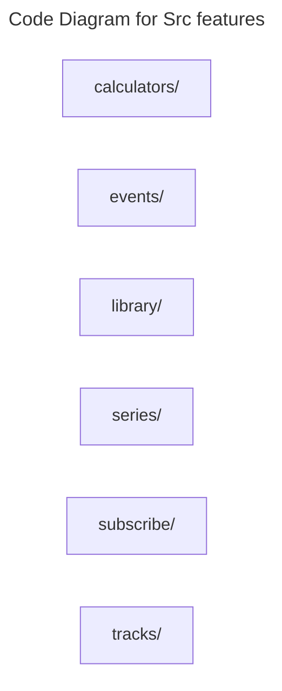

# C4 Code Level: Src features

## Overview

- **Name**: Src features
- **Description**: Src features modules for the TrafficMENA codebase.
- **Location**: [src/features](../../../src/features)
- **Language**: Directory aggregator (no direct source files)
- **Purpose**: Organize the src features responsibilities used by the application.

## Code Elements

### Subdirectories

- [src/features/calculators](./c4-code-src-features-calculators.md) - Frontend modules for the platform's marketing and finance calculators.
- [src/features/events](./c4-code-src-features-events.md) - Frontend feature modules for browsing, managing, and interacting with events and meetups.
- [src/features/library](./c4-code-src-features-library.md) - Frontend feature modules for the premium content library and asset detail experiences.
- [src/features/series](./c4-code-src-features-series.md) - Frontend feature modules for curated content series and their presentation.
- [src/features/subscribe](./c4-code-src-features-subscribe.md) - Frontend modules for subscription landing pages, membership messaging, and premium conversion UI.
- [src/features/tracks](./c4-code-src-features-tracks.md) - Frontend feature modules for learning tracks and bundled event journeys.

### Functions/Methods

- No direct top-level functions or methods are defined in files at this directory level.

### Classes/Modules

- This directory is primarily an organizational boundary for child directories rather than a direct source module location.

## Dependencies

### Internal Dependencies

- src/features/calculators (child module boundary)
- src/features/events (child module boundary)
- src/features/library (child module boundary)
- src/features/series (child module boundary)
- src/features/subscribe (child module boundary)
- src/features/tracks (child module boundary)

### External Dependencies

- None captured from direct file imports in this directory.

## Relationships

