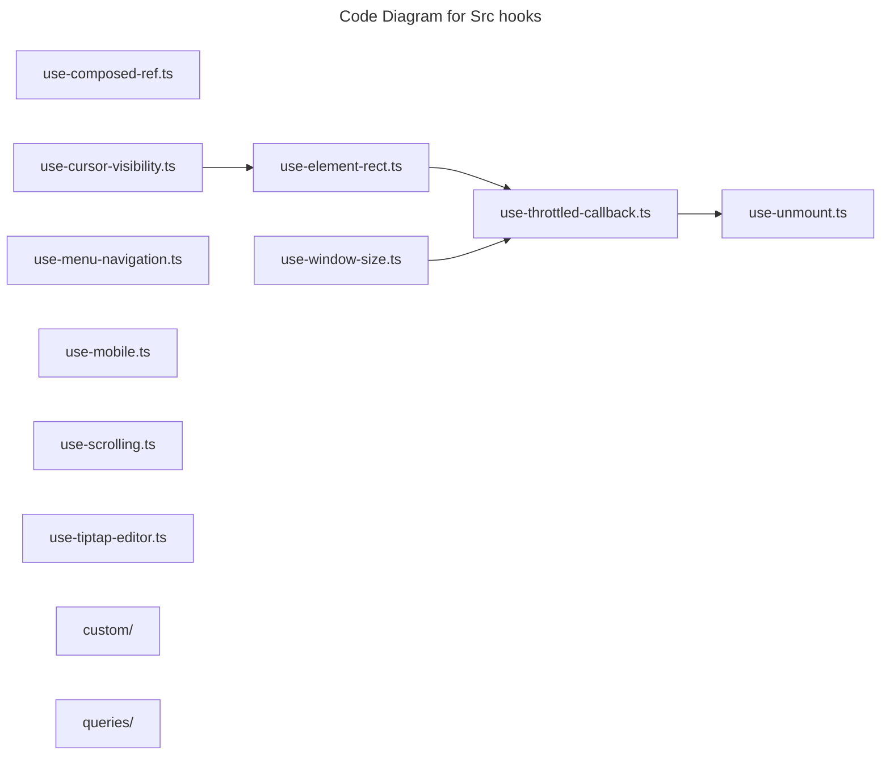

# C4 Code Level: Src hooks

## Overview

- **Name**: Src hooks
- **Description**: Src hooks React hooks and stateful helper logic.
- **Location**: [src/hooks](../../../src/hooks)
- **Language**: TypeScript
- **Purpose**: Share reusable src hooks interaction and data-fetching behavior across components.

## Code Elements

### Subdirectories

- [src/hooks/custom](./c4-code-src-hooks-custom.md) - Hooks custom React hooks and stateful helper logic.
- [src/hooks/queries](./c4-code-src-hooks-queries.md) - Hooks queries React hooks and stateful helper logic.

### Functions/Methods

- `updateRef(ref: NonNullable<UserRef<T>>, value: T | null): unknown`
  - Description: Implements update ref behavior for this module.
  - Location: [src/hooks/use-composed-ref.ts](../../../src/hooks/use-composed-ref.ts) (line 6)
  - Dependencies: react
- `useComposedRef(libRef: React.RefObject<T | null>, userRef: UserRef<T>): unknown`
  - Description: React hook that manages composed ref behavior.
  - Location: [src/hooks/use-composed-ref.ts](../../../src/hooks/use-composed-ref.ts) (line 15)
  - Dependencies: react
- `useCursorVisibility({ editor, overlayHeight = 0 }: CursorVisibilityOptions): unknown`
  - Description: React hook that manages cursor visibility behavior.
  - Location: [src/hooks/use-cursor-visibility.ts](../../../src/hooks/use-cursor-visibility.ts) (line 25)
  - Dependencies: ./use-element-rect, @/hooks/use-window-size, @tiptap/react, react
- `isClientSide(): boolean`
  - Description: Checks whether client side.
  - Location: [src/hooks/use-element-rect.ts](../../../src/hooks/use-element-rect.ts) (line 43)
  - Dependencies: ./use-throttled-callback, react
- `useElementRect({
  element,
  enabled = true,
  throttleMs = 100,
  useResizeObserver = true,
}: ElementRectOptions = {}): RectState`
  - Description: React hook that manages element rect behavior.
  - Location: [src/hooks/use-element-rect.ts](../../../src/hooks/use-element-rect.ts) (line 51)
  - Dependencies: ./use-throttled-callback, react
- `useBodyRect(options: Omit<ElementRectOptions, 'element'> = {}): RectState`
  - Description: React hook that manages body rect behavior.
  - Location: [src/hooks/use-element-rect.ts](../../../src/hooks/use-element-rect.ts) (line 149)
  - Dependencies: ./use-throttled-callback, react
- `useRefRect(ref: React.RefObject<T>, options: Omit<ElementRectOptions, 'element'> = {}): RectState`
  - Description: React hook that manages ref rect behavior.
  - Location: [src/hooks/use-element-rect.ts](../../../src/hooks/use-element-rect.ts) (line 159)
  - Dependencies: ./use-throttled-callback, react
- `useMenuNavigation({
  editor,
  containerRef,
  query,
  items,
  onSelect,
  onClose,
  orientation = 'vertical',
  autoSelectFirstItem = true,
}: MenuNavigationOptions<T>): unknown`
  - Description: React hook that manages menu navigation behavior.
  - Location: [src/hooks/use-menu-navigation.ts](../../../src/hooks/use-menu-navigation.ts) (line 52)
  - Dependencies: @tiptap/react, react
- `useIsMobile(breakpoint = 768): unknown`
  - Description: React hook that manages is mobile behavior.
  - Location: [src/hooks/use-mobile.ts](../../../src/hooks/use-mobile.ts) (line 3)
  - Dependencies: react
- `useScrolling(target?: ScrollTarget, options: UseScrollingOptions = {}): boolean`
  - Description: React hook that manages scrolling behavior.
  - Location: [src/hooks/use-scrolling.ts](../../../src/hooks/use-scrolling.ts) (line 12)
  - Dependencies: react
- `useThrottledCallback(fn: T, wait = 250, dependencies: React.DependencyList = [], options: ThrottleSettings = defaultOptions): {
  (this: ThisParameterType<T>, ...args: Parameters<T>): ReturnType<T>;
  cancel: () => void;
  flush: () => void;
}`
  - Description: React hook that manages throttled callback behavior.
  - Location: [src/hooks/use-throttled-callback.ts](../../../src/hooks/use-throttled-callback.ts) (line 24)
  - Dependencies: ./use-unmount, lodash.throttle, react
- `useTiptapEditor(providedEditor?: Editor | null): {
  editor: Editor | null;
  editorState?: Editor['state'];
  canCommand?: Editor['can'];
}`
  - Description: React hook that manages tiptap editor behavior.
  - Location: [src/hooks/use-tiptap-editor.ts](../../../src/hooks/use-tiptap-editor.ts) (line 16)
  - Dependencies: @tiptap/react, react
- `useUnmount(callback: (...args: Array<any>) => any): unknown`
  - Description: React hook that manages unmount behavior.
  - Location: [src/hooks/use-unmount.ts](../../../src/hooks/use-unmount.ts) (line 9)
  - Dependencies: react
- `useWindowSize(): WindowSizeState`
  - Description: React hook that manages window size behavior.
  - Location: [src/hooks/use-window-size.ts](../../../src/hooks/use-window-size.ts) (line 41)
  - Dependencies: ./use-throttled-callback, react

### Classes/Modules

- `use-composed-ref.ts`
  - Description: Module that implements use composed ref responsibilities for this directory.
  - Location: [src/hooks/use-composed-ref.ts](../../../src/hooks/use-composed-ref.ts)
  - Contains: 2 function(s)
  - Dependencies: react
- `use-cursor-visibility.ts`
  - Description: Module that implements use cursor visibility responsibilities for this directory.
  - Location: [src/hooks/use-cursor-visibility.ts](../../../src/hooks/use-cursor-visibility.ts)
  - Contains: 1 function(s)
  - Dependencies: ./use-element-rect, @/hooks/use-window-size, @tiptap/react, react
- `use-element-rect.ts`
  - Description: Module that implements use element rect responsibilities for this directory.
  - Location: [src/hooks/use-element-rect.ts](../../../src/hooks/use-element-rect.ts)
  - Contains: 4 function(s)
  - Dependencies: ./use-throttled-callback, react
- `use-menu-navigation.ts`
  - Description: Module that implements use menu navigation responsibilities for this directory.
  - Location: [src/hooks/use-menu-navigation.ts](../../../src/hooks/use-menu-navigation.ts)
  - Contains: 1 function(s)
  - Dependencies: @tiptap/react, react
- `use-mobile.ts`
  - Description: Module that implements use mobile responsibilities for this directory.
  - Location: [src/hooks/use-mobile.ts](../../../src/hooks/use-mobile.ts)
  - Contains: 1 function(s)
  - Dependencies: react
- `use-scrolling.ts`
  - Description: Module that implements use scrolling responsibilities for this directory.
  - Location: [src/hooks/use-scrolling.ts](../../../src/hooks/use-scrolling.ts)
  - Contains: 1 function(s)
  - Dependencies: react
- `use-throttled-callback.ts`
  - Description: Module that implements use throttled callback responsibilities for this directory.
  - Location: [src/hooks/use-throttled-callback.ts](../../../src/hooks/use-throttled-callback.ts)
  - Contains: 1 function(s)
  - Dependencies: ./use-unmount, lodash.throttle, react
- `use-tiptap-editor.ts`
  - Description: Module that implements use tiptap editor responsibilities for this directory.
  - Location: [src/hooks/use-tiptap-editor.ts](../../../src/hooks/use-tiptap-editor.ts)
  - Contains: 1 function(s)
  - Dependencies: @tiptap/react, react
- `use-unmount.ts`
  - Description: Module that implements use unmount responsibilities for this directory.
  - Location: [src/hooks/use-unmount.ts](../../../src/hooks/use-unmount.ts)
  - Contains: 1 function(s)
  - Dependencies: react
- `use-window-size.ts`
  - Description: Module that implements use window size responsibilities for this directory.
  - Location: [src/hooks/use-window-size.ts](../../../src/hooks/use-window-size.ts)
  - Contains: 1 function(s)
  - Dependencies: ./use-throttled-callback, react

## Dependencies

### Internal Dependencies

- ./use-element-rect
- ./use-throttled-callback
- ./use-unmount
- @/hooks/use-window-size
- src/hooks/custom (child module boundary)
- src/hooks/queries (child module boundary)

### External Dependencies

- @tiptap/react
- lodash.throttle
- react

## Relationships

