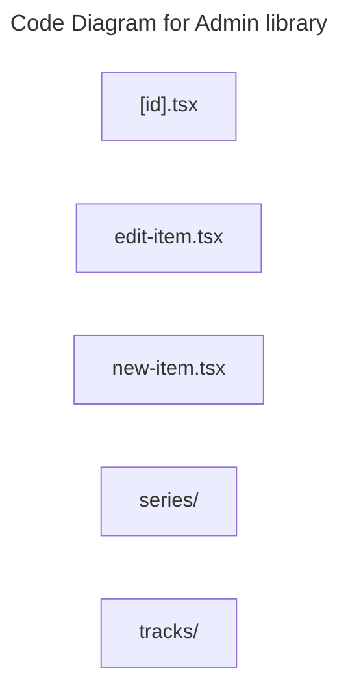

# C4 Code Level: Admin library

## Overview

- **Name**: Admin library
- **Description**: Admin library route-level page modules.
- **Location**: [src/pages/admin/library](../../../src/pages/admin/library)
- **Language**: TypeScript
- **Purpose**: Compose full-screen admin library experiences that are mounted by the SPA router.

## Code Elements

### Subdirectories

- [src/pages/admin/library/series](./c4-code-src-pages-admin-library-series.md) - Library series route-level page modules.
- [src/pages/admin/library/tracks](./c4-code-src-pages-admin-library-tracks.md) - Library tracks route-level page modules.

### Functions/Methods

- `SanitizedDescription({ className, html }: SanitizedHtmlProps): unknown`
  - Description: Implements sanitized description behavior for this module.
  - Location: [src/pages/admin/library/[id].tsx](../../../src/pages/admin/library/[id].tsx) (line 28)
  - Dependencies: @/features/library/hooks/useLibrary, @/shared/components/LoadingSpinner, @/shared/components/VideoEmbed, @/shared/components/layout/AppLayout, @/shared/components/ui/button, @/shared/components/ui/card, dompurify, lucide-react, react, react-router-dom
- `AdminLibraryItemDetail(): unknown`
  - Description: Implements admin library item detail behavior for this module.
  - Location: [src/pages/admin/library/[id].tsx](../../../src/pages/admin/library/[id].tsx) (line 36)
  - Dependencies: @/features/library/hooks/useLibrary, @/shared/components/LoadingSpinner, @/shared/components/VideoEmbed, @/shared/components/layout/AppLayout, @/shared/components/ui/button, @/shared/components/ui/card, dompurify, lucide-react, react, react-router-dom
- `EditLibraryItemPage(): unknown`
  - Description: Implements edit library item page behavior for this module.
  - Location: [src/pages/admin/library/edit-item.tsx](../../../src/pages/admin/library/edit-item.tsx) (line 15)
  - Dependencies: @/features/library/components/LibraryAssetForm, @/features/library/hooks/useLibrary, @/shared/components/DataLoader, @/shared/components/layout/AdminProtectedRoute, @/shared/components/layout/AppLayout, @/shared/components/ui/card, @/shared/hooks/custom/useRolePermissions, lucide-react, react-router-dom
- `NewLibraryItemPage(): unknown`
  - Description: Implements new library item page behavior for this module.
  - Location: [src/pages/admin/library/new-item.tsx](../../../src/pages/admin/library/new-item.tsx) (line 9)
  - Dependencies: @/features/library/components/LibraryAssetForm, @/features/library/hooks/useLibrary, @/shared/components/layout/AdminProtectedRoute, @/shared/components/layout/AppLayout, @/shared/components/ui/card, lucide-react, react-router-dom

### Classes/Modules

- `[id].tsx`
  - Description: Module that implements [id] responsibilities for this directory.
  - Location: [src/pages/admin/library/[id].tsx](../../../src/pages/admin/library/[id].tsx)
  - Contains: 2 function(s)
  - Dependencies: @/features/library/hooks/useLibrary, @/shared/components/LoadingSpinner, @/shared/components/VideoEmbed, @/shared/components/layout/AppLayout, @/shared/components/ui/button, @/shared/components/ui/card, dompurify, lucide-react, react, react-router-dom
- `edit-item.tsx`
  - Description: Module that implements edit item responsibilities for this directory.
  - Location: [src/pages/admin/library/edit-item.tsx](../../../src/pages/admin/library/edit-item.tsx)
  - Contains: 1 function(s)
  - Dependencies: @/features/library/components/LibraryAssetForm, @/features/library/hooks/useLibrary, @/shared/components/DataLoader, @/shared/components/layout/AdminProtectedRoute, @/shared/components/layout/AppLayout, @/shared/components/ui/card, @/shared/hooks/custom/useRolePermissions, lucide-react, react-router-dom
- `new-item.tsx`
  - Description: Module that implements new item responsibilities for this directory.
  - Location: [src/pages/admin/library/new-item.tsx](../../../src/pages/admin/library/new-item.tsx)
  - Contains: 1 function(s)
  - Dependencies: @/features/library/components/LibraryAssetForm, @/features/library/hooks/useLibrary, @/shared/components/layout/AdminProtectedRoute, @/shared/components/layout/AppLayout, @/shared/components/ui/card, lucide-react, react-router-dom

## Dependencies

### Internal Dependencies

- @/features/library/components/LibraryAssetForm
- @/features/library/hooks/useLibrary
- @/shared/components/DataLoader
- @/shared/components/LoadingSpinner
- @/shared/components/VideoEmbed
- @/shared/components/layout/AdminProtectedRoute
- @/shared/components/layout/AppLayout
- @/shared/components/ui/button
- @/shared/components/ui/card
- @/shared/hooks/custom/useRolePermissions
- src/pages/admin/library/series (child module boundary)
- src/pages/admin/library/tracks (child module boundary)

### External Dependencies

- dompurify
- lucide-react
- react
- react-router-dom

## Relationships

