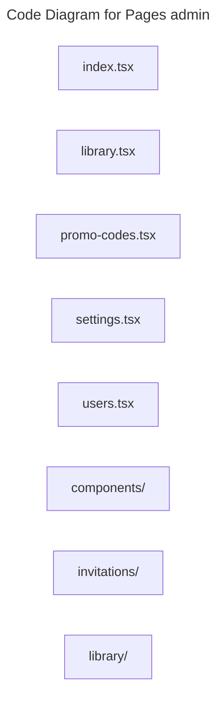

# C4 Code Level: Pages admin

## Overview

- **Name**: Pages admin
- **Description**: Pages admin route-level page modules.
- **Location**: [src/pages/admin](../../../src/pages/admin)
- **Language**: TypeScript
- **Purpose**: Compose full-screen pages admin experiences that are mounted by the SPA router.

## Code Elements

### Subdirectories

- [src/pages/admin/components](./c4-code-src-pages-admin-components.md) - Admin components React component modules.
- [src/pages/admin/invitations](./c4-code-src-pages-admin-invitations.md) - Invitations route-level page modules.
- [src/pages/admin/library](./c4-code-src-pages-admin-library.md) - Admin library route-level page modules.

### Functions/Methods

- `MetricCard({ label, value, icon: Icon, trend }): unknown`
  - Description: Implements metric card behavior for this module.
  - Location: [src/pages/admin/index.tsx](../../../src/pages/admin/index.tsx) (line 34)
  - Dependencies: @/app/hooks/useAdminMetrics, @/app/hooks/useInvitations, @/shared/components/layout/AdminProtectedRoute, @/shared/components/layout/AppLayout, @/shared/components/ui/badge, @/shared/components/ui/button, @/shared/components/ui/card, @/shared/components/ui/tabs, @/shared/hooks/custom/useIsAdmin, @/shared/hooks/custom/useIsManager, lucide-react, react, react-router-dom
- `formatCount(value: number): unknown`
  - Description: Formats count for presentation or transport.
  - Location: [src/pages/admin/index.tsx](../../../src/pages/admin/index.tsx) (line 51)
  - Dependencies: @/app/hooks/useAdminMetrics, @/app/hooks/useInvitations, @/shared/components/layout/AdminProtectedRoute, @/shared/components/layout/AppLayout, @/shared/components/ui/badge, @/shared/components/ui/button, @/shared/components/ui/card, @/shared/components/ui/tabs, @/shared/hooks/custom/useIsAdmin, @/shared/hooks/custom/useIsManager, lucide-react, react, react-router-dom
- `formatRevenue(cents: number): unknown`
  - Description: Formats revenue for presentation or transport.
  - Location: [src/pages/admin/index.tsx](../../../src/pages/admin/index.tsx) (line 52)
  - Dependencies: @/app/hooks/useAdminMetrics, @/app/hooks/useInvitations, @/shared/components/layout/AdminProtectedRoute, @/shared/components/layout/AppLayout, @/shared/components/ui/badge, @/shared/components/ui/button, @/shared/components/ui/card, @/shared/components/ui/tabs, @/shared/hooks/custom/useIsAdmin, @/shared/hooks/custom/useIsManager, lucide-react, react, react-router-dom
- `AdminDashboard(): unknown`
  - Description: Implements admin dashboard behavior for this module.
  - Location: [src/pages/admin/index.tsx](../../../src/pages/admin/index.tsx) (line 54)
  - Dependencies: @/app/hooks/useAdminMetrics, @/app/hooks/useInvitations, @/shared/components/layout/AdminProtectedRoute, @/shared/components/layout/AppLayout, @/shared/components/ui/badge, @/shared/components/ui/button, @/shared/components/ui/card, @/shared/components/ui/tabs, @/shared/hooks/custom/useIsAdmin, @/shared/hooks/custom/useIsManager, lucide-react, react, react-router-dom
- `LibraryManagement(): unknown`
  - Description: Implements library management behavior for this module.
  - Location: [src/pages/admin/library.tsx](../../../src/pages/admin/library.tsx) (line 39)
  - Dependencies: @/app/hooks/useLibraryAssets, @/features/library/components/LibraryGrid, @/features/library/hooks/useLibrary, @/features/series, @/features/series/hooks/useSeries, @/shared/components/LoadingSpinner, @/shared/components/layout/AdminProtectedRoute, @/shared/components/layout/AppLayout, @/shared/components/ui/button, @/shared/components/ui/tabs, @/shared/hooks/custom/use-toast, @/shared/hooks/custom/useRolePermissions, lucide-react, react, react-router-dom
- `formatLocalInput(iso: string): unknown`
  - Description: Formats local input for presentation or transport.
  - Location: [src/pages/admin/promo-codes.tsx](../../../src/pages/admin/promo-codes.tsx) (line 75)
  - Dependencies: @/app/api/events, @/app/api/promoCodes, @/app/api/tracks, @/app/hooks/usePromoCodes, @/shared/components/layout/AdminProtectedRoute, @/shared/components/layout/AppLayout, @/shared/components/ui/badge, @/shared/components/ui/button, @/shared/components/ui/card, @/shared/components/ui/dialog, @/shared/components/ui/input, @/shared/components/ui/label, @/shared/components/ui/select, @/shared/components/ui/table, @/shared/hooks/custom/use-toast, @/shared/hooks/custom/useRolePermissions, @/shared/utils/errorHandling, @hookform/resolvers/zod, @tanstack/react-query, lucide-react, react, react-hook-form, zod
- `formatDateRange(startsAt: string, endsAt: string): unknown`
  - Description: Formats date range for presentation or transport.
  - Location: [src/pages/admin/promo-codes.tsx](../../../src/pages/admin/promo-codes.tsx) (line 84)
  - Dependencies: @/app/api/events, @/app/api/promoCodes, @/app/api/tracks, @/app/hooks/usePromoCodes, @/shared/components/layout/AdminProtectedRoute, @/shared/components/layout/AppLayout, @/shared/components/ui/badge, @/shared/components/ui/button, @/shared/components/ui/card, @/shared/components/ui/dialog, @/shared/components/ui/input, @/shared/components/ui/label, @/shared/components/ui/select, @/shared/components/ui/table, @/shared/hooks/custom/use-toast, @/shared/hooks/custom/useRolePermissions, @/shared/utils/errorHandling, @hookform/resolvers/zod, @tanstack/react-query, lucide-react, react, react-hook-form, zod
- `getStatus(promo: PromoCodeRecord): unknown`
  - Description: Returns status derived from current inputs or state.
  - Location: [src/pages/admin/promo-codes.tsx](../../../src/pages/admin/promo-codes.tsx) (line 94)
  - Dependencies: @/app/api/events, @/app/api/promoCodes, @/app/api/tracks, @/app/hooks/usePromoCodes, @/shared/components/layout/AdminProtectedRoute, @/shared/components/layout/AppLayout, @/shared/components/ui/badge, @/shared/components/ui/button, @/shared/components/ui/card, @/shared/components/ui/dialog, @/shared/components/ui/input, @/shared/components/ui/label, @/shared/components/ui/select, @/shared/components/ui/table, @/shared/hooks/custom/use-toast, @/shared/hooks/custom/useRolePermissions, @/shared/utils/errorHandling, @hookform/resolvers/zod, @tanstack/react-query, lucide-react, react, react-hook-form, zod
- `AdminPromoCodes(): unknown`
  - Description: Implements admin promo codes behavior for this module.
  - Location: [src/pages/admin/promo-codes.tsx](../../../src/pages/admin/promo-codes.tsx) (line 104)
  - Dependencies: @/app/api/events, @/app/api/promoCodes, @/app/api/tracks, @/app/hooks/usePromoCodes, @/shared/components/layout/AdminProtectedRoute, @/shared/components/layout/AppLayout, @/shared/components/ui/badge, @/shared/components/ui/button, @/shared/components/ui/card, @/shared/components/ui/dialog, @/shared/components/ui/input, @/shared/components/ui/label, @/shared/components/ui/select, @/shared/components/ui/table, @/shared/hooks/custom/use-toast, @/shared/hooks/custom/useRolePermissions, @/shared/utils/errorHandling, @hookform/resolvers/zod, @tanstack/react-query, lucide-react, react, react-hook-form, zod
- `AdminSettingsPage(): unknown`
  - Description: Implements admin settings page behavior for this module.
  - Location: [src/pages/admin/settings.tsx](../../../src/pages/admin/settings.tsx) (line 6)
  - Dependencies: ./components/InviteOnlySettingsCard, ./components/SubscriptionSettingsCard, @/shared/components/layout/AppLayout, @/shared/hooks/custom/useIsAdmin
- `AdminUsersPage(): unknown`
  - Description: Implements admin users page behavior for this module.
  - Location: [src/pages/admin/users.tsx](../../../src/pages/admin/users.tsx) (line 75)
  - Dependencies: @/app/api/client, @/app/api/users, @/app/hooks/useCurrentUser, @/app/hooks/useSubscriptions, @/shared/components/layout/AdminProtectedRoute, @/shared/components/layout/AppLayout, @/shared/components/ui/badge, @/shared/components/ui/button, @/shared/components/ui/card, @/shared/components/ui/dialog, @/shared/components/ui/input, @/shared/components/ui/label, @/shared/components/ui/select, @/shared/components/ui/table, @/shared/hooks/custom/use-toast, @/shared/hooks/custom/useRolePermissions, @tanstack/react-query, lucide-react, react
- `AdminUserRow({
  user,
  isOwner,
  isManagerRole,
  bootstrapPromote,
  actorRole,
  currentUserId,
  onChangeRole,
  pendingRoleUserIds,
  pendingDeleteUserId,
  onRequestDelete,
  onManageSubscription,
  pendingSubscriptionUserIds,
}: {
  user: AdminUserRecord;
  isOwner: boolean;
  isManagerRole: boolean;
  bootstrapPromote: boolean;
  actorRole: UserRoleValue | null;
  currentUserId: string | null;
  onChangeRole: (userId: string, role: UserRoleValue) => Promise<void>;
  pendingRoleUserIds: Set<string>;
  pendingDeleteUserId: string | null;
  onRequestDelete: (payload: { user: AdminUserRecord }) => void;
  onManageSubscription: (payload: { user: AdminUserRecord; mode: 'grant' | 'revoke' }) => void;
  pendingSubscriptionUserIds: Set<string>;
}): unknown`
  - Description: Implements admin user row behavior for this module.
  - Location: [src/pages/admin/users.tsx](../../../src/pages/admin/users.tsx) (line 673)
  - Dependencies: @/app/api/client, @/app/api/users, @/app/hooks/useCurrentUser, @/app/hooks/useSubscriptions, @/shared/components/layout/AdminProtectedRoute, @/shared/components/layout/AppLayout, @/shared/components/ui/badge, @/shared/components/ui/button, @/shared/components/ui/card, @/shared/components/ui/dialog, @/shared/components/ui/input, @/shared/components/ui/label, @/shared/components/ui/select, @/shared/components/ui/table, @/shared/hooks/custom/use-toast, @/shared/hooks/custom/useRolePermissions, @tanstack/react-query, lucide-react, react

### Classes/Modules

- `index.tsx`
  - Description: Entry-point module that re-exports or wires together sibling modules.
  - Location: [src/pages/admin/index.tsx](../../../src/pages/admin/index.tsx)
  - Contains: 4 function(s)
  - Dependencies: @/app/hooks/useAdminMetrics, @/app/hooks/useInvitations, @/shared/components/layout/AdminProtectedRoute, @/shared/components/layout/AppLayout, @/shared/components/ui/badge, @/shared/components/ui/button, @/shared/components/ui/card, @/shared/components/ui/tabs, @/shared/hooks/custom/useIsAdmin, @/shared/hooks/custom/useIsManager, lucide-react, react, react-router-dom
- `library.tsx`
  - Description: Module that implements library responsibilities for this directory.
  - Location: [src/pages/admin/library.tsx](../../../src/pages/admin/library.tsx)
  - Contains: 1 function(s)
  - Dependencies: @/app/hooks/useLibraryAssets, @/features/library/components/LibraryGrid, @/features/library/hooks/useLibrary, @/features/series, @/features/series/hooks/useSeries, @/shared/components/LoadingSpinner, @/shared/components/layout/AdminProtectedRoute, @/shared/components/layout/AppLayout, @/shared/components/ui/button, @/shared/components/ui/tabs, @/shared/hooks/custom/use-toast, @/shared/hooks/custom/useRolePermissions, lucide-react, react, react-router-dom
- `promo-codes.tsx`
  - Description: Module that implements promo codes responsibilities for this directory.
  - Location: [src/pages/admin/promo-codes.tsx](../../../src/pages/admin/promo-codes.tsx)
  - Contains: 4 function(s)
  - Dependencies: @/app/api/events, @/app/api/promoCodes, @/app/api/tracks, @/app/hooks/usePromoCodes, @/shared/components/layout/AdminProtectedRoute, @/shared/components/layout/AppLayout, @/shared/components/ui/badge, @/shared/components/ui/button, @/shared/components/ui/card, @/shared/components/ui/dialog, @/shared/components/ui/input, @/shared/components/ui/label, @/shared/components/ui/select, @/shared/components/ui/table, @/shared/hooks/custom/use-toast, @/shared/hooks/custom/useRolePermissions, @/shared/utils/errorHandling, @hookform/resolvers/zod, @tanstack/react-query, lucide-react, react, react-hook-form, zod
- `settings.tsx`
  - Description: Module that implements settings responsibilities for this directory.
  - Location: [src/pages/admin/settings.tsx](../../../src/pages/admin/settings.tsx)
  - Contains: 1 function(s)
  - Dependencies: ./components/InviteOnlySettingsCard, ./components/SubscriptionSettingsCard, @/shared/components/layout/AppLayout, @/shared/hooks/custom/useIsAdmin
- `users.tsx`
  - Description: Module that implements users responsibilities for this directory.
  - Location: [src/pages/admin/users.tsx](../../../src/pages/admin/users.tsx)
  - Contains: 2 function(s)
  - Dependencies: @/app/api/client, @/app/api/users, @/app/hooks/useCurrentUser, @/app/hooks/useSubscriptions, @/shared/components/layout/AdminProtectedRoute, @/shared/components/layout/AppLayout, @/shared/components/ui/badge, @/shared/components/ui/button, @/shared/components/ui/card, @/shared/components/ui/dialog, @/shared/components/ui/input, @/shared/components/ui/label, @/shared/components/ui/select, @/shared/components/ui/table, @/shared/hooks/custom/use-toast, @/shared/hooks/custom/useRolePermissions, @tanstack/react-query, lucide-react, react

## Dependencies

### Internal Dependencies

- ./components/InviteOnlySettingsCard
- ./components/SubscriptionSettingsCard
- @/app/api/client
- @/app/api/events
- @/app/api/promoCodes
- @/app/api/tracks
- @/app/api/users
- @/app/hooks/useAdminMetrics
- @/app/hooks/useCurrentUser
- @/app/hooks/useInvitations
- @/app/hooks/useLibraryAssets
- @/app/hooks/usePromoCodes
- @/app/hooks/useSubscriptions
- @/features/library/components/LibraryGrid
- @/features/library/hooks/useLibrary
- @/features/series
- @/features/series/hooks/useSeries
- @/shared/components/LoadingSpinner
- @/shared/components/layout/AdminProtectedRoute
- @/shared/components/layout/AppLayout
- @/shared/components/ui/badge
- @/shared/components/ui/button
- @/shared/components/ui/card
- @/shared/components/ui/dialog
- @/shared/components/ui/input
- @/shared/components/ui/label
- @/shared/components/ui/select
- @/shared/components/ui/table
- @/shared/components/ui/tabs
- @/shared/hooks/custom/use-toast
- @/shared/hooks/custom/useIsAdmin
- @/shared/hooks/custom/useIsManager
- @/shared/hooks/custom/useRolePermissions
- @/shared/utils/errorHandling
- src/pages/admin/components (child module boundary)
- src/pages/admin/invitations (child module boundary)
- src/pages/admin/library (child module boundary)

### External Dependencies

- @hookform/resolvers/zod
- @tanstack/react-query
- lucide-react
- react
- react-hook-form
- react-router-dom
- zod

## Relationships

