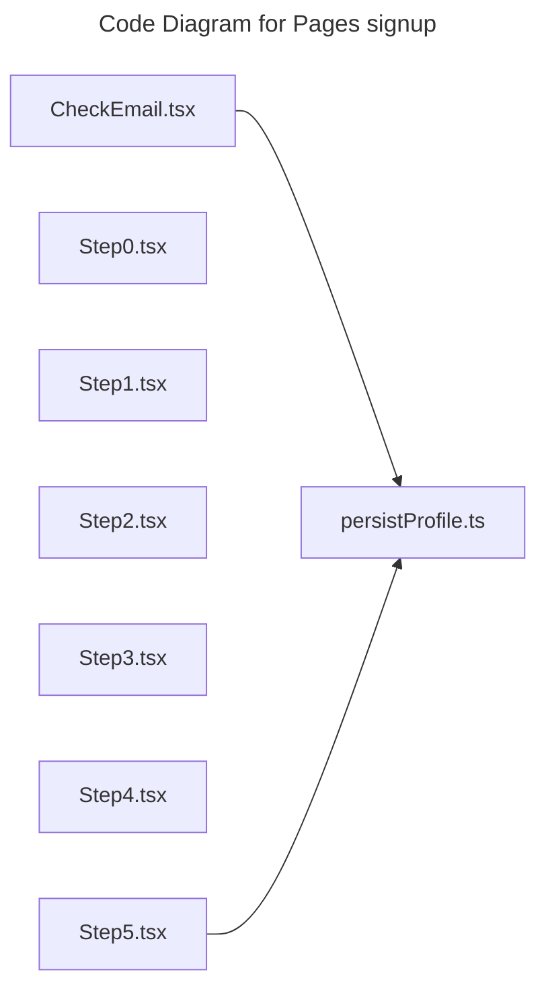

# C4 Code Level: Pages signup

## Overview

- **Name**: Pages signup
- **Description**: Pages signup route-level page modules.
- **Location**: [src/pages/signup](../../../src/pages/signup)
- **Language**: TypeScript
- **Purpose**: Compose full-screen pages signup experiences that are mounted by the SPA router.

## Code Elements

### Functions/Methods

- `CheckEmail(): unknown`
  - Description: Implements check email behavior for this module.
  - Location: [src/pages/signup/CheckEmail.tsx](../../../src/pages/signup/CheckEmail.tsx) (line 24)
  - Dependencies: ./persistProfile, @/app/api/client, @/shared/components/Turnstile, @/shared/components/layout/SignUpLayout, @/shared/components/ui/button, @/shared/components/ui/input-otp, @/shared/context/AuthContext, @/shared/hooks/custom/use-toast, @/shared/utils/errorHandling, @/shared/utils/postSignupRedirect, lucide-react, react, react-router-dom
- `resolveFormData(override?: SignUpFormData): SignUpFormData | null`
  - Description: Implements resolve form data behavior for this module.
  - Location: [src/pages/signup/persistProfile.ts](../../../src/pages/signup/persistProfile.ts) (line 11)
  - Dependencies: @/app/api/users, @/shared/components/layout/SignUpLayout, @/shared/utils/localStorage
- `clearSignupCache(): unknown`
  - Description: Implements clear signup cache behavior for this module.
  - Location: [src/pages/signup/persistProfile.ts](../../../src/pages/signup/persistProfile.ts) (line 24)
  - Dependencies: @/app/api/users, @/shared/components/layout/SignUpLayout, @/shared/utils/localStorage
- `async persistSignupProfile(override?: SignUpFormData): unknown`
  - Description: Implements persist signup profile behavior for this module.
  - Location: [src/pages/signup/persistProfile.ts](../../../src/pages/signup/persistProfile.ts) (line 30)
  - Dependencies: @/app/api/users, @/shared/components/layout/SignUpLayout, @/shared/utils/localStorage
- `Step0(): unknown`
  - Description: Implements step0 behavior for this module.
  - Location: [src/pages/signup/Step0.tsx](../../../src/pages/signup/Step0.tsx) (line 35)
  - Dependencies: @/app/api/invitations, @/shared/components/layout/Header, @/shared/components/layout/SignUpLayout, @/shared/components/ui/badge, @/shared/components/ui/button, @/shared/components/ui/card, @/shared/context/AuthContext, @/shared/utils/eventRedirectUtils, @/shared/utils/subscriptionRedirectUtils, date-fns, lucide-react, react, react-router-dom
- `Step1(): unknown`
  - Description: Implements step1 behavior for this module.
  - Location: [src/pages/signup/Step1.tsx](../../../src/pages/signup/Step1.tsx) (line 10)
  - Dependencies: @/shared/components/layout/SignUpLayout, @/shared/components/ui/button, @/shared/components/ui/input, @/shared/components/ui/label, lucide-react, react, react-router-dom
- `Step2(): unknown`
  - Description: Implements step2 behavior for this module.
  - Location: [src/pages/signup/Step2.tsx](../../../src/pages/signup/Step2.tsx) (line 21)
  - Dependencies: @/shared/components/layout/SignUpLayout, @/shared/components/ui/button, @/shared/components/ui/input, @/shared/components/ui/label, lucide-react, react, react-router-dom
- `parseSavedPhone(saved: string): unknown`
  - Description: Parses saved phone into a normalized form.
  - Location: [src/pages/signup/Step3.tsx](../../../src/pages/signup/Step3.tsx) (line 32)
  - Dependencies: @/shared/components/layout/SignUpLayout, @/shared/components/ui/button, @/shared/components/ui/input, @/shared/components/ui/label, @/shared/components/ui/select, @/shared/data/countries, react, react-router-dom
- `Step3(): unknown`
  - Description: Implements step3 behavior for this module.
  - Location: [src/pages/signup/Step3.tsx](../../../src/pages/signup/Step3.tsx) (line 43)
  - Dependencies: @/shared/components/layout/SignUpLayout, @/shared/components/ui/button, @/shared/components/ui/input, @/shared/components/ui/label, @/shared/components/ui/select, @/shared/data/countries, react, react-router-dom
- `Step4(): unknown`
  - Description: Implements step4 behavior for this module.
  - Location: [src/pages/signup/Step4.tsx](../../../src/pages/signup/Step4.tsx) (line 7)
  - Dependencies: @/shared/components/layout/SignUpLayout, @/shared/components/ui/button, react, react-router-dom
- `Step5(): unknown`
  - Description: Implements step5 behavior for this module.
  - Location: [src/pages/signup/Step5.tsx](../../../src/pages/signup/Step5.tsx) (line 22)
  - Dependencies: ./persistProfile, @/app/api/client, @/app/api/invitations, @/shared/components/Turnstile, @/shared/components/layout/SignUpLayout, @/shared/components/ui/button, @/shared/context/AuthContext, @/shared/hooks/custom/use-toast, @/shared/utils/errorHandling, react, react-router-dom

### Classes/Modules

- `CheckEmail.tsx`
  - Description: Module that implements check email responsibilities for this directory.
  - Location: [src/pages/signup/CheckEmail.tsx](../../../src/pages/signup/CheckEmail.tsx)
  - Contains: 1 function(s)
  - Dependencies: ./persistProfile, @/app/api/client, @/shared/components/Turnstile, @/shared/components/layout/SignUpLayout, @/shared/components/ui/button, @/shared/components/ui/input-otp, @/shared/context/AuthContext, @/shared/hooks/custom/use-toast, @/shared/utils/errorHandling, @/shared/utils/postSignupRedirect, lucide-react, react, react-router-dom
- `persistProfile.ts`
  - Description: Module that implements persist profile responsibilities for this directory.
  - Location: [src/pages/signup/persistProfile.ts](../../../src/pages/signup/persistProfile.ts)
  - Contains: 3 function(s)
  - Dependencies: @/app/api/users, @/shared/components/layout/SignUpLayout, @/shared/utils/localStorage
- `Step0.tsx`
  - Description: Module that implements step0 responsibilities for this directory.
  - Location: [src/pages/signup/Step0.tsx](../../../src/pages/signup/Step0.tsx)
  - Contains: 1 function(s)
  - Dependencies: @/app/api/invitations, @/shared/components/layout/Header, @/shared/components/layout/SignUpLayout, @/shared/components/ui/badge, @/shared/components/ui/button, @/shared/components/ui/card, @/shared/context/AuthContext, @/shared/utils/eventRedirectUtils, @/shared/utils/subscriptionRedirectUtils, date-fns, lucide-react, react, react-router-dom
- `Step1.tsx`
  - Description: Module that implements step1 responsibilities for this directory.
  - Location: [src/pages/signup/Step1.tsx](../../../src/pages/signup/Step1.tsx)
  - Contains: 1 function(s)
  - Dependencies: @/shared/components/layout/SignUpLayout, @/shared/components/ui/button, @/shared/components/ui/input, @/shared/components/ui/label, lucide-react, react, react-router-dom
- `Step2.tsx`
  - Description: Module that implements step2 responsibilities for this directory.
  - Location: [src/pages/signup/Step2.tsx](../../../src/pages/signup/Step2.tsx)
  - Contains: 1 function(s)
  - Dependencies: @/shared/components/layout/SignUpLayout, @/shared/components/ui/button, @/shared/components/ui/input, @/shared/components/ui/label, lucide-react, react, react-router-dom
- `Step3.tsx`
  - Description: Module that implements step3 responsibilities for this directory.
  - Location: [src/pages/signup/Step3.tsx](../../../src/pages/signup/Step3.tsx)
  - Contains: 2 function(s)
  - Dependencies: @/shared/components/layout/SignUpLayout, @/shared/components/ui/button, @/shared/components/ui/input, @/shared/components/ui/label, @/shared/components/ui/select, @/shared/data/countries, react, react-router-dom
- `Step4.tsx`
  - Description: Module that implements step4 responsibilities for this directory.
  - Location: [src/pages/signup/Step4.tsx](../../../src/pages/signup/Step4.tsx)
  - Contains: 1 function(s)
  - Dependencies: @/shared/components/layout/SignUpLayout, @/shared/components/ui/button, react, react-router-dom
- `Step5.tsx`
  - Description: Module that implements step5 responsibilities for this directory.
  - Location: [src/pages/signup/Step5.tsx](../../../src/pages/signup/Step5.tsx)
  - Contains: 1 function(s)
  - Dependencies: ./persistProfile, @/app/api/client, @/app/api/invitations, @/shared/components/Turnstile, @/shared/components/layout/SignUpLayout, @/shared/components/ui/button, @/shared/context/AuthContext, @/shared/hooks/custom/use-toast, @/shared/utils/errorHandling, react, react-router-dom

## Dependencies

### Internal Dependencies

- ./persistProfile
- @/app/api/client
- @/app/api/invitations
- @/app/api/users
- @/shared/components/Turnstile
- @/shared/components/layout/Header
- @/shared/components/layout/SignUpLayout
- @/shared/components/ui/badge
- @/shared/components/ui/button
- @/shared/components/ui/card
- @/shared/components/ui/input
- @/shared/components/ui/input-otp
- @/shared/components/ui/label
- @/shared/components/ui/select
- @/shared/context/AuthContext
- @/shared/data/countries
- @/shared/hooks/custom/use-toast
- @/shared/utils/errorHandling
- @/shared/utils/eventRedirectUtils
- @/shared/utils/localStorage
- @/shared/utils/postSignupRedirect
- @/shared/utils/subscriptionRedirectUtils

### External Dependencies

- date-fns
- lucide-react
- react
- react-router-dom

## Relationships

