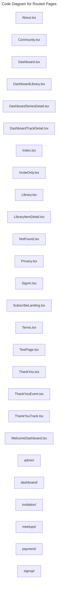

# C4 Code Level: Routed Pages

## Overview

- **Name**: Routed Pages
- **Description**: Route-level screens composing the public site, dashboard, signup wizard, payment states, and admin views.
- **Location**: [src/pages](../../../src/pages)
- **Language**: TypeScript
- **Purpose**: Bind feature modules into URL-addressable experiences in the SPA.

## Code Elements

### Subdirectories

- [src/pages/admin](./c4-code-src-pages-admin.md) - Pages admin route-level page modules.
- [src/pages/dashboard](./c4-code-src-pages-dashboard.md) - Pages dashboard route-level page modules.
- [src/pages/invitation](./c4-code-src-pages-invitation.md) - Pages invitation route-level page modules.
- [src/pages/meetups](./c4-code-src-pages-meetups.md) - Pages meetups route-level page modules.
- [src/pages/payment](./c4-code-src-pages-payment.md) - Pages payment route-level page modules.
- [src/pages/signup](./c4-code-src-pages-signup.md) - Pages signup route-level page modules.

### Functions/Methods

- `AboutPage(): unknown`
  - Description: Implements about page behavior for this module.
  - Location: [src/pages/About.tsx](../../../src/pages/About.tsx) (line 6)
  - Dependencies: @/shared/components/layout/Layout, @/shared/components/ui/button, lucide-react, react-router-dom
- `CommunityComingSoon(): unknown`
  - Description: Implements community coming soon behavior for this module.
  - Location: [src/pages/Community.tsx](../../../src/pages/Community.tsx) (line 6)
  - Dependencies: @/shared/components/layout/Layout, @/shared/components/ui/button, lucide-react, react-router-dom
- `Dashboard(): unknown`
  - Description: Implements dashboard behavior for this module.
  - Location: [src/pages/Dashboard.tsx](../../../src/pages/Dashboard.tsx) (line 35)
  - Dependencies: @/app/api/skills, @/app/hooks/useCurrentUser, @/app/hooks/useSkills, @/shared/components/layout/AppLayout, @/shared/components/layout/ProtectedRoute, @/shared/components/ui/badge, @/shared/components/ui/button, @/shared/components/ui/card, @/shared/components/ui/checkbox, @/shared/components/ui/input, @/shared/components/ui/label, @/shared/components/ui/textarea, @/shared/context/AuthContext, @/shared/hooks/custom/use-toast, @/shared/utils/inputSanitization, lucide-react, react
- `DashboardLibrary(): unknown`
  - Description: Implements dashboard library behavior for this module.
  - Location: [src/pages/DashboardLibrary.tsx](../../../src/pages/DashboardLibrary.tsx) (line 15)
  - Dependencies: @/app/hooks/useLibraryAssets, @/features/library/components/LibraryItemCard, @/features/series, @/features/series/hooks/useSeries, @/shared/components/LoadingSpinner, @/shared/components/layout/AppLayout, @/shared/components/layout/ProtectedRoute, @/shared/components/ui/card, @/shared/components/ui/input, @/shared/components/ui/tabs, lucide-react, react
- `getAssetTypeStyles(fileType: string, embedType?: string | null): unknown`
  - Description: Returns asset type styles derived from current inputs or state.
  - Location: [src/pages/DashboardSeriesDetail.tsx](../../../src/pages/DashboardSeriesDetail.tsx) (line 22)
  - Dependencies: @/features/series, @/features/series/hooks/useSeries, @/shared/components/LoadingSpinner, @/shared/components/layout/AppLayout, @/shared/components/layout/ProtectedRoute, @/shared/components/ui/button, @/shared/components/ui/card, lucide-react, react, react-router-dom
- `SeriesResourceCard({ asset, isSeriesPremium }): unknown`
  - Description: Implements series resource card behavior for this module.
  - Location: [src/pages/DashboardSeriesDetail.tsx](../../../src/pages/DashboardSeriesDetail.tsx) (line 53)
  - Dependencies: @/features/series, @/features/series/hooks/useSeries, @/shared/components/LoadingSpinner, @/shared/components/layout/AppLayout, @/shared/components/layout/ProtectedRoute, @/shared/components/ui/button, @/shared/components/ui/card, lucide-react, react, react-router-dom
- `DashboardSeriesDetail(): unknown`
  - Description: Implements dashboard series detail behavior for this module.
  - Location: [src/pages/DashboardSeriesDetail.tsx](../../../src/pages/DashboardSeriesDetail.tsx) (line 141)
  - Dependencies: @/features/series, @/features/series/hooks/useSeries, @/shared/components/LoadingSpinner, @/shared/components/layout/AppLayout, @/shared/components/layout/ProtectedRoute, @/shared/components/ui/button, @/shared/components/ui/card, lucide-react, react, react-router-dom
- `TrackEventCard({ event, assets }): unknown`
  - Description: Implements track event card behavior for this module.
  - Location: [src/pages/DashboardTrackDetail.tsx](../../../src/pages/DashboardTrackDetail.tsx) (line 22)
  - Dependencies: @/features/library/hooks/useLibrary, @/features/library/types, @/features/tracks/components/TrackBookingButton, @/features/tracks/hooks/useTracks, @/shared/components/LoadingSpinner, @/shared/components/layout/AppLayout, @/shared/components/layout/ProtectedRoute, @/shared/components/ui/button, @/shared/components/ui/card, lucide-react, react, react-router-dom
- `DashboardTrackDetail(): unknown`
  - Description: Implements dashboard track detail behavior for this module.
  - Location: [src/pages/DashboardTrackDetail.tsx](../../../src/pages/DashboardTrackDetail.tsx) (line 85)
  - Dependencies: @/features/library/hooks/useLibrary, @/features/library/types, @/features/tracks/components/TrackBookingButton, @/features/tracks/hooks/useTracks, @/shared/components/LoadingSpinner, @/shared/components/layout/AppLayout, @/shared/components/layout/ProtectedRoute, @/shared/components/ui/button, @/shared/components/ui/card, lucide-react, react, react-router-dom
- `Index(): unknown`
  - Description: Implements index behavior for this module.
  - Location: [src/pages/Index.tsx](../../../src/pages/Index.tsx) (line 124)
  - Dependencies: @/app/api/events, @/app/api/tracks, @/features/events/components/EventCard, @/features/tracks/components/PublicTrackCard, @/shared/components/layout/Layout, @/shared/components/ui/button, @/shared/utils/errorHandling, @tanstack/react-query, lucide-react, react, react-router-dom
- `InviteOnlyPage(): unknown`
  - Description: Implements invite only page behavior for this module.
  - Location: [src/pages/InviteOnly.tsx](../../../src/pages/InviteOnly.tsx) (line 9)
  - Dependencies: @/shared/components/layout/Layout, @/shared/components/ui/button, lucide-react, react, react-router-dom
- `LibraryComingSoon(): unknown`
  - Description: Implements library coming soon behavior for this module.
  - Location: [src/pages/Library.tsx](../../../src/pages/Library.tsx) (line 6)
  - Dependencies: @/shared/components/layout/Layout, @/shared/components/ui/button, lucide-react, react-router-dom
- `SanitizedDescription({ className, html }: SanitizedHtmlProps): unknown`
  - Description: Implements sanitized description behavior for this module.
  - Location: [src/pages/LibraryItemDetail.tsx](../../../src/pages/LibraryItemDetail.tsx) (line 28)
  - Dependencies: @/features/library/hooks/useLibrary, @/shared/components/LoadingSpinner, @/shared/components/VideoEmbed, @/shared/components/layout/AppLayout, @/shared/components/layout/ProtectedRoute, @/shared/components/ui/button, @/shared/components/ui/card, dompurify, lucide-react, react, react-router-dom
- `LibraryItemDetail(): unknown`
  - Description: Implements library item detail behavior for this module.
  - Location: [src/pages/LibraryItemDetail.tsx](../../../src/pages/LibraryItemDetail.tsx) (line 36)
  - Dependencies: @/features/library/hooks/useLibrary, @/shared/components/LoadingSpinner, @/shared/components/VideoEmbed, @/shared/components/layout/AppLayout, @/shared/components/layout/ProtectedRoute, @/shared/components/ui/button, @/shared/components/ui/card, dompurify, lucide-react, react, react-router-dom
- `NotFound(): unknown`
  - Description: Implements not found behavior for this module.
  - Location: [src/pages/NotFound.tsx](../../../src/pages/NotFound.tsx) (line 3)
  - Dependencies: react-router-dom
- `PrivacyPolicy(): unknown`
  - Description: Implements privacy policy behavior for this module.
  - Location: [src/pages/Privacy.tsx](../../../src/pages/Privacy.tsx) (line 3)
  - Dependencies: @/shared/components/layout/Layout
- `SignIn(): unknown`
  - Description: Implements sign in behavior for this module.
  - Location: [src/pages/SignIn.tsx](../../../src/pages/SignIn.tsx) (line 13)
  - Dependencies: @/app/api/client, @/shared/components/Turnstile, @/shared/components/layout/Layout, @/shared/components/ui/button, @/shared/components/ui/input, @/shared/components/ui/label, @/shared/context/AuthContext, @/shared/hooks/custom/use-toast, react, react-router-dom
- `HeroSection({
  subscriptionInfo,
  onSubscribe,
  isLoaded,
}: {
  subscriptionInfo: { priceEgp?: number | null; discountPercent?: number } | undefined;
  onSubscribe: () => void;
  isLoaded: boolean;
}): unknown`
  - Description: Implements hero section behavior for this module.
  - Location: [src/pages/SubscribeLanding.tsx](../../../src/pages/SubscribeLanding.tsx) (line 26)
  - Dependencies: @/app/hooks/useSubscriptions, @/features/subscribe/components, @/features/subscribe/content, @/shared/components/layout/Layout, @/shared/components/ui/badge, @/shared/components/ui/button, @/shared/context/AuthContext, @/shared/utils/subscriptionRedirectUtils, lucide-react, react, react-router-dom
- `FinalCTASection({
  subscriptionInfo,
  onSubscribe,
}: {
  subscriptionInfo: { priceEgp?: number | null; discountPercent?: number } | undefined;
  onSubscribe: () => void;
}): unknown`
  - Description: Implements final ctasection behavior for this module.
  - Location: [src/pages/SubscribeLanding.tsx](../../../src/pages/SubscribeLanding.tsx) (line 142)
  - Dependencies: @/app/hooks/useSubscriptions, @/features/subscribe/components, @/features/subscribe/content, @/shared/components/layout/Layout, @/shared/components/ui/badge, @/shared/components/ui/button, @/shared/context/AuthContext, @/shared/utils/subscriptionRedirectUtils, lucide-react, react, react-router-dom
- `SubscribeLanding(): unknown`
  - Description: Implements subscribe landing behavior for this module.
  - Location: [src/pages/SubscribeLanding.tsx](../../../src/pages/SubscribeLanding.tsx) (line 194)
  - Dependencies: @/app/hooks/useSubscriptions, @/features/subscribe/components, @/features/subscribe/content, @/shared/components/layout/Layout, @/shared/components/ui/badge, @/shared/components/ui/button, @/shared/context/AuthContext, @/shared/utils/subscriptionRedirectUtils, lucide-react, react, react-router-dom
- `TermsOfService(): unknown`
  - Description: Implements terms of service behavior for this module.
  - Location: [src/pages/Terms.tsx](../../../src/pages/Terms.tsx) (line 3)
  - Dependencies: @/shared/components/layout/Layout
- `TestPage(): unknown`
  - Description: Implements test page behavior for this module.
  - Location: [src/pages/TestPage.tsx](../../../src/pages/TestPage.tsx) (line 1)
  - Dependencies: None
- `ThankYou(): unknown`
  - Description: Implements thank you behavior for this module.
  - Location: [src/pages/ThankYou.tsx](../../../src/pages/ThankYou.tsx) (line 7)
  - Dependencies: @/shared/components/ui/button, @/shared/components/ui/card, lucide-react, react, react-router-dom
- `ThankYouEvent(): unknown`
  - Description: Implements thank you event behavior for this module.
  - Location: [src/pages/ThankYouEvent.tsx](../../../src/pages/ThankYouEvent.tsx) (line 30)
  - Dependencies: @/app/hooks/useSubscriptions, @/features/events/hooks/useEventBooking, @/features/events/hooks/useEvents, @/shared/components/DataLoader, @/shared/components/layout/Layout, @/shared/components/ui/badge, @/shared/components/ui/button, @/shared/components/ui/card, @/shared/context/AuthContext, @/shared/hooks/custom/useLocationVisibility, @/shared/utils/dateUtils, @/shared/utils/eventRedirectUtils, lucide-react, react, react-router-dom
- `ThankYouTrack(): unknown`
  - Description: Implements thank you track behavior for this module.
  - Location: [src/pages/ThankYouTrack.tsx](../../../src/pages/ThankYouTrack.tsx) (line 28)
  - Dependencies: @/app/hooks/useSubscriptions, @/features/tracks/hooks/useTracks, @/shared/components/DataLoader, @/shared/components/layout/Layout, @/shared/components/ui/badge, @/shared/components/ui/button, @/shared/components/ui/card, @/shared/context/AuthContext, @/shared/hooks/custom/useLocationVisibility, @/shared/utils/dateUtils, @/shared/utils/trackRedirectUtils, lucide-react, react, react-router-dom
- `WelcomeDashboard(): unknown`
  - Description: Implements welcome dashboard behavior for this module.
  - Location: [src/pages/WelcomeDashboard.tsx](../../../src/pages/WelcomeDashboard.tsx) (line 18)
  - Dependencies: @/app/api/events, @/app/api/library, @/app/api/series, @/app/api/tracks, @/shared/components/layout/AppLayout, @/shared/components/payment, @/shared/components/ui/badge, @/shared/components/ui/button, @/shared/components/ui/card, @/shared/components/ui/skeleton, @tanstack/react-query, dompurify, lucide-react, react, react-router-dom

### Classes/Modules

- `About.tsx`
  - Description: Module that implements about responsibilities for this directory.
  - Location: [src/pages/About.tsx](../../../src/pages/About.tsx)
  - Contains: 1 function(s)
  - Dependencies: @/shared/components/layout/Layout, @/shared/components/ui/button, lucide-react, react-router-dom
- `Community.tsx`
  - Description: Module that implements community responsibilities for this directory.
  - Location: [src/pages/Community.tsx](../../../src/pages/Community.tsx)
  - Contains: 1 function(s)
  - Dependencies: @/shared/components/layout/Layout, @/shared/components/ui/button, lucide-react, react-router-dom
- `Dashboard.tsx`
  - Description: Module that implements dashboard responsibilities for this directory.
  - Location: [src/pages/Dashboard.tsx](../../../src/pages/Dashboard.tsx)
  - Contains: 1 function(s)
  - Dependencies: @/app/api/skills, @/app/hooks/useCurrentUser, @/app/hooks/useSkills, @/shared/components/layout/AppLayout, @/shared/components/layout/ProtectedRoute, @/shared/components/ui/badge, @/shared/components/ui/button, @/shared/components/ui/card, @/shared/components/ui/checkbox, @/shared/components/ui/input, @/shared/components/ui/label, @/shared/components/ui/textarea, @/shared/context/AuthContext, @/shared/hooks/custom/use-toast, @/shared/utils/inputSanitization, lucide-react, react
- `DashboardLibrary.tsx`
  - Description: Module that implements dashboard library responsibilities for this directory.
  - Location: [src/pages/DashboardLibrary.tsx](../../../src/pages/DashboardLibrary.tsx)
  - Contains: 1 function(s)
  - Dependencies: @/app/hooks/useLibraryAssets, @/features/library/components/LibraryItemCard, @/features/series, @/features/series/hooks/useSeries, @/shared/components/LoadingSpinner, @/shared/components/layout/AppLayout, @/shared/components/layout/ProtectedRoute, @/shared/components/ui/card, @/shared/components/ui/input, @/shared/components/ui/tabs, lucide-react, react
- `DashboardSeriesDetail.tsx`
  - Description: Module that implements dashboard series detail responsibilities for this directory.
  - Location: [src/pages/DashboardSeriesDetail.tsx](../../../src/pages/DashboardSeriesDetail.tsx)
  - Contains: 3 function(s)
  - Dependencies: @/features/series, @/features/series/hooks/useSeries, @/shared/components/LoadingSpinner, @/shared/components/layout/AppLayout, @/shared/components/layout/ProtectedRoute, @/shared/components/ui/button, @/shared/components/ui/card, lucide-react, react, react-router-dom
- `DashboardTrackDetail.tsx`
  - Description: Module that implements dashboard track detail responsibilities for this directory.
  - Location: [src/pages/DashboardTrackDetail.tsx](../../../src/pages/DashboardTrackDetail.tsx)
  - Contains: 2 function(s)
  - Dependencies: @/features/library/hooks/useLibrary, @/features/library/types, @/features/tracks/components/TrackBookingButton, @/features/tracks/hooks/useTracks, @/shared/components/LoadingSpinner, @/shared/components/layout/AppLayout, @/shared/components/layout/ProtectedRoute, @/shared/components/ui/button, @/shared/components/ui/card, lucide-react, react, react-router-dom
- `Index.tsx`
  - Description: Module that implements index responsibilities for this directory.
  - Location: [src/pages/Index.tsx](../../../src/pages/Index.tsx)
  - Contains: 1 function(s)
  - Dependencies: @/app/api/events, @/app/api/tracks, @/features/events/components/EventCard, @/features/tracks/components/PublicTrackCard, @/shared/components/layout/Layout, @/shared/components/ui/button, @/shared/utils/errorHandling, @tanstack/react-query, lucide-react, react, react-router-dom
- `InviteOnly.tsx`
  - Description: Module that implements invite only responsibilities for this directory.
  - Location: [src/pages/InviteOnly.tsx](../../../src/pages/InviteOnly.tsx)
  - Contains: 1 function(s)
  - Dependencies: @/shared/components/layout/Layout, @/shared/components/ui/button, lucide-react, react, react-router-dom
- `Library.tsx`
  - Description: Module that implements library responsibilities for this directory.
  - Location: [src/pages/Library.tsx](../../../src/pages/Library.tsx)
  - Contains: 1 function(s)
  - Dependencies: @/shared/components/layout/Layout, @/shared/components/ui/button, lucide-react, react-router-dom
- `LibraryItemDetail.tsx`
  - Description: Module that implements library item detail responsibilities for this directory.
  - Location: [src/pages/LibraryItemDetail.tsx](../../../src/pages/LibraryItemDetail.tsx)
  - Contains: 2 function(s)
  - Dependencies: @/features/library/hooks/useLibrary, @/shared/components/LoadingSpinner, @/shared/components/VideoEmbed, @/shared/components/layout/AppLayout, @/shared/components/layout/ProtectedRoute, @/shared/components/ui/button, @/shared/components/ui/card, dompurify, lucide-react, react, react-router-dom
- `NotFound.tsx`
  - Description: Module that implements not found responsibilities for this directory.
  - Location: [src/pages/NotFound.tsx](../../../src/pages/NotFound.tsx)
  - Contains: 1 function(s)
  - Dependencies: react-router-dom
- `Privacy.tsx`
  - Description: Module that implements privacy responsibilities for this directory.
  - Location: [src/pages/Privacy.tsx](../../../src/pages/Privacy.tsx)
  - Contains: 1 function(s)
  - Dependencies: @/shared/components/layout/Layout
- `SignIn.tsx`
  - Description: Module that implements sign in responsibilities for this directory.
  - Location: [src/pages/SignIn.tsx](../../../src/pages/SignIn.tsx)
  - Contains: 1 function(s)
  - Dependencies: @/app/api/client, @/shared/components/Turnstile, @/shared/components/layout/Layout, @/shared/components/ui/button, @/shared/components/ui/input, @/shared/components/ui/label, @/shared/context/AuthContext, @/shared/hooks/custom/use-toast, react, react-router-dom
- `SubscribeLanding.tsx`
  - Description: Module that implements subscribe landing responsibilities for this directory.
  - Location: [src/pages/SubscribeLanding.tsx](../../../src/pages/SubscribeLanding.tsx)
  - Contains: 3 function(s)
  - Dependencies: @/app/hooks/useSubscriptions, @/features/subscribe/components, @/features/subscribe/content, @/shared/components/layout/Layout, @/shared/components/ui/badge, @/shared/components/ui/button, @/shared/context/AuthContext, @/shared/utils/subscriptionRedirectUtils, lucide-react, react, react-router-dom
- `Terms.tsx`
  - Description: Module that implements terms responsibilities for this directory.
  - Location: [src/pages/Terms.tsx](../../../src/pages/Terms.tsx)
  - Contains: 1 function(s)
  - Dependencies: @/shared/components/layout/Layout
- `TestPage.tsx`
  - Description: Module that implements test page responsibilities for this directory.
  - Location: [src/pages/TestPage.tsx](../../../src/pages/TestPage.tsx)
  - Contains: 1 function(s)
  - Dependencies: None
- `ThankYou.tsx`
  - Description: Module that implements thank you responsibilities for this directory.
  - Location: [src/pages/ThankYou.tsx](../../../src/pages/ThankYou.tsx)
  - Contains: 1 function(s)
  - Dependencies: @/shared/components/ui/button, @/shared/components/ui/card, lucide-react, react, react-router-dom
- `ThankYouEvent.tsx`
  - Description: Module that implements thank you event responsibilities for this directory.
  - Location: [src/pages/ThankYouEvent.tsx](../../../src/pages/ThankYouEvent.tsx)
  - Contains: 1 function(s)
  - Dependencies: @/app/hooks/useSubscriptions, @/features/events/hooks/useEventBooking, @/features/events/hooks/useEvents, @/shared/components/DataLoader, @/shared/components/layout/Layout, @/shared/components/ui/badge, @/shared/components/ui/button, @/shared/components/ui/card, @/shared/context/AuthContext, @/shared/hooks/custom/useLocationVisibility, @/shared/utils/dateUtils, @/shared/utils/eventRedirectUtils, lucide-react, react, react-router-dom
- `ThankYouTrack.tsx`
  - Description: Module that implements thank you track responsibilities for this directory.
  - Location: [src/pages/ThankYouTrack.tsx](../../../src/pages/ThankYouTrack.tsx)
  - Contains: 1 function(s)
  - Dependencies: @/app/hooks/useSubscriptions, @/features/tracks/hooks/useTracks, @/shared/components/DataLoader, @/shared/components/layout/Layout, @/shared/components/ui/badge, @/shared/components/ui/button, @/shared/components/ui/card, @/shared/context/AuthContext, @/shared/hooks/custom/useLocationVisibility, @/shared/utils/dateUtils, @/shared/utils/trackRedirectUtils, lucide-react, react, react-router-dom
- `WelcomeDashboard.tsx`
  - Description: Module that implements welcome dashboard responsibilities for this directory.
  - Location: [src/pages/WelcomeDashboard.tsx](../../../src/pages/WelcomeDashboard.tsx)
  - Contains: 1 function(s)
  - Dependencies: @/app/api/events, @/app/api/library, @/app/api/series, @/app/api/tracks, @/shared/components/layout/AppLayout, @/shared/components/payment, @/shared/components/ui/badge, @/shared/components/ui/button, @/shared/components/ui/card, @/shared/components/ui/skeleton, @tanstack/react-query, dompurify, lucide-react, react, react-router-dom

## Dependencies

### Internal Dependencies

- @/app/api/client
- @/app/api/events
- @/app/api/library
- @/app/api/series
- @/app/api/skills
- @/app/api/tracks
- @/app/hooks/useCurrentUser
- @/app/hooks/useLibraryAssets
- @/app/hooks/useSkills
- @/app/hooks/useSubscriptions
- @/features/events/components/EventCard
- @/features/events/hooks/useEventBooking
- @/features/events/hooks/useEvents
- @/features/library/components/LibraryItemCard
- @/features/library/hooks/useLibrary
- @/features/library/types
- @/features/series
- @/features/series/hooks/useSeries
- @/features/subscribe/components
- @/features/subscribe/content
- @/features/tracks/components/PublicTrackCard
- @/features/tracks/components/TrackBookingButton
- @/features/tracks/hooks/useTracks
- @/shared/components/DataLoader
- @/shared/components/LoadingSpinner
- @/shared/components/Turnstile
- @/shared/components/VideoEmbed
- @/shared/components/layout/AppLayout
- @/shared/components/layout/Layout
- @/shared/components/layout/ProtectedRoute
- @/shared/components/payment
- @/shared/components/ui/badge
- @/shared/components/ui/button
- @/shared/components/ui/card
- @/shared/components/ui/checkbox
- @/shared/components/ui/input
- @/shared/components/ui/label
- @/shared/components/ui/skeleton
- @/shared/components/ui/tabs
- @/shared/components/ui/textarea
- @/shared/context/AuthContext
- @/shared/hooks/custom/use-toast
- @/shared/hooks/custom/useLocationVisibility
- @/shared/utils/dateUtils
- @/shared/utils/errorHandling
- @/shared/utils/eventRedirectUtils
- @/shared/utils/inputSanitization
- @/shared/utils/subscriptionRedirectUtils
- @/shared/utils/trackRedirectUtils
- src/pages/admin (child module boundary)
- src/pages/dashboard (child module boundary)
- src/pages/invitation (child module boundary)
- src/pages/meetups (child module boundary)
- src/pages/payment (child module boundary)
- src/pages/signup (child module boundary)

### External Dependencies

- @tanstack/react-query
- dompurify
- lucide-react
- react
- react-router-dom

## Relationships

