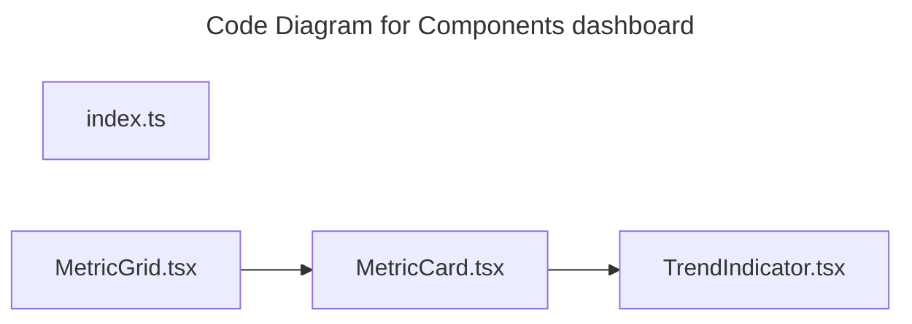

# C4 Code Level: Components dashboard

## Overview

- **Name**: Components dashboard
- **Description**: Components dashboard React component modules.
- **Location**: [src/shared/components/dashboard](../../../src/shared/components/dashboard)
- **Language**: TypeScript
- **Purpose**: Render components dashboard user interface elements for the TrafficMENA frontend.

## Code Elements

### Functions/Methods

- `MetricCard({
  metric,
  icon: Icon,
  className = '',
  isLoading = false,
}): unknown`
  - Description: Implements metric card behavior for this module.
  - Location: [src/shared/components/dashboard/MetricCard.tsx](../../../src/shared/components/dashboard/MetricCard.tsx) (line 33)
  - Dependencies: ./TrendIndicator, @/shared/components/ui/alert, @/shared/components/ui/card, @/shared/components/ui/skeleton, lucide-react, react
- `MetricGrid({
  metrics,
  isLoading = false,
  error,
  onRetry,
  className = '',
  columns = 3,
}): unknown`
  - Description: Implements metric grid behavior for this module.
  - Location: [src/shared/components/dashboard/MetricGrid.tsx](../../../src/shared/components/dashboard/MetricGrid.tsx) (line 29)
  - Dependencies: ./MetricCard, @/shared/components/ui/alert, @/shared/components/ui/button, lucide-react, react
- `TrendIndicator({
  value,
  isPositive,
  period,
  className = '',
}): unknown`
  - Description: Implements trend indicator behavior for this module.
  - Location: [src/shared/components/dashboard/TrendIndicator.tsx](../../../src/shared/components/dashboard/TrendIndicator.tsx) (line 19)
  - Dependencies: @/shared/lib/utils, lucide-react, react

### Classes/Modules

- `index.ts`
  - Description: Entry-point module that re-exports or wires together sibling modules.
  - Location: [src/shared/components/dashboard/index.ts](../../../src/shared/components/dashboard/index.ts)
  - Contains: module-level configuration or data
  - Dependencies: None
- `MetricCard.tsx`
  - Description: Module that implements metric card responsibilities for this directory.
  - Location: [src/shared/components/dashboard/MetricCard.tsx](../../../src/shared/components/dashboard/MetricCard.tsx)
  - Contains: 1 function(s)
  - Dependencies: ./TrendIndicator, @/shared/components/ui/alert, @/shared/components/ui/card, @/shared/components/ui/skeleton, lucide-react, react
- `MetricGrid.tsx`
  - Description: Module that implements metric grid responsibilities for this directory.
  - Location: [src/shared/components/dashboard/MetricGrid.tsx](../../../src/shared/components/dashboard/MetricGrid.tsx)
  - Contains: 1 function(s)
  - Dependencies: ./MetricCard, @/shared/components/ui/alert, @/shared/components/ui/button, lucide-react, react
- `TrendIndicator.tsx`
  - Description: Module that implements trend indicator responsibilities for this directory.
  - Location: [src/shared/components/dashboard/TrendIndicator.tsx](../../../src/shared/components/dashboard/TrendIndicator.tsx)
  - Contains: 1 function(s)
  - Dependencies: @/shared/lib/utils, lucide-react, react

## Dependencies

### Internal Dependencies

- ./MetricCard
- ./TrendIndicator
- @/shared/components/ui/alert
- @/shared/components/ui/button
- @/shared/components/ui/card
- @/shared/components/ui/skeleton
- @/shared/lib/utils

### External Dependencies

- lucide-react
- react

## Relationships

