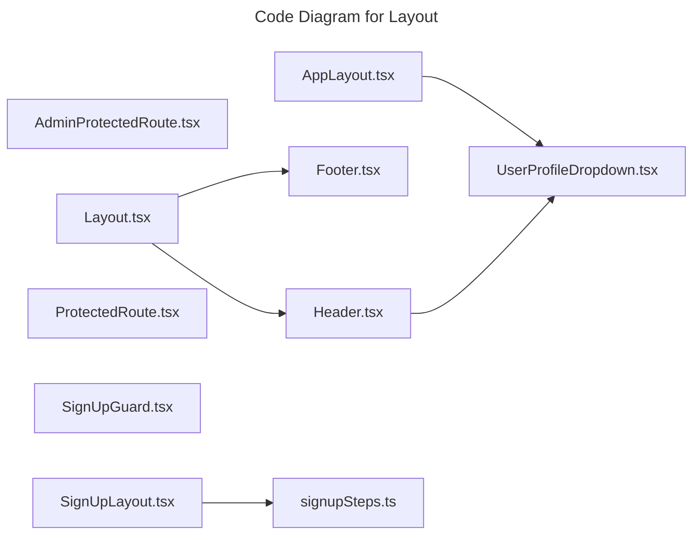

# C4 Code Level: Layout

## Overview

- **Name**: Layout
- **Description**: Layout React component modules.
- **Location**: [src/shared/components/layout](../../../src/shared/components/layout)
- **Language**: TypeScript
- **Purpose**: Render layout user interface elements for the TrafficMENA frontend.

## Code Elements

### Functions/Methods

- `AdminProtectedRoute({
  children,
  allowedRoles = ['owner', 'admin'],
  redirectPath = '/dashboard',
}): unknown`
  - Description: Implements admin protected route behavior for this module.
  - Location: [src/shared/components/layout/AdminProtectedRoute.tsx](../../../src/shared/components/layout/AdminProtectedRoute.tsx) (line 17)
  - Dependencies: @/shared/context/AuthContext, @/shared/hooks/custom/useRolePermissions, react, react-router-dom
- `AppSidebar({ variant }: { variant: AppLayoutVariant }): unknown`
  - Description: Implements app sidebar behavior for this module.
  - Location: [src/shared/components/layout/AppLayout.tsx](../../../src/shared/components/layout/AppLayout.tsx) (line 127)
  - Dependencies: ./UserProfileDropdown, @/app/hooks/useSubscriptions, @/shared/components/PhoneCompletionBanner, @/shared/components/ui/sidebar, @/shared/context/AuthContext, @/shared/hooks/custom/useRolePermissions, lucide-react, react, react-router-dom
- `AppLayout({ variant, children }): unknown`
  - Description: Implements app layout behavior for this module.
  - Location: [src/shared/components/layout/AppLayout.tsx](../../../src/shared/components/layout/AppLayout.tsx) (line 283)
  - Dependencies: ./UserProfileDropdown, @/app/hooks/useSubscriptions, @/shared/components/PhoneCompletionBanner, @/shared/components/ui/sidebar, @/shared/context/AuthContext, @/shared/hooks/custom/useRolePermissions, lucide-react, react, react-router-dom
- `Footer(): unknown`
  - Description: Implements footer behavior for this module.
  - Location: [src/shared/components/layout/Footer.tsx](../../../src/shared/components/layout/Footer.tsx) (line 3)
  - Dependencies: react-router-dom
- `Header(): unknown`
  - Description: Implements header behavior for this module.
  - Location: [src/shared/components/layout/Header.tsx](../../../src/shared/components/layout/Header.tsx) (line 38)
  - Dependencies: ./UserProfileDropdown, @/app/hooks/useSubscriptions, @/shared/components/ui/button, @/shared/components/ui/drawer, @/shared/context/AuthContext, @/shared/hooks/custom/useRolePermissions, lucide-react, react, react-router-dom
- `Layout({ children }): unknown`
  - Description: Implements layout behavior for this module.
  - Location: [src/shared/components/layout/Layout.tsx](../../../src/shared/components/layout/Layout.tsx) (line 9)
  - Dependencies: ./Footer, ./Header, react
- `ProtectedRoute({ children }): unknown`
  - Description: Implements protected route behavior for this module.
  - Location: [src/shared/components/layout/ProtectedRoute.tsx](../../../src/shared/components/layout/ProtectedRoute.tsx) (line 10)
  - Dependencies: @/shared/context/AuthContext, react, react-router-dom
- `SignUpGuard({ children }: SignUpGuardProps): unknown`
  - Description: Implements sign up guard behavior for this module.
  - Location: [src/shared/components/layout/SignUpGuard.tsx](../../../src/shared/components/layout/SignUpGuard.tsx) (line 26)
  - Dependencies: @/app/api/settings, react, react-router-dom
- `useSignUpContext(): unknown`
  - Description: React hook that manages sign up context behavior.
  - Location: [src/shared/components/layout/SignUpLayout.tsx](../../../src/shared/components/layout/SignUpLayout.tsx) (line 65)
  - Dependencies: ./signupSteps, @/shared/components/layout/Header, @/shared/components/ui/button, @/shared/utils/localStorage, lucide-react, react, react-router-dom
- `SignUpLayout({
  children,
  currentStep,
  totalSteps = SIGNUP_TOTAL_STEPS,
  onBack,
  showBackButton = true,
}): unknown`
  - Description: Implements sign up layout behavior for this module.
  - Location: [src/shared/components/layout/SignUpLayout.tsx](../../../src/shared/components/layout/SignUpLayout.tsx) (line 84)
  - Dependencies: ./signupSteps, @/shared/components/layout/Header, @/shared/components/ui/button, @/shared/utils/localStorage, lucide-react, react, react-router-dom
- `SignUpProvider({ children }): unknown`
  - Description: Implements sign up provider behavior for this module.
  - Location: [src/shared/components/layout/SignUpLayout.tsx](../../../src/shared/components/layout/SignUpLayout.tsx) (line 162)
  - Dependencies: ./signupSteps, @/shared/components/layout/Header, @/shared/components/ui/button, @/shared/utils/localStorage, lucide-react, react, react-router-dom
- `UserProfileDropdown(): unknown`
  - Description: Implements user profile dropdown behavior for this module.
  - Location: [src/shared/components/layout/UserProfileDropdown.tsx](../../../src/shared/components/layout/UserProfileDropdown.tsx) (line 18)
  - Dependencies: @/app/hooks/useCurrentUser, @/app/hooks/useSubscriptions, @/shared/components/ui/avatar, @/shared/components/ui/dropdown-menu, @/shared/context/AuthContext, @/shared/hooks/custom/useRolePermissions, @/shared/utils/adminAccess, lucide-react, react, react-router-dom

### Classes/Modules

- `AdminProtectedRoute.tsx`
  - Description: Module that implements admin protected route responsibilities for this directory.
  - Location: [src/shared/components/layout/AdminProtectedRoute.tsx](../../../src/shared/components/layout/AdminProtectedRoute.tsx)
  - Contains: 1 function(s)
  - Dependencies: @/shared/context/AuthContext, @/shared/hooks/custom/useRolePermissions, react, react-router-dom
- `AppLayout.tsx`
  - Description: Module that implements app layout responsibilities for this directory.
  - Location: [src/shared/components/layout/AppLayout.tsx](../../../src/shared/components/layout/AppLayout.tsx)
  - Contains: 2 function(s)
  - Dependencies: ./UserProfileDropdown, @/app/hooks/useSubscriptions, @/shared/components/PhoneCompletionBanner, @/shared/components/ui/sidebar, @/shared/context/AuthContext, @/shared/hooks/custom/useRolePermissions, lucide-react, react, react-router-dom
- `Footer.tsx`
  - Description: Module that implements footer responsibilities for this directory.
  - Location: [src/shared/components/layout/Footer.tsx](../../../src/shared/components/layout/Footer.tsx)
  - Contains: 1 function(s)
  - Dependencies: react-router-dom
- `Header.tsx`
  - Description: Module that implements header responsibilities for this directory.
  - Location: [src/shared/components/layout/Header.tsx](../../../src/shared/components/layout/Header.tsx)
  - Contains: 1 function(s)
  - Dependencies: ./UserProfileDropdown, @/app/hooks/useSubscriptions, @/shared/components/ui/button, @/shared/components/ui/drawer, @/shared/context/AuthContext, @/shared/hooks/custom/useRolePermissions, lucide-react, react, react-router-dom
- `Layout.tsx`
  - Description: Module that implements layout responsibilities for this directory.
  - Location: [src/shared/components/layout/Layout.tsx](../../../src/shared/components/layout/Layout.tsx)
  - Contains: 1 function(s)
  - Dependencies: ./Footer, ./Header, react
- `ProtectedRoute.tsx`
  - Description: Module that implements protected route responsibilities for this directory.
  - Location: [src/shared/components/layout/ProtectedRoute.tsx](../../../src/shared/components/layout/ProtectedRoute.tsx)
  - Contains: 1 function(s)
  - Dependencies: @/shared/context/AuthContext, react, react-router-dom
- `SignUpGuard.tsx`
  - Description: Module that implements sign up guard responsibilities for this directory.
  - Location: [src/shared/components/layout/SignUpGuard.tsx](../../../src/shared/components/layout/SignUpGuard.tsx)
  - Contains: 1 function(s)
  - Dependencies: @/app/api/settings, react, react-router-dom
- `SignUpLayout.tsx`
  - Description: Module that implements sign up layout responsibilities for this directory.
  - Location: [src/shared/components/layout/SignUpLayout.tsx](../../../src/shared/components/layout/SignUpLayout.tsx)
  - Contains: 3 function(s)
  - Dependencies: ./signupSteps, @/shared/components/layout/Header, @/shared/components/ui/button, @/shared/utils/localStorage, lucide-react, react, react-router-dom
- `signupSteps.ts`
  - Description: Module that implements signup steps responsibilities for this directory.
  - Location: [src/shared/components/layout/signupSteps.ts](../../../src/shared/components/layout/signupSteps.ts)
  - Contains: module-level configuration or data
  - Dependencies: None
- `UserProfileDropdown.tsx`
  - Description: Module that implements user profile dropdown responsibilities for this directory.
  - Location: [src/shared/components/layout/UserProfileDropdown.tsx](../../../src/shared/components/layout/UserProfileDropdown.tsx)
  - Contains: 1 function(s)
  - Dependencies: @/app/hooks/useCurrentUser, @/app/hooks/useSubscriptions, @/shared/components/ui/avatar, @/shared/components/ui/dropdown-menu, @/shared/context/AuthContext, @/shared/hooks/custom/useRolePermissions, @/shared/utils/adminAccess, lucide-react, react, react-router-dom

## Dependencies

### Internal Dependencies

- ./Footer
- ./Header
- ./UserProfileDropdown
- ./signupSteps
- @/app/api/settings
- @/app/hooks/useCurrentUser
- @/app/hooks/useSubscriptions
- @/shared/components/PhoneCompletionBanner
- @/shared/components/layout/Header
- @/shared/components/ui/avatar
- @/shared/components/ui/button
- @/shared/components/ui/drawer
- @/shared/components/ui/dropdown-menu
- @/shared/components/ui/sidebar
- @/shared/context/AuthContext
- @/shared/hooks/custom/useRolePermissions
- @/shared/utils/adminAccess
- @/shared/utils/localStorage

### External Dependencies

- lucide-react
- react
- react-router-dom

## Relationships

