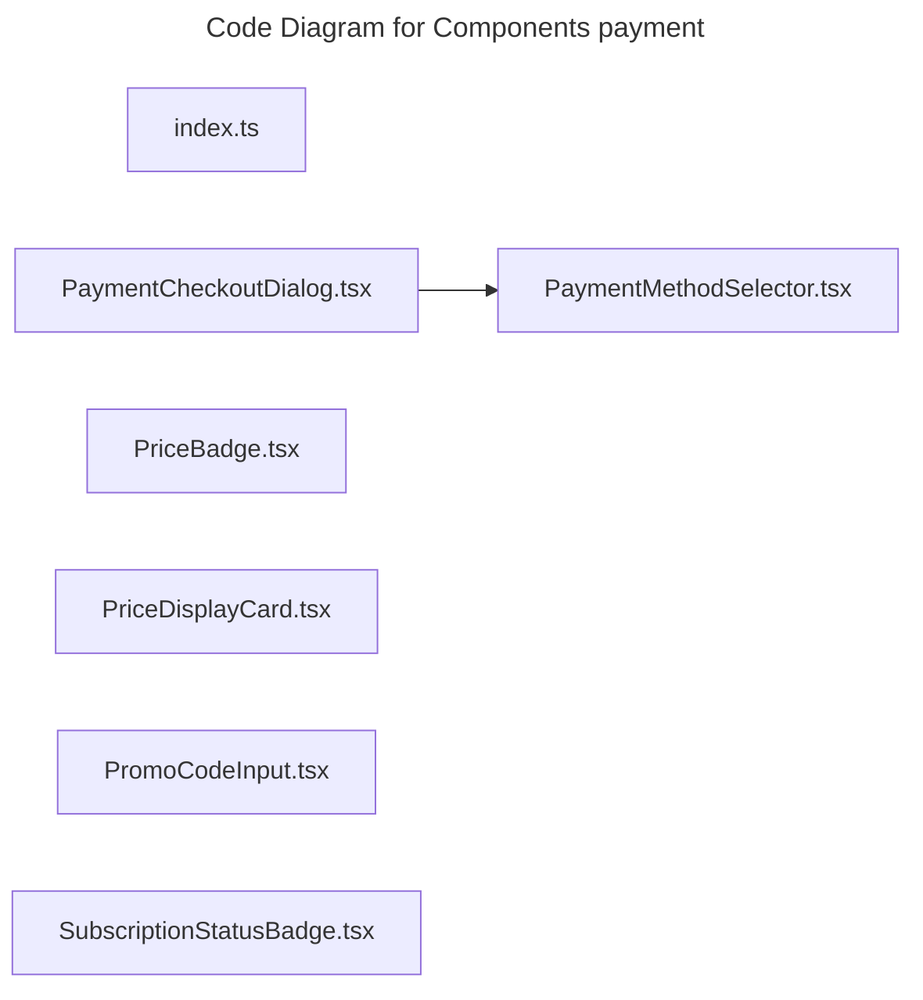

# C4 Code Level: Components payment

## Overview

- **Name**: Components payment
- **Description**: Components payment React component modules.
- **Location**: [src/shared/components/payment](../../../src/shared/components/payment)
- **Language**: TypeScript
- **Purpose**: Render components payment user interface elements for the TrafficMENA frontend.

## Code Elements

### Functions/Methods

- `createCheckoutIdempotencyKey(scope: string): string`
  - Description: Creates checkout idempotency key for downstream use.
  - Location: [src/shared/components/payment/PaymentCheckoutDialog.tsx](../../../src/shared/components/payment/PaymentCheckoutDialog.tsx) (line 31)
  - Dependencies: ./PaymentMethodSelector, @/app/api/client, @/app/api/payments, @/app/hooks/usePayments, @/shared/components/ui/button, @/shared/components/ui/dialog, @/shared/context/AuthContext, @/shared/hooks/custom/use-toast, @/shared/utils/paymentMethods, lucide-react, react, react-router-dom
- `PaymentCheckoutDialog({
  open,
  onOpenChange,
  itemType,
  itemId,
  itemName,
  appliedPromoCode,
  onSuccess,
}: PaymentCheckoutDialogProps): unknown`
  - Description: Implements payment checkout dialog behavior for this module.
  - Location: [src/shared/components/payment/PaymentCheckoutDialog.tsx](../../../src/shared/components/payment/PaymentCheckoutDialog.tsx) (line 38)
  - Dependencies: ./PaymentMethodSelector, @/app/api/client, @/app/api/payments, @/app/hooks/usePayments, @/shared/components/ui/button, @/shared/components/ui/dialog, @/shared/context/AuthContext, @/shared/hooks/custom/use-toast, @/shared/utils/paymentMethods, lucide-react, react, react-router-dom
- `PaymentMethodSelector({
  value,
  onChange,
  disabled,
  enabled = true,
}: PaymentMethodSelectorProps): unknown`
  - Description: Implements payment method selector behavior for this module.
  - Location: [src/shared/components/payment/PaymentMethodSelector.tsx](../../../src/shared/components/payment/PaymentMethodSelector.tsx) (line 16)
  - Dependencies: @/app/api/payments, @/app/hooks/usePayments, @/shared/components/ui/button, @/shared/components/ui/label, @/shared/components/ui/radio-group, @/shared/lib/utils, lucide-react
- `PaymentMethodCard({ method, isSelected, disabled }: PaymentMethodCardProps): unknown`
  - Description: Implements payment method card behavior for this module.
  - Location: [src/shared/components/payment/PaymentMethodSelector.tsx](../../../src/shared/components/payment/PaymentMethodSelector.tsx) (line 101)
  - Dependencies: @/app/api/payments, @/app/hooks/usePayments, @/shared/components/ui/button, @/shared/components/ui/label, @/shared/components/ui/radio-group, @/shared/lib/utils, lucide-react
- `PriceBadge({
  itemType,
  itemId,
  basePriceCents,
  className,
  showSubscriberDiscount = true,
  pricePreview: externalPricePreview,
  colorScheme = 'primary',
}: PriceBadgeProps): unknown`
  - Description: Implements price badge behavior for this module.
  - Location: [src/shared/components/payment/PriceBadge.tsx](../../../src/shared/components/payment/PriceBadge.tsx) (line 29)
  - Dependencies: @/app/api/payments, @/app/hooks/usePayments, @/shared/lib/utils, lucide-react
- `PriceDisplayCard({
  itemType,
  basePriceCents,
  pricePreview,
  label = 'Price',
  className,
}: PriceDisplayCardProps): unknown`
  - Description: Implements price display card behavior for this module.
  - Location: [src/shared/components/payment/PriceDisplayCard.tsx](../../../src/shared/components/payment/PriceDisplayCard.tsx) (line 35)
  - Dependencies: @/app/api/payments, @/shared/lib/utils, lucide-react
- `PromoCodeInput({
  onApply,
  onRemove,
  appliedCode,
  isApplied = false,
  error,
  isLoading,
  disabled,
  disabledMessage,
  className,
}: PromoCodeInputProps): unknown`
  - Description: Implements promo code input behavior for this module.
  - Location: [src/shared/components/payment/PromoCodeInput.tsx](../../../src/shared/components/payment/PromoCodeInput.tsx) (line 20)
  - Dependencies: @/shared/components/ui/button, @/shared/components/ui/input, @/shared/components/ui/label, @/shared/lib/utils, lucide-react, react
- `SubscriptionStatusBadge({
  className,
  showLink = true,
}: SubscriptionStatusBadgeProps): unknown`
  - Description: Implements subscription status badge behavior for this module.
  - Location: [src/shared/components/payment/SubscriptionStatusBadge.tsx](../../../src/shared/components/payment/SubscriptionStatusBadge.tsx) (line 13)
  - Dependencies: @/app/hooks/useSubscriptions, @/shared/context/AuthContext, @/shared/lib/utils, date-fns, lucide-react, react-router-dom

### Classes/Modules

- `index.ts`
  - Description: Entry-point module that re-exports or wires together sibling modules.
  - Location: [src/shared/components/payment/index.ts](../../../src/shared/components/payment/index.ts)
  - Contains: module-level configuration or data
  - Dependencies: None
- `PaymentCheckoutDialog.tsx`
  - Description: Module that implements payment checkout dialog responsibilities for this directory.
  - Location: [src/shared/components/payment/PaymentCheckoutDialog.tsx](../../../src/shared/components/payment/PaymentCheckoutDialog.tsx)
  - Contains: 2 function(s)
  - Dependencies: ./PaymentMethodSelector, @/app/api/client, @/app/api/payments, @/app/hooks/usePayments, @/shared/components/ui/button, @/shared/components/ui/dialog, @/shared/context/AuthContext, @/shared/hooks/custom/use-toast, @/shared/utils/paymentMethods, lucide-react, react, react-router-dom
- `PaymentMethodSelector.tsx`
  - Description: Module that implements payment method selector responsibilities for this directory.
  - Location: [src/shared/components/payment/PaymentMethodSelector.tsx](../../../src/shared/components/payment/PaymentMethodSelector.tsx)
  - Contains: 2 function(s)
  - Dependencies: @/app/api/payments, @/app/hooks/usePayments, @/shared/components/ui/button, @/shared/components/ui/label, @/shared/components/ui/radio-group, @/shared/lib/utils, lucide-react
- `PriceBadge.tsx`
  - Description: Module that implements price badge responsibilities for this directory.
  - Location: [src/shared/components/payment/PriceBadge.tsx](../../../src/shared/components/payment/PriceBadge.tsx)
  - Contains: 1 function(s)
  - Dependencies: @/app/api/payments, @/app/hooks/usePayments, @/shared/lib/utils, lucide-react
- `PriceDisplayCard.tsx`
  - Description: Module that implements price display card responsibilities for this directory.
  - Location: [src/shared/components/payment/PriceDisplayCard.tsx](../../../src/shared/components/payment/PriceDisplayCard.tsx)
  - Contains: 1 function(s)
  - Dependencies: @/app/api/payments, @/shared/lib/utils, lucide-react
- `PromoCodeInput.tsx`
  - Description: Module that implements promo code input responsibilities for this directory.
  - Location: [src/shared/components/payment/PromoCodeInput.tsx](../../../src/shared/components/payment/PromoCodeInput.tsx)
  - Contains: 1 function(s)
  - Dependencies: @/shared/components/ui/button, @/shared/components/ui/input, @/shared/components/ui/label, @/shared/lib/utils, lucide-react, react
- `SubscriptionStatusBadge.tsx`
  - Description: Module that implements subscription status badge responsibilities for this directory.
  - Location: [src/shared/components/payment/SubscriptionStatusBadge.tsx](../../../src/shared/components/payment/SubscriptionStatusBadge.tsx)
  - Contains: 1 function(s)
  - Dependencies: @/app/hooks/useSubscriptions, @/shared/context/AuthContext, @/shared/lib/utils, date-fns, lucide-react, react-router-dom

## Dependencies

### Internal Dependencies

- ./PaymentMethodSelector
- @/app/api/client
- @/app/api/payments
- @/app/hooks/usePayments
- @/app/hooks/useSubscriptions
- @/shared/components/ui/button
- @/shared/components/ui/dialog
- @/shared/components/ui/input
- @/shared/components/ui/label
- @/shared/components/ui/radio-group
- @/shared/context/AuthContext
- @/shared/hooks/custom/use-toast
- @/shared/lib/utils
- @/shared/utils/paymentMethods

### External Dependencies

- date-fns
- lucide-react
- react
- react-router-dom

## Relationships

