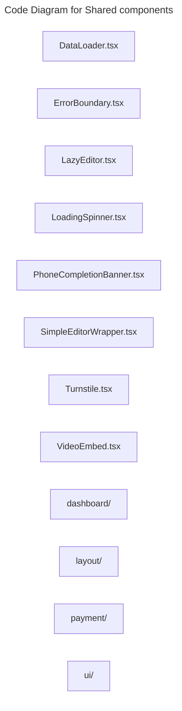

# C4 Code Level: Shared components

## Overview

- **Name**: Shared components
- **Description**: Shared components React component modules.
- **Location**: [src/shared/components](../../../src/shared/components)
- **Language**: TypeScript
- **Purpose**: Render shared components user interface elements for the TrafficMENA frontend.

## Code Elements

### Subdirectories

- [src/shared/components/dashboard](./c4-code-src-shared-components-dashboard.md) - Components dashboard React component modules.
- [src/shared/components/layout](./c4-code-src-shared-components-layout.md) - Layout React component modules.
- [src/shared/components/payment](./c4-code-src-shared-components-payment.md) - Components payment React component modules.
- [src/shared/components/ui](./c4-code-src-shared-components-ui.md) - Reusable UI primitives and shadcn-based building blocks shared across the frontend.

### Functions/Methods

- `DataLoader({
  loading,
  error,
  children,
  loadingText = 'Loading...',
  onRetry,
  emptyState,
  isEmpty = false,
}): unknown`
  - Description: Implements data loader behavior for this module.
  - Location: [src/shared/components/DataLoader.tsx](../../../src/shared/components/DataLoader.tsx) (line 16)
  - Dependencies: @/shared/components/LoadingSpinner, @/shared/components/ui/button, lucide-react, react
- `LazyEditor(props: LazyEditorProps): unknown`
  - Description: Implements lazy editor behavior for this module.
  - Location: [src/shared/components/LazyEditor.tsx](../../../src/shared/components/LazyEditor.tsx) (line 18)
  - Dependencies: @/shared/components/ErrorBoundary, @/shared/components/LoadingSpinner, react
- `LoadingSpinner({
  size = 'md',
  text = 'Loading...',
  className,
}): unknown`
  - Description: Implements loading spinner behavior for this module.
  - Location: [src/shared/components/LoadingSpinner.tsx](../../../src/shared/components/LoadingSpinner.tsx) (line 11)
  - Dependencies: @/shared/lib/utils, lucide-react, react
- `PhoneCompletionBanner(): unknown`
  - Description: Implements phone completion banner behavior for this module.
  - Location: [src/shared/components/PhoneCompletionBanner.tsx](../../../src/shared/components/PhoneCompletionBanner.tsx) (line 7)
  - Dependencies: @/app/hooks/useCurrentUser, @/shared/context/AuthContext, lucide-react, react, react-router-dom
- `MainToolbarContent({
  onHighlighterClick,
  onLinkClick,
  isMobile,
}: {
  onHighlighterClick: () => void;
  onLinkClick: () => void;
  isMobile: boolean;
}): unknown`
  - Description: Implements main toolbar content behavior for this module.
  - Location: [src/shared/components/SimpleEditorWrapper.tsx](../../../src/shared/components/SimpleEditorWrapper.tsx) (line 66)
  - Dependencies: @/components/tiptap-icons/arrow-left-icon, @/components/tiptap-icons/highlighter-icon, @/components/tiptap-icons/link-icon, @/components/tiptap-node/blockquote-node/blockquote-node.scss, @/components/tiptap-node/code-block-node/code-block-node.scss, @/components/tiptap-node/heading-node/heading-node.scss, @/components/tiptap-node/horizontal-rule-node/horizontal-rule-node-extension, @/components/tiptap-node/horizontal-rule-node/horizontal-rule-node.scss, @/components/tiptap-node/image-node/image-node.scss, @/components/tiptap-node/image-upload-node/image-upload-node-extension, @/components/tiptap-node/list-node/list-node.scss, @/components/tiptap-node/paragraph-node/paragraph-node.scss, @/components/tiptap-templates/simple/simple-editor.scss, @/components/tiptap-ui-primitive/button, @/components/tiptap-ui-primitive/spacer, @/components/tiptap-ui-primitive/toolbar, @/components/tiptap-ui/blockquote-button, @/components/tiptap-ui/code-block-button, @/components/tiptap-ui/color-highlight-popover, @/components/tiptap-ui/heading-dropdown-menu, @/components/tiptap-ui/image-upload-button, @/components/tiptap-ui/link-popover, @/components/tiptap-ui/list-dropdown-menu, @/components/tiptap-ui/mark-button, @/components/tiptap-ui/text-align-button, @/components/tiptap-ui/undo-redo-button, @/hooks/use-cursor-visibility, @/hooks/use-mobile, @/hooks/use-window-size, @/lib/tiptap-utils, @tiptap/extension-highlight, @tiptap/extension-image, @tiptap/extension-list, @tiptap/extension-subscript, @tiptap/extension-superscript, @tiptap/extension-text-align, @tiptap/extension-typography, @tiptap/extensions, @tiptap/react, @tiptap/starter-kit, dompurify, react
- `MobileToolbarContent({
  type,
  onBack,
}: {
  type: 'highlighter' | 'link';
  onBack: () => void;
}): unknown`
  - Description: Implements mobile toolbar content behavior for this module.
  - Location: [src/shared/components/SimpleEditorWrapper.tsx](../../../src/shared/components/SimpleEditorWrapper.tsx) (line 136)
  - Dependencies: @/components/tiptap-icons/arrow-left-icon, @/components/tiptap-icons/highlighter-icon, @/components/tiptap-icons/link-icon, @/components/tiptap-node/blockquote-node/blockquote-node.scss, @/components/tiptap-node/code-block-node/code-block-node.scss, @/components/tiptap-node/heading-node/heading-node.scss, @/components/tiptap-node/horizontal-rule-node/horizontal-rule-node-extension, @/components/tiptap-node/horizontal-rule-node/horizontal-rule-node.scss, @/components/tiptap-node/image-node/image-node.scss, @/components/tiptap-node/image-upload-node/image-upload-node-extension, @/components/tiptap-node/list-node/list-node.scss, @/components/tiptap-node/paragraph-node/paragraph-node.scss, @/components/tiptap-templates/simple/simple-editor.scss, @/components/tiptap-ui-primitive/button, @/components/tiptap-ui-primitive/spacer, @/components/tiptap-ui-primitive/toolbar, @/components/tiptap-ui/blockquote-button, @/components/tiptap-ui/code-block-button, @/components/tiptap-ui/color-highlight-popover, @/components/tiptap-ui/heading-dropdown-menu, @/components/tiptap-ui/image-upload-button, @/components/tiptap-ui/link-popover, @/components/tiptap-ui/list-dropdown-menu, @/components/tiptap-ui/mark-button, @/components/tiptap-ui/text-align-button, @/components/tiptap-ui/undo-redo-button, @/hooks/use-cursor-visibility, @/hooks/use-mobile, @/hooks/use-window-size, @/lib/tiptap-utils, @tiptap/extension-highlight, @tiptap/extension-image, @tiptap/extension-list, @tiptap/extension-subscript, @tiptap/extension-superscript, @tiptap/extension-text-align, @tiptap/extension-typography, @tiptap/extensions, @tiptap/react, @tiptap/starter-kit, dompurify, react
- `SimpleEditorWrapper({
  value,
  onChange,
  placeholder = 'Start typing...',
  maxLength = 5000,
}: SimpleEditorWrapperProps): unknown`
  - Description: Implements simple editor wrapper behavior for this module.
  - Location: [src/shared/components/SimpleEditorWrapper.tsx](../../../src/shared/components/SimpleEditorWrapper.tsx) (line 161)
  - Dependencies: @/components/tiptap-icons/arrow-left-icon, @/components/tiptap-icons/highlighter-icon, @/components/tiptap-icons/link-icon, @/components/tiptap-node/blockquote-node/blockquote-node.scss, @/components/tiptap-node/code-block-node/code-block-node.scss, @/components/tiptap-node/heading-node/heading-node.scss, @/components/tiptap-node/horizontal-rule-node/horizontal-rule-node-extension, @/components/tiptap-node/horizontal-rule-node/horizontal-rule-node.scss, @/components/tiptap-node/image-node/image-node.scss, @/components/tiptap-node/image-upload-node/image-upload-node-extension, @/components/tiptap-node/list-node/list-node.scss, @/components/tiptap-node/paragraph-node/paragraph-node.scss, @/components/tiptap-templates/simple/simple-editor.scss, @/components/tiptap-ui-primitive/button, @/components/tiptap-ui-primitive/spacer, @/components/tiptap-ui-primitive/toolbar, @/components/tiptap-ui/blockquote-button, @/components/tiptap-ui/code-block-button, @/components/tiptap-ui/color-highlight-popover, @/components/tiptap-ui/heading-dropdown-menu, @/components/tiptap-ui/image-upload-button, @/components/tiptap-ui/link-popover, @/components/tiptap-ui/list-dropdown-menu, @/components/tiptap-ui/mark-button, @/components/tiptap-ui/text-align-button, @/components/tiptap-ui/undo-redo-button, @/hooks/use-cursor-visibility, @/hooks/use-mobile, @/hooks/use-window-size, @/lib/tiptap-utils, @tiptap/extension-highlight, @tiptap/extension-image, @tiptap/extension-list, @tiptap/extension-subscript, @tiptap/extension-superscript, @tiptap/extension-text-align, @tiptap/extension-typography, @tiptap/extensions, @tiptap/react, @tiptap/starter-kit, dompurify, react
- `loadTurnstileScript(): Promise<void>`
  - Description: Implements load turnstile script behavior for this module.
  - Location: [src/shared/components/Turnstile.tsx](../../../src/shared/components/Turnstile.tsx) (line 41)
  - Dependencies: react
- `Turnstile({
  onVerify,
  onExpire,
  onError,
  theme = 'auto',
  size = 'normal',
  className,
}: TurnstileProps): unknown`
  - Description: Implements turnstile behavior for this module.
  - Location: [src/shared/components/Turnstile.tsx](../../../src/shared/components/Turnstile.tsx) (line 73)
  - Dependencies: react
- `useTurnstile(): unknown`
  - Description: React hook that manages turnstile behavior.
  - Location: [src/shared/components/Turnstile.tsx](../../../src/shared/components/Turnstile.tsx) (line 151)
  - Dependencies: react
- `VideoEmbed({ url, className = '' }): unknown`
  - Description: Implements video embed behavior for this module.
  - Location: [src/shared/components/VideoEmbed.tsx](../../../src/shared/components/VideoEmbed.tsx) (line 9)
  - Dependencies: @/shared/utils/embedUrlValidation, react

### Classes/Modules

- `ErrorBoundary`
  - Description: Class that encapsulates error boundary behavior and related methods.
  - Location: [src/shared/components/ErrorBoundary.tsx](../../../src/shared/components/ErrorBoundary.tsx) (line 18)
  - Methods: `getDerivedStateFromError(error: Error): ErrorBoundaryState`, `componentDidCatch(error: Error, errorInfo: React.ErrorInfo): unknown`, `render(): unknown`
  - Dependencies: @/shared/components/ui/button, lucide-react, react

- `DataLoader.tsx`
  - Description: Module that implements data loader responsibilities for this directory.
  - Location: [src/shared/components/DataLoader.tsx](../../../src/shared/components/DataLoader.tsx)
  - Contains: 1 function(s)
  - Dependencies: @/shared/components/LoadingSpinner, @/shared/components/ui/button, lucide-react, react
- `ErrorBoundary.tsx`
  - Description: Module that implements error boundary responsibilities for this directory.
  - Location: [src/shared/components/ErrorBoundary.tsx](../../../src/shared/components/ErrorBoundary.tsx)
  - Contains: 1 class(es)
  - Dependencies: @/shared/components/ui/button, lucide-react, react
- `LazyEditor.tsx`
  - Description: Module that implements lazy editor responsibilities for this directory.
  - Location: [src/shared/components/LazyEditor.tsx](../../../src/shared/components/LazyEditor.tsx)
  - Contains: 1 function(s)
  - Dependencies: @/shared/components/ErrorBoundary, @/shared/components/LoadingSpinner, react
- `LoadingSpinner.tsx`
  - Description: Module that implements loading spinner responsibilities for this directory.
  - Location: [src/shared/components/LoadingSpinner.tsx](../../../src/shared/components/LoadingSpinner.tsx)
  - Contains: 1 function(s)
  - Dependencies: @/shared/lib/utils, lucide-react, react
- `PhoneCompletionBanner.tsx`
  - Description: Module that implements phone completion banner responsibilities for this directory.
  - Location: [src/shared/components/PhoneCompletionBanner.tsx](../../../src/shared/components/PhoneCompletionBanner.tsx)
  - Contains: 1 function(s)
  - Dependencies: @/app/hooks/useCurrentUser, @/shared/context/AuthContext, lucide-react, react, react-router-dom
- `SimpleEditorWrapper.tsx`
  - Description: Module that implements simple editor wrapper responsibilities for this directory.
  - Location: [src/shared/components/SimpleEditorWrapper.tsx](../../../src/shared/components/SimpleEditorWrapper.tsx)
  - Contains: 3 function(s)
  - Dependencies: @/components/tiptap-icons/arrow-left-icon, @/components/tiptap-icons/highlighter-icon, @/components/tiptap-icons/link-icon, @/components/tiptap-node/blockquote-node/blockquote-node.scss, @/components/tiptap-node/code-block-node/code-block-node.scss, @/components/tiptap-node/heading-node/heading-node.scss, @/components/tiptap-node/horizontal-rule-node/horizontal-rule-node-extension, @/components/tiptap-node/horizontal-rule-node/horizontal-rule-node.scss, @/components/tiptap-node/image-node/image-node.scss, @/components/tiptap-node/image-upload-node/image-upload-node-extension, @/components/tiptap-node/list-node/list-node.scss, @/components/tiptap-node/paragraph-node/paragraph-node.scss, @/components/tiptap-templates/simple/simple-editor.scss, @/components/tiptap-ui-primitive/button, @/components/tiptap-ui-primitive/spacer, @/components/tiptap-ui-primitive/toolbar, @/components/tiptap-ui/blockquote-button, @/components/tiptap-ui/code-block-button, @/components/tiptap-ui/color-highlight-popover, @/components/tiptap-ui/heading-dropdown-menu, @/components/tiptap-ui/image-upload-button, @/components/tiptap-ui/link-popover, @/components/tiptap-ui/list-dropdown-menu, @/components/tiptap-ui/mark-button, @/components/tiptap-ui/text-align-button, @/components/tiptap-ui/undo-redo-button, @/hooks/use-cursor-visibility, @/hooks/use-mobile, @/hooks/use-window-size, @/lib/tiptap-utils, @tiptap/extension-highlight, @tiptap/extension-image, @tiptap/extension-list, @tiptap/extension-subscript, @tiptap/extension-superscript, @tiptap/extension-text-align, @tiptap/extension-typography, @tiptap/extensions, @tiptap/react, @tiptap/starter-kit, dompurify, react
- `Turnstile.tsx`
  - Description: Module that implements turnstile responsibilities for this directory.
  - Location: [src/shared/components/Turnstile.tsx](../../../src/shared/components/Turnstile.tsx)
  - Contains: 3 function(s)
  - Dependencies: react
- `VideoEmbed.tsx`
  - Description: Module that implements video embed responsibilities for this directory.
  - Location: [src/shared/components/VideoEmbed.tsx](../../../src/shared/components/VideoEmbed.tsx)
  - Contains: 1 function(s)
  - Dependencies: @/shared/utils/embedUrlValidation, react

## Dependencies

### Internal Dependencies

- @/app/hooks/useCurrentUser
- @/components/tiptap-icons/arrow-left-icon
- @/components/tiptap-icons/highlighter-icon
- @/components/tiptap-icons/link-icon
- @/components/tiptap-node/blockquote-node/blockquote-node.scss
- @/components/tiptap-node/code-block-node/code-block-node.scss
- @/components/tiptap-node/heading-node/heading-node.scss
- @/components/tiptap-node/horizontal-rule-node/horizontal-rule-node-extension
- @/components/tiptap-node/horizontal-rule-node/horizontal-rule-node.scss
- @/components/tiptap-node/image-node/image-node.scss
- @/components/tiptap-node/image-upload-node/image-upload-node-extension
- @/components/tiptap-node/list-node/list-node.scss
- @/components/tiptap-node/paragraph-node/paragraph-node.scss
- @/components/tiptap-templates/simple/simple-editor.scss
- @/components/tiptap-ui-primitive/button
- @/components/tiptap-ui-primitive/spacer
- @/components/tiptap-ui-primitive/toolbar
- @/components/tiptap-ui/blockquote-button
- @/components/tiptap-ui/code-block-button
- @/components/tiptap-ui/color-highlight-popover
- @/components/tiptap-ui/heading-dropdown-menu
- @/components/tiptap-ui/image-upload-button
- @/components/tiptap-ui/link-popover
- @/components/tiptap-ui/list-dropdown-menu
- @/components/tiptap-ui/mark-button
- @/components/tiptap-ui/text-align-button
- @/components/tiptap-ui/undo-redo-button
- @/hooks/use-cursor-visibility
- @/hooks/use-mobile
- @/hooks/use-window-size
- @/lib/tiptap-utils
- @/shared/components/ErrorBoundary
- @/shared/components/LoadingSpinner
- @/shared/components/ui/button
- @/shared/context/AuthContext
- @/shared/lib/utils
- @/shared/utils/embedUrlValidation
- src/shared/components/dashboard (child module boundary)
- src/shared/components/layout (child module boundary)
- src/shared/components/payment (child module boundary)
- src/shared/components/ui (child module boundary)

### External Dependencies

- @tiptap/extension-highlight
- @tiptap/extension-image
- @tiptap/extension-list
- @tiptap/extension-subscript
- @tiptap/extension-superscript
- @tiptap/extension-text-align
- @tiptap/extension-typography
- @tiptap/extensions
- @tiptap/react
- @tiptap/starter-kit
- dompurify
- lucide-react
- react
- react-router-dom

## Relationships

